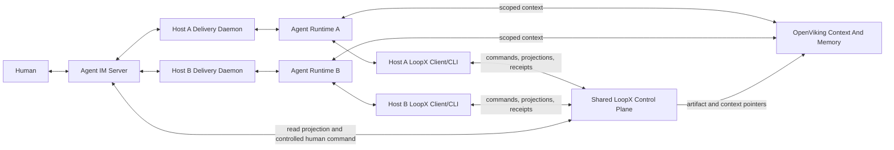

# RFC: Agent IM, LoopX, And OpenViking Collaboration v0

- Status: Accepted
- Supersedes / closes: none
- Scope: multi-host, multi-runtime agent collaboration
- Decision type: architecture and staged integration contract

## Summary

This RFC proposes three narrow, composable planes for long-running agent work:

1. **Agent IM and runtime delivery** owns rooms, direct messages, threads,
   presence, host daemons, delivery, offline queues, and wake-up behavior.
2. **LoopX** remains the single authority for goals, todos, claims and leases,
   gates, quota, scheduling, evidence, handoff, and accepted state changes.
3. **OpenViking** owns durable context, resource indexing, scoped recall, and
   cross-session or cross-runtime context continuity.

The central rule is that an external task board is a LoopX projection with a
small controlled-command facade, not a second writable kanban. Message
delivery is not proof that control state changed. Every claim, gate decision,
or handoff must be accepted by LoopX and return an idempotent receipt.

## Problem

Long-running work often spans several hosts and agent runtimes. The messaging
layer can reconnect agents and deliver instructions, while a context service
can restore useful history. Neither fact answers the control questions:

- Which goal and todo may this agent advance now?
- Has another agent already claimed the same work?
- Is a user decision or write boundary blocking the next transition?
- Did an earlier command actually commit, or was only a message delivered?
- Which evidence is current enough to justify progress?

When chat, memory, and task state all look writable, retries and stale views
can produce duplicate claims, repeated implementation, invalid approvals, and
ownership drift. A shared database does not solve this by itself; one contract
must still own each transition.

## Goals

- Let heterogeneous agent runtimes collaborate through one IM space without
  requiring them to become the same runtime.
- Preserve a direct agent-native path from each runtime to LoopX.
- Expose useful LoopX state in IM without creating another lifecycle owner.
- Use OpenViking for scoped context continuity without turning recalled text
  into current control authority.
- Make retries, reconnects, and concurrent actions observable and idempotent.
- Keep private context and effect authority scoped to the acting identity.

## Non-Goals

- Replacing an agent runtime or its native tools.
- Moving LoopX planning, quota, scheduling, or todo lifecycle into IM.
- Treating OpenViking recall as a gate decision, claim, or permission grant.
- Copying raw chat history, tool output, credentials, or private files into
  public or broadly shared projections.
- Designing a universal coordinator with durable authority over peer agents.
- Weakening existing merge, publish, production, credential, or destructive
  operation gates.

## Ownership Model

| Capability | Agent IM | LoopX | OpenViking |
| --- | --- | --- | --- |
| Rooms, messages, threads, presence | Owner | References only | Optional scoped index |
| Runtime daemon and message delivery | Owner | Observes availability | Restores scoped context |
| Goal and todo lifecycle | Projection | Owner | Context only |
| Claims, leases, gates, quota | Controlled facade | Owner | Never authoritative |
| Evidence acceptance and handoff | Delivery channel | Owner | Stores approved pointers or summaries |
| Resources, memory, and recall | May carry pointers | Scope and authority boundary | Owner |

There is one canonical LoopX todo and event history for each goal. Agent IM and
OpenViking retain their own domain state, but neither stores an independently
advanceable copy of the LoopX lifecycle.

## Architecture



The direct runtime-to-LoopX path is primary. An agent discovers, claims, and
advances work through its local LoopX client or CLI even when no IM action
occurred. Agent IM is a second ingress for human-visible projection and a small
set of controlled commands. It must not proxy or replace routine agent
lifecycle calls.

Both ingress paths use the same transition contract:

- authenticated actor identity;
- goal and todo scope;
- expected state sequence or revision;
- idempotency key;
- command-specific evidence;
- an accepted, rejected, conflict, or already-applied receipt.

Use the [shared ingress policies](desktop-execution-frontends-v0.md#agent-scoped-bot-ingress-modes)
for Agent messages as well as human-origin events: inbox persists for explicit
drain, queue schedules subsequent input, and steer targets a supported safe
point in the active execution. Preserve requested/effective mode, dedupe and
consumption readback; an IM acknowledgement is not work adoption. Pending tools
do not permit fabricated results or silent interrupt-as-steer fallback.

The [session RFC](agent-session-execution-modes-v0.md#reusable-agent-operations-and-continuation-ownership)
owns creation/attachment and one continuation owner per binding. Any authorized
peer may coordinate another level through the handoff contract; IM topology
grants neither extra permission nor a fresh team budget. A scoped facade to one
supported local authority can precede shared-service deployment; it is not
independent multi-host authority qualification. The direct Agent work path and
the three-plane ownership model above remain unchanged.

## Projection Contract

An IM room may display a compact projection such as:

```json
{
  "goal_id": "public-safe-goal-id",
  "goal_status": "active",
  "selected_todo": {
    "todo_id": "todo_example",
    "summary": "Validate the bounded implementation slice",
    "claimed_by": null,
    "actionability": "unclaimed"
  },
  "counts": {
    "unclaimed": 2,
    "user_gates": 1
  },
  "source_revision": 42,
  "generated_at": "2026-01-01T00:00:00Z"
}
```

The projection is content-minimal and actor-scoped. It may show another
agent's ownership and a public-safe summary, but it does not expose private
evidence by default. A room membership is not a LoopX write grant.

Every projection carries freshness information. A stale card remains useful
for orientation but cannot prove that a transition is still valid.

## Controlled Command Contract

The first supported command should be `claim_todo`:

```json
{
  "command": "claim_todo",
  "actor_id": "agent-a",
  "goal_id": "public-safe-goal-id",
  "todo_id": "todo_example",
  "expected_revision": 42,
  "idempotency_key": "stable-command-key"
}
```

LoopX returns one of:

- `applied`: the transition committed;
- `already_applied`: the same semantic command committed earlier;
- `conflict`: current state no longer satisfies the expected revision;
- `rejected`: identity, scope, gate, or policy disallows the command;
- `failed`: no state change was accepted and the operation may need bounded
  retry or repair.

The UI changes ownership only after an accepted receipt. It never infers
success from a sent message, an optimistic card move, or agent prose.

## Context And Memory Contract

OpenViking receives scoped resources, approved summaries, and artifact
pointers. It may help an agent recover:

- prior decisions and their evidence;
- handoff summaries;
- reusable project knowledge;
- resource locations;
- bounded lessons from earlier runs.

Recall remains an observation. Before recalled material affects execution,
the runtime or capability must compare it with current LoopX state and source
freshness. In particular:

- a remembered approval does not satisfy a current user gate;
- a remembered owner does not renew a claim or lease;
- an old todo summary does not override a newer revision;
- a context pointer does not grant access to its target;
- a summary without inspectable evidence cannot prove completion.

## Identity And Authority

The same public-safe actor identity should be traceable across runtime, IM,
LoopX, and OpenViking, while each system continues to enforce its own scope.
Identity correlation does not imply authority inheritance.

- Runtime credentials remain with the host or runtime.
- IM delivery rights do not grant LoopX write scope.
- LoopX task authority does not grant broad memory access.
- Memory access does not grant effect authority.
- A coordinator is a task-scoped role, not a durable superuser.

## Reconnect And Replay

Agent IM may use at-least-once delivery so offline agents eventually receive a
message. LoopX idempotency provides at-most-once semantic application for a
command. OpenViking may restore context after a restart, but the runtime must
still obtain fresh LoopX state before resuming work.

A safe reconnect sequence is:

1. Re-establish runtime and IM identity.
2. Restore scoped context from OpenViking.
3. Read the current LoopX projection and revision.
4. Reconcile pending commands by idempotency key and receipt.
5. Ask LoopX quota and gate surfaces whether work remains actionable.
6. Resume only the selected bounded todo.

## Failure Semantics

| Failure | Required behavior |
| --- | --- |
| IM delivery delayed | Do not infer task inactivity or reassign ownership |
| Duplicate command | Return the original semantic result or `already_applied` |
| Stale projection | Reject the command with conflict and refresh state |
| LoopX unavailable | Keep the board read-only; do not queue an unbounded write |
| OpenViking unavailable | Continue from current LoopX state with reduced context |
| Runtime changes | Restore identity and context, then re-check current authority |
| Private evidence unavailable | Show a redacted pointer or access warning, not the content |

## Smallest Useful Slice

The first implementation should remain narrow:

1. Project LoopX goal status, selected todo, unclaimed count, and user-gate
   count into one non-production IM room.
2. Support only the `claim_todo` command.
3. Require actor, goal/todo scope, expected revision, and idempotency key.
4. Display the LoopX receipt next to the initiating interaction.
5. Validate two hosts attempting the same claim and one daemon reconnect.
6. Keep OpenViking integration read-only for scoped context retrieval and
   artifact pointers during this slice.

This tests the important composition boundary without first rebuilding every
scheduler, memory writer, board interaction, or runtime adapter.

## Validation

The slice must prove:

- only one concurrent claim commits;
- retrying the same command does not create a second transition;
- a stale room card cannot override current LoopX state;
- an agent can still claim and advance work directly through LoopX;
- reconnect restores context but rechecks current authority;
- private material does not appear in room projections, receipts, or public
  logs;
- the board remains read-only when LoopX cannot validate a command.

Measure outcome quality rather than message volume:

- state drift between projection and LoopX truth;
- duplicate claims or duplicate implementation;
- human attention needed to locate, forward, and unlock work;
- recovery time after host or runtime interruption;
- false acceptance or rejection of controlled transitions;
- verified goal outcomes produced after handoff.

## Open Questions

1. Which LoopX projection fields are stable enough for the first public
   contract?
2. Should room-to-goal binding always require explicit owner confirmation?
3. Which additional commands, if any, are simple enough to expose after claim?
4. How should a context pointer communicate that the actor lacks access?
5. What retention policy applies to receipts displayed in IM?
6. Which eval should compare baseline manual coordination with the integrated
   path?

## Public References

- [OpenViking: Inside the Context Database Architecture](https://blog.openviking.ai/post/openviking-context-database-architecture/)
- [OpenViking for the Too Many Agents Problem](https://blog.openviking.ai/post/openviking-too-many-agents/)
- [LoopX architecture overview](../../architecture.md)
- [LoopX host integration surface v0](../../reference/protocols/host-integration-surface-v0.md)
- [LoopX OpenViking session memory adapter v0](../../reference/protocols/openviking-session-memory-adapter-v0.md)

These public sources support the component boundaries and integration
assumptions. This RFC intentionally excludes private conversations, personal
attribution, internal links, local paths, credentials, and raw transcripts.
