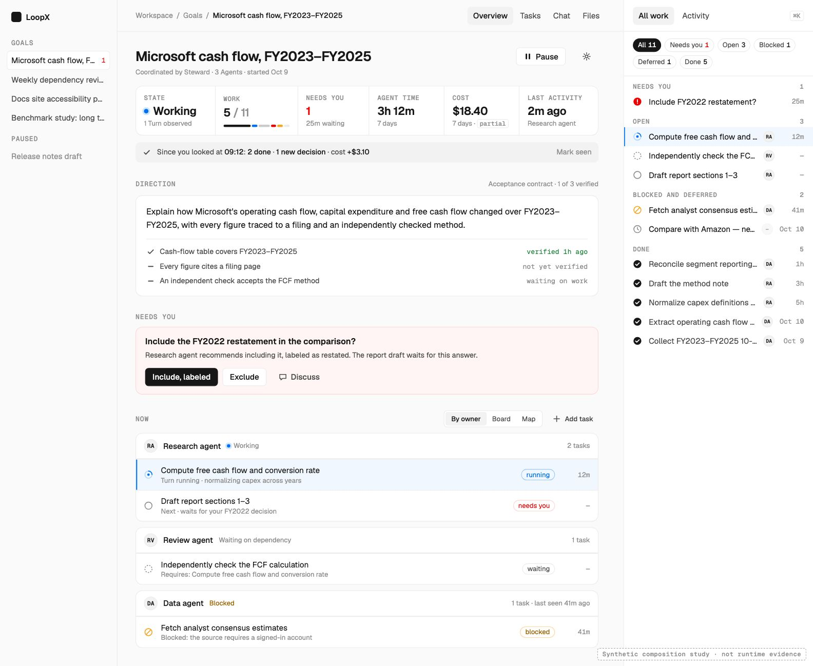
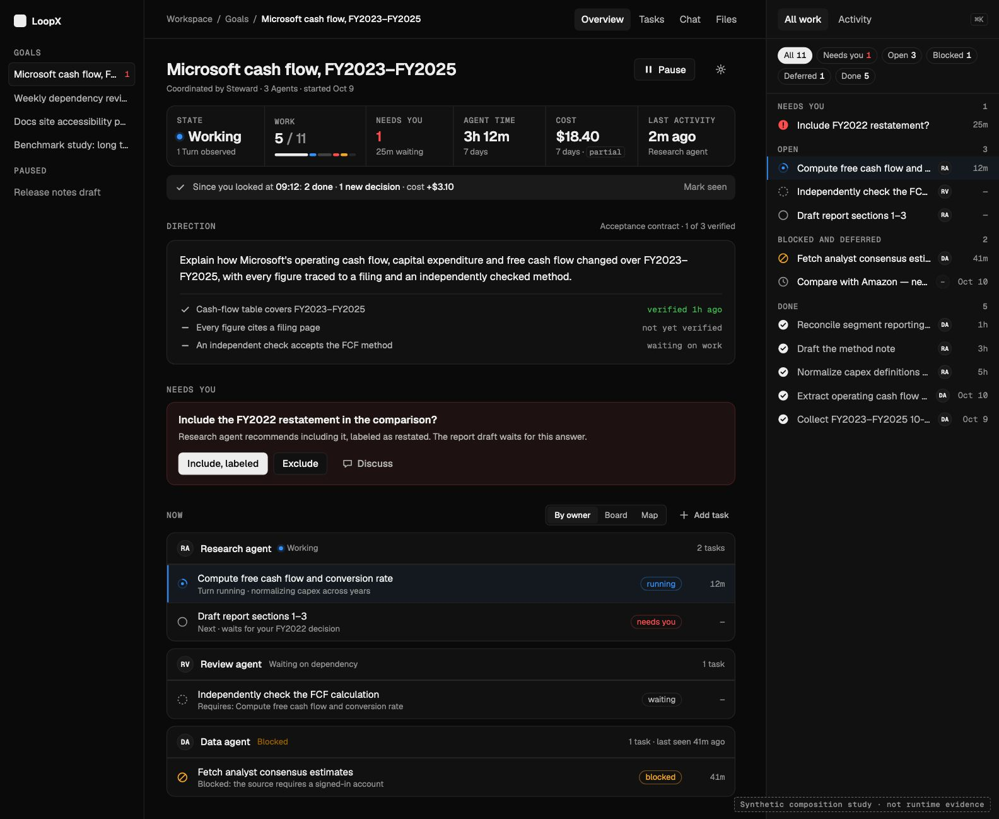
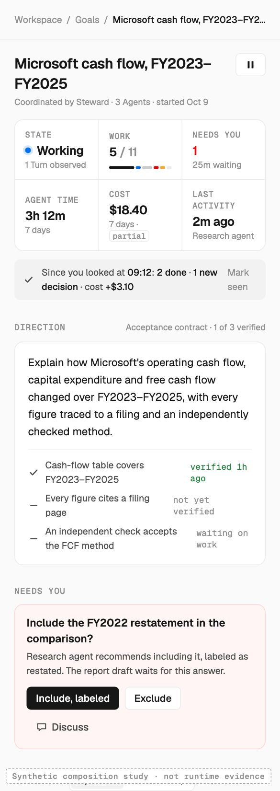

# RFC: Goal Workspace Surface v0

- **RFC status:** Accepted
- **Supersedes / closes:** none
- **Delivery maturity:** Proposal. Goal Overview, Tasks, Chat and Files, the W1 work map, usage display, acceptance readback and lifecycle pause ship as separate regions; the composed page and its vital semantics are not implemented.
- **Owners:** existing workspace presentation owner. Data and action owners named in Section 5 keep their authority.
- **Created / normative revision:** 2026-10-11.
- **Implementation baseline:** `5c62c5c03`.
- **Language:** [中文版](goal-workspace-surface-v0.zh-CN.md) is the semantic mirror. Differences are defects.
- **Parent contracts:** [design system](../../development/design.md), [frontend delivery](../../development/frontend-delivery.md), [intelligent presentation](intelligent-review-presentation-surfaces-v0.md) §8 and Stage 4, [live team workspace](live-team-workspace-v0.md) W1–W3, [App conversations](app-conversation-and-async-inbox-v0.md), [usage and cost](goal-usage-token-cost-v0.md), [acceptance observations](../../reference/goal-acceptance-observations.md), [overall roadmap](loopx-overall-roadmap-v0.md) S5, R1–R3 and G0/G1.

Sections 1–10 are the design and acceptance contract; Section 4 records audited
current facts. Section 11 is the delivery plan and Section 12 lists unresolved
decisions. This document owns **the composition of one Goal's page and the
display semantics of its summary figures**. It owns no state, scheduler,
acceptance rule, cost computation or new action.

## 1. Decision summary

1. **One Goal, one composed page.** A persistent masthead (breadcrumb, title,
   coordinator line, Pause/Resume, settings) and a vitals strip sit above every
   Goal view: Overview, Tasks, Chat and Files. Overview becomes the composed
   brief: Direction → Needs you → Now → Results, followed by the existing
   delivery section. A right-hand All-work rail accompanies it on wide screens.
2. **Every figure has one meaning.** Each vital is bound to one existing typed
   owner and declares its window, scope, coverage and unknown behavior
   (Section 5.3). Nothing is shown as a lifetime figure until an owner produces
   one. Done, accepted and adopted stay distinct.
3. **One reducer feeds every count.** A pure TypeScript reducer,
   `goal_workspace_digest_v0`, in the existing presentation boundary composes
   vitals, responsibility groups, rail order and the since-last-look delta from
   already-projected facts. The strip, rail chips, Now groups and Tasks board
   agree for the same snapshot.
4. **Decide in place.** Pause/Resume, gate decisions, task creation and, when
   its owner admits an App path, acceptance-target declaration use existing
   typed actions with preview, one confirmation and recorded readback.
5. **Expressive, never theatrical.** Live treatment requires an observed active
   Turn or worker. Motion is event-local and happens once per observed change.
   A dark theme is the inverse of the same tokens. A command palette launches
   existing projected actions only.

**Unchanged:** Todo, gate, quota, lifecycle, acceptance and usage authority;
the Tasks board, W1 map, Chat, Files and the Stage 4 delivery section keep their
contracts and become lenses or destinations of this page. **Default boundary:**
the Overview composition is a default UI change and requires the owner's
first-screen preview approval before M1 becomes default. **Not approved here:**
new Todo fields (including display numbers), a lifetime usage aggregate,
browser authoring of executable acceptance checks, Lark or CLI parity, and any
live-team L1/L2 or G1 claim.

## 2. Problem and motivation

An owner returns to a Goal after a few hours ([GQ09](../../product/use-cases/steward/golden-queries.md):
"Pick up where we left off yesterday. Ask if you need a decision."). They want
five answers at a glance: is anything actually running, what needs me, how far
along is it, what did it cost, and what came back. Today the facts exist but
are scattered. Selecting a Goal often opens Chat. Needs-you items and a 24-hour
usage line live in Overview, lanes live in Tasks, Pause lives on a sidebar row,
outputs live in Files, and the work map sits inside the delivery section. Each
region uses its own window and wording. Nothing says what changed since the
owner last looked.

A familiar goal-page pattern answers these questions with a stat strip, a
brief, current tasks and an all-tasks rail. Copied literally, it would mislead:
a wall-clock "running time" implies work during idle hours; `#47` implies a
stable identity that native Todos deliberately lack; "54 done" reads as
accepted; a spinner derived from stored status implies activity nobody
observed. LoopX needs the legibility of that pattern with its own honesty
rules.

No current owner can solve this locally. The usage RFC owns cost fields, live
team owns the W-track and team scene, intelligent presentation owns item
disclosure and the delivery section, and Tasks owns lanes. None owns the page
as one object, so counts, windows and selection drift between regions.

### Invariants

- Composition reads. Writes happen only through existing typed actions with
  their preview, confirmation, fingerprint and readback.
- One typed classification feeds every count, chip, ribbon segment, group and
  rail section. Counts never come from prose. For one snapshot, all regions
  agree.
- Liveness comes from observation. Stored status, registration, a claim or a
  recent state write is not activity; stale observations show their age.
- Unknown is not zero. Partial coverage is visible. Every metric names its
  window and scope.
- Done, accepted and adopted are separate facts; Todo exhaustion is not Goal
  completion.
- Work is grouped by responsibility. Work without a resolvable owner goes into
  an explicit group and is never dropped.
- Display position is never an identifier.
- Opening, refreshing, switching lenses, opening the palette or replaying never
  starts work, spends quota or calls a validator.
- A failed source makes only its own region unavailable, with the reason; the
  rest of the page still renders.

## 3. Scope and non-goals

### In scope

- Page anatomy and responsive layout for one Goal in the packaged frontend.
- Normative semantics of each vital and of the since-last-look delta.
- The Now lens: responsibility grouping, ordering and row grammar.
- The All-work rail: sections, filters, ordering and coverage disclosure.
- Placement and readback of Pause/Resume, gate decisions, Add task and target
  declaration, all through existing owners.
- One selection model shared by Now, Board, Map, rail and the detail drawer.
- Keyboard map, command palette, glyph set, motion grammar and dark inverse.
- Validation of the above in the packaged frontend with a real backend.

### Non-goals

- New Todo, gate, acceptance or usage fields or stores. Section 12 routes such
  needs to their owners.
- Scheduler, wake, quota or cadence changes.
- Replacing the Tasks board, W1 map, Chat or Files.
- The live-team spatial studio and its L1–L3 journey, which stay in
  [Live Team Workspace](live-team-workspace-v0.md) and remain reachable from
  this page.
- Lark Goal Channel, manager home, public website or README first screens.
- The benchmark study dashboard.

## 4. Current-system contract

Facts at `5c62c5c03`:

| Region | Current owner / entry | Verified behavior | Gap for this RFC |
| --- | --- | --- | --- |
| Goal shell | `ChannelHeader`, `GoalSidebar` in the personal workspace | Title, activity chip, Overview/Tasks/Chat/Files tabs; Pause/Resume on sidebar rows | No breadcrumb or page-level lifecycle control; no persistent summary |
| Lifecycle | `goal.stop` / `goal.resume` from `loopx/control_plane/goals/operator_actions.ts` (`goal_lifecycle`, `requires_confirmation`, state fingerprint) | Stop pauses automatic Turns, leaves active attention and projects effective quota to 0; a running tool call is not killed; Todos, history, evidence and configuration remain; only Resume restores eligibility ([user guide §3.1](../../guides/personal-workspace-user-guide.md)) | Effect and in-flight work are not read back on the Goal page |
| Overview | `GoalOverview` | Progress sentence, Needs-you list, 24h tokens/cost/duration, then the Stage 4 delivery section (`task_graph_projection_v0`, W1 `goal_task_map_v0`, acceptance contract and observation) | No vitals strip; usage window differs from other surfaces |
| Tasks | `GoalTasksView` | Lanes: awaiting confirmation, pending/running, scheduled, completed; agent-lane filter; completed history from `/api/chat/completed-todos` | Not grouped by responsibility; text assignee; no observed elapsed time |
| Usage | `usage_summary` | 24h/7d tokens, `cost_usd`, `duration_ms`; fields absent when unmeasured; `sample_run_count`, `available` | No lifetime aggregate; no explicit per-runtime coverage |
| Acceptance | Goal authority via `goal-acceptance` (preview, provider CAS, exact replay); Dashboard reads only | Objective, criteria, coverage scope, bindings; observation projection is bounded and partial by design | No App declaration path; target absence is silent |
| Goal brief | Status Goal snapshot | No general objective field; the Agent's progress sentence and, when enabled, the acceptance contract objective | The page has no stable brief for Goals without a contract |
| Todo identity | Status `todoItemSchema` | Native Todos are addressed by `todo_id` and intentionally carry no synthetic index; legacy Markdown Todos keep `index` | A numbered rail would invent identity |
| Activity | `goal-activity.ts`, agent-lane `lastActivityAt`, host-thread activity, run timeline | Work-kind chip and per-lane observation | Not summarized as one observed last-activity fact |
| Themes | `workspace-theme.ts` (`loopx`, `paper`, `brutal`) | Light-first presets | No dark inverse of the LoopX theme |

## 5. Proposed architecture

### 5.1 Ownership and placement

Extend the existing personal-workspace presentation in
`apps/presentation/dashboard` and the TypeScript presentation boundary in
`loopx/control_plane/presentation/`, which already hosts typed action review
plans. **Placement:** no capability, extension or provider is added. The page
presents existing built-in owners. Intelligent presentation owns item
disclosure and the delivery section, and live team owns the team scene. Neither
owns cross-region page semantics, so this RFC owns composition only.

| Region | Data owner (unchanged) | Action owner (unchanged) |
| --- | --- | --- |
| Masthead | Goal registry and lifecycle activation | `goal_lifecycle` typed action |
| Vitals | Todo projection, attention queue, `usage_summary`, execution observation | None; each cell focuses its region |
| Direction | Acceptance contract and observation; progress summary (Section 12 D6) | Acceptance owner configuration (M3, Section 12 D3) |
| Needs you | Attention and gate owners; action review plan | Existing gate decision actions |
| Now, rail | Todo projection, execution observation, run timeline, `goal_task_map_v0` relations | Todo create dry-run/apply; existing drawer actions |
| Results | Files and Goal-results owner; acceptance owner for badges | Existing open/read actions |
| Conversation | Chat and session owner | Existing composer |

**Forbidden substitutes:** frontend-only status classes that diverge from typed
owners; counts parsed from prose; acceptance inferred from a reviewer name or
artifact hash; activity inferred from `updated_at`, a claim or registration;
lifetime totals summed client-side from windows.

### 5.2 Page anatomy

*Synthetic composition study rendered with LoopX tokens from the public GQ01
example. It is not runtime evidence, not packaged UI and not an approved first
screen.*

| # | Region | Shown when | Earns attention because |
| --- | --- | --- | --- |
| 1 | **Masthead**: breadcrumb (Workspace / Goals / Goal), title, coordinator and team line, Pause/Resume, settings | Always, on every Goal view; compacts on scroll | Identity and the one consequential control stay one glance away |
| 2 | **Vitals strip**: at most six cells; each cell is a button that focuses its region | Always | Answers moving / waiting on me / how far / what cost in one line |
| 3 | **Delta line**: "Since you looked at 09:12: 2 done · 1 new decision · +$3.10" | Only for a material delta | The return moment the product promises |
| 4 | **Direction**: objective, acceptance criteria with verification state | Always; criteria only with a contract | What "done" means and how close it is |
| 5 | **Needs you**: decision cards with recommendation, consequence and actions | Only when non-empty | Decisions are the owner's actual work |
| 6 | **Now**: lens switch (By owner / Board / Map) and Add task | Open work exists | Who is doing what, who is blocked |
| 7 | **Results**: returned outputs, with acceptance shown separately | At least one result | What came back and whether it is trusted |
| 8 | **All-work rail**: tabs All work / Activity, filter chips, sections | ≥1200px; drawer below | Complete inventory without leaving the brief |
| 9 | Existing **Delivery and evidence** section | As today | Stage 4 contract unchanged, below Results |

Chat remains a direct destination. "Discuss" on a decision or row opens Goal
Chat with that subject attached through the existing composer; it does not
create a second conversation store.

### 5.3 Vital semantics

Every vital is a typed record: `value`, `window`, `scope`, `basis`,
`coverage: complete | partial | unknown`, `availability: ok | loading |
unavailable(reason)`. The table is normative.

| Vital | Source | Display | Unknown / partial | Never |
| --- | --- | --- | --- | --- |
| **State** | Lifecycle activation, existing presentation state, execution observation | "Working" with live treatment only while an active Turn or worker is observed; otherwise the existing quiet / waiting on you / blocked / scheduled / paused / completed state. Subline names the basis: "1 Turn observed", "last seen 41m ago" | Observation unavailable: state without live treatment plus "activity unknown" | Live treatment from status, claim or registration |
| **Work** | Todo projection for this Goal: non-archived Agent advancement Todos; done count from the same snapshot | "done / total" and a ribbon segmented by typed display class (Section 5.6) | Done count unavailable: open count only, labeled | Counting user decisions or wishes as work; presenting done as accepted |
| **Needs you** | Goal-scoped blocking attention items (user gates, run operator gates) | Count and oldest waiting age; danger color plus icon when above zero; zero recedes | Read failure: "unavailable", not 0 | Non-blocking wishes |
| **Agent time** | `usage_summary` duration over the widest available window (7d, else 24h) | "3h 12m · 7 days" | Absent: "—" with "not measured"; owner-signaled sampling gap: "partial" | Wall-clock Goal age; a lifetime figure |
| **Cost** | `usage_summary` `cost_usd` over the same window as Agent time | "$18.40 · 7 days" | Absent: "—", never "$0.00"; a measured zero shows "$0.00"; "partial" only from an owner coverage signal | A budget, a price estimate unless the owner marks it estimated |
| **Last activity** | Most recent observed execution fact: agent-lane activity, host-thread activity, Turn or run events | Relative time and actor | No observation: "No observed activity" | `updated_at`, a registration or a configuration write |

Agent time and Cost always share one window. Where the owner provides no
coverage signal, the cell names its window and source and makes no
completeness claim (Section 12 D4). When the Goal owner projects a creation
time, a Goal age such as "started Oct 9" may appear in the masthead line, never
as runtime.

### 5.4 Now: responsibility groups and row grammar

**Membership.** Now shows open work that is running (observed), claimed,
waiting on a dependency, blocked, or next runnable. Done and deferred work
appear in the rail. Decisions appear in Needs you, and the work they hold is
badged in its group.

**Grouping.** One group per responsible member (claim or agent lane), with the
member's observed state summarized in the group header. Work without a
resolvable owner goes into an explicit "Unassigned" group. Group order: groups
that need attention (blocked, failed) first, then observed working, then
waiting, then idle. Within a group: running, held by a decision, next, waiting,
blocked. Ties follow the `goal_task_map_v0` dependency order, then `todo_id`.

**Row.** `glyph · title · one reason line · typed badge · time`.

- The glyph differs by shape and carries a text label; color is secondary.
- The reason line carries exactly one fact: the running step, "Requires: …",
  the public-safe blocked reason, or "deferred until …".
- Time is the elapsed time since the observed Turn start for running work, or
  the waiting age for decisions and blocked work when the owner records it.
  Otherwise it shows "—".

**Lenses.** Board is the existing `GoalTasksView`; Map is the W1
`GoalWorkMapView`. Selecting a Todo anywhere (row, board card, map node, rail,
palette) opens the existing detail drawer, highlights the same Todo in the
other regions and records `todo` in the URL so reload and back restore it.

**Add task.** An inline composer uses the existing Todo dry-run, shows the
preview, applies after one confirmation and reads back the created row in its
group. A failed apply keeps the draft and shows the owner's error.

### 5.5 All-work rail

- **Sections in typed order:** Needs you → Open (running first) → Blocked and
  deferred → Done (newest first, virtualized, paginated by the existing
  completed-history owner).
- **Filter chips** carry counts from the same classification as the strip.
  Search matches titles.
- **Activity tab:** material events only (done, blocked, decision recorded,
  result returned, acceptance changed) from run history and the timeline.
  Routine progress folds.
- **No numbers.** v0 shows no `#n`, because native Todos intentionally have no
  synthetic index and a position counter would read as identity. A copyable
  reference stays in the drawer's diagnostics disclosure (Section 12 D1).
- **Footer** states scope ("Counts cover this Goal"), refresh time and any
  truncation (node limit, bounded history) as partial coverage.

### 5.6 Shared reducer: `goal_workspace_digest_v0`

A pure function in `loopx/control_plane/presentation/` takes already-parsed Goal
snapshot facts: Todos, done count, attention items, usage, execution
observations, lifecycle activation, an acceptance summary, a supplied
`observed_at` and an optional previous digest. It returns vitals (Section 5.3),
typed counts, ordered Now groups, ordered rail sections and the delta. It
performs no I/O and reads no clock.

**Vocabulary.** It reuses Todo status (`open | done | blocked | deferred`),
attention kinds and the existing presentation states. It adds one closed set of
display classes local to the reducer: `running_observed`, `needs_you`, `open`,
`waiting_dependency`, `blocked`, `deferred`, `done`. It also adds the six vital
ids. Both sets stay local until a second consumer (CLI or Lark) adopts the
digest. At that point they register with the semantic vocabulary registry
rather than being copied.

### 5.7 Since you looked

- Per (status source, Goal), the browser stores a last-seen digest in local
  storage: typed counts, decision ids, a bounded set of done Todo ids, the usage
  window values and the observation time. It stores no titles or content and
  makes no server write.
- On open, the reducer compares the current digest with that marker: newly
  done, new decisions, newly blocked, results returned and a cost delta. The
  cost delta appears only when both digests use the same window.
- The line appears only when a delta is material. The marker advances when the
  owner selects "Mark seen" or leaves the Goal after the line was shown.
- The line is not a notification channel and does not touch the attention queue.

### 5.8 Direction and measurable target

- When an acceptance contract is enabled, show its objective and criteria.
  Otherwise show the current progress sentence, labeled as the Agent's
  summary. Status projects no general Goal objective today; adding one is an
  owner decision (Section 12 D6), not a frontend inference from chat or Todo
  text.
- Each criterion shows its owner state: verified (with time), failing, not yet
  verified, or waiting on work. A summary reads "1 of 3 verified". Observation
  partiality stays visible; an absence of gaps is not acceptance.
- **No contract:** a quiet line, "No measurable target declared", with a
  "Declare target" action once M3 admits an App path. Until then, the line
  explains plainly that targets are declared through the Goal owner's
  acceptance configuration. A command-copy button is not offered as the action.
- **M3:** declaration goes through the acceptance owner: objective, criteria
  descriptions, coverage scope (`selected_work` or `all_advancement`) and
  bindings. It follows preview, one confirmation, provider CAS and readback, and
  a conflict shows the newer revision. Executable checks stay in the owner's
  local file (Section 12 D3).

### 5.9 Lifecycle control

- Pause/Resume sits in the masthead on every Goal view and uses the existing
  `goal.stop` / `goal.resume` actions with the current state fingerprint.
- The confirmation states the owner's effect in plain language: "Stops new
  automatic Turns for this Goal and removes it from active attention. A tool
  call already running finishes. Tasks, history, evidence and configuration are
  kept. Only Resume restarts it."
- After execution, the page reads back activation. While an active Turn is
  still observed, State reads "Pausing · 1 Turn finishing", then "Paused". A
  stale fingerprint is refused with a refresh prompt, and a repeated click does
  not repeat the effect. Remote sources keep the existing exact-host-alias rule.
- This control is distinct from the live-team "pause animation" control and
  from coordinator pause in the team panel, which does not stop workers.

### 5.10 Keyboard, palette, visual language and motion

**Keyboard.** `j`/`k` move within the focused list, `Enter` opens the drawer,
`Esc` closes it and restores focus, `g` then `o`/`t`/`c`/`f` switches view,
`1`/`2`/`3` switches lens, `/` searches the rail and `?` lists shortcuts. Every
region is reachable in tab order with visible focus.

**Command palette (⌘K / Ctrl-K).** It navigates to Goals, Todos and results.
It also invokes only the actions already projected for the current snapshot,
such as Pause/Resume, open settings, Add task or decide a gate. Each opens its
existing preview. The palette is a launcher, not an executor, and it accepts no
free-text instructions to Agents; that is Chat.

**Glyphs.** Done is a filled check; running is an arc with a core and appears
only when observed; open is a ring; waiting is a dashed ring; needs you is a
filled exclamation; blocked is a slashed ring; deferred is a clock. Shapes
remain distinct in grayscale.

**Color.** The base is monochrome per the design system. Blue is reserved for
observed activity, danger for needs-you, warning for blocked and green for
verified acceptance.

**Motion.** Motion happens once per observed change. A row glyph changes in at
most 200ms when a snapshot shows a transition, a new decision enters in at most
250ms and the delta line fades in. The live indicator is a static halo; an
optional slow pulse appears only for an observed active Turn and stops in
hidden tabs and under reduced motion. An unchanged refresh produces no motion,
and replay is labeled historical.

**Dark.** A workspace theme option inverts the same tokens. It is not a
separate identity.

**Responsive.**

- At 1200px and wider: sidebar, one content frame and the rail.
- From 768px to 1199px: the rail becomes a drawer toggled from the masthead.
- At 640px and narrower: one column in this order: masthead with an icon Pause,
  vitals in a 3×2 grid, the delta line, Needs you and Now. Direction collapses,
  and All work opens from the top bar.

## 6. Alternatives and design choices

| Alternative | Decision | Reason |
| --- | --- | --- |
| Copy the reference pattern literally (flat list, `#n`, lifetime runtime) | Rejected | Breaks the identity, liveness and unknown-is-not-zero invariants |
| A separate Goal page route beside the workspace tabs | Rejected | Duplicates navigation; Overview is already the direct Goal destination |
| A Python-served page projection | Rejected | The TypeScript presentation boundary is the established owner; a Python decision mirror is forbidden |
| The W1 map as the Overview hero | Deferred | The map is a lens; "what needs me" is faster as a list; first-screen approval would still apply |
| Vitals on Overview only | Rejected | Owners working in Chat or Tasks would lose pause and needs-you context |
| Lifetime totals summed from windows | Rejected | Double counting and retention gaps; lifetime belongs to the usage owner |

## 7. Safety, privacy and compatibility

- No new authority. Every action reuses its typed owner with the fingerprint,
  confirmation and readback that owner already requires.
- Primary copy shows no protocol ids, machine paths, credentials or provider
  ids; those sit in the diagnostics disclosure. The local delta marker holds
  counts and ids only.
- Progressive loading stays per region. A loading or failed region never
  renders as empty success.
- Remote status sources stay read-only except lifecycle under the existing
  exact host-alias binding.
- Copy is bilingual from one terminology table: Work / 工作, Needs you / 等你决定,
  Agent time / Agent 用时, Cost / 成本, Last activity / 最近活动, Paused / 已暂停,
  Done / 已完成, Accepted / 已验收.
- Default change: while under review, M1 may ship behind a local view toggle.
  After first-screen approval it becomes the default, with release notes naming
  the changed Overview and masthead.

## 8. Migration and rollback

This is presentation only, with no state migration. Each milestone reverts on
its own; data, actions and owners are untouched. Existing `goalId`, `view` and
visited-view memory are preserved. The `todo` URL parameter is additive, and
the local delta marker can be deleted at any time without effect.

## 9. Validation and acceptance

| Claim | Test or evidence | Required result | Boundary |
| --- | --- | --- | --- |
| V1 Vital truth | Reducer fixtures written from Section 5.3 before implementation; packaged browser compared with `loopx status --format json` for a disposable Goal | Absent usage renders "—"; measured zero renders $0.00; stale observation has no live treatment; Agent time and Cost share a window | Does not qualify provider cost coverage |
| V2 Count agreement | One snapshot rendered in strip, chips, ribbon, Now, rail and Board; mutation case misclassifies one Todo | Totals equal; the mutation fails the test | Bounded projections disclose truncation |
| V3 Responsibility | Multiple owners, unassigned work, out-of-order timestamps | Correct groups and order; nothing dropped | — |
| V4 Pause journey (GQ08) | Packaged UI with the real Chat server on a disposable Goal | Preview → confirm → readback stopped; "Turn finishing" while observed; Resume; stale fingerprint refused; double click has one effect | Host heartbeat removal is the host's evidence |
| V5 Return journey (GQ09) | Two snapshots with synthetic progress; unchanged pair; window change | Material delta shown and dismissable; none when unchanged; cost delta omitted on window change | Not a notification guarantee |
| V6 States and access | Populated, quiet, blocked, paused, loading, unavailable, partial, long titles; en and zh-CN; 1440/1024/390px; keyboard; reduced motion; dark contrast | All regions readable; AA contrast; full keyboard path; no motion under reduced motion | — |
| V7 Decide in place | Gate decision and Add task through existing actions, including a failed apply | Recorded readback; failure keeps the draft | — |
| V8 Target declaration (M3) | Preview, confirm, CAS conflict, readback; Agent-role invocation | Owner path succeeds; conflict shows the newer revision; Agent role cannot configure | Executable checks out of scope |
| V9 No side effects | Browser network assertions while opening, refreshing, switching lenses and opening the palette | No action, quota or validator request | — |
| V10 Render budget | 200-node Goal (the map node limit) | Threshold frozen before measuring, then met | Not live-team display scale |

Synthetic fixtures may prove composition. Journeys V4, V5, V7 and V8 also need
the real owning backend on disposable state. A skipped row is not green.

## 10. Operational contract

The page reuses progressive status and delivery-review reads; it adds no
polling loop or wake policy. Completed history pages through its existing
owner. Hidden tabs stop animation. Each region shows a typed failure with
retry, and stale observations show their age. No server state is added.
Upgrades follow the packaged Chat bundle window; open tabs reload after a
second upgrade.

## 11. Normative delivery plan

| Milestone | Shipped behavior | Entry gate | Exit evidence | Rollback |
| --- | --- | --- | --- | --- |
| M0 Contract | This RFC, the composition study and roadmap/RFC reconciliation | — | Docs governance smoke; owner review | Revert docs |
| M1 Masthead and vitals | Persistent masthead with Pause/Resume readback on all Goal views; vitals from `goal_workspace_digest_v0`; Overview order Direction (read-only) → Needs you → existing sections | First-screen preview approval of the Goal page | V1, V2 (strip), V4, V6, V9 | Revert composition |
| M2 Work lenses and rail | Now by owner with Board/Map lenses; All-work rail and Activity; shared selection and `todo` deep link; inline Add task; Results region | M1 | V2, V3, V6, V7, V9, V10 | Revert to M1 |
| M3 Direction and return | Since-you-looked delta; target declaration through the acceptance owner | M2; D3 decided by its owner | V5, V8 | Hide declaration; delete marker |
| M4 Live and expressive | W2 live state on rows and map from the execution observation owner; event motion; keyboard map and palette; dark inverse | M2; W2 observation available | V6 (motion, dark); live-team W2 acceptance | Disable motion/theme |

This track runs beside R2/R3, like the W-track. It makes their outcomes legible
and does not pre-empt R1/R2 P0 repairs. It advances no L1, V4 or G1 gate. CLI
and Lark adoption of the digest are separate qualifications.

## 12. Open decisions

| # | Decision | Owner | Options | Recommendation | Needed before |
| --- | --- | --- | --- | --- | --- |
| D1 | Human-speakable Todo reference ("fix #47") | Todo bounded context | None; display-only position; an owner-assigned per-Goal sequence written at creation and never reused | None in M1–M2; adopt the owner sequence only when Chat references to tasks show a repeated need. It is an additive field with a backfill rule | Any numbered UI |
| D2 | Lifetime usage | Usage RFC owner | Window only; an owner aggregate since Goal creation with retention disclosure | Window only until the owner ships a lifetime aggregate with coverage | Any lifetime figure |
| D3 | App authoring scope for acceptance targets | Goal acceptance authority | Descriptions, scope and bindings with checks kept local; full check authoring; none | The first option | M3 |
| D4 | Usage coverage signal | Usage RFC owner | Sample counts only; explicit measured versus observed runtimes | An explicit field before "partial" means more than sampling | M1 "partial" beyond sampling |
| D5 | Dark theme default | Presentation owner | Opt-in; follow system preference | Opt-in until AA review on real data | M4 |
| D6 | Goal objective in status | Goal registry / Vision owner | Contract objective or progress summary only; an additive projected objective from the Goal's recorded creation or Vision text | The additive field, public-safe and length-bounded | A brief for Goals without a contract |

## Appendix A: Execution ledger

No entries yet. Dated entries belong in
[`ledger/goal-workspace-surface-v0/`](ledger/README.md).

## Appendix B: Decision log

| Date | Decision | Owner / approval | Alternatives | Sections |
| --- | --- | --- | --- | --- |
| 2026-10-11 | Propose page composition and vital semantics over existing owners | This RFC's pull-request review | Section 6 | 1–12 |
