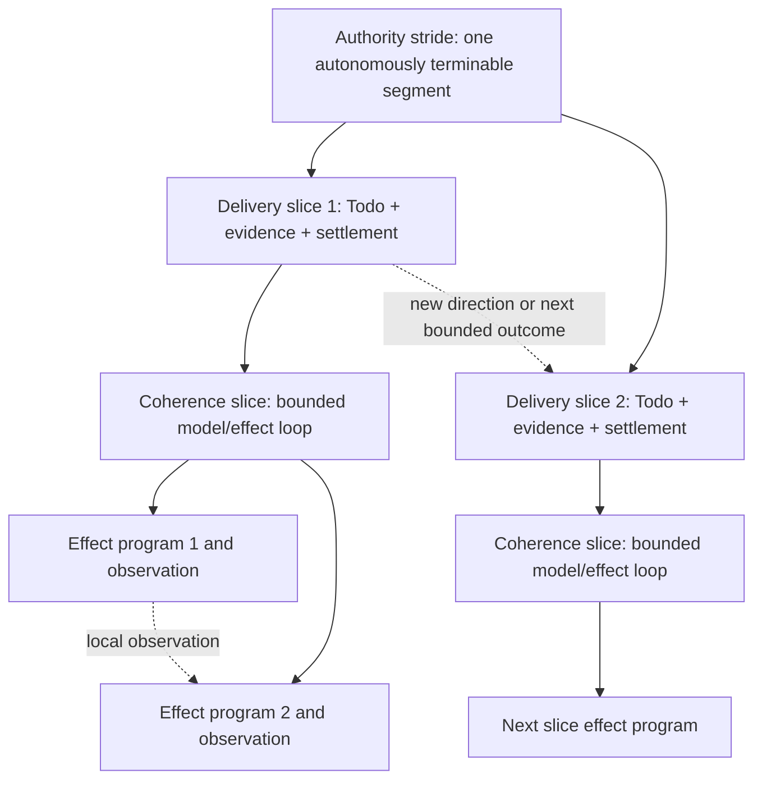

# RFC: Hierarchical Agent Stride Control v0

| Field | Value |
|---|---|
| Status | Accepted |
| Supersedes / closes | none |
| Date | 2026-08-15 |
| Authors | LoopX maintainers |
| Scope | Effect feedback, bounded delivery, authority escalation, model qualification, and long-horizon efficiency |
| Tracking issue | [#3203](https://github.com/huangruiteng/loopx/issues/3203) |
| Source baseline | LoopX `8b8e7b248` |

> Language note: the
> [Chinese version](./hierarchical-agent-stride-control-v0.zh-CN.md) and this
> English version are semantic mirrors. A difference between them is a defect.

## 1. Decision Summary

LoopX should treat **stride** as a hierarchical control problem: how much
semantically coherent work should be admitted before the next feedback,
settlement, or authority boundary.

The system has three nested strides:

1. **Effect stride**: work before the next decision-relevant environment
   observation returns to the model. Its target unit is an effect program
   inside one coherence slice.
2. **Delivery stride**: work before the next light control intervention and
   durable settlement. Its target unit is one bounded, evidence-backed delivery
   slice owned by a Todo.
3. **Authority stride**: work before the next heavy intervention that may
   change scope, acceptance, permission, or direction. Its target unit is one
   autonomously terminable segment.

These are not three independent timeouts and not three fixed counts. The inner
stride is owned by the host and effect interpreter, the middle stride by the
LoopX Turn/Todo/settlement lifecycle, and the outer stride by goal, vision,
gate, and human authority. An inner result may force an early delivery
settlement; a delivery result may force an early authority escalation. A
scheduler tick alone must not manufacture either semantic transition.

This RFC proposes a measurement-first program. The smallest useful slice is a
read-only, provider-neutral stride observation derived from existing receipts.
It should characterize current standard and fine-grained execution before any
runtime automatically widens or narrows a stride. Adaptive control begins in
shadow mode and is promoted only after repeated, stable qualification.

The core judgment is:

> Long-horizon efficiency comes from placing semantic boundaries well, not
> from maximizing uninterrupted work or minimizing protocol events in
> isolation.

## 2. Why One "Turn Length" Is Not Enough

Long-running agents are often tuned with one vague variable: make the turn
longer or shorter. That collapses three different questions:

- How many causally related tool effects can execute before the model needs to
  reconsider its next action?
- How much outcome-bearing work can execute before evidence and state must be
  durably settled?
- How long can an agent continue under unchanged authority before a user or
  supervisor must decide anything?

A single setting cannot answer all three. The same model may safely run a large
read-only tool program, require a small checkpoint before modifying a fragile
artifact, and still operate for hours without human attention while its goal
and permission boundary remain stable.

The opposite failure is also common. A host may interrupt every small Todo,
force repeated quota and scheduler ceremonies, and ask the user for progress
without creating new authority. The agent appears controlled, but useful work
density collapses.

The three-stride model explains both sides:

| Boundary | Too short | Too long |
|---|---|---|
| Effect feedback | Excess model roundtrips, context re-entry, and tool-call overhead | Decision-relevant observations are consumed late; errors and side effects compound |
| Delivery settlement | Fragmented Todos, repeated scheduling, local-completion bias | Evidence becomes stale, writeback is delayed, and one Todo hides direction changes |
| Authority intervention | Human attention and supervisor churn without new authority | Scope drift, late steering, permission mistakes, and dishonest non-termination |

The objective is therefore not "larger stride". It is the largest stride that
preserves decision coherence, reversibility, evidence freshness, and authority
correctness for the current model and work class.

## 3. Terminology

### 3.1 Feedback hierarchy

This RFC uses three kinds of external feedback:

1. **Environment feedback**: tool results, repository state, test output,
   remote API responses, or other observations that can change the next action.
2. **Control feedback**: quota decisions, scheduler wakes, Todo state,
   validation results, writeback receipts, and replan obligations.
3. **Authority feedback**: user steering, user gates, protected-operation
   decisions, goal or acceptance changes, and supervisor proposals that a
   legitimate authority accepts or rejects.

Environment feedback informs action. Control feedback qualifies and settles a
bounded slice. Authority feedback may change what work is legitimate.

### 3.2 Coherence slice

A **coherence slice** is the largest local sequence of model decisions and tool
effects for which all of the following remain stable:

- the immediate objective and postcondition;
- the active hypothesis or implementation direction;
- the permission and reversibility boundary;
- the evidence needed to decide whether the slice succeeded.

At the LoopX product boundary, one governed Turn should represent one bounded
delivery slice and one coherence slice. A host may implement it with one native
model turn or a bounded multi-step model/tool loop. Provider-native terminology
is not the contract.

### 3.3 Bounded delivery slice

A **bounded delivery slice** is one scheduled, Todo-anchored outcome with:

- a verifiable postcondition;
- an explicit effect, time, or work budget;
- fresh evidence;
- targeted validation;
- durable writeback and settlement.

One bounded delivery slice should normally align with one coherence slice. It
has one selected Todo as its causal anchor and may, in fine-grained mode, close
a bounded chain of evidence-qualified checkpoint Todos while direction remains
unchanged. A new direction is a new slice. A broad Todo must be split when an
intermediate result is expected to change direction or authority.

### 3.4 Autonomous segment

An **autonomous segment** is a sequence of bounded delivery slices executed
under one stable authority snapshot. It ends honestly with one of:

- accepted goal or milestone outcome;
- coverage-backed exhaustion or no-follow-up;
- a concrete blocker;
- a user or protected-operation gate;
- an explicit scope or acceptance change.

An elapsed timer, a status report, or completion of one local Todo is not by
itself an autonomous-segment terminal.

## 4. Current Truth and Missing Pieces

This section is intentionally maintained as implementation evolves. Shipped
behavior is defined by code and stable protocol references; this RFC records
the research direction.

### 4.1 What exists today

| Layer | Current LoopX truth |
|---|---|
| Effect | The [Agent Loop Effect Interpreter RFC](./agent-loop-effect-interpreter-v0.md) defines typed effect request, interpretation, observation, and settlement semantics. |
| Turn | The [LoopX Turn protocol](../../reference/protocols/loopx-turn-v0.md) governs decide -> execute -> validate -> commit and keeps scheduler handoff outside settlement. |
| Delivery | Execution profiles distinguish standard and fine-grained Todo contracts; fine-grained mode uses a coherent-slice turn budget and evidence-sensitive successor creation. Every admitted heartbeat still performs full durable settlement. |
| Continuation | In addition to same-Turn controller dispositions, a typed delivery-continuity reducer can preserve the latest accountable `outcome_progress` Todo across heartbeat wakes while that same Todo remains open, actionable, capability-ready, and owned by the same agent. |
| Progress | Typed progress observations, repeat detection, semantic replan closure, and evidence projections can distinguish material delta from maintenance. |
| Research | The [Research Exploration Control Plane RFC](./research-exploration-control-plane-v0.md) defines an optional typed knowledge frontier and composition experiments. |
| Authority | Goal vision, user gates, permission policy, and peer/supervisor boundaries remain separate from execution and scheduling. |

### 4.2 What is missing

| Gap | Consequence |
|---|---|
| No shared stride vocabulary | Host, Todo, scheduler, and human-attention changes are discussed as one generic "turn length" problem. |
| No cross-layer observation | LoopX cannot tell whether low throughput came from model/tool roundtrips, over-frequent settlement, or authority churn. |
| No model capability profile for stride | A fast tool-using model and a slower protocol-reliable model receive mostly static execution contracts. |
| No semantic split/merge qualification | Todo granularity is configured or prompted, but not evaluated against observed decision changes and settlement cost. |
| No interruption-value model | Periodic reports and genuine authority changes are not measured separately. |
| No adaptive promotion path | There is no shadow recommendation -> bounded experiment -> promoted policy lifecycle for stride tuning. |

## 5. The Three-Layer Model



The hierarchy is nested, but the inner effect count and the outer delivery
count are not fixed. A governed Turn normally aligns one delivery slice with
one coherence slice, while that slice may contain many model/effect cycles and
a fine-grained causal checkpoint chain. An autonomous segment may contain one
delivery slice or many. Semantic stop conditions dominate numeric ceilings.

### 5.1 Effect stride

**Question:** how much causally dependent environment work should execute
before a decision-relevant observation returns to the model?

**Owner:** host agent loop, tool runtime, and effect interpreter.

**Target unit:** one bounded effect program within a coherence slice.

**Continue when:** every next effect is a causal consequence of the current
decision, intermediate observations can be consumed locally without changing
the governing hypothesis, effects remain within the same permission and
reversibility class, and the program stays inside declared budgets.

**Stop when:** an observation can change the next plan; a permission, safety,
or irreversible boundary appears; the local hypothesis is contradicted; the
output needed for validation is available; or a compute, wall-time, call, or
output ceiling is reached.

DeepSeek Harness **Code Mode** is a concrete public example of widening this
stride. The model writes a Python or TypeScript program that can loop, branch,
fan out, and post-process tool results without returning every intermediate
result to model context. Tool subcalls still traverse the same policy and guard
pipeline. That can reduce model roundtrips without weakening effect authority.

Code Mode does not imply that a Todo should become broader or that human review
should become rarer. It changes one layer only.

### 5.2 Delivery stride

**Question:** how much outcome-bearing work should execute before LoopX
validates, writes evidence, refreshes durable state, and settles the slice?

**Owner:** Todo, Turn, validation, writeback, quota, and settlement contracts.

**Target unit:** one bounded delivery slice and coherence slice with one stable
postcondition.

**Continue when:** the Todo postcondition is unchanged; fresh evidence supports
the same direction; a successor is causally related rather than prewritten;
there is no open replan or authority obligation; and the bounded chain remains
inside its safety ceiling.

**Stop when:** the postcondition is met; evidence changes direction; validation
fails in a way that requires a new hypothesis; a replan obligation opens; a
user or permission gate appears; or further work would make the evidence and
writeback stale.

A scheduler wake is not a delivery closeout. A normally admitted open
advancement Todo starts with an `in_flight_continuation` settlement boundary;
after an accountable `outcome_progress`, the next heartbeat also resumes that
same Todo ahead of a newly reordered sibling while the postcondition, claim,
capability readiness, and authority facts remain stable. A heartbeat receipt,
blocking work lane, autonomous replan, control repair, delivery denial,
`outcome_gap`, Todo completion/blocking, or claim transfer ends that continuity
and returns selection to the ordinary typed frontier.

Continuation does not create a lighter settlement class. Each heartbeat still
validates, durably writes back, and spends quota under the existing accountable
settlement contract. The additive `in_flight_continuation` boundary changes
only vision-checkpoint timing: intermediate progress on the same Todo records a
typed continuation checkpoint without demanding a fresh vision decision.
Completion, durable Next Action changes, replan, gaps, and terminal outcomes
remain `semantic_closeout` boundaries and retain the strict vision contract.
Multi-slice bursts and redundant scheduler-ACK suppression remain separate
experiments; they are not implied by sticky Todo selection.

Todo granularity should be defined by **decision stability**, not line count,
file count, command count, or elapsed minutes:

- a Todo is too broad when a plausible intermediate observation can change the
  direction, acceptance test, or required authority;
- a Todo is too narrow when it records only a mechanically dependent substep
  whose result cannot change the next decision and whose separate settlement
  adds no reusable evidence.

The existing fine-grained contract is a useful experiment, not the final
answer. It already permits several causally related advancement Todos in one
coherence slice after inspecting fresh evidence, while forbidding a prewritten
long runnable chain. This RFC generalizes the measurement problem around that
behavior rather than replacing it.

### 5.3 Authority stride

**Question:** how long may the agent continue before an intervention is allowed
to change scope, acceptance, permission, or direction?

**Owner:** goal and vision acceptance, user gates, protected-action policy, and
human authority. A supervisor may propose; it does not acquire authority by
observing or scheduling work.

**Target unit:** one autonomously terminable segment.

**Continue when:** the authority snapshot is stable; selected work remains
inside accepted scope; no protected operation requires consent; evidence
supports continued autonomy; and one honest terminal remains reachable.

**Stop when:** the goal or acceptance boundary must change; a protected action
requires authorization; ambiguity has material consequence; coverage is
exhausted; a concrete blocker persists; or an accepted milestone is complete.

A human-readable progress report need not be a heavy intervention. Reporting
may be a projection side effect with no steering authority. Conversely, a one-
line user instruction that changes scope is a heavy intervention even if it is
cheap to deliver.

## 6. Cross-Layer Control Laws

### 6.1 Semantic boundaries outrank numeric budgets

Every layer may have hard ceilings for safety and cost, but a ceiling is not a
completion rule. The controller should end early on semantic change and must
not claim success merely because a maximum was reached.

### 6.2 Inner continuation cannot borrow outer authority

A programmatic tool loop may compress many effects, but it cannot cross a
permission boundary, broaden the Todo postcondition, reinterpret acceptance,
or suppress a required user gate.

### 6.3 Outer continuity cannot excuse missing settlement

Stable goal authority does not allow an agent to work for hours without fresh
evidence and durable writeback. Delivery settlement is the memory and replay
boundary of the autonomous segment.

### 6.4 Scheduler cadence is not semantic cadence

A wake signal says that the host may inspect current state. It does not prove
that a new Todo is needed, that a coherence slice ended, or that human
attention is warranted. Missed and duplicate wakes should be recoverable from
durable state.

### 6.5 A stronger model does not widen every layer

Model capability is multidimensional:

- reliable tool-program composition may justify a larger effect stride;
- good observation use may justify a larger coherence slice;
- weak typed-protocol compliance may require a smaller delivery packet;
- poor self-evaluation may require earlier validation despite high coding
  throughput;
- stable long-context reasoning may reduce redundant replans but does not grant
  protected-operation authority;
- a risky or irreversible work class may require narrow effect and delivery
  strides regardless of model strength.

The system must qualify a model/task/profile combination rather than attach one
global "long-horizon" score to a model name.

### 6.6 Replanning is a boundary transition, not a fourth stride

Replan consumes evidence from the current slice and selects a new direction.
It usually ends the current delivery slice. It may remain inside the same
authority stride when goal, acceptance, and permissions are unchanged; it
escalates outward only when those boundaries must change.

## 7. Architecture Integration

This RFC does not introduce a second execution engine.

### 7.1 Effect interpreter integration

An inner tool program should compile to, or be interpreted as, the existing
typed effect program. Each sub-effect remains policy-qualified and receipt-
bearing. Programmatic composition changes scheduling and observation return;
it does not make side effects opaque.

If a future policy module selects an effect-stride profile, it should emit a
typed verdict that the effect interpreter enforces. Policy must not become a
parallel executor.

### 7.2 Turn and settlement integration

The current validated Turn receipt remains the middle-layer proof. The
settlement order and stable effect identity continue to protect validation,
durable writeback, and spend. Scheduler handoff remains outside settlement.

The first stride observation should be derived from existing receipts and run
history. It must not require every host to adopt a new execution path.

### 7.3 Todo and replan integration

Todo owns the bounded postcondition. Replan owns direction change. A stride
controller may recommend split, merge, continue, settle, or escalate, but it
must not close a Todo, fabricate evidence, or clear a replan obligation.

Research goals may also consume the typed frontier defined by the Research
Exploration RFC. A composition experiment can be one delivery slice; the
stride model does not create another research graph.

### 7.4 Authority integration

Goal and vision state remain authoritative for acceptance. User gates and
protected-operation policy remain authoritative for permission. Supervisors,
dashboards, and scheduler projections may recommend intervention but cannot
silently convert a proposal into authority.

## 8. Measurement Model

The first implementation should measure before it controls.

### 8.1 Candidate read-only observation

The exact wire schema is intentionally deferred until an active caller exists.
A provider-neutral `hierarchical_stride_observation_v0` should be derivable
from existing public-safe receipts and contain concepts equivalent to:

```json
{
  "schema_version": "hierarchical_stride_observation_v0",
  "lineage": {
    "goal_id": "goal-1",
    "agent_id": "agent-1",
    "todo_id": "todo-7",
    "turn_key": "turn-12"
  },
  "effect": {
    "model_steps": 3,
    "tool_effects": 18,
    "model_visible_observations": 4,
    "completion_reason": "decision_relevant_observation"
  },
  "delivery": {
    "coherence_slices": 1,
    "checkpoint_todos_completed": 2,
    "material_deltas": 1,
    "settlement_reason": "postcondition_met",
    "evidence_fresh": true
  },
  "authority": {
    "authority_snapshot_id": "authority-3",
    "bounded_slices_since_change": 6,
    "segment_disposition": "continue"
  }
}
```

This is observation, not authority. Missing host metrics remain unknown; they
must not be guessed from prose or command names.

### 8.2 Core metrics

**Effect layer**

- useful tool effects per model-visible observation;
- intermediate bytes prevented from re-entering model context;
- decision correction latency after a contradictory observation;
- permission or irreversible-boundary violations per effect program;
- effect-program replay and duplicate-side-effect rate.

**Delivery layer**

- qualified material deltas per wake and per settled Turn;
- settlement lag between material evidence and durable writeback;
- Todo split, reopen, supersede, and redundant-successor rates;
- repeated or materially equivalent progress observations;
- control-plane call, token, wall-time, and model-attention share.

**Authority layer**

- human attention minutes per accepted outcome;
- heavy interventions that actually changed authority versus status-only
  interactions;
- work invalidated by late steering;
- autonomous segments ending in accepted outcome, exhaustion, blocker, gate,
  deletion, or timeout;
- scope and permission violations.

**End-to-end**

- task success and acceptance quality;
- wall time, token cost, tool cost, and human attention;
- useful-work density;
- recovery loss after interruption or failure;
- review burden and defect escape rate.

Counts alone are insufficient. A control-plane call and a repository-wide test
do not have equal cost. The evaluator should retain count, time, token, and
semantic-outcome views.

### 8.3 Cross-layer mismatch signals

The evaluator should identify, without changing runtime behavior:

- **observation debt**: effects continue after the first result that should
  have changed the plan;
- **settlement lag**: material evidence exists but durable writeback is delayed;
- **fragmentation tax**: repeated settlements carry no independently useful
  postcondition or evidence;
- **local-completion bias**: Todo completion is mistaken for goal or segment
  terminal;
- **authority churn**: heavy interventions produce no authority delta;
- **authority drift**: work continues under stale goal, acceptance, or
  permission state;
- **cadence coupling**: scheduler frequency, rather than semantic state,
  determines how work is split.

## 9. Model and Work-Class Qualification

### 9.1 Capability vector

A model profile should be empirical and versioned. Relevant dimensions include:

- tool-program construction and local result handling;
- observation use and plan revision;
- typed packet and receipt compliance;
- constraint retention across long context;
- self-evaluation calibration;
- error recovery and replay discipline;
- evidence summarization without semantic loss;
- honest terminal selection.

The profile describes observed capability under one host/tool contract. It does
not grant authority.

### 9.2 Work classes

Stride qualification should distinguish at least:

1. read-heavy investigation with reversible tools;
2. code modification with targeted tests and reviewable diffs;
3. research exploration with hypothesis and coverage changes;
4. external or irreversible operations requiring explicit gates.

A profile promoted for class 1 must not be inherited by class 4.

### 9.3 Initial hypotheses

- **H1:** programmatic tool execution raises useful effects per model-visible
  observation for composable read-heavy work without increasing policy escape
  or duplicate effects.
- **H2:** decision-stable Todo boundaries raise material outcome per settlement
  compared with both tiny mechanical Todos and broad prewritten chains.
- **H3:** event-driven authority intervention reduces human attention without
  increasing late-steering loss compared with periodic steering.
- **H4:** cross-layer mismatch explains more long-horizon failure than any
  single raw turn-length value.
- **H5:** fast high-throughput models benefit more from compact typed control
  packets and host-derived observations than from more frequent protocol
  ceremonies.

## 10. Experiment Program

### 10.1 Fairness requirements

Comparisons must use:

- the same task statement and starting repository state;
- a pinned LoopX release, host, tool catalog, and scheduler implementation;
- no mid-run reinstall or policy change;
- native or equivalently reliable scheduling;
- public-safe result projections rather than raw private trajectories;
- multiple repetitions, with `N >= 5` per promoted comparison cell;
- both success quality and failure-mode classification.

One run may discover a bug. It cannot establish an optimal stride.

### 10.2 Staged matrix

The first study should avoid a full three-dimensional combinatorial grid.

**Stage A: characterize current behavior**

- standard LoopX execution profile;
- fine-grained profile;
- host-native baseline without LoopX control settlement where a fair adapter
  exists.

**Stage B: vary effect stride only**

- native single-tool effect requests;
- bounded programmatic tool execution;
- identical delivery and authority contracts.

**Stage C: vary delivery stride only**

- mechanically small Todo;
- current fixed bounded Todo;
- shadow-recommended decision-stable Todo;
- identical effect and authority contracts.

**Stage D: vary authority stride only**

- periodic reporting/steering;
- event-driven reporting with unchanged authority;
- event-driven authority escalation;
- identical effect and delivery contracts.

Only after these stages identify interactions should a factorial experiment
combine promoted profiles.

### 10.3 Behavioral qualification

Deterministic tests should prove projection and transition semantics. Model
behavior tests should separately exercise a real packet, actual tool schemas,
and the model's next action. They should judge whether the action consumed a
decision-relevant observation, selected a bounded postcondition, or escalated
authority correctly. They must not pass merely because output contains a
keyword.

## 11. Smallest Useful Implementation Slice

The first implementation is deliberately narrow and reversible:

1. Add one public architecture vocabulary for effect, delivery, and authority
   stride.
2. Derive a read-only stride observation from existing Turn, settlement, Todo,
   quota, and gate receipts where available.
3. Add an offline evaluator that reports layer metrics and mismatch signals.
4. Characterize standard and fine-grained LoopX profiles with public-safe
   fixtures and at least one real model behavior qualification path.
5. Emit shadow recommendations only. Do not alter Todo selection, scheduler
   frequency, effect execution, or user notification.

The first slice should extend the nearest existing Turn/status read model. It
should not create a new built-in capability, executor, scheduler, or generic
policy framework.

## 12. Milestones

### M0: RFC and baseline taxonomy

- agree on the three ownership boundaries;
- define current-mode characterization fixtures;
- name public-safe metrics and failure classes.

### M1: Read-only observation and evaluator

- derive observations from existing receipts;
- preserve unknown fields as unknown;
- report effect, delivery, authority, and cross-layer metrics;
- prove no runtime, quota, notification, or authority behavior changes.

### M2: Effect-stride qualification

- add one real host adapter experiment for bounded programmatic tools;
- prove sub-effects retain policy, identity, failure, and replay semantics;
- compare against native tool calls under a fixed delivery profile.

### M3: Delivery-stride shadow recommendations

- recommend split, keep, or merge from typed postcondition and evidence
  transitions;
- validate recommendations against independent acceptance rules;
- retain Todo and replan as the only execution authorities.

### M4: Authority-stride shadow recommendations

- distinguish reports from authority-changing interventions;
- recommend continue, report, gate, or escalate;
- keep user and protected-operation authority unchanged.

### M5: Opt-in adaptive experiment

- promote only a qualified model/work-class/profile combination;
- retain hard ceilings and rollback;
- compare repeated results against the pinned fixed profile;
- publish limitations and failure modes with any claimed improvement.

## 13. Validation Criteria

The research program is qualified only when it can prove:

1. each observed interval is attributable to stable goal, agent, Todo, Turn,
   and authority lineage where those identities exist;
2. missing host detail remains unknown rather than inferred from prose;
3. deterministic replay produces the same stride observation and mismatch
   classification;
4. effect-program composition preserves sub-effect policy, receipt, failure,
   cancellation, and replay boundaries;
5. Todo split/merge recommendations are tested against semantic
   postconditions, not string or file-count heuristics;
6. reports with no authority delta are not counted as heavy steering;
7. local Todo completion cannot become goal or autonomous-segment terminal;
8. shadow mode changes no scheduling, quota spend, notification, gate, or
   execution behavior;
9. promoted profiles improve end-to-end quality or cost across repeated runs,
   not only one layer-local count;
10. failure cases remain honestly terminal and recoverable.

## 14. Non-Goals

This RFC does not propose:

- one universal optimal number of tool calls, Todos, turns, or minutes;
- forcing every host to use programmatic tool calling;
- making every Todo exactly one native turn or every turn exactly one Todo;
- replacing EffectProgram, Turn settlement, Todo, replan, goal vision, or user
  gates;
- letting a scheduler, supervisor, model confidence score, or adaptive policy
  acquire human authority;
- parsing prose, command names, or file paths to classify semantic progress;
- widening permission or privacy boundaries for efficiency;
- introducing concurrency, race, or CAS machinery before a real concurrent
  caller exists;
- training a generic reinforcement-learning controller before measurement and
  stable baselines exist;
- publishing raw trajectories, private task content, credentials, or internal
  operational evidence.

## 15. Risks and Mitigations

| Risk | Mitigation |
|---|---|
| Metrics reward large but wrong slices | Pair efficiency with acceptance quality, correction latency, defect escape, and recovery loss. |
| Metrics reward tiny but ceremonial slices | Measure independently useful postconditions, evidence, and fragmentation tax. |
| Model or host versions invalidate a profile | Version profiles by model, host, tool contract, work class, and LoopX release. |
| Adaptive layers fight each other | Promote one layer at a time; preserve semantic stop precedence and hard ceilings. |
| Programmatic tools obscure side effects | Interpret every sub-effect through the existing policy and receipt pipeline. |
| Shadow recommendation becomes hidden authority | Mark it read-only; require existing Todo, replan, gate, and user paths for action. |
| Benchmark-specific assumptions leak into core | Keep observations provider-neutral and put adapter details in qualification fixtures. |
| Public evidence reveals private work | Store bounded public-safe aggregates and keep raw trajectories outside the repository. |

## 16. Open Research Questions

1. Which observations are reliably decision-relevant across hosts without
   requiring model self-report?
2. Can Todo split/merge quality be judged from typed postconditions and
   evidence lineage alone, or is a bounded model proposal required?
3. How should interruption regret be estimated when the counterfactual path is
   unobserved?
4. Which model capability dimensions transfer across repositories and which
   must be requalified per work class?
5. How much scheduler jitter can be normalized before wall-time comparisons
   become misleading?
6. When should an event-driven report remain a projection side effect, and when
   should it open a genuine authority gate?
7. What minimum repeated-run evidence justifies promoting a shadow
   recommendation into opt-in adaptive control?

## 17. References

- [LoopX Turn v0](../../reference/protocols/loopx-turn-v0.md)
- [Agent Loop Effect Interpreter v0](./agent-loop-effect-interpreter-v0.md)
- [Research Exploration Control Plane v0](./research-exploration-control-plane-v0.md)
- [Goal Vision and Replan contract v0](../../reference/protocols/goal-vision-replan-contract-v0.md)
- [DeepSeek Harness Code Mode implementation note](https://github.com/deepseek-ai/deepseek-harness/blob/master/.agents/notes/implemented/feature/2026-06-15-code-mode.md)
- [DeepSeek Harness tool execution pipeline](https://github.com/deepseek-ai/deepseek-harness/blob/master/docs/tool-execution-pipeline.md)
