# Quiet-to-due Monitor recovery qualification

[中文镜像](2026-10-02-monitor-quiet-due-recovery.zh-CN.md)

This checkpoint adds composition evidence for T2 and the
[recovery verification RFC](../../composable-state-machines-recovery-verification-v0.md).
Base `e38b057b3` already
contains the effect-identity repair from [#4335](https://github.com/loopx-project/loopx/pull/4335).
An older installed runtime can still exhibit that repaired defect.
The remaining repair handles an unpolled, bound Monitor that becomes blocked:
its original Turn now exposes conditional lifecycle recovery instead of ordinary
execution or conflicting replan selection. No new RPC or persisted schema is added.

## Missing counterexample

A quiet heartbeat automatically commits an observation without a Todo. If a
Monitor becomes due during that same Turn, its explicit binding and actual
observation must remain possible. The first observation cannot settle the later
Todo or occupy its effect identity. Testing a newly due Monitor after an ordinary
unbound guard misses this prerequisite: the quiet poll has already committed.

```mermaid
flowchart LR
    Q[Quiet guard: no Todo] --> O[Commit quiet observation]
    O --> D[Monitor becomes due]
    D --> B[Bind original Turn to Monitor]
    B --> P[Commit exact poll once]
    P --> L[Discard caller response]
    L --> R[Read back and retry original poll]
    R --> S[Turn settled; no quota debit]
    S --> N[Material successor uses a new Turn]
```

## Executable boundary

`tests/control_plane/test_monitor_quiet_due_recovery.py` enumerates twelve journeys:
legacy Markdown, canonical File and canonical SQLite, each with unchanged and
material observations, with and without a peer-scoped user gate and reminder. Each journey uses real CLI subprocesses, real TS effects
and isolated provider state. It performs two exact retries and one conflicting
result retry. The response is deliberately discarded after successful command
completion; this models acknowledgement loss, not a process crash inside commit.

Independent assertions require two distinct polls (quiet and Todo-bound),
unchanged original observation, no refresh/spend records, no mutation on replay
or conflict, one material generation and successor only in the material case,
and settled readback that cannot execute further work in the original Turn.
The Monitor remains open; material successor selection uses a fresh Turn.

Three additional journeys block an already-bound Monitor before its poll. The
unmodified base incorrectly returns `normal_run` in this fixture; other frontier
states can attempt a conflicting replan binding. Head returns the existing
`unsettled_host_turn_recovery` mode with the original identity and no delivery
authority. Two readbacks preserve blocked state. Only after the fixture's blocker
is resolved does the test execute the projected restore command, re-enter the
original guard, poll and settle without spending quota.

Sensitivity was checked in a disposable checkout of the same base: restoring
Turn-only effect allocation makes the unchanged/legacy journey fail at its first
bound poll with `heartbeat_receipt_identity_conflict`. Unmodified base passes
all six journeys. This is a deliberate historical-rule mutation, not a claim
that the current base fails. The temporary mutant is not a shipped fixture.

An additional counterexample supplies an incomplete Todo frontier with no aggregate
work lane and an unrelated peer gate. The exact settled Monitor still has to
return `heartbeat_settled_skip`. Base instead allows ordinary execution because
the adapter drops its typed phase when the aggregate lane is absent. The adapter
now preserves the bound Monitor projection independently of aggregate coverage;
TS still owns poll verification and phase classification. This regression is red
before the adapter change and green after it.

A further composition case settles an advancement Turn, then moves its primary
Todo to `blocked` before an independent due Monitor is observed.
The emitted poll previously failed because admission accepted only open/done
primaries. The existing TS transaction owner now accepts this later hold only
when exact settlement readback is `settled`. Unsettled holds still fail closed;
the Monitor must independently pass its due, owner, gate and lease checks.
No held Todo is reopened, no new advancement is admitted and no extra debit is
created. Synthetic TS regressions cover the accepted hold and identity/gate
rejections (including deferred primaries); one CLI journey exercise in-flight writeback, spend, hold, poll and
exact replay. The accepted blocked-primary TS case fails before the change.

## Ownership and limits

| Boundary | Existing owner retained |
| --- | --- |
| Selection arbitration | `work_items/action_portfolio.ts` |
| Monitor transaction and immutable replay | `quota/monitor_poll_commit.ts` |
| Observation and successors in canonical authority | `coordination/todo_monitor_poll.ts` |
| Turn closeout readback | `quota/settlement_readback.ts`, `quota/settlement_phase.ts` |
| Bound Monitor lifecycle recovery | `quota/blocked_wait.ts` |
| Bound phase projection into an optional aggregate lane | `work_items/work_lane.py` |
| Legacy effect-id compatibility and transport | `quota/monitor_poll.py` |

The related refactor shares the current-Turn recovery envelope between causal
waits and blocked Monitor recovery in `blocked_wait.ts`. Python passes the already
verified Monitor phase through the existing request and renders the typed repair;
it owns no second lifecycle rule. The added phase field is optional: earlier
requests retain their causal-wait behavior. Only active, correctly owned blocked
Monitors with `poll_due` qualify; missing, duplicate, foreign, archived and already
polled inputs do not enter this restoration route. Tests assert these exclusions.

Default behavior changes for blocked, unpolled replay, for bound Monitor
projection when an incomplete frontier has no aggregate lane, and for independent
auxiliary observation after an exact settled advancement is held. The emitted
restore command is conditional on a verified resolved blocker; the projection
neither reopens the Todo nor establishes a poll/closeout receipt. Retain the
blocker when unresolved. The existing Todo writer still enforces mutation authority.
Runtime request count is unchanged; no Python rule deletion or performance gain
is claimed. Moving the retained Python effect-id compatibility resolver needs
separate pending-receipt/caller characterization and is deferred.

This qualifies a bounded Monitor closeout and CLI successor-selection sequence,
not full M2/M3: lease transfer, mid-commit crashes, PostgreSQL, scheduler dispatch
and original-context App/Lark delivery are outside this test. Existing pending-
wait recovery tests separately cover original binding retention on File/SQLite.
No model, external provider or benchmark job runs. There is no frontend change.
Reverting restores the previous projection without rewriting persisted data,
but also restores the blocked-Monitor and missing-lane recovery gaps.
