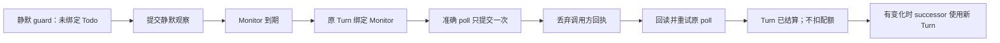

# Monitor 从静默到到期的恢复验证

[English mirror](2026-10-02-monitor-quiet-due-recovery.md)

本 checkpoint 为 T2 和[恢复验证 RFC](../../composable-state-machines-recovery-verification-v0.zh-CN.md)
补充组合证据。
基线 `e38b057b3` 已包含 [#4335](https://github.com/loopx-project/loopx/pull/4335)
的 effect identity 修复；较旧的已安装 runtime 仍可能出现该缺陷。
剩余修复处理已绑定但尚未 poll 的 Monitor 变为 blocked：原 Turn 现在暴露有条件的
生命周期恢复，不再进入普通执行或冲突的 replan 选择。不新增 RPC 或持久化 schema。

## 缺失的反例

静默 heartbeat 会自动提交一条未绑定 Todo 的 observation。若 Monitor 在同一 Turn
内变为到期，仍必须能显式绑定并提交实际观察。前一条 observation 不能完成后续
Todo 的结算，也不能占用它的 effect identity。仅从普通未绑定 guard 测试新到期
Monitor 会遗漏这个前提：静默 poll 已经提交。

## 可执行边界

`tests/control_plane/test_monitor_quiet_due_recovery.py` 确定性枚举十二条旅程：
legacy Markdown、canonical File、canonical SQLite，分别观察无变化与有变化。
每组分别覆盖有、无其他 peer 的 user gate 及普通用户提醒。
各旅程使用真实 CLI 子进程、TS effects 和隔离 provider 状态，执行两次原请求重试
和一次结果冲突重试。第一次命令成功后主动丢弃响应，模拟调用方确认丢失，
不等于模拟提交过程中的进程崩溃。

独立断言要求：静默和 Todo-bound 两条 poll 身份不同；原观察不变；没有 refresh／
spend 记录；重放和冲突不改状态；仅有变化时生成一次 material generation 与一个
successor；已结算回读不允许原 Turn 再执行工作。Monitor 仍为 open；有变化时，
后继选择通过新的 Turn 完成。

另五条旅程在绑定之后、poll 之前将 Monitor 标为 blocked：legacy、File、SQLite
的 soft claim，以及 File、SQLite 的 hard lease。未修改基线在这个
fixture 中错误返回 `normal_run`；其他 frontier 状态还可能尝试冲突的 replan
绑定。修复后使用既有 `unsettled_host_turn_recovery`，保留原身份且不给交付权限。
两次回读都保留 blocked 状态；仅在 fixture 的 blocker 已解除后，测试才执行
投影的恢复命令、重入原 guard、poll 并无配额扣减地结束 Turn。恢复命令向现有
生命周期 owner 提交独立核实的原因与 `--clear-resume-when`。hard lease 下恢复
不授予执行权限：无 lease 的 poll 仍拒绝，取得新 lease 后才执行精确 poll。
另外两条 File／SQLite 用例将相同投影命令用于存在活跃 holder 的状态，验证拒绝
且 Todo、lease 与 Goal 状态均不变。

敏感性验证使用同一基线的临时 checkout：恢复仅按 Turn 分配 effect 的历史规则后，
无变化／legacy 旅程在首次绑定后的 poll 以 `heartbeat_receipt_identity_conflict`
失败。未修改基线的六条旅程全部通过。这是刻意注入历史规则的 mutation，
不声称当前基线仍有该缺陷。临时 mutant 不作为发布 fixture 保留。

另一个反例给出不完整的 Todo frontier：聚合 work lane 缺失，且存在其他 peer 的
user gate。精确的已结算 Monitor 仍必须返回 `heartbeat_settled_skip`。基线 adapter
在聚合 lane 缺失时丢弃已验证 phase，错误恢复普通执行。修复后，绑定 Monitor 的
投影不再依赖聚合覆盖完整性；poll 验证与 phase 判断仍归 TS。此反例在 adapter
修复前失败、修复后通过。

另一个组合场景先结算 advancement Turn，再将主 Todo 置为 `blocked`，
随后观察独立到期的 Monitor。此前命令已经投影，但准入只接受 open/done 主 Todo，
导致执行失败。现在由现有 TS 事务 owner 检查精确结算回读：仅 `settled` 才允许
这些后续 hold。尚未结算的 hold 仍拒绝，Monitor 仍须独立通过到期、owner、gate 和
lease 检查。不重开被 hold 的 Todo，不授予新交付，不增加扣费。合成 TS 回归覆盖
该 hold 及身份／gate 拒绝（含 deferred 主 Todo）；一条 CLI 旅程覆盖 in-flight 写回、扣费、hold、poll
和精确重放。blocked 主 Todo 的 TS 正例在修改前失败。

## 归属与限制

| 边界 | 保留的现有 owner |
| --- | --- |
| selection 仲裁 | `work_items/action_portfolio.ts` |
| Monitor 事务与不可变重放 | `quota/monitor_poll_commit.ts` |
| canonical authority 中的观察与 successor | `coordination/todo_monitor_poll.ts` |
| Turn 结算回读 | `quota/settlement_readback.ts`、`quota/settlement_phase.ts` |
| 绑定 Monitor 的生命周期恢复 | `quota/blocked_wait.ts` |
| 已绑定 phase 到可选聚合 lane 的投影 | `work_items/work_lane.py` |
| legacy effect-id 兼容与 transport | `quota/monitor_poll.py` |

伴随重构在 `blocked_wait.ts` 内共享 causal wait 与 blocked Monitor 的 current-Turn
恢复 envelope。Python 通过现有请求传递已验证的 Monitor phase，并渲染 typed repair，
不另建生命周期判断。新增 phase 字段为可选，旧请求保留 causal-wait 行为。
只有 active、owner 合法、状态 blocked 且 phase 为 `poll_due` 的 Monitor 进入此
恢复路线；缺失、重复、其他 owner、已归档或已 poll 的输入均排除，测试覆盖这些边界。

默认行为改变上述 blocked、尚未 poll 的重入，不完整 frontier 缺少聚合 lane
时已绑定 Monitor 的投影，以及精确结算后的 advancement 被 hold 时的独立辅助观察。
恢复命令以 blocker 已核实解除为
前提；投影不会自行重开 Todo，也不构成 poll／closeout receipt。原因未解除时
继续保留 blocked。既有 Todo writer 仍执行变更权限检查。runtime 请求数不变，
不计 Python 规则删除量或性能收益。保留的 Python effect-id 兼容 resolver 迁移
需要另行刻画 pending receipt／caller，本次延后。

本次仅验证有界 Monitor 结算与 CLI successor selection，不完成整个 M2／M3：
lease transfer、提交中断、PostgreSQL、scheduler dispatch、App／Lark 原上下文投递
均不在覆盖范围。现有 pending-wait 回归另行验证 File／SQLite 保留原绑定的恢复。
不调用模型、外部 provider 或 benchmark Job，无前端变更。
撤销修复可恢复旧投影且无需改写持久数据，但也会恢复 blocked Monitor 与聚合 lane 缺失的恢复缺口。
