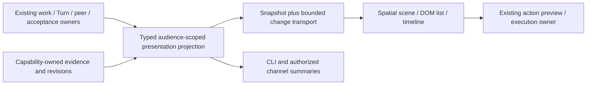

# RFC: Live Team Workspace v0

- **RFC status:** Draft; proposed product and presentation decisions.
- **Delivery maturity:** Design only. An isolated synthetic visual exploration does not qualify production execution or streaming.
- **Owners:** existing workspace presentation, collaboration and runtime owners.
- **Created / normative revision:** 2026-09-20.
- **Implementation baseline:** `e7ef75c08`.
- **Language:** [中文版](live-team-workspace-v0.zh-CN.md) is the semantic mirror. Differences are defects.
- **Parent contracts:** [intelligent presentation](intelligent-review-presentation-surfaces-v0.md), [overall roadmap](loopx-overall-roadmap-v0.md) S3/S5/S7 and R2/R3/R7, [project coordination](../../reference/project-coordination.md).

Sections 1–11 propose the product and acceptance contract; Section 4 records
current implementation facts. Section 12 contains unresolved decisions. Appendix
A separates investigation from implementation. This document owns the live-team
presentation slice, not another scheduler, work graph or capability registry.

## 1. Decision summary

Make a working research team **visible, spatial and inspectable** in the existing
Goal workspace. Combine a precise command surface with an expressive research
studio: people can watch collaborators exchange artifacts, challenge findings,
revise conclusions and return to the original coordinator. Dramatic presentation
is an explicit product objective, alongside comprehensibility and correctness.

Use one semantic projection for the spatial view, accessible list, timeline and
channel summary. Existing typed owners decide execution, acceptance, adoption
and effects. The renderer chooses how to explain those facts. Opening, replaying,
zooming or rearranging the view never starts work or changes authority.

The first live slice is opt-in through the existing **Team execution** entry.
A later approved Overview composition can bring the scene forward without
removing Tasks/Kanban, Chat or Outputs. No default navigation or runtime changes
are approved by this RFC. A synthetic preview must visibly identify itself.

## 2. Problem and observable result

A roster plus status cards cannot answer: **what changed the team's conclusion,
which evidence is it using, who owes the next result, and does the original
research Agent continue?** Streaming more chat creates volume without causality.
A generic workflow editor describes topology but misses the evolution of a
research judgment. An animated office can suggest productive work when the only
fact is that a member was registered.

The target journey starts in the original research conversation: the coordinator
splits a question, local and cloud members investigate, one challenges an input,
another revises it, an independent check accepts the exact artifact, and the
coordinator adopts it into a new research step. The workspace makes that chain
legible without opening every conversation. It also makes incomplete return,
lost observation and rejected results equally visible.

Invariants:

- Registration, grant, admission, execution, return, independent acceptance,
  requester adoption and Goal completion are distinct facts, not one progress bar.
- A peer role, visual group, drag gesture or model statement grants no authority.
- An unknown cost, source relationship, dependency or state remains unknown.
- Evidence freshness and input revision travel with the displayed conclusion.
- Reading/replay cannot run validators or providers on every animation tick.
- The original coordinator remains substantive; more members are justified by
  independent work or a dependency, not an on-screen Agent count.

## 3. Scope and visual experience

### One workspace, three scales

| Scale | What the user sees | Useful interaction |
| --- | --- | --- |
| Team | Stable member stations around the current question; grouped subteams at larger scale | Focus an active dependency or blocked branch; open a member in place |
| Work | The selected question's dependency paths, owed returns and independent checks | Follow a handoff, inspect a repair, return to the original conversation |
| Evidence | Versioned artifacts and compact conclusion changes | Compare before/after, open an authorized source, inspect acceptance and adoption separately |

Use semantic zoom: expanding one task replaces unrelated detail with a compact
context, preserving selection and a return path. Camera changes are intentional
and interruptible; a new event cannot move the user's reading position. Mobile
uses a vertical focused chain and accessible list instead of shrinking a graph.

### Signature interactions

1. **Evidence travels.** A bounded packet moves along an actual handoff edge once
   when a delivery is observed. Request, returned artifact and acceptance have
   different glyphs. Continuous decorative particles are not a throughput meter.
2. **Disagreement leaves a trace.** A sourced challenge opens a visible return
   path; the superseded conclusion remains as a before/after layer. Agreement
   count never becomes confidence. Independent origin requires explicit lineage.
3. **The conclusion takes shape.** A central research folio accumulates adopted,
   versioned findings. Compare the previous basis with the revised basis; do not
   animate a fictional probability or forecast from token output.
4. **Replay the turning point.** A timeline seeks to material events and shows
   what was known then, why it changed and what remains unresolved. Replay is
   labeled historical, with an explicit return to current observations.
5. **Focus the critical dependency.** Dim unrelated work without hiding failures.
   Highlight a real prerequisite path or owed return. If the work owner provides
   no dependency relation, show an observed exchange, not an invented causal edge.
6. **Grow from a studio to a portfolio.** At 10/30/100, collapse by explicit
   subgoal/team scope, preserve material exceptions and expand one cluster. A
   hundred actors are not a hundred simultaneous text panels or subscriptions.

The preferred art direction is clean and high-tech: a cold dark field, precise
linework, a clear central research focus, stable member zones and event-local
highlights. Avoid overlapping decorative orbits, translucent text panels and
multiple simultaneous focal points. Route edges outside reading regions; keep
only the relevant exchange prominent. Depth must clarify hierarchy.

The visual vocabulary can be striking: architectural depth, dimensional work
surfaces, purposeful choreography and transitions from member to artifact to
conclusion. Retain LoopX typography, semantic colors and readable DOM text.
Use [Earn The User's Attention](../../development/design.md#earn-the-users-attention)
for the complete viewport. Motion itself may earn attention, but must not
misrepresent activity. No raw reasoning stream, invented inner monologue,
unreviewed public showcase, trade execution or automated investment decision is
part of this slice.

## 4. Audited current system

| Current owner / entry | Verified behavior at baseline | Gap for this proposal |
| --- | --- | --- |
| `collaboration_mcp.Delegations`; `control_plane/collaboration/delegation.ts` | Requester-scoped explicit bindings, detached work, original-operation recovery, independent accepted-artifact readback | No complete chronological team event source or adoption-to-continuation proof |
| `delegation_inventory.py`; CLI `delegation operations/inspect` | Bounded hash-address pagination; actual Turn/preflight; unavailable branches retained | Inventory is a live page, not an ordered change stream or fleet snapshot; reads can invoke pinned validation |
| `goal-team-work.tsx` in the existing workspace | On-demand inventory and per-binding prerequisite checks | No spatial scene, replay or continuous team observation |
| `chat_server._turn_events`; frontend `streamChatTurn` | Turn-scoped SSE with event identity, sequence and reconnect cursor | Not a Goal/team aggregate; its cursor cannot order independent Turn journals |
| Peer requests/returns and Goal Chat continuation | Request lineage, receiver decisions, original routes; native pause/recovery | Delivery is not requester adoption; unattended wake and two-cycle G1 remain unqualified |
| Existing task graph and acceptance projections | Typed work dependencies and independent acceptance observations | Research conclusion/source lineage must come from the owning capability, not inferred chat text |

Provider credential/admission defects remain runtime-owner work. The scene
must expose such failures and cannot fix them by inferring readiness or launching
an alternative provider. Existing integration repairs and this presentation
slice can progress independently until live qualification requires both.

## 5. Architecture and ownership

**Placement:** extend the existing presentation contract and workspace. Reuse
collaboration, Turn, Todo/acceptance, manager context and source/evidence owners.
There is no new built-in capability or provider. The built-in local Chat host
provides observation transport; optional model/runtime providers retain their
adapters. Finance-specific metrics stay in the finance/research capability and
arrive as audience-safe artifact/claim projections, never kernel rules.

### Observation contract, before a new schema

Implement one cohesive TS projection when its first live caller is built.
Python may read journals, collect owner facts and serve transport; it must not
invent the semantic lifecycle. First inventory producer fields and receipt
identities. Reuse existing schemas; do not add speculative parallel event names
or a second writable event-sourced task system merely to render an animation.

The projection needs: scoped Goal and audience; stable actor/work/operation
identity; parent request and explicit dependency references where present;
source owner and revision; event identity and observed time; previous/current
visible fact; freshness/completeness; audience-safe artifact reference and
version; separate validation, delivery and adoption observations. Unknown is
explicit; observation time must not be presented as actual start/finish time.

A process lock is evidence of an active delegation worker, not proof that its
model is currently generating tokens. A returned model claim is distinct from
host-observed execution and independent validation. UI labels preserve that
provenance. Cost displays retain measured/estimated/unavailable distinctions and
provider scope; motion rate or token count does not imply financial cost.

### Snapshot and stream

- A versioned snapshot establishes one audience-scoped display basis. Subscribe
  with a bounded cursor; if the basis expired or a gap is detected, resnapshot
  explicitly. The existing hash inventory cursor is not a chronological cursor.
- A projection sequence may order display delivery within one stream epoch;
  source revisions and request/dependency identities establish causality. Do not
  impose wall-clock total order across hosts or reuse Turn cursors globally.
- Deduplicate by stable event identity; replay changes presentation only. Duplicate
  delivery, reconnect and seeking cannot repeat side effects or sound/motion.
- Use bounded buffers and coalesce routine activity. Preserve acceptance,
  invalidation, failure and decisions; overflow becomes a visible gap plus
  resnapshot rather than silent loss or unbounded memory.
- Separate cheap observations from explicit accepted-artifact revalidation.
  Show last-verified revision/time and invalidation. Reconnection must not call
  every validator repeatedly; a correctness-critical fresh read uses the existing
  owner and its admission limits. A historical acceptance badge is never labeled
  currently valid when inputs or availability have changed.
- One scoped team connection replaces per-actor browser connections. Reuse the
  local Chat SSE infrastructure where compatible; provider-specific streaming
  can be absent. Without granular events, show last observed state honestly.

## 6. Research and technical choices

These primary sources inform the design; they do not qualify LoopX behavior.

### Agent-interface study

The visual study prioritizes interfaces **for operating and understanding
agents**, rather than unrelated interfaces built by agents. Creator posts and
sampled demo frames were inspected on X. These are presentation observations
and creator-described capabilities, not independent product or runtime tests.
No popularity, throughput or productivity claim is used as evidence.

| Agent example / creator source | Observed or described interaction | Transfer to LoopX / limit |
| --- | --- | --- |
| [AgentCraft multiplayer](https://x.com/idosal1/status/2033962188025565595) | RTS map, member roster, selected-agent context; creator describes cross-machine handoff | Stable spatial identity and selection-to-context; adopt the interaction grammar without fantasy-game chrome or implying that proximity grants authority |
| [MagicPath 2.0](https://x.com/skirano/status/2054975534539370708) | Creator presents a shared human/agent canvas and parallel design outputs; demo shows editable product artifacts | Make research artifacts the common workspace: compare contributions beside their sources, rather than filling the scene with conversation windows |
| [Copilot Mission Control](https://x.com/DanWahlin/status/2059401567892377800) | Selected session, tool-oriented scene and activity panel; author describes replay and turns | Couple a legible event stream to the scene, with selection and historical inspection; tools are distinct from team members and successful calls do not certify outcomes |
| [ClawTeam Gource visualization](https://x.com/huang_chao4969/status/2036860913685561421) | Agent/Git activity visualized as an evolving graph alongside execution output | Event-driven spatial changes can make collaboration tangible; file/commit activity alone cannot stand in for peer adoption or research progress |
| [Mission Control](https://x.com/nykdotdev/status/2091755907676082211) | Creator walkthrough presents dispatch, review, runtime and operational views | Preserve explicit review, failure and next-action context under the expressive scene; do not copy a full administration console into the first viewport |
| [Star Office UI](https://x.com/ring_hyacinth/status/2028021181073527273) | Pixel workspace with state-related locations and a compact work/status area | Stable places can convey team presence; pixel-office decoration and synthetic inner monologues are not the chosen research interface |

**Design synthesis:** a spatial research workbench with a precise command
surface. Keep an enduring place for each member, but put the selected research
question and its artifacts at the visual center. This is a proposed synthesis,
not a claim of unprecedented invention. General WebGL showcases may inform
craft, but do not determine the agent interaction model.

The next visual iteration must demonstrate three connected moments:

1. A member returns a versioned evidence object into the shared workbench.
   One bounded transfer reveals its sender, receiver and delivery observation;
   selection opens the artifact in a stable, readable inspector.
2. An independent member challenges that object. A focused spatial separation
   reveals the exact old/new inputs and unresolved discrepancy; unaffected
   members stay compact. Spatial depth represents explicit versions or groups,
   never hidden reasoning, confidence or fabricated progress.
3. The original researcher adopts the verified revision and changes the
   visible conclusion. A time scrubber reconstructs that turning point without
   re-running work, then returns to current observations.

The command surface stays stationary while objects change. Use crisp material
edges, restrained illumination and deliberate transitions for a high-tech feel;
remove redundant orbit lines, repeated status cards and simultaneous animation
loops. Compare the scene with its plain list on comprehension of who owes what,
what changed and what remains unverified. A stronger visual treatment still
requires a new concrete preview; the current exploration is not approved UI.

### Runtime and rendering references

| Source | Useful precedent | LoopX choice / tradeoff |
| --- | --- | --- |
| [AutoGen Studio](https://microsoft.github.io/autogen/0.4.7/user-guide/autogenstudio-user-guide/index.html) | Visual composition and interaction with teams | Runtime evidence and evolving conclusions take priority over a workflow editor; do not require users to wire a DAG |
| [LangSmith Studio](https://docs.langchain.com/langsmith/studio) | Graph inspection, chat and time-travel debugging | Adapt replay to owner questions; historical inspection never implicitly reruns work |
| [Anthropic research system](https://www.anthropic.com/engineering/multi-agent-research-system) | Lead/worker research division and parallel investigation | Require original-lead synthesis and useful independent artifacts; no performance uplift transferred from another system |
| [React Flow animated edges](https://reactflow.dev/examples/edges/animating-edges) and [performance](https://reactflow.dev/learn/advanced-use/performance) | Custom nodes/edges, SVG/Web Animations, selective subscriptions | Candidate if pan/zoom/graph selection merits its dependency; start small with DOM/SVG and stable layout, not a continuously moving force graph |
| [PixiJS performance](https://pixijs.com/8.x/guides/concepts/performance-tips) and [accessibility](https://pixijs.com/8.x/guides/components/accessibility) | Batched spatial rendering; explicit accessible DOM overlays | Candidate for measured large-scene bottlenecks; keep text/actions semantic, and compare with SVG on identical workloads before adding it |
| [Rive data binding](https://www.rive.app/blog/data-binding-in-rive-a-shared-language-for-designers-and-developers) | State-driven authored animation | Optional later expressiveness; runtime facts drive animation inputs, never the reverse; assets/runtime add maintenance cost |
| [AG-UI events](https://docs.ag-ui.com/concepts/events) | Streaming lifecycle, state snapshots/deltas and subagent attribution | Optional transport vocabulary mapping after an adapter need; run-finished does not mean LoopX acceptance/adoption, and raw/reasoning payloads are excluded |
| [SSE](https://developer.mozilla.org/en-US/docs/Web/API/Server-sent_events/Using_server-sent_events) | Event ids and reconnectable server-to-client delivery | Fit for scoped observations; commands retain current HTTP owners; transport reconnection alone cannot prove complete history |

Prefer the existing React/DOM stack plus SVG/WAAPI for the first live view.
Defer WebGL/WebGPU/3D dependency until an actual depth interaction or measured
workload needs it. Visual ambition is judged by the experience, not shader count.
A renderer change must preserve the same projection and accessibility behavior.

## 7. Authority, privacy and compatibility

Selecting a member opens its existing authorized context; a role or ancestor
relationship grants no child access. Resolve audience authorization server-side
before joining or caching facts. Revoke and clear previously visible data when
scope changes; reconnect cannot reuse another audience's cursor. Do not embed
raw prompts, reasoning, credentials, local paths or private provider identifiers
in events, shareable previews or public screenshots. Explicit owner-only source
access remains distinct from public-safe summaries and exports.

Default-off preserves ordinary chat, bindings, scheduler behavior and budgets.
Existing threads are not replaced to attach this display. No passive subscription
starts, retries, accepts, cancels or wakes work. Actual controls route through
existing typed actions and current admission; viewing a replay cannot activate
historical action buttons. Queue, inbox and steer retain their different delivery
contracts. Keep unknown/unsupported provider facts visible.

## 8. Migration and rollback

Ship the first scene behind an explicit view selection using the existing
team-inspection entry. Keep the list available over the same facts. No canonical
record migration is needed; historical journals lacking fields remain incomplete.
Any disposable transport cache must be rebuildable from current authorized
owners, with explicit history gaps if durable events do not exist.

Disable the scene or stop its subscription to return to list/chat without
interrupting member work. Do not delete journals, rebind sessions, rewrite
historical receipt strength or reset provider state. Default Overview/navigation
changes require the repository's concrete first-screen preview approval before
commit/push; approval of an unrelated copy edit does not approve this scene.

## 9. Acceptance

### First live outcome: one understandable correction

The immediate product target is one **real objection → revision → independent
acceptance → requester adoption**, visible through the packaged workspace with
usable evidence and intervention/stop controls. This is L1's exit condition;
it is not postponed to a later visual polish or continuity phase. A synthetic
script, current-status roster, or stream connection alone cannot satisfy it.

| Moment / user question | Required production evidence and interaction |
| --- | --- |
| Who objected, and to what? | An attributed request or review outcome bound to the challenged claim/artifact version and its evidence; do not classify free text into an authoritative objection state |
| What changed? | Explicit lineage between the original and revised artifacts, with inspectable inputs and a readable difference; differing hashes alone do not establish a correction |
| What passed acceptance? | Independent acceptance for that exact revision, with verifier/source identity and freshness; superseded inputs invalidate the current badge rather than preserving a reassuring historical label |
| Who adopted it? | Requester-owned evidence referencing the accepted revision and the resulting synthesis or next work; delivery, receiver task adoption, requester read/consumption and agreement counts are insufficient |
| Can I intervene or stop? | An existing authorized intervention route with visible queued/delivered/applied distinctions, and a stop/pause route naming its actual target and returned effect; pending or failed control stays visible |

Exercise this same real episode through the frontend and independent CLI
readback. Show unexecuted work, rejected acceptance, missing adoption, stale
artifacts and lost observation without completing the chain visually. A user
must be able to locate the relevant evidence and tell what the control changed.
Pausing the coordinator does not stop dispatched workers: name those workers and
the remaining execution scope. If worker cancellation is unsupported, state it
explicitly; a whole-team stop claim requires worker-owner termination readback.

Implementation checkpoint (2026-09-21): [#4762](https://github.com/loopx-project/loopx/pull/4762)
and [#4811](https://github.com/loopx-project/loopx/pull/4811) are merged. The latter
records native Codex MCP execution and a real-model correction/acceptance/adoption
qualification. This retires the earlier host-approval blocker; it does not prove
the released first-use journey, two continuing cycles or observer comprehension.
Reuse the existing version-bound readback, feedback and scoped pause owners.
The next presentation slice compares an explicitly selected dependency with the
accepted output, requiring the referenced artifact and hash to match. A newer,
missing or unverified source must not silently replace the requested version.
Text differences do not establish semantic correctness or requester adoption.
Keep readable output and comparison prominent; retain raw identifiers in details.
`consume_return` alone still means consumption, not version-bound adoption.
Motion is retained
only when it clarifies these transitions;
remove effects that obscure absent execution, absent acceptance or source loss.
Broader semantic zoom, extra actors and renderer experiments follow this exit.

### Qualification matrix

| ID | Required evidence | Passing result / exclusion |
| --- | --- | --- |
| V1 Truth | Synthetic lifecycle, stale artifact, missing adoption and lost connection | All axes remain distinct; no fabricated executing/accepted/complete state |
| V2 Stream | Duplicate, out-of-order source revisions, expired cursor, restart, revocation and overflow | Consistent current readback, visible gaps, no duplicate effects, no audience leakage |
| V3 Experience | Packaged desktop + 390px, keyboard/screen reader, 200% zoom, reduced motion, idle/blocked/unavailable | Usable source/action path and return focus; selection preserved; no idle activity theater |
| V4 Research loop | Original coordinator plus 2–3 real workers; two cycles; one peer dependency, rejection/correction and worker interruption while another progresses | Pinned independent validation, requester adoption and original-lead continuation read back via CLI and packaged UI; no manual result forwarding; R2/G1 rules unchanged |
| V5 Scale | Identical recorded workloads at 10/30/100 actors, high event rate and long replay | Freeze workload/device/targets before measurement; report latency, CPU/GPU, memory, gaps and attention cost; synthetic render load is not live fleet qualification |
| V6 Rollback | Feature off, old thread, pause, renderer error, source loss | Existing work continues under its original owner; list/Chat remain available; no validation storm |
| V7 Comprehension | Observers identify the blocker, changed conclusion, evidence origin and next owner from list versus scene | Predeclare questions and success criteria; record errors and time-to-answer; novelty ratings cannot conceal worse comprehension |

Candidate V5 targets, to ratify before execution: 60fps target/30fps graceful
floor for foreground motion; p95 interaction below 100ms; p95 projection-receipt
to DOM below 500ms; bounded 10-minute replay and no unbounded heap growth in a
30-minute run. Separate renderer latency from provider/network latency. Record
hardware, viewport, event rate, visible nodes/edges and measurement method. These
are design budgets, not measured performance or release guarantees.

## 10. Operating behavior

Quiet, disconnected, stale, recovering and blocked are first-class visible
states. Stop packet animation when disconnected; retain last observations with
their age. Stop animation in hidden tabs; reduced motion removes travel/camera
motion while retaining discrete events. Offer an explicit pause-animation control
separate from pause-coordinator. Do not auto-scroll logs or emit per-token live
region announcements. Unknown cost is not zero. No audio by default.

Aggregate only over the declared scope and completeness. Show partial inventory
instead of claiming an entire fleet is healthy. Failure stays discoverable while
its cluster is collapsed. Use existing scheduler backpressure; the display has
no wake policy or model refresh loop. Record observation errors without storing
sensitive event bodies in diagnostics.

## 11. Delivery order and relationship to aggressive R2 progress

The [near-term local-agent launch](loopx-overall-roadmap-v0.md#near-term-local-agent-product-and-launch) uses L1 as its real-run demonstration and L2/G1 for sustained-team claims. Marketing preparation can run alongside implementation, but cannot advance these exits.

| Slice | Complete useful result | Entry / exit | Owner and rollback |
| --- | --- | --- | --- |
| L0 Design and traceability | Interactive synthetic study, source audit and executable acceptance plan | Design review; V1/V3 concept checks; no live claim | Presentation; discard prototype, retain decisions |
| L1 One real correction | Objection→revision→independent acceptance→requester adoption is understandable, with evidence, intervention and accurately scoped stop controls | Section 9 first live outcome; V1/V2/V3/V6 and episode-level V7 through real frontend + CLI | Collaboration/evidence/control owners + Chat/packaged UI; disable scene without implying work stopped |
| L2 Continuous research | Original research Agent completes V4 and the user replays correction→adoption→next cycle | Runtime credential/admission repairs and usable L1; qualify each host profile, then V4 | Existing R2/R3 owners; stop new admission and retain results |
| L3 Semantic zoom and scale | Subteams, source/conclusion version comparison and focused replay at measured 10/30/100 display load | Typed lineage producers and L2; V5/V7 and approved first-screen composition | Presentation + evidence owner; reduce detail/revert renderer |

The next executable implementation is **L1**, a complete observation-to-user
vertical with the complete Section 9 correction episode. Include missing
version/adoption producers, source collection, typed projection, reconnect
semantics, packaged UI, evidence navigation, intervention/stop feedback,
independent CLI readback and failure cases in one delivery plan. Inventory
existing receipt identities before choosing a new transport schema. Keep expensive validation outside routine polling.

R2 remains the execution priority: resolve runtime admission/authentication in its
current owner; prove two useful cycles; then qualify governed task derivation and
approved member/profile provisioning through existing registration and settings.
Parallel return/join and original-lead continuation are required before raising
concurrency. Persistent static bindings are a bounded starting point, not a
reusable dynamic staffing system. Do not create a second orchestration program,
replace ongoing integration work, weaken gates, or hide execution failures behind
visual completion. Lark consumes the same bounded facts and existing actions;
its complete return journey is separately qualified and is not a 3D UI port.

## 12. Open decisions

- **Presentation owner, before L1:** final art direction and motion grammar.
  Recommendation: a command surface plus spatial research studio, judged first
  on one real correction. Defer expanded semantic zoom; test populated and failed states.
- **Collaboration/transport owners, before L1:** reuse or extend existing event
  receipts for a restartable team stream. Audit durable coverage; choose a scoped
  cache only if the current owners cannot supply the needed projection directly.
- **Presentation/performance owners, before L3:** retain SVG or add PixiJS/Rive.
  Compare equal scenes, accessibility, bundle size and memory; no dependency is
  adopted by this RFC.
- **Research capability owner, before conclusion view goes live:** exact public-safe
  claim/source/version/adoption fields and privacy. The kernel must not classify
  report independence from prose or infer financial recommendation confidence.

## Appendix A. Investigation and delivery evidence

At the named baseline, source inspection confirms the existing inventory,
preflight, team dialog and Turn SSE described in Section 4. Primary-source
research in Section 6 establishes design alternatives, not product acceptance.
A local synthetic interactive study exercises spatial members, one-shot handoff
motion, correction replay, evidence drill-down and degraded-state presentation.
It launches no Agents and reads no private research data. It is not shipped in
the product or used as live runtime evidence.

**Current checkpoint:** L0 design is merged; Section 9 records the open L1
implementation candidate. Full L1 and L2–L3 remain unqualified. V1/V3 may be
explored with the synthetic study; V2/V4/V5/V6/V7 remain unqualified until their
required production or measured evidence exists. No G1/G3/G4 promotion follows.
The exact delivery PR carries validation and review; roadmap pointers retain
this boundary rather than appending another operational task ledger.
