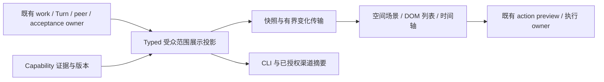

# RFC：团队实时工作区 v0

- **RFC 状态：** Draft；产品与展示决策提案。
- **交付成熟度：** 部分实现：有界团队检查已交付；可读成果/对照切片在 [#4828](https://github.com/loopx-project/loopx/pull/4828) 提案中。空间流式展示仍是设计，不代表生产资格已完成。
- **Owner：** 既有工作区展示、协作与 runtime owner。
- **创建 / 规范修订：** 2026-09-20。
- **实现基线：** `e7ef75c08`。
- **语言：** [English](live-team-workspace-v0.md) 为语义镜像；差异属于缺陷。
- **上位合同：** [智能展示](intelligent-review-presentation-surfaces-v0.zh-CN.md)、[总路线](loopx-overall-roadmap-v0.zh-CN.md) S3/S5/S7 与 R2/R3/R7、[项目协调](../../reference/project-coordination.md)。

第 1–11 节提出产品与验收合同；第 4 节记录当前实现事实。第 12 节保留未决事项，
附录 A 区分调研与实现。本文只拥有团队实时展示切片，不建立第二套调度器、
工作图或 capability registry。

## 1. 决策摘要

让工作的投研团队在既有 Goal 工作区里**看得见、有空间感、可深入核对**。
将精确的指挥台与富有表现力的研究工作室融合：用户能看见成员交换产物、
质疑依据、修订结论，并把结果交回原协调员。惊艳的展示本身是明确产品目标，
同时要求可理解、事实准确。

空间场景、无障碍列表、时间轴和渠道摘要消费同一语义投影。既有 typed owner
判断执行、验收、采用和副作用；renderer 决定怎样解释事实。打开、回放、缩放、
移动视图都不能启动工作或改变权限。

首个真实切片由既有**团队执行情况**入口显式选择启用。后续经批准的概览编排
可将现场前置，保留任务 / Kanban、对话和成果。本文不批准默认导航或 runtime
变化。合成预览必须清楚标识演示性质。

## 2. 问题与可观察结果

成员名单与状态卡片不能回答：**什么改变了团队的结论、正在采用哪份证据、
谁欠下一份结果、原投研 Agent 是否仍在继续？** 更多流式聊天只是增加信息量，
未必说明因果。通用工作流编辑器描述拓扑，却不表达研究判断的变化；动画办公室
可能在只有成员注册事实时，制造正在产出价值的错觉。

目标旅程从原投研对话开始：主力拆解问题，本地与云端成员研究，一方质疑输入，
另一方修订，独立校验接受准确产物，主力采用它并进入下一步研究。工作区让用户
不用翻遍全部对话就能理解这条链路，同时看清返回未闭合、观测丢失与结果被拒绝。

必须保持的不变量：

- 注册、授权、准入、执行、结果返回、独立验收、请求方采用、Goal 完成分别记录，
  不能压成一条进度条。
- peer 角色、空间分组、拖拽或模型声明不授予权限。
- 未知成本、来源关系、依赖或状态仍显示未知。
- 证据新鲜度与输入版本随结论展示。
- 阅读 / 回放不能在每一动画帧运行 validator 或 provider。
- 原协调员持续承担实质研究；更多成员必须对应独立工作或真实依赖，不能以画面中的数量为目标。

## 3. 范围与视觉体验

### 一个工作区，三个尺度

| 尺度 | 用户看见什么 | 有用的交互 |
| --- | --- | --- |
| 团队 | 当前问题周围的稳定成员工位；规模变大后按明确小队分组 | 聚焦活跃依赖或受阻分支，原地打开成员 |
| 工作 | 所选问题的依赖链、待返回结果与独立校验 | 跟随交接、检查修复、回到原对话 |
| 证据 | 版本化产物与精简的结论变化 | 对比前后，打开获准来源，分别查看验收和采用 |

用语义缩放展开一个任务，同时把无关细节收为紧凑上下文，保留选择与返回路径。
镜头变化由明确交互触发且可打断；新事件不能移动用户的阅读位置。手机采用纵向
聚焦链与无障碍列表，不把大图缩小到无法阅读。

### 标志性交互

1. **证据流动。** 观察到一次实际交付后，有限的证据载体沿交接边移动一次。
   请求、返回产物与验收采用不同图形。持续装饰粒子不能充当吞吐率仪表。
2. **分歧留痕。** 带来源的质疑展开可见返回路径；被替代的结论保留为前后对比层。
   共识人数不换算成置信度，来源独立性需要显式谱系。
3. **结论成形。** 中央研究页汇集已采用、带版本的发现，比较旧依据与新依据；
   不依据 token 输出制作虚构概率或预测动画。
4. **回放转折。** 时间轴定位实质事件，说明当时知道什么、为何改变、还有哪些问题。
   回放明确标为历史，并提供回到当前观察的入口。
5. **聚焦关键依赖。** 淡化无关工作但不藏起失败；突出真实前置条件或待返回结果。
   work owner 没有提供依赖关系时，只画观察到的交换，不创造因果边。
6. **从工作室长成团队群。** 在 10/30/100 规模，按显式子目标 / 团队范围折叠，
   保留重要异常，展开一个群组。100 个成员不等于同时打开 100 份文本面板或订阅。

首选美术方向是干净的高科技感：冷黑底、精细线条、清晰的中心研究焦点、稳定
成员区域和局部事件高亮。避免多层装饰轨道、透明文字卡片与多个焦点同时竞争。
连线绕开阅读区，只突出相关交换；纵深必须帮助理解层级。

视觉可以大胆：建筑式纵深、有体积感的工作面、有目的的编排、从成员到产物再到
结论的连续转场。沿用 LoopX 字体、语义颜色与可读 DOM 文字。整个视口遵循
[Earn The User's Attention](../../development/design.md#earn-the-users-attention)。
动态本身可以值得观看，但不能伪装活动。原始推理流、虚构内心独白、未经审阅的
公开 showcase、交易执行与自动投资决策不属于此切片。

## 4. 当前系统审计

| 当前 owner / 入口 | 基线已验证行为 | 本提案尚缺 |
| --- | --- | --- |
| `collaboration_mcp.Delegations`；`control_plane/collaboration/delegation.ts` | requester scoped 显式绑定、独立执行、原 operation 恢复、accepted 产物独立回读 | 完整有序团队事件源；采用到继续研究的证据 |
| `delegation_inventory.py`；CLI `delegation operations/inspect` | 有界 hash 地址分页、真实 Turn/preflight、保留不可用分支 | inventory 是实时分页，不是有序变化流或 fleet 快照；读取可能调用 pinned validator |
| 工作区 `goal-team-work.tsx` | 按需 inventory 与成员启动条件检查 | 空间场景、回放、持续团队观测 |
| `chat_server._turn_events`；前端 `streamChatTurn` | Turn scoped SSE、事件身份 / sequence / 重连 cursor | 不是 Goal/team 聚合流；该 cursor 不能给多个 Turn journal 排序 |
| peer 请求 / 返回与 Goal Chat continuation | 请求谱系、接收方决定、原路返回、native 暂停 / 恢复 | 投递不等于请求方采用；无人值守 wake 与两轮 G1 仍未通过验收 |
| 既有任务图与验收投影 | typed 工作依赖、独立验收观察 | 研究结论与来源谱系应由 capability 提供，不能从聊天文字推断 |

provider credential / admission 缺陷仍由 runtime owner 处理。场景须揭示这些失败，
不能靠猜 readiness 或启动另一个 provider 消除它们。既有接入修复与展示切片可
独立推进，到真实资格化时再汇合。

## 5. 架构与归属

**放置理由：** 扩展既有 presentation contract 和 workspace；复用 collaboration、
Turn、Todo/acceptance、manager context 与来源 / 证据 owner。不新增 built-in
capability 或 provider。内置本地 Chat host 承载观测传输，可选 model/runtime
provider 保留各自 adapter。金融指标留在 finance/research capability，作为有
受众边界的 artifact/claim 投影输入，不能变成 kernel 规则。

### 先明确观测合同，再定 schema

首个真实调用方落地时，实现一个内聚 TS 投影。Python 可读 journal、收集 owner
事实和承载传输，不能自行创造语义生命周期。先盘点 producer 字段与 receipt
身份，复用既有 schema；不能为了动画添加假想事件大全，或另一套可写的
事件溯源任务系统。

投影需要：Goal 与受众范围；稳定 actor/work/operation 身份；存在时的父请求与
显式依赖；源 owner 与版本；事件身份和观测时间；前后可见事实；新鲜度与
完整性；受众安全的 artifact 引用及版本；分离的校验、投递与采用观察。
未知显式表达，观测时间不能冒充实际开始 / 完成时间。

进程锁证明 delegation worker 活跃，不证明模型正在生成 token。模型返回的
声明与宿主观察到的执行、独立验证分别展示。成本区分实测 / 估计 / 不可用及
provider 范围；动画速度与 token 数不能隐含货币成本。

### 快照与流

- 带版本快照确定受众范围内的展示基线，以有界 cursor 订阅。基线过期或发现缺口
  时显式重读快照；已有 hash inventory cursor 不是时间序 cursor。
- projection sequence 可以给一个流 epoch 内的投递排序；因果由源版本和
  请求 / 依赖身份确定。不能按不同 host 的墙钟强排全序，也不能全局复用 Turn cursor。
- 按稳定事件身份去重；重放只改变展示。重复投递、重连和拖动时间轴不能重做
  副作用，也不能反复触发同一声效 / 动画。
- 缓冲有界、合并常规活动，保留验收、失效、失败与决策；溢出显示缺口并重读，
  不能静默丢失或无限增长内存。
- 将廉价观测与显式 accepted-artifact revalidation 分开，显示上次校验版本 / 时间
  与失效。重连不能重复调用所有 validator；必须新鲜读取的正确性检查仍走原 owner
  及其准入限制。输入或可用性变化后，历史验收不能标为当前有效。
- 一个有范围的团队连接替代逐成员浏览器连接。兼容时复用本地 Chat SSE；provider
  可以没有细粒度流，此时如实展示上次观察状态。

## 6. 调研与技术选择

以下一手资料支撑方案比较，不证明 LoopX 行为通过资格化。

### Agent 界面专项调研

优先研究**操作和理解 Agent 的界面**，而非 Agent 生成的无关网站。通过 X 阅读
创作者原帖并抽样查看演示视频画面；以下区分呈现观察与作者描述，不代表独立
试用或 runtime 验证。热度、吞吐量和效率宣传不作为资格化证据。

| Agent 案例 / 创作者来源 | 观察到或作者描述的交互 | LoopX 借鉴与边界 |
| --- | --- | --- |
| [AgentCraft 多人协作](https://x.com/idosal1/status/2033962188025565595) | RTS 地图、成员列表、所选 Agent 上下文；作者描述跨机器交接 | 稳定空间身份与选中后查看上下文；借鉴操作方式，不复制奇幻游戏装饰，也不让空间邻近暗示权限 |
| [MagicPath 2.0](https://x.com/skirano/status/2054975534539370708) | 作者介绍人和 Agent 的共享画布与并行设计产物；视频展示可编辑产品成果 | 让研究产物成为共同工作面，贡献与来源可并排比较，避免把场景塞满聊天窗口 |
| [Copilot Mission Control](https://x.com/DanWahlin/status/2059401567892377800) | 所选 session、工具场景与活动面板；作者描述回放与 turns | 可读事件流与场景联动，支持选择和历史检查；工具与团队成员分开，调用成功不证明结果通过验收 |
| [ClawTeam Gource 可视化](https://x.com/huang_chao4969/status/2036860913685561421) | Agent / Git 活动图随执行演进，旁边保留执行输出 | 用真实事件推动空间变化，体现协作现场感；文件 / commit 活动不能替代 peer 采用或研究进展 |
| [Mission Control](https://x.com/nykdotdev/status/2091755907676082211) | 作者演示分派、review、runtime 与运维视图 | 表现场景下保留明确复核、失败和下一步上下文，不把完整管理后台复制到首屏 |
| [Star Office UI](https://x.com/ring_hyacinth/status/2028021181073527273) | 像素工作区、与状态关联的位置、精简工作 / 状态区域 | 固定位置帮助感知成员存在；像素办公室装饰与虚构内心独白不是本研究界面的方向 |

**设计综合：空间研究工作台 + 精确指挥界面。** 每个成员有稳定位置，视觉中心
交给所选研究问题和产物。这是拟议的综合方案，不声称首创。通用 WebGL 作品
可以辅助打磨表现，但不能决定 Agent 交互模型。

下一轮视觉迭代必须连贯演示三个时刻：

1. 成员把带版本的证据对象交到共享工作台。一次有限交接显示发送者、接收者和
   投递观察，选中后在稳定、可读的详情区展开产物。
2. 独立成员质疑该对象。局部空间展开揭示准确的新旧输入与未解决差异；无关
   成员保持紧凑。纵深表达明确的版本或分组，不能表示隐藏推理、置信度或虚构进度。
3. 原研究员采用已核验修订，更新可见结论。时间轴还原这个转折，不重新执行
   工作，并能回到当前观察。

指挥界面固定，产物随事实变化。用精确材质边缘、克制照明和有意图的转场呈现
高科技感；移除冗余轨道、重复状态卡片与同时循环的动画。与普通列表比较用户
是否能理解谁欠什么、什么变了、什么仍未核验。更强视觉方案仍需新的具体预览，
当前探索不是已批准的产品 UI。

### Runtime 与渲染参考

| 来源 | 可借鉴之处 | LoopX 选择 / 取舍 |
| --- | --- | --- |
| [AutoGen Studio](https://microsoft.github.io/autogen/0.4.7/user-guide/autogenstudio-user-guide/index.html) | 可视团队组合与交互 | 优先 runtime 证据和演进中的结论，不要求用户连 DAG |
| [LangSmith Studio](https://docs.langchain.com/langsmith/studio) | 图检查、聊天与时间回溯调试 | 回放围绕所有者问题，历史检查不隐式重跑工作 |
| [Anthropic research system](https://www.anthropic.com/engineering/multi-agent-research-system) | lead/worker 研究分工与并行调查 | 要求原主力综合与有用的独立产物，不移植别的系统的效果声明 |
| [React Flow 动态边](https://reactflow.dev/examples/edges/animating-edges)与[性能](https://reactflow.dev/learn/advanced-use/performance) | 自定义节点 / 边、SVG/Web Animations、局部订阅 | 平移 / 缩放 / 图选择值得引入依赖时采用；首版可用 DOM/SVG 稳定布局，不让力导向图持续漂移 |
| [PixiJS 性能](https://pixijs.com/8.x/guides/concepts/performance-tips)与[无障碍](https://pixijs.com/8.x/guides/components/accessibility) | 批量空间绘制、显式 DOM 无障碍覆盖 | 大场景实测瓶颈后的候选；文字 / 动作用语义 DOM，以相同负载和 SVG 比较后再引入 |
| [Rive data binding](https://www.rive.app/blog/data-binding-in-rive-a-shared-language-for-designers-and-developers) | 状态驱动的设计动画 | 后续表现力候选；runtime 事实驱动动画，反向不成立；资产 / runtime 有维护成本 |
| [AG-UI events](https://docs.ag-ui.com/concepts/events) | 流式 lifecycle、状态快照 / delta、subagent 归属 | 有真实 adapter 需求后再映射传输词汇；run-finished 不等于 LoopX 验收 / 采用，排除 raw/reasoning payload |
| [SSE](https://developer.mozilla.org/en-US/docs/Web/API/Server-sent_events/Using_server-sent_events) | 事件 id 与可重连的服务端推送 | 适合范围内观测；命令沿用 HTTP owner；传输恢复不能证明历史完整 |

首个真实视图优先既有 React/DOM + SVG/WAAPI。等真实纵深交互或实测负载需要时
再引入 WebGL/WebGPU/3D。视觉野心按体验评判，不按 shader 数量。更换 renderer
必须保持同一投影与无障碍语义。

## 7. 权限、隐私与兼容

选择成员只打开既有获准上下文；角色或父子关系不自动授予子范围访问。服务端先
解析受众权限再 join / cache 事实；scope 变化后撤回并清除已展示数据，重连不能
复用其他受众 cursor。事件、分享预览与公开截图不能带 raw prompt、推理、凭证、
本地路径或私有 provider 身份。明确的 owner-only 来源访问与公开安全摘要 / 导出
保持区分。

默认关闭时保持普通 Chat、绑定、scheduler 与预算行为。不能为展示替换旧线程。
被动订阅不启动、重试、验收、取消或唤醒工作。真实控制走既有 typed action 与
当前准入；历史回放中的 action 按钮不能执行。queue、inbox、steer 保留不同投递
合同，provider 未知 / 不支持字段保持可见。

## 8. 迁移与回滚

首版在既有团队检查入口显式选择，列表使用同一组事实。无需迁移 canonical
记录，缺少字段的旧 journal 保持不完整。可丢弃 transport cache 必须能从当前
获准 owner 重建；没有持久事件时明确显示历史缺口。

关闭场景或订阅可回到列表 / Chat，不能中断成员工作。不得删除 journal、重绑
session、提高历史 receipt 的语义强度或重置 provider。默认概览 / 导航变化
必须在 commit/push 前完成仓库要求的具体首屏预览审批；对另一处文案精简的
批准不等于批准本场景。

## 9. 验收

### 首个真实结果：看懂一次纠偏

眼前的产品目标是：让用户在打包前端里看懂一次**真实的“提出异议 → 修订 →
独立验收 → 请求方采用”**，能够找到证据、介入或停止。这是 L1 的退出条件，
不能推迟到后续视觉打磨或持续运行阶段。合成脚本、当前状态名单或连通事件流
都不能单独满足它。

| 时刻 / 用户问题 | 必须具备的生产证据与交互 |
| --- | --- |
| 谁对什么提出异议？ | 有归属的请求或复核结果，绑定受质疑的结论 / 产物版本及证据；不能从自由文本推断权威异议状态 |
| 到底改了什么？ | 原产物与修订产物之间明确的谱系，可检查输入并读懂差异；哈希不同本身不能证明发生了纠偏 |
| 什么通过了验收？ | 针对准确修订版本的独立验收，带 verifier / 来源身份与新鲜度；输入被替代后不能继续显示令人安心的历史通过标签 |
| 谁采用了它？ | 请求方拥有的采用证据，引用通过验收的版本及形成的综合结论或下一步工作；投递、接收方采用任务、请求方已读 / 消费、赞成人数都不够 |
| 能介入或停止吗？ | 既有获准干预入口，区分排队 / 投递 / 应用；停止或暂停入口说明实际目标和返回效果，待处理 / 失败控制保持可见 |

前端和独立 CLI 回读同一次真实过程。尚未执行、验收失败、缺少采用、产物过期
和观测丢失都不能在画面里补成闭环。用户必须能找到相关证据，并知道控制改变了
什么。暂停协调员不会停止已派发成员：须显示这些成员及仍在执行的范围。成员
不支持取消时明确说明；宣称整队停止需要成员执行 owner 的终止回读。

实施检查点（2026-09-21）：[#4762](https://github.com/loopx-project/loopx/pull/4762)
和 [#4811](https://github.com/loopx-project/loopx/pull/4811) 已合并。后者记录了原生
Codex MCP 执行与真实模型纠偏/验收/采用资格，原工具审批阻塞已经解除；这仍不能
证明发布包首次使用、连续两轮协作或观察者理解度。复用现有版本回读、反馈与范围
限定暂停的 owner。#4828 展示切片把可读报告带回原 Goal 对话，并让用户选择一份
依赖与已验收产物并排阅读，默认优先同名/同类型。指定文件和哈希必须匹配，原文
保留可查，不将 JSON 推断成结论。更新、缺失或无法核验的来源不能替代引用版本。文本
差异不代表结论正确或请求方已采用。突出可读产物和对照，原始标识收进详情。
已合并 [#4814](https://github.com/loopx-project/loopx/pull/4814) 支持从管家和 Goal
飞书卡片确认同一份 canonical 团队计划。认证的卡片绑定和共享决策 owner 防止第二次
点击重复分配。这加强可选请求/干预入口；真实双卡点击仍需安装后验收，不能证明
执行、结果回报或整队停止。
`consume_return` 单独仍只代表消费，不能替代版本绑定的采用。
动态只有让上述变化更清楚才保留；掩盖未执行、未验收
或来源失联的效果应移除。更广的语义缩放、成员扩张和 renderer 探索在此后推进。

### 资格化矩阵

| ID | 所需证据 | 通过标准 / 排除项 |
| --- | --- | --- |
| V1 事实 | 合成 lifecycle、过期 artifact、缺失采用、连接丢失 | 各轴分离，不虚构 executing/accepted/complete |
| V2 流 | 重复、源版本乱序、cursor 过期、重启、撤权、溢出 | 当前回读一致，缺口可见，无重复副作用或跨受众泄露 |
| V3 体验 | packaged 桌面 + 390px、键盘 / 屏幕阅读器、200% 缩放、减弱动态、安静 / 受阻 / 不可用 | 来源 / action 路径与返回焦点可用，选择保留，不用闲置动画伪装工作 |
| V4 研究闭环 | 原 coordinator + 2–3 真实 worker，两轮，一次 peer 依赖、拒绝 / 纠偏和一个 worker 中断而另一个继续 | pinned 独立验证、请求方采用、原主力继续均由 CLI 与 packaged UI 回读；无人肉转发；R2/G1 标准不变 |
| V5 规模 | 相同记录负载的 10/30/100 actor、高事件率、长回放 | 测前冻结负载 / 设备 / 目标；报告延迟、CPU/GPU、内存、缺口、注意力成本；合成渲染压力不等于真实 fleet 资格 |
| V6 回滚 | 功能关闭、旧线程、暂停、renderer 错误、源丢失 | 原 owner 继续拥有工作；列表 / Chat 可用，不触发校验风暴 |
| V7 理解 | 对比列表与场景，观察者识别阻塞、结论变化、证据来源和下一 owner | 预先声明问题 / 成功标准，记录错误与答题时间；新奇评分不能掩盖理解退步 |

V5 候选目标在实验前定稿：前台动态目标 60fps / 优雅降级底线 30fps；p95 交互
低于 100ms；p95 投影接收到 DOM 低于 500ms；有界 10 分钟回放，30 分钟运行
无无界堆增长。renderer 延迟与 provider / 网络分开统计，记录硬件、视口、
事件率、可见节点 / 边及测量方法。这些是设计预算，不是已测性能或发布保证。

## 10. 运行合同

安静、失联、陈旧、恢复中与受阻都是明确状态。失联停止证据移动，保留上次观察
和时间；隐藏 tab 停止动画，reduced motion 去掉移动 / 镜头，仍保留离散事件。
“暂停动画”与“暂停协调员”分别提供。日志不自动滚动，live region 不逐 token
播报，未知成本不显示 0，声音默认关闭。

聚合受声明 scope 与完整性约束；分页不完整时不能宣称整个 fleet 健康。群组折叠
仍能发现失败。复用 scheduler backpressure，展示没有 wake policy 或模型刷新循环。
记录观测错误时不把敏感事件正文写入诊断。

## 11. 交付顺序与激进推进 R2 的关系

[近期本地 Agent 发布路线](loopx-overall-roadmap-v0.zh-CN.md#近期本地-agent-产品与发布路线)以 L1 作为真实运行演示，以 L2/G1 支撑持续团队承诺。宣传准备可与实现同期推进，但不替代这些验收。

| 切片 | 完整有用结果 | 进入 / 退出 | Owner 与回滚 |
| --- | --- | --- | --- |
| L0 设计与可追溯性 | 可交互合成研究、源审计、可执行验收计划 | 设计评审；V1/V3 概念检查；不声明 live | Presentation；丢弃原型，保留决策 |
| L1 一次真实纠偏 | 看懂异议→修订→独立验收→请求方采用，可查证据、干预并使用范围准确的停止控制 | 第 9 节首个真实结果；真实前端 + CLI 的 V1/V2/V3/V6 和本过程 V7 | Collaboration / evidence / control owner + Chat/packaged UI；关闭场景不暗示工作停止 |
| L2 持续研究 | 原投研 Agent 完成 V4，用户回放纠偏→采用→下一轮 | runtime 凭证 / 准入修复及可用 L1；逐 profile 资格化后 V4 | 既有 R2/R3 owner；停新准入、保留结果 |
| L3 语义缩放与规模 | 子团队、来源 / 结论版本对比、实测 10/30/100 展示负载下的聚焦回放 | typed 谱系 producer 与 L2；V5/V7、批准首屏编排 | Presentation + evidence owner；降细节 / 回退 renderer |

下一个可执行实现是 **L1**，覆盖第 9 节完整纠偏过程的观测到用户 vertical。
同一交付计划包含缺失的版本 / 采用 producer、源收集、typed 投影、重连语义、
打包前端、证据导航、干预 / 停止反馈、独立 CLI 回读和失败用例。选择新 transport
schema 前先盘点既有 receipt 身份，昂贵校验离开常规轮询。

执行优先级仍是 R2：当前 runtime owner 解决准入 / 认证，证明两轮有用闭环，
随后沿既有注册与 settings 验证受治理任务派生及经批准的成员 / profile 创建。
提高并发前必须处理并行返回 / join 和原主力继续。静态绑定是有界起点，不是可
重复动态配员系统。不能另建编排项目、替换正在进行的接入修复、降低 gate 或用
视觉完成掩盖执行失败。Lark 消费同样的有界事实与既有 action，完整返回旅程
单独验收，不要求把 3D UI 搬到 Lark。

## 12. 未决事项

- **Presentation owner，L1 前：** 最终美术方向与 motion grammar。建议融合指挥台
  与空间研究工作室，首先以一次真实纠偏评判；扩大语义缩放后置，验证有内容与失败状态。
- **Collaboration / transport owner，L1 前：** 复用或扩展哪些 receipt 支持可重启
  团队流。先审计持久覆盖；现有 owner 无法直接提供需要的投影时才选 scoped cache。
- **Presentation / performance owner，L3 前：** 保持 SVG 还是引入 PixiJS/Rive。
  对比相同场景、无障碍、bundle 与内存；本文不引入依赖。
- **Research capability owner，结论视图上线前：** 公开安全 claim/source/version/
  adoption 字段及隐私。kernel 不从文字分类报告独立性，也不推断金融建议置信度。

## 附录 A：调研与交付证据

在所列基线上，源码审计确认第 4 节的 inventory、preflight、team dialog 和 Turn
SSE。第 6 节一手资料支撑设计选项，不构成产品验收。一个本地合成交互研究展示
空间成员、单次交接动态、纠偏回放、证据深入与降级状态；不启动 Agent，不读取
私人投研数据，未作为产品发布，也不充当真实 runtime 证据。

**当前检查点：** L0 设计已合并；第 9 节记录开放中的 L1 实现候选。完整 L1 及 L2–L3 仍未验收。合成研究可探索 V1/V3；
V2/V4/V5/V6/V7 在获得其要求的生产或测量证据前都未资格化。不晋升 G1/G3/G4。
准确交付 PR 承载验证与 review；总路线只投影此边界，不再追加运行任务账本。
