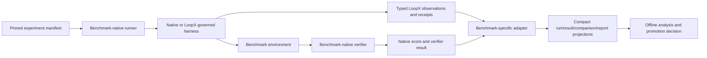

# RFC: Long-Horizon Harness Benchmark and Research Program v0

| Field | Value |
|---|---|
| Status | Accepted |
| Supersedes / closes | none |
| Date | 2026-08-16 |
| Authors | LoopX maintainers |
| Scope | External capability evidence, benchmark collaboration, harness experiments, and mechanism qualification |
| Source baseline | LoopX `e8d40542f` |

> Language note: the
> [Chinese version](./long-horizon-harness-benchmark-research-program-v0.zh-CN.md)
> and this English version are semantic mirrors. A difference between them is
> a defect.

## 1. Decision Summary

LoopX should maintain one long-horizon harness research program with two
strictly separated lanes:

1. **Capability evidence** asks whether a pinned LoopX harness improves a
   benchmark-native outcome, efficiency, or recovery result under a fair,
   reproducible comparison.
2. **Mechanism research** uses benchmark tasks as experimental environments to
   test typed hypotheses about stride, evidence delivery, replanning, research
   exploration, human attention, memory utility, and capability evolution.

The initial external-validity portfolio should use three complementary
benchmarks rather than one synthetic aggregate leaderboard:

- **Agents' Last Exam (ALE)** for broad professional workflows, mixed CLI/GUI
  environments, and economically meaningful deliverables;
- **Long-Horizon Terminal Benchmark (LHTB)** for hundreds of dependent terminal
  actions, dense partial reward, verifier checkpoints, and long-run failure
  dynamics;
- **DeepSWE** for original, long-horizon software-engineering tasks with
  outcome-oriented verifiers.

The benchmark's native runner, task contract, verifier, score, and publication
rules remain authoritative. LoopX supplies an adapter, experiment manifest,
typed control observations, and compact public-safe result projections. It
must not replace benchmark truth with its own coordination score.

No single run, control-plane call count, or improved internal metric proves
LoopX capability. A capability claim requires benchmark-native outcome evidence
or cost-normalized non-inferiority, treatment integrity, repeated matched runs,
and uncertainty. Mechanism studies may publish negative results and may remain
non-leaderboard research indefinitely.

## 2. Why This Program Is Needed

LoopX already has several candidate benchmark execution surfaces:

- a provider-neutral `BenchmarkAdapter` lifecycle;
- compact `benchmark_run_v0`, `benchmark_result_v0`,
  `benchmark_comparison_v0`, and `benchmark_experiment_report_v0` read models;
- run-permission, route, lifecycle, attempt, failure, and artifact boundaries;
- adapters for ALE, Terminal-Bench, SkillsBench, and AgentIssue-Bench;
- passive-baseline, assisted-mode, and claim-boundary documentation.

These assets are useful inputs, not the authority for the new program. Much of
the existing benchmark code and research predates a sustained native-versus-
LoopX pilot and is uneven in abstraction, validation depth, and operational
value. The program should retain a component only after a current real run
demonstrates its caller outcome, boundary, and conformance contract.

What is missing is a durable research contract that says what this machinery
may prove. Without it, the program can mistake protocol activity for useful
work, select cases after seeing outcomes, compare incompatible harnesses, or
bundle several mechanisms into a treatment whose causal effect cannot be
identified.

The program also needs external breadth. A software-only benchmark can show
engineering value but not broad professional transfer. A broad CUA benchmark
can show external validity but makes detailed loop-mechanism attribution harder.
A binary-only benchmark can hide partial progress, while a dense-reward
benchmark may over-emphasize verifier cadence. The three-benchmark portfolio
turns these limitations into complementary evidence.

The core research question is:

> Under which task, model, host, and budget conditions does an external durable
> control plane improve verified long-horizon work enough to justify its
> protocol, latency, and complexity cost?

### 2.1 Evidence and design authority

Two authority orders must not be confused:

1. **Benchmark truth** comes from the pinned upstream runner, environment,
   verifier, scoring contract, and publication rules.
2. **LoopX benchmark-capability design truth** comes first from current pilot
   practice and its independently checked failure modes; official benchmark
   materials explain the native boundary; existing LoopX benchmark code and
   older research are candidate reuse, not presumed architecture.

The current DeepSWE pilot is therefore the first design-driving practice for
the LoopX benchmark capability. Its reusable lessons include arm permission
parity, hidden-answer and verifier isolation, independent completion
validation, accountable settlement only after validation, compact run
reduction, and explicit invalidation when treatment integrity cannot be
proved. Private trajectories and audit artifacts remain local evidence. Only
their generalized typed contracts and public-safe conclusions may be promoted
to the repository.

## 3. Benchmark Primer and Fit Analysis

Benchmark counts and leaderboard values in this section are an informative
snapshot reviewed on 2026-08-16. They are not normative. Every experiment must
pin an upstream revision, task set, runner, verifier, and budget.

### 3.1 Agents' Last Exam

[Agents' Last Exam](https://agents-last-exam.org/) evaluates long-horizon,
economically valuable professional workflows with verifiable outcomes. Its
public site reports 1,500+ collected tasks across 55 targeted sub-industries;
the [paper](https://arxiv.org/abs/2606.05405) organizes the benchmark into 13
industry clusters and reports that the hardest tier remains far from saturated.

The public
[evaluation framework](https://github.com/rdi-berkeley/agents-last-exam)
separates the agent harness, machine-like sandbox, and executable task. A task
contains an instruction, input material, and a hidden reference staged after
the agent finishes. `evaluate()` produces a score in `[0, 1]`. The runner
collects a unified trajectory and artifacts, and supports both in-sandbox CLIs
and out-of-sandbox harnesses. ALE explicitly preserves each harness's own loop,
tools, memory, and sub-agents rather than driving every system through one
step-by-step scaffold.

**Best fit for LoopX research**

- cross-surface continuity between CLI and GUI work;
- durable state and recovery across heterogeneous professional software;
- authority and human-attention studies where real user judgment has value;
- whether one provider-neutral control plane transfers beyond software work;
- benchmark collaboration on scalable task pipelines and verifier contracts.

**Limits on claims**

- task heterogeneity and licensed environments can make repeated factorial
  studies expensive;
- a harness-level comparison may differ in more than LoopX unless tool and
  capability surfaces are pinned carefully;
- hidden references and raw professional artifacts must never enter LoopX's
  public state or repository;
- broad outcome evidence is strong external validity but weak evidence for one
  specific mechanism unless that mechanism is independently instrumented.

### 3.2 Long-Horizon Terminal Benchmark

[LHTB](https://github.com/zli12321/LHTB) contains 46 containerized tasks across
nine categories. Tasks use a Harbor-compatible five-part layout: metadata,
instruction, environment, hidden verifier, and oracle solution. Its public
[benchmark description](https://zli12321.github.io/LHTB/index.html) emphasizes
three properties: hundreds of dependent actions, verifier resistance through
hidden or replayed checks, and continuous reward in `[0, 1]`, with `0.95` as
the solved threshold.

LHTB's modified Harbor can continue a session after an intermediate verifier
result until pass or timeout. It records checkpoint reward and verifier mode,
while the published model comparison uses one Terminus-2 scaffold, a 90-minute
budget, and mean reward plus solve count. This makes final score and the shape
of progress over time separately observable.

**Best fit for LoopX research**

- stall and repetition detection over hundreds of terminal actions;
- semantic replan latency and whether a new direction creates reward progress;
- evidence/checkpoint use without treating a read or ACK as progress;
- delivery-stride and interruption-cadence studies;
- recovery after failed attempts, premature completion, or verifier feedback;
- reward-area-under-curve and time-to-threshold efficiency analysis.

**Limits on claims**

- modified Harbor behavior is part of the benchmark contract and must not be
  copied into generic LoopX semantics;
- intermediate verifier feedback is benchmark-native evidence, not user
  authority and not a general production oracle;
- identical-scaffold leaderboard results do not automatically validate a
  different governed harness;
- dense reward can reveal progress while still failing to measure maintainable
  code or professional transfer.

### 3.3 DeepSWE

[DeepSWE](https://deepswe.datacurve.ai/) evaluates 113 original long-horizon
software-engineering tasks across 91 active repositories and five languages.
The [paper](https://arxiv.org/abs/2607.07946) describes tasks written from
scratch rather than mined from merged fixes, with hand-written verifiers that
grade requested functionality rather than one reference patch.

The official [run guide](https://deepswe.datacurve.ai/run) exposes
Harbor-compatible tasks through Pier. Published leaderboard runs use
mini-swe-agent for scaffold consistency; Pier can also drive CLI harnesses such
as Codex and Claude Code. The public leaderboard reports task success together
with confidence intervals, cost, output tokens, and agent steps.

**Best fit for LoopX research**

- long-horizon repository understanding, implementation, validation, and
  recovery;
- durable Todo/evidence value against a strong coding-agent baseline;
- effect- and delivery-stride qualification for software work;
- code-quality and verifier-outcome parity after interruptions or restarts;
- holdout evaluation for capability or memory proposals discovered elsewhere.

**Limits on claims**

- changing from the published mini-swe-agent scaffold to another harness is a
  harness experiment, not a model-only leaderboard comparison;
- task or verifier material must not be reused as training, memory, skill, or
  capability-evolution input;
- a passing verifier does not by itself prove lower maintenance cost or broad
  professional transfer;
- repository-level traces can contain sensitive or high-volume material and
  must be reduced before entering LoopX state.

### 3.4 StartupBench

[StartupBench](https://startupbench.github.io/) benchmarks general-purpose agents
on market-validated startup workflows. It contains 97 real-world workflow tasks
across six professional domains (medical & healthcare 21, finance 18, business &
management 19, legal 16, STEM & computer science 16, education & humanities 7).
Tasks are derived from funded AI-native startup products, product demos, and
user interviews around workflows users actually delegate; each task asks the
agent to search, reason, compose, verify, and deliver multi-format artifacts
(DOCX, XLSX, PPTX, PDF, Markdown, images, text) under realistic workspace
constraints.

Scoring is artifact-first: each submission is transformed into evidence views
and judged against fine-grained weighted rubrics (25.3 rubrics per task on
average) rather than answer similarity. The published Agent-as-Judge framework
reports 92% human agreement, a pass threshold of 90, and a top pass@1 of 31.27
with the best average score 73.67 across nine frontier agents, leaving most
realistic workflow deliverables short of production-ready completion.

**Best fit for LoopX research**

- long-horizon artifact delivery and multi-format output verification;
- professional-domain workflow delegation beyond software (finance, legal,
  medical, business) and whether one control plane transfers there;
- deliverable quality and self-verification hallucination: agents claiming
  requirements are met while rubric inspection fails;
- human-attention and authority studies where deliverables are externally
  judged;
- evidence-linked Todo/settlement around artifact completion and format
  compliance.

**Limits on claims**

- task scenarios, reference materials, and generated artifacts must not enter
  LoopX public state or the reusable training/memory surface;
- Agent-as-Judge is benchmark-native evaluation, not a general production
  oracle or authority;
- a rubric score does not by itself prove lower maintenance cost or broad
  professional transfer without an independent audit;
- leaderboard results are model/scaffold specific; changing the harness is
  its own experiment.

### 3.5 LoopsBench

[LoopsBench](https://loopsbench.ai/) (microsoft/Loopsbench) is a benchmark and
harness for long-horizon software tasks in terminal environments. Each task
packages an agent-visible workspace, unit-level requirements, module dependency
graphs, and Docker-backed execution with verifiers that distinguish incomplete,
partial, and complete solutions. The corpus is community-grown through
GitHub-native task proposal and validation, with deterministic task bundles and
SHA-256 checksums; the paper is
[arXiv 2608.00267](https://arxiv.org/abs/2608.00267) and the dataset is hosted
on [Hugging Face](https://huggingface.co/datasets/LoopsBench/LoopsBench).
Built-in adapters cover Oracle, Mini SWE-agent, SWE-agent, OpenHands, Claude
Code, Cursor, Codex, Qwen Code, and Copilot.

**Best fit for LoopX research**

- multi-unit long-horizon implementation: plan, implement, test, and recover
  across connected modules with explicit dependency graphs;
- partial-vs-complete verifier semantics: making progress is observable
  separately from finishing;
- dependency-graph-aware work ordering and stall/replan studies;
- Docker/terminal realism and reproducible remote or local execution;
- recovery after failed unit tests and verifier feedback without treating a
  read or ACK as progress.

**Limits on claims**

- the task corpus is still growing; every experiment must pin the upstream
  revision and exact task set;
- the incomplete/partial/complete verifier tiers are a benchmark contract and
  must not be copied into generic LoopX production semantics;
- Docker-backed terminal tasks require clean network and container isolation
  attestation;
- early-stage leaderboard comparisons are provisional, not a saturated
  reference.

### 3.6 WideSearch

[WideSearch](https://widesearch-seed.github.io/) (ByteDance-Seed/WideSearch)
benchmarks agentic broad information-seeking. It contains 200 bilingual tasks
(100 English, 100 Chinese) across 18 industries that require the agent to
search, collect, and organize large-scale structured information into markdown
tables. The challenge is operational scale and completeness rather than
single-fact cognitive difficulty; evaluation uses fine-grained Item F1 with
exact-match, number-near, URL-match, date-near, and LLM-judge components. The
[paper](https://arxiv.org/abs/2508.07999) and
[dataset](https://huggingface.co/datasets/ByteDance-Seed/WideSearch) are public
under MIT, and a [Harbor adapter](https://github.com/harbor-framework/harbor)
is available for deterministic task generation.

**Best fit for LoopX research**

- web-research workloads that need the benchmark toolkit's network-permitted
  solving policy (`widesearch-permitted-solving`), which the LoopX integrity
  reducer already models;
- long-horizon collection/completeness versus hallucination: agents must
  verify scale and completeness, not only find one fact;
- evidence-based verification (citations, URLs, dates, numbers) that connects
  to evidence and human-attention research;
- bilingual (English/Chinese) generalization across 18 industries;
- a complement to "deep" search benchmarks by stressing breadth and volume.

**Limits on claims**

- live web collection is time- and environment-sensitive; pin the retrieval
  window, tools, and search surface per experiment;
- Item F1 and LLM-judge metrics must be pinned to their exact contract and
  judge model;
- external network access stays under the benchmark-native
  `permitted_solving` policy and must never generalize into a production
  network authority;
- raw web content and retrieved pages must be reduced before entering LoopX
  state; benchmark material must not be reused as training, memory, or skill
  input.

### 3.7 Why these six form a portfolio

| Evidence dimension | ALE | LHTB | DeepSWE |
|---|---|---|---|
| Professional breadth | Primary | Mixed | Software only |
| CLI/GUI cross-surface work | Primary | Terminal | Repository/terminal |
| Dense progress signal | Task-dependent `[0,1]` | Primary continuous reward | Primarily verifier outcome |
| Long-loop dynamics | Observable trajectories | Primary research surface | Strong engineering surface |
| Original/anti-contamination design | Task-managed hidden references | Hidden/replay verifier resistance | Original tasks and verifiers |
| Harness-transfer evidence | Strong, harness-preserving | Requires explicit scaffold comparison | Pier supports multiple CLIs; published scaffold is pinned |
| Best LoopX question | Does control transfer to real professional work? | Why and when does the loop stall or recover? | Does control improve verified software delivery? |

The program must report each benchmark in its native metric space. It must not
average ALE score, LHTB reward, and DeepSWE pass rate into one LoopX number.

The second trio adds three complementary surfaces to the same program:

| Evidence dimension | StartupBench | LoopsBench | WideSearch |
|---|---|---|---|
| Work surface | Multi-format professional artifacts | Multi-unit terminal software | Large-scale web collection |
| Core challenge | Deliverable quality and format compliance | Partial vs. complete across connected units | Breadth and completeness at scale |
| Primary metric | Weighted rubric / Agent-as-Judge | Incomplete/partial/complete verifier tiers | Item F1 and component metrics |
| Long-horizon relevance | Artifact assembly and consistency | Dependency-graph planning and recovery | Sustained search/collect/verify loops |
| Network boundary | Workflow-local | Containerized terminal | External network permitted for solving |
| Best LoopX question | Does control improve verified artifact delivery? | Why and when does multi-unit work stall or recover? | Does evidence-gated control reduce hallucination at scale? |

The six must still be reported in their native metric spaces; StartupBench
rubrics, LoopsBench verifier tiers, and WideSearch Item F1 must not be averaged
into one number or into the ALE/LHTB/DeepSWE results.

## 4. Claim Ladder

Every public result must name the highest claim level it supports.

### C0: Reproduction and adapter fidelity

The pinned native runner can provision, execute, grade, and reduce a task
without changing task semantics. The adapter preserves lifecycle and public
boundaries. No LoopX benefit is claimed.

### C1: Control observability

LoopX passively records durable state, progress, cost, recovery, and failure
attribution without changing the worker's decisions or official outcome. This
may prove auditability or measurement capability, not task uplift.

### C2: Within-benchmark causal evidence

A matched, repeated comparison isolates one governed mechanism or one complete
LoopX profile and shows benchmark-native uplift or cost-normalized
non-inferiority with improved long-horizon failure metrics. The claim is scoped
to the pinned benchmark, model, harness, task stratum, and budget.

### C3: Cross-benchmark generality

The same typed mechanism direction replicates across at least two materially
different benchmark families without benchmark-specific semantic shortcuts.
The exact effect size may differ. A null result in a third family remains part
of the report.

### C4: Product promotion evidence

A mechanism has C2 or C3 evidence, passes LoopX model-behavior and state-machine
qualification, stays inside overhead and authority budgets, and survives a
non-benchmark product canary. Only then may maintainers consider changing a
default profile. Benchmark evidence alone does not change production defaults.

## 5. Experiment Contract

### 5.1 Unit of comparison

The minimum experimental identity is:

```text
(benchmark_id, benchmark_revision, task_id, task_stratum,
 environment_digest, verifier_revision, model_id, model_revision,
 harness_id, harness_revision, policy_profile, seed, budget)
```

Unknown values remain explicit. Display names, prose prompts, or “same model
family” are not identity.

### 5.2 Required arms

The program distinguishes four arm types:

1. **Native baseline**: the benchmark's supported reference scaffold or a
   declared CLI harness with no LoopX control.
2. **Passive LoopX**: identical worker decisions and benchmark contract, with
   read-only LoopX observation and compact settlement.
3. **Governed LoopX**: a declared LoopX profile may affect continuation,
   checkpoints, replan, recovery, or allowed control actions.
4. **Mechanism ablation**: one named mechanism differs from a governed parent
   profile while every other controllable field is held fixed.

Assisted human or simulator intervention is a separate study family. It must
never be presented as an autonomous leaderboard arm.

For a Codex treatment comparison, the existing Passive Baseline Protocol still
requires the matching Codex goal-mode baseline. A benchmark-reference scaffold
reproduction is an additional fidelity row; it does not replace the same-host
baseline needed to attribute a LoopX treatment.

### 5.3 Fairness and treatment integrity

For a matched cell:

- task input, environment, verifier, model revision, reasoning effort, budget,
  network/tool envelope, and starting state are pinned;
- runner and harness differences are declared rather than hidden behind the
  model name;
- no release, prompt policy, skill set, or scheduler implementation changes
  during a run;
- both arms receive the same declared authority envelope, and a structured
  integrity audit proves that hidden references, expected answers, verifier
  internals, and post-run grading material were unavailable to the worker;
- every treatment emits a compact typed receipt proving which mechanisms were
  delivered, triggered, accepted, rejected, or unused;
- missing treatment delivery is non-compliance, not a treatment failure;
- crashes, setup failures, and verifier failures retain separate attempt and
  failure classes;
- task selection and primary metrics are registered before outcome inspection.

Repeated comparisons should use paired tasks and seeds. `N >= 5` per promoted
comparison cell is the default floor, not a guarantee of statistical power.
Expensive ALE cells may use a predeclared sequential design, but stopping rules
must not depend on whether the current effect looks favorable.

### 5.4 Result separation

Every experiment report keeps these layers separate:

- benchmark-native outcome;
- LoopX control-plane observations;
- cost and latency;
- assisted intervention, when present;
- treatment-integrity status;
- benchmark-integrity and arm-authority-parity status;
- publication and leaderboard eligibility.

An internal control score may diagnose behavior. It must not be added to the
native task score or used to turn a failed task into a success.

## 6. Measurement Model

### 6.1 Native outcomes

- benchmark score, reward, or pass result;
- task and stratum success rate with uncertainty;
- benchmark-native sub-scores when officially defined;
- final artifact/verifier outcome;
- submit and leaderboard eligibility.

### 6.2 Efficiency

- wall time, model tokens, provider cost, tool calls, and agent steps;
- score per unit cost and time, reported alongside raw score;
- reward area under the time/step curve where checkpoints are native;
- time and cost to the first material delta and to score thresholds;
- unused budget after honest success, exhaustion, blocker, or no-follow-up.

### 6.3 Long-horizon control quality

- materially equivalent work-slice repetitions;
- idle or maintenance loops accepted after a replan obligation;
- trigger-to-context, trigger-to-new-direction, and trigger-to-material-delta
  latency;
- evidence delivered, used, contradicted, and ignored;
- duplicated work and recovery loss after interruption;
- stale-state, premature-terminal, repeated-blocker, and harness-conflict rates;
- durable settlement lag and resume quality;
- protocol tax decomposed into model tokens, control calls, wall time, and
  attention rather than one call-count percentage.

These measurements must come from typed observations, receipts, runner events,
or verifier checkpoints. Prose similarity and keyword matching cannot be the
semantic source of truth.

### 6.4 Human attention

For assisted studies only:

- human or simulator attention minutes and response latency;
- gates that changed authority versus status-only interruptions;
- accepted, declined, expired, and unused wishlist items;
- prevented wasted work after an intervention;
- false escalation and unnecessary gate rate;
- value of information under a fixed intervention budget.

### 6.5 Benchmark integrity and anti-cheating

A correct outcome is not eligible evidence when one arm had access to hidden
answers, reference artifacts, verifier implementation details, post-run
grading material, or a broader undeclared permission envelope. Integrity is an
independent qualification axis, not a note attached after scoring.

The audit must consume structured runner facts: mount and file visibility,
environment/capability manifests, network policy, artifact staging phases,
tool-access events, verifier invocation ownership, and cross-arm envelope
diffs. It must not infer cheating from model prose, command substrings, or the
fact that a solution resembles a reference answer.

The minimum dispositions are:

- `eligible`: the declared envelope and observed access are conformant;
- `quarantined`: evidence is incomplete or parity cannot yet be established;
- `invalid`: a forbidden source was accessible, the worker participated in
  grading, or the arms had an outcome-relevant undeclared authority mismatch.

The private audit may retain protected evidence pointers and exact access
events. The public receipt contains only stable run identity, pinned policy and
environment digests, parity status, disposition, reason codes, and redacted
evidence references. A public receipt cannot upgrade an unknown private audit
to `eligible`.

## 7. Architecture and Ownership



Ownership follows these rules:

- the **benchmark** owns task meaning, environment, verifier, native score,
  submission policy, and benchmark version;
- the **host harness** owns its model/tool loop and provider-native execution;
- **LoopX core** owns provider-neutral goal, Todo, evidence, effect, replan,
  settlement, authority, and compact benchmark contracts;
- a **benchmark adapter** owns runner-specific launch, observation, reduction,
  and failure attribution;
- the **research evaluator** owns offline comparisons and may not grant runtime
  authority;
- maintainers own production promotion after independent product validation.

The current `BenchmarkAdapter` and compact read models are the nearest candidate
owners, not frozen architecture. LHTB and DeepSWE should get narrow adapters
only when a real pinned runner call site exists and the pilot shows which
existing pieces remain useful. Modified Harbor/Pier behavior stays in the
adapter boundary; it must not become generic LoopX lifecycle logic merely
because two benchmarks use Harbor-compatible tasks.

### 7.1 Benchmark capability incubation from the DeepSWE pilot

The product outcome is not “run one adapter.” It is:

> Produce a reproducible, integrity-qualified, benchmark-native result and a
> compact claim receipt without exposing protected task material.

This is the caller contract for a LoopX `benchmark` capability. The existing
`benchmark_runner` token remains an execution-capacity declaration; it does
not by itself grant task access, verifier access, submission authority, or
result eligibility. Benchmark-specific adapters are providers of the outcome
contract, not owners of generic integrity or settlement truth.

The first cohesive capability slice should be extracted from the real
DeepSWE pilot in this order:

1. pinned run identity and native-runner preflight;
2. arm authority-envelope declaration and parity check;
3. private structured integrity audit plus public-safe receipt;
4. attempt lifecycle and failure attribution;
5. controller-owned completion validation;
6. accountable writeback and spend only after validation;
7. native result reduction and claim-level projection.

Existing code is retained only where characterization proves the same
semantics. Large ledgers, dated routing packets, benchmark-specific prose
parsers, and unused builders do not become capability architecture merely
because they already exist.

The first real call site should stabilize a small private audit contract before
promotion. A representative shape is:

```text
benchmark_integrity_audit_v0
  run_identity
  arm_id
  declared_authority_envelope_digest
  observed_access_summary
  cross_arm_parity
  hidden_reference_access
  verifier_material_access
  grading_owner
  disposition
  reason_codes
  private_evidence_refs
```

Its public projection excludes `private_evidence_refs`, raw paths, tool logs,
task text, trajectories, expected answers, and verifier output. The existing
`trajectory_hygiene_summary_v0` measures controller/non-material event mix; it
does not prove benchmark integrity and must not be reused as an anti-cheating
oracle.

## 8. Mechanism Research Labs

### 8.1 Hierarchical stride

The [Hierarchical Agent Stride Control RFC](./hierarchical-agent-stride-control-v0.md)
defines effect, delivery, and authority strides. Benchmarks should qualify one
layer at a time:

- DeepSWE: effect and delivery stride during repository investigation,
  implementation, and validation;
- LHTB: delivery stride, checkpoint cadence, and correction after contradictory
  verifier evidence;
- ALE: authority stride and cross-surface delivery under heterogeneous tools.

The study should estimate model- and work-class-specific response curves, not
one global tool-call or Todo-count threshold. Wider is not automatically better.

### 8.2 Evidence, stall detection, and semantic replan

The core hypothesis is that a durable coverage ledger plus semantic progress
observations can prevent repeated maintenance work and make replan create a
new runnable direction. A read receipt proves context delivery only. Replan
closure requires a typed semantic delta such as a new surface, hypothesis,
probe family, successor, coverage-backed exhaustion, blocker, or no-follow-up.

LHTB is the primary dynamics lab because partial reward and checkpoints expose
whether direction changes create progress. DeepSWE validates whether the same
mechanism improves repository outcomes without reward-specific shortcuts. ALE
tests transfer to heterogeneous professional workflows.

### 8.3 Research exploration and composition

The [Research Exploration Control Plane RFC](./research-exploration-control-plane-v0.md)
defines typed research nodes, closure, and explicit composition experiments.
Research-reproduction LHTB tasks and analytical ALE workflows can test whether
composition candidates improve coverage or outcomes. DeepSWE can test
composition across repository surfaces, but a passing patch must remain the
authority.

Benchmark feedback must not create research graph truth directly. An adapter
maps public-safe evidence to observations; the research contract decides
whether a node closed, contradicted, or created a composition candidate.

### 8.4 Human-attention wishlist

The [Human Attention Wishlist RFC](./human-attention-wishlist-v0.md) can be
evaluated as an assisted-mode sidecar. The question is not whether agents can
generate more requests. It is whether bounded, evidence-backed wishes improve
outcome or reduce wasted work per minute of human attention without becoming
false gates or interrupting autonomous delivery.

ALE is the strongest primary environment because professional workflows often
contain legitimate preference and expertise leverage. LHTB and DeepSWE should
serve as negative controls: most benchmark tasks have no legitimate human
authority surface, so wishlist traffic should normally remain zero.

### 8.5 Capability evolution sandbox

Benchmarks can expose recurring missing capabilities, but no benchmark run may
install, promote, or train a production capability autonomously. The research
lifecycle is:

```text
typed unmet-outcome observation
  -> bounded capability candidate
  -> public-safe implementation proposal
  -> offline/unit qualification
  -> development-task validation
  -> held-out benchmark evaluation
  -> maintainer promotion or rejection
```

A wishlist item may ask a human to supply expertise, permission, or an optional
provider. It cannot serve as capability approval. Capability candidates must
be named by caller outcome, not a benchmark task or delivery mechanism.

To avoid benchmark overfitting:

- discovery and evaluation task sets are separated;
- task bodies, hidden verifier details, trajectories, and answer artifacts do
  not enter reusable memory or capability packages;
- promotion requires non-benchmark product validation;
- capability provenance records which observations motivated the proposal;
- null or harmful candidates are retained as research results, not silently
  retried until favorable.

### 8.6 Post-outcome memory utility

The [Post-Outcome Memory Utility Attribution RFC](./post-outcome-memory-utility-attribution-v0.md)
can use verified benchmark outcomes as one evidence source. A trajectory-level
reward does not establish per-memory causal credit. Holdout replay or a bounded
ablation is required before assigning strong utility. Benchmark content must
never be retained in a way that contaminates later tasks.

## 9. Benchmark Integration Plan

### 9.1 ALE

Extend the existing ALE adapter rather than creating a parallel integration.
The first collaboration package should include:

1. exact upstream revision and provider/deployer characterization;
2. native no-LoopX reproduction on a public, license-compatible slice;
3. passive LoopX trajectory/result reduction with outcome parity;
4. one governed recovery or stride experiment with a preregistered hypothesis;
5. an upstream-friendly harness/deployer or trace-conformance patch when the
   ALE maintainers consider it useful.

Longer-term collaboration can develop scalable task pipelines: a recurring
class of real work, a task-generation template, and a consistent verifier.
LoopX should contribute harness and longitudinal-evaluation expertise, not
claim domain authority it does not have.

### 9.2 LHTB

Add an adapter only after pinning the repository, Harbor modification, and
`continue_until_timeout` semantics. The first package should include:

1. oracle smoke and one native Terminus-2-compatible reproduction;
2. reduction of final and checkpoint rewards without raw verifier output;
3. passive stall/repetition and protocol-tax characterization;
4. a single semantic-replan ablation;
5. runner-to-adapter conformance tests that distinguish solver, verifier, and
   infrastructure failure.

LoopX must consume verifier feedback as evidence offered by this benchmark,
not generalize it into a production control-plane authority.

### 9.3 DeepSWE

Add a Pier/Harbor adapter only after a native subset run and official result
reduction are characterized. The first package should include:

1. deterministic public task sampling and pinned Pier configuration;
2. native mini-swe-agent reproduction for scaffold parity;
3. a declared CLI harness comparison when testing Codex or another host;
4. passive and governed LoopX arms on the same task/model/budget cells;
5. code-change, verifier, cost, token, and step reporting without retaining
   task solutions in reusable state;
6. an authority-parity and anti-cheating audit before either arm becomes
   claim-eligible;
7. controller-owned Todo completion validation and accountable settlement,
   reusing the generic invariant proven in
   [PR #3229](https://github.com/huangruiteng/loopx/pull/3229).

DeepSWE is also the first incubation environment for the benchmark capability
described in Section 7.1. The pilot should extract one cohesive, tested seam at
a time; it should not preserve the legacy benchmark directory wholesale or
rewrite it before a real call site demands the change.

### 9.4 StartupBench

Add an adapter only after pinning the upstream revision, task set, and rubric
contract. The first package should include:

1. deterministic public task sampling and pinned workspace/reference material;
2. native no-LoopX reproduction on a license-compatible slice with outcome
   parity against the published rubric scores;
3. passive LoopX trajectory/result reduction without retaining task scenarios,
   reference answers, or generated artifacts in reusable state;
4. one governed delivery or recovery experiment with a preregistered
   hypothesis;
5. an authority-parity audit that treats the Agent-as-Judge framework as
   benchmark-native evidence, not a production oracle.

StartupBench material must stay out of LoopX public state, memory, and skills;
only compact qualification receipts and artifact-level evidence pointers may
enter the control plane.

### 9.5 LoopsBench

Add an adapter only after pinning the repository revision, task set, Docker
images, and verifier semantics. The first package should include:

1. oracle smoke and one native reproduction through the built-in adapters;
2. reduction of incomplete/partial/complete verifier outcomes without raw
   verifier output;
3. passive stall/repetition and dependency-graph-ordered work characterization;
4. a single semantic-replan ablation on a pinned multi-unit task;
5. runner-to-adapter conformance tests that distinguish solver, verifier, and
   infrastructure failure, plus clean network/container isolation attestation.

The verifier tiers are a benchmark contract: LoopX must consume them as
evidence offered by this benchmark, not generalize them into production
completion semantics.

### 9.6 WideSearch

Add an adapter only after pinning the dataset revision, retrieval window, and
judge model. The first package should include:

1. deterministic task generation through the Harbor adapter with pinned split
   and judge configuration;
2. native no-LoopX reproduction with Item F1 parity on a public slice;
3. passive LoopX reduction that records loopback/external network evidence
   under the `widesearch-permitted-solving` policy without weakening the
   fail-closed restricted-resource denials;
4. one governed evidence-gating experiment (citation/URL/date/number
   verification) with a preregistered hypothesis;
5. an anti-cheating audit covering retrieval-window pinning and contamination
   of raw web content into reusable state.

External network access is benchmark-native `permitted_solving`; it must not
become a general production network authority or bypass the restricted-resource
denials that stay fail-closed in every mode.

## 10. Collaboration Contract

Benchmark collaboration should produce reviewable upstream value:

- preserve the benchmark's native task and verifier semantics;
- make adapter and runner changes independently testable;
- agree on versioned trace, checkpoint, and result fields rather than parsing
  prose logs;
- publish exact experiment manifests and claim boundaries;
- separate benchmark-maintainer review from LoopX product promotion;
- contribute generic runner or conformance fixes upstream when appropriate;
- credit task authors, benchmark maintainers, adapter authors, and research
  contributors according to their concrete work;
- publish null results, harness tax, and incompatible comparisons;
- never expose private tasks, licensed assets, hidden references, credentials,
  raw trajectories, or private collaboration material.

The goal is not to fork each benchmark into a LoopX edition. It is to make
LoopX a well-behaved harness participant whose results can be reproduced and
audited by benchmark maintainers.

## 11. Engineering Construction Plan

The research contract above says what a benchmark result may prove. This
section says how the repository should build, validate, and operate the
supporting engineering. The two ladders are intentionally orthogonal:

- **Engineering readiness** describes whether a reusable contract, runner seam,
  evidence boundary, and operational path are implemented and qualified.
- **Claim level (C0--C4)** describes what the resulting experiment is allowed to
  say about LoopX. Reaching an engineering stage never upgrades a research
  claim by itself.

### 11.1 Ownership layers

Build each benchmark integration in these layers, from the most reusable to the
most benchmark-specific:

1. **Provider-neutral toolkit**
   - owns typed permissions, source and artifact boundaries, integrity receipts,
     runtime observations, experiment-board projections, countability gates,
     and public-safe post-run contracts;
   - grants no runner, model, Docker, verifier, upload, submission, or
     publication authority.
2. **Native runtime bridge**
   - owns the real host transaction used by a supported harness, such as the
     native Codex Goal transport and continuation lifecycle;
   - keeps process, environment, and task-bridge authority with the runner.
3. **Benchmark adapter**
   - owns task provisioning, benchmark-native lifecycle, verifier invocation,
     score reduction, checkpoint semantics, and benchmark-specific failure
     attribution;
   - must import toolkit contracts instead of recreating generic state or
     integrity logic.
4. **Study and analysis layer**
   - owns manifests, preregistered arm selection, paired comparisons,
     uncertainty, and offline interpretation;
   - may not grant runtime authority or rewrite benchmark-native results.

Do not create a second active benchmark package, a generic score authority, or a
benchmark-specific capability merely to make a runner installable. A new
module needs a real caller, a named owner, a focused contract, and a validation
surface in the same change or an explicitly staged follow-up.

### 11.2 Engineering readiness stages

Use these stages in PRs, contributor tasks, and pilot updates. They are delivery
gates, not release promises:

- **E0 -- Contract and boundary foundation**
  - typed schema and ownership decision recorded;
  - public/private and authority boundaries have negative coverage;
  - no live benchmark run is required.
- **E1 -- Native runner conformance**
  - a pinned public-safe runner path can preflight, execute, verify, and reduce
    one synthetic or approved task slice;
  - source, runtime, treatment, and integrity receipts are emitted without raw
    task material;
  - setup, solver, verifier, and scoring failures remain distinguishable.
- **E2 -- Campaign operations**
  - experiment-board identity, concurrency admission, exact-job observation,
    runtime continuity, terminal closeout, and safe reconciliation work across
    repeated transitions;
  - a provider can recover or quarantine an invalid run without changing the
    score authority.
- **E3 -- Matched-study readiness**
  - baseline, passive, governed, and ablation arms have a declared manifest;
  - task/model/harness/budget identity, treatment delivery, integrity, and
    countability are independently checked;
  - paired analysis and stopping rules are registered before outcome inspection.
- **E4 -- Replication and promotion readiness**
  - a named mechanism reproduces across a second benchmark family or has a
    documented null result;
  - protocol tax, uncertainty, authority risk, and public/private handling are
    reviewed;
  - non-benchmark product qualification and maintainer promotion remain
    separate required gates.

The current repository is strongest at E0--E2. E3 is the next engineering and
research target; E4 remains a future promotion gate. A benchmark adapter may be
technically E1-ready while its study is still C0, and a C2 result is not valid
when its E2 runtime evidence is incomplete.

The [shared Codex research runtime](../../../benchmark/runtime/RUNTIME.md) is
the LHTB/SWE-Marathon native bridge checkpoint: it shares trial setup and uses
product heartbeat, Turn and Goal execution while retaining native verification.
Synthetic Harbor conformance qualifies this engineering seam only; E3 matched
studies and E4 cross-benchmark claims remain separate acceptance.

Task entry is a separate ablation axis: a runner-seeded execution Todo versus
model planning through the product's `todo plan` checkpoint. Planning runs
before the selected driver, uses the shared Goal planner/Todo-delta contract,
and consumes the phase budget without counting as advancement. Qualification
must read back task identity and actual Todos, preserve blocked state and
disclose the separate planning session; synthetic task success alone does not
prove equivalence to interactive `$loopx` startup or planning effectiveness.

### 11.3 Required delivery slice

Every benchmark engineering PR or contributor task should identify a bounded
slice containing:

- the caller outcome and owning layer;
- the schema or transition contract, including illegal states;
- one real or synthetic call site;
- characterization and negative or mutation coverage;
- the compact public-safe receipt or projection;
- the private-input boundary and artifact classification;
- the exact validation commands and expected disposition;
- documentation that links to this RFC without copying benchmark-specific truth
  into generic toolkit docs.

Prefer one complete vertical seam over a broad inactive framework. For example,
an adapter should first prove one native preflight and one official-result
reduction before adding a general campaign scheduler, a large ledger, or a
benchmark-family abstraction with no caller.

### 11.4 Community contribution routing

Community contributors can work safely on public synthetic slices and reusable
contracts:

- adapter lifecycle and result-reduction fixtures;
- integrity, source, artifact, and authority-parity negative tests;
- experiment-board transitions, reconciliation, and concurrency reducers;
- public-safe trajectory and case-insight projections;
- manifest validation, matched-pair analysis, uncertainty, and protocol-tax
  tooling;
- benchmark-maintainer-friendly trace or runner conformance fixes;
- documentation and examples that state claim level and non-goals.

Live tasks, hidden verifiers, raw trajectories, credentials, official
submissions, unpublished comparisons, and leaderboard operations remain
maintainer-owned. A contributor task must state its target base branch, smallest
useful slice, non-goals, and validation plan; an RFC or direction tracker alone
does not authorize implementation.

### 11.5 Engineering readiness review

Before calling a slice ready, reviewers should answer:

1. Is the behavior owned by the toolkit, native runtime, benchmark adapter, or
   offline evaluator, and is that ownership visible in the code layout?
2. Does a real caller exercise the new contract, or should the proposal remain
   an RFC/fixture instead of production structure?
3. Can an invalid, incomplete, or authority-mismatched run fail closed without
   leaking private data or silently becoming countable?
4. Are public receipts sufficient to explain classification without copying raw
   evidence?
5. Are benchmark-native score and LoopX control observations still separate?
6. Does the validation cover the negative path and the next likely mutation?
7. What is the highest C-level claim this engineering can support, and what
   evidence is still missing?

This review is deliberately part of ordinary engineering hygiene. It does not
authorize a live run, a leaderboard submission, a capability promotion, or a
change to LoopX defaults.

## 12. Research Program Milestones

### M0: RFC and source registry

- adopt the portfolio, claim ladder, and experiment contract;
- register durable source authority locally without committing private links;
- reconcile the existing benchmark roadmap with this RFC on future edits.

### M1: Native reproduction and adapter conformance

- pin one public-safe task slice per benchmark;
- reproduce native outcomes and lifecycle;
- prove compact reducers do not change score or read forbidden artifacts;
- characterize the current DeepSWE pilot and select, delete, or replace legacy
  benchmark pieces by demonstrated caller value;
- produce an arm-authority parity receipt and private integrity audit for the
  first paired cell;
- publish no LoopX uplift claim.

### M2: Passive observability baseline

- compare native and passive LoopX arms;
- establish outcome parity and measure protocol tax, recovery artifacts, and
  failure attribution;
- require integrity eligibility before outcome parity is accepted;
- repair measurement gaps before governed experiments.

### M3: First governed experiments

- DeepSWE: one delivery-stride or recovery hypothesis;
- LHTB: one semantic-replan/stall hypothesis;
- ALE: one cross-surface continuity or authority-stride hypothesis;
- keep each mechanism in a separate comparison.

### M4: Replication and cross-benchmark analysis

- repeat promoted cells with uncertainty;
- test the same typed mechanism on a second benchmark family;
- publish failure-mode heterogeneity rather than only pooled means.

### M5: Human attention and capability evolution

- run assisted studies under a fixed attention budget;
- evaluate capability candidates on held-out tasks;
- require maintainer review and non-benchmark canaries before promotion.

## 13. Acceptance Criteria

This RFC is successful when:

1. every benchmark experiment has a pinned identity and native outcome;
2. native, passive, governed, ablation, and assisted arms cannot be conflated;
3. treatment delivery and use are observable through typed receipts;
4. setup, solver, verifier, and official-score failures remain distinct;
5. protocol tax is measured in tokens, time, cost, calls, and attention;
6. a control metric cannot override a benchmark failure;
7. benchmark-specific behavior remains in adapters;
8. benchmark material cannot silently enter reusable memory or capabilities;
9. capability claims name their supported claim level and uncertainty;
10. negative and null results remain first-class program outputs;
11. public artifacts contain no private collaboration context or raw protected
    benchmark material;
12. hidden-reference, verifier-material, and authority-envelope access are
    independently audited before a run is claim-eligible;
13. existing benchmark code is reused only after current-pilot
    characterization proves its contract;
14. production promotion requires product qualification beyond benchmark
    evidence.

## 14. Non-Goals

- One universal long-horizon score or leaderboard.
- Replacing benchmark-native harnesses, graders, or submission rules.
- Treating more Todos, evidence rows, or control calls as capability.
- Optimizing one benchmark through task-specific prompt or policy knowledge.
- Feeding hidden tasks, trajectories, or verifier feedback into training.
- Automatically installing capabilities or changing LoopX defaults from a
  benchmark run.
- Requiring ALE, LHTB, and DeepSWE to share one runner implementation.
- Claiming model capability when the experiment changed the harness.

## 15. Risks and Mitigations

| Risk | Mitigation |
|---|---|
| Harness tax dominates any benefit | Passive arm and decomposed overhead precede governed trials. |
| Treatment is not followed by the model | Typed delivery/use receipts; classify as non-compliance. |
| Benchmark-specific policy leaks into core | Adapter ownership and cross-benchmark typed contracts. |
| Cherry-picked tasks or seeds | Predeclared task strata, paired runs, and published negative selection. |
| ALE breadth makes studies underpowered | Use stratified slices and sequential designs with fixed stopping rules. |
| LHTB verifier cadence becomes a general oracle | Keep checkpoint semantics in the adapter and replicate elsewhere. |
| DeepSWE contaminates capability or memory evolution | Strict discovery/holdout split and no task content retention. |
| One arm can see hidden answers or verifier material | Structured authority-envelope parity and access audit; quarantine or invalidate the run. |
| Legacy benchmark abstractions dictate the new capability | Treat them as candidates; retain only behavior proven by the current pilot. |
| Rich trajectories leak private or protected material | Compact public-safe reducers and explicit read boundaries. |
| One mechanism bundles several behavior changes | Single-mechanism ablations before combined profiles. |
| Research policy gains production authority | Offline evaluator and explicit maintainer promotion gate. |

## 16. Open Research Questions

1. Which benchmark-native checkpoints are frequent enough for causal analysis
   without changing agent behavior?
2. How should a study estimate protocol tax when model latency and tool latency
   vary substantially across providers?
3. Which typed progress observations transfer from terminal and SWE tasks to
   heterogeneous CUA workflows?
4. When does host-delivered evidence outperform model-initiated evidence reads,
   and when does it create context overload?
5. Can adaptive stride policies generalize across task strata, or should they
   remain model/work-class profiles?
6. What is the minimum intervention budget at which a wishlist improves ALE
   outcomes without encouraging dependency on human help?
7. Which capability candidates discovered in one benchmark survive held-out
   and non-benchmark qualification?
8. How should benchmark maintainers and harness researchers share trace schemas
   without standardizing away meaningful harness differences?

## 17. RFC Maintenance Protocol

This is a living research RFC, not a frozen benchmark snapshot.

- Update benchmark facts only from official papers, repositories, sites, and
  versioned runner contracts.
- Record benchmark-version changes as dated decision-log entries.
- Keep private collaboration material in the local authority registry; promote
  only generalized public-safe contracts.
- Let current real-run practice outrank older LoopX benchmark notes and code
  for capability design, while upstream native contracts remain benchmark
  truth.
- Add a mechanism to this RFC only when it has an owning LoopX contract and a
  falsifiable benchmark hypothesis.
- Add a benchmark only when it contributes a distinct validity dimension and
  has a reproducible runner/verifier path.
- Remove stale experimental schemas and runner notes when the canonical
  contract replaces them.

### Decision log

| Date | Decision |
|---|---|
| 2026-08-16 | Adopt ALE, LHTB, and DeepSWE as a complementary initial portfolio; separate capability evidence from mechanism research; require native outcomes and typed treatment integrity. |
| 2026-08-16 | Make the current DeepSWE pilot the design-driving practice for the LoopX benchmark capability; treat legacy code/research as candidate reuse and add structured anti-cheating and authority-parity qualification. |
| 2026-08-23 | Add an engineering readiness ladder and bounded delivery-slice rules so repository construction is tracked separately from C0--C4 research claims. |
| 2026-08-25 | Add StartupBench, LoopsBench, and WideSearch to the benchmark primer and integration plan as a second, complementary trio; require native metrics per benchmark and keep benchmark material out of reusable LoopX state. |

## 18. References

- [Agents' Last Exam project](https://agents-last-exam.org/)
- [Agents' Last Exam paper](https://arxiv.org/abs/2606.05405)
- [Agents' Last Exam evaluation framework](https://github.com/rdi-berkeley/agents-last-exam)
- [Long-Horizon Terminal Benchmark repository](https://github.com/zli12321/LHTB)
- [LHTB benchmark report](https://zli12321.github.io/LHTB/index.html)
- [DeepSWE project and leaderboard](https://deepswe.datacurve.ai/)
- [DeepSWE paper](https://arxiv.org/abs/2607.07946)
- [DeepSWE run guide](https://deepswe.datacurve.ai/run)
- [StartupBench project](https://startupbench.github.io/)
- [StartupBench paper](https://startupbench.github.io/assets/StartupBench.pdf)
- [LoopsBench project](https://loopsbench.ai/)
- [LoopsBench repository](https://github.com/microsoft/Loopsbench)
- [LoopsBench paper](https://arxiv.org/abs/2608.00267)
- [LoopsBench dataset](https://huggingface.co/datasets/LoopsBench/LoopsBench)
- [WideSearch project](https://widesearch-seed.github.io/)
- [WideSearch repository](https://github.com/ByteDance-Seed/WideSearch)
- [WideSearch paper](https://arxiv.org/abs/2508.07999)
- [WideSearch dataset](https://huggingface.co/datasets/ByteDance-Seed/WideSearch)
- [Benchmark research workspace](https://github.com/huangruiteng/loopx/blob/main/benchmark/README.md)
- [DeepSWE research practice](https://github.com/huangruiteng/loopx/blob/main/benchmark/deepswe/README.md)
- [Legacy benchmark archive](https://github.com/huangruiteng/loopx/blob/main/deprecate/benchmark-legacy/README.md)
- [Hierarchical Agent Stride Control v0](./hierarchical-agent-stride-control-v0.md)
- [Research Exploration Control Plane v0](./research-exploration-control-plane-v0.md)
- [Human Attention Wishlist v0](./human-attention-wishlist-v0.md)
- [Post-Outcome Memory Utility Attribution v0](./post-outcome-memory-utility-attribution-v0.md)
