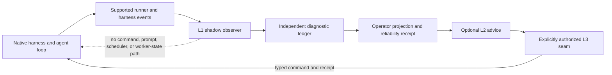

# RFC: Long-Running Agent Reliability Diagnostics and Governed Delivery v0

| Field | Value |
|---|---|
| Status | Accepted |
| Supersedes / closes | none |
| Date | 2026-08-16 |
| Authors | LoopX maintainers |
| Scope | Observer-first reliability diagnostics, bounded governed delivery, benchmark qualification, and repeatable enterprise deployment |
| Source baseline | LoopX `66492032e` |

> Language note: the
> [Chinese version](./long-running-agent-reliability-diagnostics-governed-delivery-v0.zh-CN.md)
> and this English version are semantic mirrors. A material difference between
> them is a defect.

## 1. Decision Summary

LoopX should establish a narrow product and commercial entry point for teams
that already run agent workflows for hours or days but cannot yet justify
handing those workflows to a full semantic control plane.

The entry point is **Long-Running Agent Reliability Diagnostics and Governed
Delivery**. It begins with a shadow observer that can explain stages, stalls,
repetition, recovery, evidence completeness, human attention, and final
outcomes without changing the agent's prompts, tools, scheduler, continuation,
or authority. A customer can obtain useful diagnostics before asking its
agents to follow the LoopX skill or state lifecycle.

Control expands only after evidence and explicit authorization:

1. reproduce the native workflow and record a matched baseline;
2. attach a non-influencing shadow observer and prove treatment integrity;
3. surface recommendations to an operator without granting execution power;
4. govern only pre-agreed checkpoints, gates, and recovery seams;
5. adopt the complete Semantic Control Plane only where the additional
   lifecycle contract has demonstrated value.

This is not a claim that LoopX already has paid product-market fit. It is a
product direction, research contract, and delivery discipline for discovering
repeatable value without turning every customer into a custom kernel fork.

## 2. Concrete Example

A software team has a repository agent that runs for six hours. The final patch
sometimes passes, but operators cannot see which stage it is in, whether it has
repeated the same probe, what evidence will survive a crash, or whether another
hour of execution is likely to help. The team currently watches logs and sends
manual nudges. It does not want a new planner to change the agent's behavior
during the first evaluation.

The first LoopX engagement does not replace that agent loop. It:

- pins the native harness, model, task, permissions, and budget;
- reads supported harness and runner events through a read-only adapter;
- normalizes stages, progress observations, recovery events, evidence
  references, costs, and operator interventions into a separate diagnostic
  ledger;
- produces a stage timeline, stall and repetition findings, recovery rehearsal,
  evidence-completeness report, and final reliability receipt;
- compares the observer run with the matched native baseline;
- proves that the observer did not inject context, schedule work, retry, stop,
  resume, gate, or otherwise change execution.

If the result shows a costly repeated failure, a later governed arm may let
LoopX request a human decision at one checkpoint or restore one failed run from
an accepted receipt. That authority is a new, explicit treatment. It is not a
silent upgrade of observation.

The sellable result is not “LoopX was installed.” It is a bounded answer to
three questions:

1. Where and why does the long-running workflow lose reliability?
2. Can the team observe and recover it with acceptable overhead and less human
   attention?
3. Which, if any, control seams deserve authority in a governed deployment?

## 3. Reliability Integration Levels

The product must distinguish observation, advice, and authority. A dashboard
or process called a “supervisor” does not gain control merely because it can
see the worker.

| Level | Contract | May write | May influence agent execution | Highest direct claim |
|---|---|---|---|---|
| L0 — Native baseline | Existing harness with no LoopX treatment | Native artifacts only | Native behavior only | Benchmark or workflow baseline |
| L1 — Shadow Observer | One-way event intake and independent diagnostic projection | LoopX-owned diagnostic observations, evidence pointers, and receipts | **No** prompt injection, scheduling, retry, stop, resume, gate, tool, or worker-state mutation | Observability, failure attribution, evidence completeness, and measured overhead |
| L2 — Advisory Supervisor | L1 plus typed recommendations shown to an operator | Recommendations and operator disposition receipts | No direct influence; a human may separately apply or decline a recommendation | Recommendation quality and human-attention value |
| L3 — Governed Seams | Explicit authority at named checkpoints, gates, recovery, or handoff boundaries | Accepted commands and receipts inside the granted scope | Yes, but only at predeclared seams and within the customer's authority envelope | Causal effect of the governed treatment under matched conditions |
| L4 — Semantic Control Plane | Goal, Todo, evidence, acceptance, quota, recovery, handoff, and replan lifecycle | Canonical LoopX control state | Yes, within the full selected profile and retained human authority | Repeatable governed long-horizon operation |

The dashed edge is an asserted absence, not a data path. L1 qualification must
prove that the observer has no outbound execution capability. L3 introduces a
new reviewed path rather than enabling that edge implicitly.

### 3.1 L1 non-interference is a machine contract

L1 is not “best-effort passive.” Its adapter and deployment must prove:

- event flow is one-way from the harness or runner into the observer;
- diagnostic state is not part of the worker's context, memory, scheduler
  inputs, tool results, or completion decision;
- no control command endpoint is configured;
- observer failure cannot pause or fail the worker;
- observation backpressure is bounded and measured;
- timestamps, event loss, sampling, and unsupported fields are visible;
- protected task content, raw trajectories, credentials, and private workspace
  data do not enter public projections.

An L1 run with an undeclared callback, prompt change, scheduler hook, or wider
permission envelope is not passive evidence. It is quarantined or reclassified
as a treatment arm.

### 3.2 L2 advice is not governance authority

L2 may say “this work appears materially repetitive” or “a recovery rehearsal
is recommended.” It may not perform the recovery, terminate the worker, or
write a gate decision. The operator's response is recorded separately with
attention time and outcome. This preserves the distinction between a useful
diagnostic product and a hidden autonomous manager.

### 3.3 L3 authority is seam-scoped

L3 begins with one or a few seams that already have a real failure cost and an
acceptance owner. Examples include a review checkpoint, a crash-recovery
boundary, an explicit human approval, or a verifier-backed completion seam.
The engagement must name the command, preconditions, idempotency identity,
receipt, rollback, and action that remains outside LoopX authority.

## 4. ICP, Buyers, Users, and Failure Modes

### 4.1 Ideal customer profile

The initial ICP is a team that already has a real long-running agent workflow,
an outcome owner, and repeated operational pain. The strongest early segments
are:

- software engineering, SRE, security, and IT operations teams whose work
  spans repositories, environments, reviews, and multiple hours or days;
- AI platform and agent-infrastructure teams operating heterogeneous Codex,
  Claude Code, shell, or custom harnesses;
- AI4S, bioinformatics, robotics, and research teams that need experiment
  lineage, negative-result retention, recovery, and human checkpoints;
- regulated or audit-sensitive teams that need evidence and authority
  boundaries before increasing autonomy.

The workflow must be valuable enough that failure, repetition, manual watching,
or unrecoverable state has a measurable cost. A short chatbot exchange or a
one-shot tool call is not the target.

### 4.2 Buyer and operating roles

- The **economic buyer** may be a head of engineering, AI platform leader,
  research platform leader, security leader, or workflow owner accountable for
  delivery capacity and risk.
- The **outcome owner** defines the native result and acceptance criteria. No
  formal pilot starts without one.
- The **operator** currently watches runs, intervenes, reviews evidence, or
  restores failures. Operator attention is a measured cost, not free labor.
- The **platform and security owners** approve deployment, data, identity,
  retention, and authority boundaries.
- LoopX FDE and product engineering own the supported adapter, deployment,
  evaluation, and reusable assets; they do not become the customer's permanent
  workflow operator.

### 4.3 Typical failure modes

- stages and remaining work are invisible until the run ends;
- the worker repeats materially equivalent probes or maintenance loops;
- a crash loses useful state or requires manual context reconstruction;
- continuation after interruption replays completed work or crosses an old
  decision boundary;
- evidence exists in raw logs but cannot support review, audit, or handoff;
- humans poll continuously because the system cannot distinguish healthy work,
  waiting, stall, and exhaustion;
- approvals and operator nudges are not tied to a durable scope or receipt;
- one harness-specific fix cannot be reused across another workflow or host;
- governance adds enough protocol, latency, or model confusion to reduce the
  native task outcome.

### 4.4 Explicit non-goals

- replacing the customer's model, runtime, sandbox, benchmark, or domain
  workflow by default;
- requiring full LoopX skill or state-lifecycle adoption in the diagnostic
  phase;
- claiming task uplift from an L1 observer;
- using raw logs or keyword heuristics as authoritative progress or failure
  truth;
- selling generic monitoring dashboards without a baseline, acceptance, or
  reliability decision;
- promising autonomous department replacement or unaudited outcome pricing;
- building a customer-specific LoopX kernel or accepting indefinite free PoCs;
- treating stars, demos, control-plane calls, or agent runtime as PMF.

## 5. Customer Journey and Stop/Go Gates

### 5.1 Discovery and baseline

The engagement starts by selecting one bounded workflow, one outcome owner,
and one matched baseline contract. Discovery records:

- native task outcome and acceptance owner;
- pinned harness, model, tools, permissions, environment, and budget;
- current failure and recovery process;
- operator interventions and attention minutes;
- data classification, retention, deployment, and authority boundaries;
- the decision the diagnostic result will enable.

**Stop gate:** no pilot when the workflow lacks an outcome owner, a reproducible
or reconstructable baseline, a fixed budget, a measurable acceptance result,
or permission to observe the required events.

### 5.2 Passive diagnostic

Deploy L1 in shadow mode. Validate adapter fidelity and non-interference before
interpreting the findings. The output is a diagnostic packet containing:

- stage and progress timeline;
- typed stall, repetition, recovery, and failure attribution;
- evidence and handoff completeness;
- cost, wall-clock, and attention accounting;
- event-loss and unsupported-signal disclosure;
- candidate governed seams, each tied to observed cost and a rollback path;
- a final receipt with no claim beyond the collected evidence.

**Stop or remain passive:** if event fidelity is insufficient, overhead exceeds
the agreed budget, private-data boundaries cannot be met, or findings do not
change an operator decision, do not add authority to create artificial value.

### 5.3 Advisory or governed pilot

The customer may select L2 recommendations or one bounded L3 seam. The pilot
registers the new treatment, authority envelope, expected benefit, negative
transfer threshold, rollback, and matched comparison before execution.

**Stop gate:** do not enter L3 without an explicit authority owner, a tested
fail-closed command/receipt path, a native outcome metric, and a baseline that
can detect harm. Advice that a human executes remains L2 assisted evidence and
must not be reported as autonomous uplift.

### 5.4 Acceptance

Acceptance compares predeclared metrics under the fixed budget. A successful
pilot must show the native outcome and governance cost together. It cannot pass
because the dashboard is attractive or because LoopX produced many events.

The acceptance packet includes:

- matched baseline and treatment identities;
- native outcome and uncertainty or case-level results;
- efficiency, recovery, attention, evidence, overhead, and negative-transfer
  results;
- treatment-integrity and data-boundary receipts;
- deployment and rollback evidence;
- reusable-asset inventory and customer-only work disclosure;
- accepted next level, remain-passive decision, or no-follow-up.

### 5.5 Repeatable deployment and ongoing service

Only accepted seams move into a versioned deployment pack. Ongoing service may
provide managed history, replay, governance, migration, support, and SLA, but
the workflow stays on a supported Harness and extension boundary. A second
deployment must reuse the adapter, policy, eval, or dashboard contract rather
than reopen the kernel.

**Stop gate:** do not call the motion repeatable when there is no plausible
second use, operation still depends on the original FDE, upgrades require a
customer fork, or recurring value disappears after initial delivery.

## 6. Reference Offer: Two-to-Four-Week Reliability Pilot

This reference contract defines scope, not price or a promise of benefit.

### Week 0 / pre-start qualification

- name the workflow, buyer, outcome owner, operator, and data owner;
- pin baseline identity, task strata, budget, and primary metrics;
- approve the observer data envelope and deployment route;
- reject the engagement if the discovery stop gates are not met.

### Week 1 / baseline and adapter fidelity

- reproduce or reconstruct the native baseline;
- connect one supported read-only adapter;
- prove event coverage, clock semantics, loss behavior, and non-interference;
- establish the initial operator-attention and recovery baseline.

### Week 2 / passive diagnostic

- run L1 under the matched envelope;
- deliver stage, stall/repetition, recovery, evidence, and overhead analysis;
- review candidate seams and decide remain-passive, stop, or enter a bounded
  treatment.

### Weeks 3–4 / optional governed seam and acceptance

- qualify one L2 or L3 treatment when authorized;
- run the predeclared comparison and rollback rehearsal;
- deliver the acceptance packet, reusable assets, runbook, and handover;
- record a no-follow-up decision when the governed treatment is not justified.

The pilot excludes open-ended workflow redesign, unrelated model tuning,
unbounded integrations, production writes outside the declared authority,
leaderboard submission, and a customer-only kernel fork.

## 7. Evaluation and Benchmark Contract

### 7.1 Matched arms

The product evaluation reuses the benchmark program's arm taxonomy:

1. **Native baseline** — no LoopX observation or control.
2. **Passive LoopX / L1** — identical worker decision surface plus independent
   observation and settlement.
3. **Governed LoopX / L3 or L4** — a declared profile may affect named seams.
4. **Mechanism ablation** — one mechanism differs from its governed parent.

L2 assisted studies are reported separately because human action is part of
the treatment. A replay or historical baseline may support discovery when a
live repeated workflow is unavailable, but it is weaker evidence and cannot be
presented as a matched causal comparison.

### 7.2 Required measurements

Every acceptance plan selects primary metrics before execution and reports all
applicable guardrails:

| Dimension | Required evidence |
|---|---|
| Native task outcome | Benchmark-native score/pass, customer acceptance result, quality result, or other workflow-owned outcome |
| Tokens, cost, and wall clock | Raw totals, difference from matched baseline, time to first material delta, and time to final outcome |
| Recovery | Eligible failures, successful recoveries, recovery rate, time to recovery, repeated work, and state/evidence loss |
| Human attention | Intervention count, attention minutes, response latency, false escalation, and interventions that changed the outcome or authority |
| Evidence completeness | Required evidence present, lineage intact, unsupported or missing signals, and review/handoff readiness |
| Governance overhead | Control calls, observer CPU/I/O, latency, storage, model-context tax, and operational complexity, kept separate rather than collapsed into one percentage |
| Negative transfer | Native-outcome regression, added time/cost, false stall or gate, prevented valid continuation, model confusion, or new harness failure |

Thresholds are workflow-specific and must be registered before the pilot. A
high native outcome with unacceptable attention or recovery cost may fail the
business case. Better observability with unchanged outcome may pass an L1
diagnostic acceptance, but it does not pass an L3 uplift claim.

### 7.3 Relationship to the C0–C4 evidence ladder

- **C0** qualifies native reproduction and adapter fidelity.
- **C1** is the target for L1: reliable observation without changing worker
  decisions or official outcomes.
- **C2** is required for a causal claim about an L3/L4 treatment within one
  pinned benchmark or workflow family.
- **C3** demonstrates that the same typed mechanism direction transfers across
  materially different benchmark families.
- **C4** adds model-behavior and state-machine qualification, overhead and
  authority budgets, and a non-benchmark product canary before a default or
  shipped product promotion.

The portfolio in the
[Long-Horizon Harness Benchmark and Research Program](./long-horizon-harness-benchmark-research-program-v0.md)
provides complementary environments: LHTB is especially useful for stall,
repetition, and recovery dynamics; DeepSWE for repository delivery and
interruption recovery; ALE for heterogeneous professional workflows and
operator surfaces. Each benchmark retains its own runner, verifier, metric,
and publication rules. LoopX does not turn them into one commercial score.

### 7.4 Treatment integrity for observer mode

L1 needs a first-class integrity receipt. At minimum it records:

- pinned worker, model, task, environment, tools, and budget;
- adapter and observer revision;
- event sources and fields consumed;
- configured outbound control endpoints, which must be empty;
- whether any observation entered worker context or scheduling inputs;
- observer resource use, dropped events, and clock uncertainty;
- disposition: `eligible`, `quarantined`, or `invalid`, with reason codes.

This receipt makes “between LoopX and no LoopX” a testable product mode rather
than a marketing phrase.

## 8. Reusable Assets From Every FDE Engagement

Every engagement must leave a versioned, documented asset set. Customer-only
configuration may remain private, but the product contract and reusable
mechanics cannot remain in one engineer's notebook.

| Asset | Minimum reusable content | Reuse gate |
|---|---|---|
| Adapter | Versioned event and identity mapping, loss/clock semantics, privacy boundary, fixture, and conformance check | A second compatible workflow or host can use the contract without kernel changes |
| Deployment pack | Local/private/BYOC profile, configuration schema, install/upgrade/rollback, health check, and support bundle | Reinstall and rollback do not require the original FDE |
| Policy pack | Named observer/advisory/governed profile, authority envelope, retention, alert/gate rules, and safe defaults | Policy is data/configuration over supported contracts, not customer code in core |
| Eval pack | Baseline manifest, tasks or public-safe task descriptors, metrics, integrity audit, reducer, and acceptance template | The same evaluation can compare a future release without rewriting expected truth |
| Dashboard and receipt | Stable projection, stage/failure/attention views, evidence lineage, treatment identity, and export | A reviewer can reconstruct the decision without raw private logs |

The engagement must report reusable work, customer-only work, deferred
generalization, and the next plausible reuse path. It must not create:

- an indefinite free or boundaryless proof of concept;
- a customer-specific kernel fork;
- a one-off dashboard that parses private source files or raw logs;
- a policy encoded only in prose;
- a private eval whose expected result is derived from the implementation;
- a permanent dependency on the original delivery engineer.

## 9. Open and Paid Boundary

The open core remains sufficient to inspect, operate, and leave the system.
Commercial value comes from packaging, operation, organizational controls, and
accountable delivery rather than closing the meaning of customer state.

### Open and local-first

- durable goal, Todo, evidence, acceptance, authority, handoff, recovery,
  quota, and replan schemas and semantic protocols;
- local control-plane core, CLI, exports, and public-safe projections;
- provider-neutral adapter and capability contracts;
- a usable self-host path and versioned state migration contract;
- local benchmark/evaluation primitives and integrity receipt schemas.

### Paid or managed

- supported Enterprise Harness distributions and certified adapters;
- private, air-gapped, or BYOC deployment and managed upgrades;
- enterprise connectors and domain packs;
- RBAC, SSO, policy administration, audit, residency, deletion, and signed
  exports;
- hosted or managed history, retention, replay, alerts, review queues, and
  recovery operations;
- SLA, incident response, migration, backup/restore, support, and training;
- Managed Semantic Control Plane and accountable, bounded FDE delivery.

Customers retain exportable identities, state meaning, evidence lineage, and a
local or self-hosted exit path. Hosting does not grant LoopX or the provider
permission to read private workspaces, approve gates, publish, merge, or make
production changes.

## 10. Relationship to Current LoopX Architecture

### 10.1 Operator surface

L1 and L2 consume explicit public-safe projections. The operator surface may
show stages, evidence refs, recovery state, cost, attention, and diagnostic
findings. It must not parse one customer's private source document, inline raw
trajectories, or render write controls in L1. A visible recommendation is not
an accepted gate or command.

### 10.2 Shared goal authority

L1 has no shared goal authority. It may observe a stale-marked projection or
store diagnostic receipts under an independent namespace, but it cannot claim
work or mutate the canonical aggregate. L3/L4 coordination requires explicit
per-goal opt-in and the same command, precondition, idempotency, receipt, and
provider boundaries defined by the shared-goal authority RFC. A storage or
messaging provider never becomes LoopX authority.

### 10.3 Python canonical and TypeScript draft

Python remains the canonical control-plane implementation during the current
TypeScript parity experiment. This RFC defines language-neutral product and
receipt contracts; it does not promote the TypeScript draft or create a second
authority. A TypeScript operator or observer may consume read-only projections
after parity qualification. Write paths and decision kernels remain on their
current canonical owner until their migration gate passes.

### 10.4 Benchmark research and product delivery

The benchmark RFC owns experiment identity, native truth, C0–C4 claims, and
publication discipline. This RFC owns the customer journey, sellable offer,
authority ladder, FDE asset contract, and product promotion gates. A benchmark
result can qualify a mechanism; a field engagement must still prove customer
acceptance, deployment reuse, privacy, and operational supportability.

### 10.5 Ecosystem and runtime boundary

The observer should attach through supported runner events, host adapters, or
provider-neutral projections. It does not absorb the customer's runtime. A
partner integration remains factual adoption evidence, not proof of recurrence
or willingness to pay.

## 11. Risks and Failure Containment

- **Authority creep:** a passive observer quietly starts changing prompts or
  continuation. Mitigation: one-way architecture, empty command envelope, and
  treatment-integrity receipts.
- **False diagnosis:** incomplete events create false stall or failure labels.
  Mitigation: typed source coverage, unknown states, confidence/eligibility
  disposition, and no write authority in L1.
- **Protocol tax and negative transfer:** governance consumes enough latency,
  tokens, or attention to harm the native task. Mitigation: matched budget,
  decomposed overhead, native outcome guardrail, and rollback.
- **Surveillance and privacy:** observation accumulates private content beyond
  the operational need. Mitigation: metadata-first projections, minimization,
  explicit retention/deletion, scoped evidence pointers, and local/BYOC modes.
- **Services trap:** every success depends on custom engineering. Mitigation:
  mandatory reusable assets, second-use gate, no kernel fork, and separate
  accounting for software, delivery, and ongoing operations.
- **Benchmark overfitting:** a control rule improves one verifier but harms real
  workflows. Mitigation: C0–C4 ladder, cross-family evidence, negative results,
  and non-benchmark canary.
- **Proof theater:** dashboards, calls, stars, or a single demo replace outcome
  evidence. Mitigation: predeclared native metrics and explicit claim levels.
- **Premature managed authority:** hosted operation expands before isolation,
  restore, deletion, and on-call economics are proven. Mitigation: observer and
  private/BYOC first; explicit promotion gate.

## 12. Roadmap and Promotion Criteria

### P0 — Contract and shadow-observer prototype

Deliver one provider-neutral observer envelope, integrity receipt, compact
diagnostic projection, and deterministic fixture for one real harness event
source. Prove the no-outbound-control invariant and bounded failure behavior.

**Exit:** C0 adapter fidelity plus an eligible C1 observer run; public/private
boundary and overhead are reported; no production authority exists.

**Checkpoint (2026-09):** the contract half of P0 exists as the default-off
built-in capability `reliability-diagnostics` with the extension provider
`dsh-session-events` in `packages/dsh-loopx-plugin`: provider-neutral
envelope and stats records, integrity receipt, read-only diagnostic
projection, a deterministic DSH-shaped fixture, and producer-side
public-safety rejection before the first ledger append. Still open before P0
exit: an eligible C1 observer run on a real `dsh` session, the reported
overhead measurement, and the ledger retention and deletion profile from
decision 4 below.

### P1 — Benchmark-qualified diagnostic pilot

Run matched native and L1 arms on at least one suitable benchmark family and
one non-benchmark rehearsal. Establish stage, stall/repetition, recovery,
evidence, attention, and overhead measures. Negative and null results remain
visible.

**Exit:** repeated C1 evidence, a useful diagnostic decision, an operator
receipt, and no unexplained outcome difference between baseline and passive
arms.

### P2 — Bounded governed seam

Select one evidence-backed seam with an outcome owner. Implement the typed
command/receipt/rollback path and compare it with the matched parent profile.

**Exit:** scoped C2 evidence or an honest no-follow-up; model-behavior and
state-machine qualification; no authority, privacy, or native-outcome
regression beyond the predeclared guardrail.

### P3 — Repeatable delivery

Complete the reference pilot with a versioned adapter, deployment pack, policy
pack, eval pack, and dashboard/receipt. Reuse at least one material asset on a
second workflow or compatible deployment without a kernel fork.

**Exit:** customer acceptance, handover, upgrade/rollback, second-use evidence,
and separate accounting for reusable and customer-only work. One successful
engagement is still not PMF.

### P4 — Shipped product direction

Promote from Incubation only when the supported distribution, operator
surface, data/authority boundaries, and recurring operation have survived
independent use. At least one governed mechanism needs C4 evidence; observer
mode needs stable conformance across supported adapters; managed forms need
verified export, restore, deletion, tenancy, support, and incident response.

**Exit:** maintainers can name the shipped contract, supported profiles,
acceptance and rollback, repeated deployment path, owner, support boundary, and
evidence that use continues after the initial FDE. Promotion is a repository
decision, not a sales narrative.

## 13. Product Stop/Go Rules

A prospective engagement does not enter a formal pilot when any of these are
missing:

- an accountable outcome owner;
- a native outcome and matched or explicitly weaker baseline;
- fixed budget and predeclared acceptance criteria;
- an approved data, authority, and rollback envelope;
- a bounded delivery scope and handover;
- a plausible second reuse path for the resulting assets.

The program stops or remains passive when observation is not decision-useful,
negative transfer exceeds the guardrail, authority cannot be made explicit, or
the only path to success is custom kernel work.

Stars, one demo, one passing task, one internal deployment, control-plane call
volume, or an attractive dashboard are not PMF. Evidence of paid recurrence,
accepted outcomes, reuse, managed advantage, and sustainable delivery is
required before making a stronger commercial claim.

## 14. Owner Decisions Still Required

1. Which initial ICP and reference workflow should receive the first product
   pilot: software delivery, security/SRE, or research/AI4S?
2. Which event source and harness should define the P0 shadow-observer
   conformance fixture?
   **Decided (2026-09): DeepSeek Harness (`dsh`) session events.** LoopX
   already ships a typed `dsh` Turn host and a same-session plugin whose
   read-only `session/event`, `agent/status`, `agent/error`, and
   `session/disposed` hooks let the observer be proven non-interfering inside
   an existing packaged boundary. Pi remains the comparison candidate; the
   [shared harness-selection assessment](./harness-selection-dsh-pi-v0.md)
   retains DSH for L1 and keeps Mode B selection conditional on lifecycle and
   matched-run evidence; it is not a runtime promotion.
3. Should the first two-to-four-week offer stop at L1 diagnostics by default,
   or include an optional L2 advisory week before any L3 seam?
4. Which data-retention, deletion, and support profiles belong in the first
   local/private/BYOC deployment pack?
5. Which benchmark family and non-benchmark canary are required for the first
   promotion packet?
6. Who owns product acceptance, delivery reuse, and support readiness when the
   direction moves from Incubation toward Shipped?

## 15. Relationship to Existing Documents

- [Commercialization and SaaS Opportunity Assessment](../../product/roadmaps/saas-opportunity-assessment.md)
  defines the broader open/paid thesis, product ladder, and FDE discipline.
  This RFC narrows that strategy into an observer-first offer and promotion
  contract.
- [Long-Horizon Harness Benchmark and Research Program](./long-horizon-harness-benchmark-research-program-v0.md)
  owns benchmark truth, matched arms, C0–C4 evidence, and research integrity.
- [Agent Management Observability MVP](../../product/surfaces/agent-management-observability-mvp.md)
  defines the read-only projection posture reused by L1/L2 operator surfaces.
- [Desktop Execution Frontends](./desktop-execution-frontends-v0.md) defines
  Mode B, the Managed Agent Runtime in which LoopX Desktop launches and
  supervises Pi or `dsh`. The L1 shadow observer is the passive diagnostic
  layer under that mode's Desktop-owned runtime supervisor: its integrity
  receipt and read-only projection are inputs the supervisor may project, and
  the observer acquires none of the supervisor's authority.
- [Shared Goal Authority and State Provider](./shared-goal-authority-state-provider-v0.md)
  defines the authority/provider boundary required only when L3/L4 uses shared
  coordination.
- [TypeScript Control-Plane Migration](./typescript-control-plane-migration-v0.md)
  keeps Python canonical while TypeScript candidates qualify through parity.
- [Ecosystem Adoption and Derivatives](../../community/ecosystem-adoption.md)
  records factual public adoption; it does not substitute for product outcome
  or commercial evidence.
