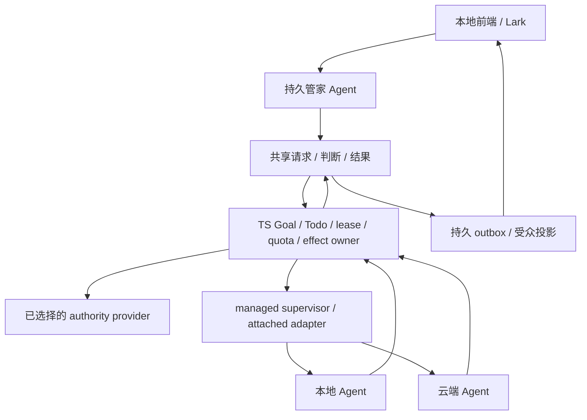

# LoopX 整体路线总纲 v0：产品、协作、技术与交付

- 状态：Draft 总体路线；不自动接受领域 RFC、不晋升 provider、不改变默认权限。
- 范围基线：2026-09-16，`0aa6179de`；管家故障复现基线单独保留在第 8 节。
- 责任：总纲拥有产品目标、跨领域依赖、优先级和组合验收；领域 RFC/稳定协议拥有具体规则；运行 Todo 拥有执行状态。
- 语言：[English](loopx-overall-roadmap-v0.md) 与本文互为语义镜像。

## 1. 总目标与产品路线

LoopX 的目标是让人用本地前端或 Lark 提出、修订和验收复杂目标，由持久管家协调多个拥有独立工作承诺的长程 LoopX Agent，在本地 managed 与云端 runtime 上持续完成可验证的工作。单 Agent 的长程可靠性是基础，多个 Agent 的协作、handoff、恢复和共享目标收敛是核心能力，百 Agent 规模是需要独立证明的系统资格。

产品成效以**在约束内交付的已验收成果、人的注意力成本和恢复能力**衡量。在线 Agent 数、生成内容量、工具调用数和 PR 数是过程信号。模型、runtime、存储 provider、IM 或 memory 服务可以替换；Goal/Todo/claim/lease/quota/effect 与验收规则必须保持明确、可追溯的唯一 owner。

| 用户与工作 | 最短价值路径 | 必须能验收的结果 |
| --- | --- | --- |
| 个人开发者/研究者 | 连接项目→一个现有或 managed Agent→连续工作→中断接续 | 安装与首次有效动作可复现；工作、产物、成本和下一步可读；不用理解全部 RFC |
| 项目负责人/管家操作者 | 目标与约束→小团队→依赖产物→方向补充→综合验收 | 能看清谁负责什么、为什么阻塞、需要什么判断；直接与 worker 对话仍可用 |
| 多项目/多主机操作者 | 有范围父子目标→本地/云端分工→共享权威与预算→整体回报 | peer 协作、隔离、公平性和恢复成立；不能因角色变成全局超级管理员 |
| 已有 agent 系统的采用者 | L1 被动诊断→L2 建议→经授权的 L3 seam→可选 L4 控制面 | 先证明无干扰和诊断价值，再证明控制效果；支持不替换原 runtime 的采用路径 |
| 能力/host/provider 开发者 | 最小 adapter→兼容与权限检查→资格证据→安装/卸载 | 扩展不复制内核真相，关闭不影响核心；版本与能力支持可发现 |

产品范围包括工程交付、研究探索、材料与知识工作、office/content 工作等可复用场景。先用一个工程交付案例和一个知识/研究案例证明可迁移性；领域能力归 capability/package，不能把某个场景的评分、阶段或私有语义写入通用内核。金融等受保护外部效果按独立领域合同模拟资格化，不能借“通用管家”直接取得执行权限。

两条采用路线共用工程资产但分别验收：**原生 LoopX 长程协调**优先完成 G1/G2；**observer-first 可靠性诊断**可并行证明价值，不等待百 Agent 或 shared service。收费部署、企业功能和托管服务仍是产品假设，不能把架构规划写成已有市场验证或运营承诺。

### 总纲与现有文档的关系

- 本页是跨产品、工程、研究和采用的路线总纲；第 2 节定义 S1–S13 工作流，第 3 节定义 G0–G5 组合里程碑，第 4 节映射全部 RFC，第 5–6 节细化多 Agent 核心路径，第 8 节保存可复核审计。
- [技术方向页](../../project/technical-directions.md) 维护公开贡献入口与 tracker，[RFC 索引](README.md) 维护领域路由；它们投影本页的跨域次序，领域 RFC 保持自己的 T/M/D/A 编号和权限门槛。
- [产品愿景](../../product/vision.md)、[能力目录](../../../loopx/capabilities/README.md)、[稳定协议](../../reference/protocols/README.md) 和已发布版本定义各自范围。总纲不创造第二套任务账本、状态 schema 或 release 支持声明。

## 2. 全领域工作流：目标、缺口与执行切片

优先级定义：P0 是当前用户旅程的正确性/连续性阻塞；P1 是可重复交付与协作基础；P2 是有证据后扩展规模、场景或采用；P3 保持设计、等待需求触发。优先级表示工作选择，不覆盖安全门槛或既有运行 quota。负责方指模块/能力 owner，不预先指定某个模型或个人。

| 工作流 | 目标及当前基础 | 下一完整切片、前置与退出证据 |
| --- | --- | --- |
| **S1 产品与持久管家 · P0** | 从需求、调查、分解到验收回报；现有 manager runtime、team intake 和 settings 是基础，端到端持续工作未完整证明 | 以 R1/R2 为第一批：承诺保留、已绑定 worker 实际推进、用户补充方向后继续；CLI/packaged frontend/Lark 分别标记资格。以两轮依赖产物及独立验收关闭最小旅程 |
| **S2 typed 内核与 durable authority · P0/P1** | Effect/Todo/quota/recovery owner、TS 事务迁移与 store 候选已存在；writer 和 provider 晋升仍未全闭合 | 每次迁移一个真实事务/恢复生命周期，先语义反例再切换/删除旧 owner；R1 正确性先于迁移数量。真实 backend、并发/fence、ambiguous commit、保留/导出恢复、bridge 成本及 D1–D3 资格 |
| **S3 目标规划与 multi-Agent 协作 · P0/P1** | Vision/replan、peer frontier、claim/lease、directory、manager_context 和显式接续有基础；通用 handoff/共享修订未闭环 | R2 必须证明 peer 依赖；R3 完成并行汇合、流水线、求助/复核、接续、自动回报；R4 做一个保持 intent 的 amendment class。检查依赖环、输入失效、拒绝/延期、lease 转移、同基线竞争及 aggregate acceptance |
| **S4 runtime/host/daemon · P0/P1** | attached/managed、Turn、broker、runtime connector 和 Desktop 修复存在；“registered”不等于可执行 | 选择一个真实合格组合完成多 Turn supervision；restart/cancel/drain/stop 不丢工作且旧 executor 被 fence。之后扩 host parity、service-profile 唯一 owner、干净安装与版本升级；按 adapter 能力显示不支持项 |
| **S5 前端、Lark 与人机交互 · P0/P1** | 本地对话、settings、proposal 和部分 Goal Channel vertical 已有；统一受众/会话/工作回读仍需资格 | 用一个团队旅程贯穿设置、工作图、handoff、阻塞、成本、修订、产物和回报；共享 typed projection，验证重连/重复点击/stale/原路反馈。再做 intelligent review、无障碍键盘流程、中英术语、错误可恢复和离线降级；只在真实决策处打断人；[团队实时工作区](live-team-workspace-v0.zh-CN.md)让交换、修订与原协调员继续推进可见 |
| **S6 材料、证据、记忆与学习 · P1** | authority registry、material lifecycle/frontier、decision context、reward memory、turn recall 已有；方向基线和部分归因仍是提案 | 先打通“材料 revision→同 Agent 阅读→决策引用→产物/结果”；失效、撤销、来源消失与遗忘策略可回读。handoff 保存影响决策的摘要与授权 artifact；OpenViking/Obelisk 按可选 provider 资格化。utility 的因果收益另以对照证明，不把相关性当提升 |
| **S7 预算、调度与 fleet 规模 · P0 观测/P1–P2 扩展** | quota/scheduler 与部分 usage aggregate 存在；全 provider 成本、分布式资源预留及百 Agent 并发尚需证据 | 先区分配置预算、准入、消耗与估算；未知成本不记零、重复事件不双记。R7 分页/有界摘要、provider/host 限流、公平性、背压、事件唤醒与失败隔离；分别报告注册数/活跃数/吞吐量和每个验收成果成本 |
| **S8 能力、扩展与领域集成 · P1/P2** | 已有 capability catalog、extension 生命周期、hook、工程/研究/content/office 能力及 computer-use 合同 | 优先用现有 issue-fix/PR-review 和材料/研究 caller 检验共享控制面；每个 provider 带 readiness、版本、权限、默认关闭、卸载/回滚、失败隔离与真实入口证据。新 domain effect 从模拟单操作闭环开始，不先建市场或通用工作流 DSL |
| **S9 身份、权限、隐私与信任 · P0 持续/P1–P2 远端** | public/private 边界、作用域、capability gate、fence 与确认合同分布在已有 owner | 随 R1/R3 验 sender/audience/artifact scope 和 stale authority；远端 R6 必须认证 tenant/Goal/actor/host、轮换撤销与最小权限。凭据保管、非可信工具/文档输入、依赖供应链、审计留存/删除及漏洞响应纳入真实路径；角色、消息或 memory 不铸造写权限 |
| **S10 可靠性、诊断与运行运营 · P0/P1** | recovery/canary、read-only diagnostics 原型及 DSH event adapter 已有；C0/C1、开销和完整运营资格仍未闭合 | 故障分类→可观察状态→恢复演练→防复发；覆盖进程/存储/网络/投递故障和数据增长。定义并冻结 SLO、RPO/RTO、容量/保留边界，实测后标 qualified；运行手册含升级、备份恢复、停止与人工接管，不以测试数代替恢复结果 |
| **S11 评测与科学研究 · P1 持续/P2 研究** | benchmark toolkit、Explore、长程 portfolio 与十轨 frontier science 有设计/局部实现 | 固定 native/passive/governed arm、模型/harness/预算/task split 与 evaluator；报告原生分数、成本、失败、人工介入和不确定性。sequential evidence、continuation、stride 为早期研究；memory、formal kernel、curriculum/evolution、主动实验与多尺度状态按 T01–T10 分阶段，不自动影响生产 |
| **S12 发布、开发体验与社区治理 · P0 卫生/P1** | 安装、源码验证、扩展注册、DCO/PR、测试层级、contributor route 与双语文档已存在 | 从干净机器/发布包验一条首次工作和一次升级/回滚；host/OS 支持以 release contract 为准。缩短合理改动的定位、测试和 review 成本；公开精确 head、可重复 fixture、兼容窗口、维护者路由和贡献归属，退休重复协议及过时证据 |
| **S13 采用、生态与商业可持续性 · P1 发现/P2 试点** | 公开 adoption loop、showcase、license/governance、observer-first 产品合同已存在；付费 PMF 未证明 | 先收集真实独立首次使用/重复使用/退出原因，做可复现案例和有固定预算/验收/回滚的试点；沉淀 reusable adapter 与交付手册。核算模型/计算/存储/支持成本及维护负担；满足重复需求后再决策商业托管边界、支持等级和分发，不承诺 SLA 或擅改开源条款 |

### RFC 之外的关键覆盖与 owning sources

下列不是可忽略的配套事项；它们直接决定一个长程团队是否可用。目录或 README 证明的是可发现的实现/合同入口，具体安装可用性仍从 `loopx capability list/show` 与选定版本读取。

| 领域与已有入口 | 所属工作流 | 当前总纲要求的下一步 |
| --- | --- | --- |
| [Goal Vision/replan](../../reference/protocols/goal-vision-replan-contract-v0.md)、[work graph](../../reference/protocols/task-graph-projection-v0.md)、[peer runtime](../../reference/protocols/peer-agent-runtime-v1.md)、[监督](../../reference/protocols/peer-supervisor-v0.md) | S2/S3 | 将跨工作依赖、重规划、验收与 handoff 放进同一个真实案例；aggregate closeout 必须消费验收事实 |
| [quota](../../quota-allocation.md)、[cadence](../../operations/long-task-cadence-policy.md)、[attention](../../operations/attention-queue.md) | S5/S7 | 预算耗尽/延期/被阻塞时有明确下一次触发及用户回读；百 Agent 不靠高频全文轮询 |
| [材料生命周期](../../reference/protocols/material-lifecycle-architecture-v0.zh-CN.md)、[材料 frontier](../../reference/protocols/agent-material-frontier-v0.md)、[authority 注册](../../operations/authority-source-registration.md) | S6 | 路线/RFC 更新能由 Agent 按 revision 发现并登记阅读；read receipt 不表示同意或获得权限；归档不丢原始来源 |
| [Decision Context](../../../loopx/capabilities/decision_context/README.md)、[Reward Memory](../../../loopx/capabilities/reward_memory/README.md)、[Semantic Preference](../../../loopx/capabilities/semantic_preference/README.md)、[Turn Recall](../../../loopx/capabilities/agent_turn_recall/README.md) | S6/S11 | 区分事实、偏好、建议、归因和权威；同一 scope 的回忆/失效/结果反馈负例先行 |
| [Issue Fix](../../../loopx/capabilities/issue_fix/README.md)、[PR Review](../../../loopx/capabilities/pr_review_queue/README.md)、[Change Quality](../../../loopx/capabilities/change_quality/README.md)、[Integration Branch](../../../loopx/capabilities/integration_branch/README.md)、[Change Window](../../../loopx/capabilities/repository_change_window/README.md) | S8/S12 | 作为工程团队的端到端 caller：问题→实现→独立 review→验证→批准范围内交付；head 漂移不复用旧证据 |
| [Explore](../../../loopx/capabilities/explore/README.md)、[Benchmark Toolkit](../../../loopx/capabilities/benchmark_toolkit/README.md)、[auto-research](../../product/use-cases/auto-research/README.md) | S8/S11 | 作为第二类协作旅程：问题/假设→并行实验→独立解释→后继；无提升/失败也形成有效结果 |
| [Content Operations](../../../loopx/capabilities/content_ops/README.md)、[Periodic Report](../../../loopx/capabilities/periodic_report/README.md)、[office operations](../../product/use-cases/office-operations/README.md)、[domain packs](../../product/domain-capability-packs.md) | S5/S8 | 公共投影驱动显示；草稿、review、发布权限与结果分离；不将 generic sink 绑定项目私有文档 |
| [Extensions](../../reference/extensions.md)、[runtime catalog](../../integrations/runtime-connector-catalog.md)、[host surface](../../reference/protocols/host-integration-surface-v0.md)、[skill delivery](../../../loopx/capabilities/project_skill_delivery/README.md) | S4/S8/S12 | 最小 adapter 示例与注册 readback 一致；兼容矩阵、升级/禁用/卸载有实测；host skill 不成为第二内核 |
| [Computer Use](../../reference/protocols/computer-use-runtime-v0.md)、[operator credential](../../reference/operator-model-credential.md)、[private boundary](../../public-private-boundary.md) | S8/S9 | 按实际 host 限制与敏感操作授权验收；外部文本无法自行提升权限，截图/日志与凭据有隔离和留存边界 |
| [Testing/quality](../../development/testing-and-quality.md)、[CI impact](../../development/ci-impact-selection.md)、[source correctness](../../reference/protocols/local-state-write-correctness-v0.md)、[release readiness](../../product/release-readiness.md) | S2/S10/S12 | 独立语义预期、真实 backend 与安装入口、负例/mutation；控制验证成本，但不把 skipped 当通过 |
| [Install](../../guides/installing-loopx.md)、[newcomer path](../../guides/newcomer-command-path.md)、[design](../../development/design.md)、[user guide](../../guides/personal-workspace-user-guide.md) | S1/S5/S12 | 首次价值路径、错误修复、支持平台、可访问性和双语一致性；UI 变化使用既有 design 和 first-screen review |
| [Public adoption](../../product/public-adoption-loop.md)、[scenario gaps](../../product/scenario-capability-gap-map.md)、[SaaS assessment](../../product/roadmaps/saas-opportunity-assessment.zh-CN.md)、[licensing](../../project/licensing.md)、[governance](../../../.github/GOVERNANCE.md) | S12/S13 | 公开成果与失败反馈可追溯；商业假设独立验收，license/贡献者归属/社区权限按既有政策，不由总纲改写 |

## 3. 组合里程碑、资源次序与完成定义

S 工作流表示长期责任，G 里程碑表示一次可验收的产品组合，R 卡表示当前主线实现切片。三者互相引用，不新增运行状态机。未列日期表示按证据晋级；可用资源和业务优先级改变时更新 canonical Todo，而不是假定全部同期开工。

| 里程碑 | 产品退出条件 | 必须闭合的工作流 / 核心路径 |
| --- | --- | --- |
| **G0 可信基线** | 当前功能/默认值/资格可读；已复现承诺丢失、stale、空成功、部分提交等错误有回归和修复；发布包的单 Agent 基本循环及成本未知项显式可见 | S1/S2/S7/S9/S10/S12；R1。不会因总纲合并自动完成 |
| **G1 小团队交付** | 管家和 2–3 个长程 LoopX worker 至少两轮真实协作，含依赖产物、peer handoff、故障恢复、用户补充与独立验收；单 Agent 路径继续可用 | G0；S3/S4/S5；R2 + R3 的最小现有路径，不等通用迁移或新 store |
| **G2 可恢复的协作工作台** | 通用 peer 请求/复核/结果返回、会话接续、材料与方向基线可追溯；本地前端/Lark 使用相同事实；本地 durable profile 通过适用资格 | G1；S2–S7/S9/S10；R3/R4/R5。D3 等显式晋升仍单独决策 |
| **G3 本地/云端共同工作** | 至少两真实 host（含云端），认证作用域、撤销、网络故障、共享预算与旧 worker fence 成立；依赖产物和回报跨 host 可恢复 | G2 相关合同；S3/S4/S7/S9/S10；R6 |
| **G4 百 Agent 资格** | 10→30→100+ 的活跃 cohort 分级满足预先冻结的吞吐/延迟/成本/恢复 SLO；宏观目标经历方向变化仍收敛，管家不成为消息瓶颈 | G3；R7；S5/S7/S10/S11。注册百行不能替代该门槛 |
| **G5 可重复采用与生态** | 外部用户可独立安装、复现、升级、导出/回滚；至少工程及知识/研究两类旅程形成可验证案例；支持成本、维护归属、试点成效有记录 | S8/S10–S13 从 G0 并行投入；小范围采用不等待 G4。商业服务须额外明确运营与许可边界 |

首批资源顺序：先完成 R1 的用户承诺与恢复闭环，再验 G1 的真实小团队；允许一个相邻 TS 事务/投递修复切片和一个只读诊断/材料资格切片同期准备，但不得让后续设计掩盖 P0。每个实现切片只有一个主 owner、一个主验收结果和明确依赖；同时进行多少项按实际 review 与验证容量决定，不按 Agent 数填满任务板。

暂停/降级条件：新方案复制权威或扩大默认权限、真实 backend 资格缺失、改动无法独立回滚、成本或人工干预随规模失控、benchmark integrity 失败、用户无法解释当前工作与阻塞。保留事实/回执，停止相关新 admission，修复规则或缩小 cohort；不能靠放松验收、删失败样本、刷测试预期或换名晋级。

### 近期本地 Agent 产品与发布路线

**规划修订：2026-09-20；属于提案，不代表版本验收通过。**
把 native 路线收敛成 **用已有本地 Agent 持续办事、带回可检查成果的开源个人 Agent**。
首批用户是已拥有受支持 Agent 登录态的开发者和重度研究用户。先面对一位长期管家，
需要时再展开专家团队。这是 S1/S4/S5/S12/S13 对 G0/G1 与早期 G5 的有界交付，
不新增运行时、平行路线图，也不阻塞 observer-first 路线。

“让你的 local Agent 像 Grok Bot / Muse 一样工作”可以作为理解入口。
主要承诺应是“给 Agent 一个目标，回来验收成果”。比较必须说明支持范围，不宣称
完整开源替代、模型能力等价、免费推理、保证无人值守成功或官方关联。本地编排不
等于离线推理，也不代表模型服务商不接收任务数据。后台执行依赖宿主在线；关闭
浏览器与关闭电脑是两件事。

#### 调研依据与产品取舍

以下来源于 2026-09-20 检索；厂商能力属于 **声明，未经本次实测**。

| 原始来源 | 有关发现 | LoopX 取舍与限制 |
| --- | --- | --- |
| [Grok Bot 产品页](https://x.ai/bot)与[发布说明](https://x.ai/news/introducing-grok-bot) | 厂商描述常驻云端队友、共享工具、工作交接与成果返回 | 借鉴对话委派和可见成果；本地宿主不能继承云端 24/7 承诺 |
| [Meta Muse 发布](https://about.fb.com/news/2026/09/introducing-muse-personal-ai-agent/)与[设计说明](https://introducing.muse.ai/) | 厂商描述长期主对话、Goals、有价值才主动通知、丰富产物和明确操作控件 | 以一位管家和首次有用成果为中心；重要动作采用确定性控件，工具细节渐进展开 |
| [X 原始体验比较](https://x.com/Michaelzsguo/status/2101057424115253645) | 一位用户更认可 Muse 的成品体验，而非配置组件 | 作为产品化假设，不作为性能优劣证据；另做独立首次使用验证 |

X 原帖通过 Ego Lite 阅读；官方文章已读取，未登录实测产品或完整观看演示视频。
Muse 设计页在浏览器超时，其文章通过网页检索读取。本次调研不能证明实际可靠性、
隐私保护等价或转化率。

#### 一条首次使用路径，一个标志性成果

1. 沿现有安装 owner 安装发行包，打开 `loopx dashboard`。在原处诊断 Python/Node、
   宿主登录、所选模型/profile 和工具就绪；安装成功不能直接显示 Agent 已就绪。
2. 显式引导配置可用运行时、模型账户、工具、预算与权限。以用户明确意图为约束，
   Agent 在范围内自主选择和分配。锁定管家/Chat profile 时必须遵守；授权灵活资源池
   时可自主选路。Codex 与 Ark 都是配置方案，不是统一偏好。展示有效选择，不复制
   密钥、不迁移旧会话、不静默越权回退。缺少条件时给出具体修复入口。
3. 直接交给管家真实任务，不先建团队，不要求理解 Goal/Todo/Turn。预览有关范围、
   交付物与资源上限；已经授权、可逆的日常步骤不反复弹确认卡。
4. 从公开资料交付带来源的研究简报。加入矛盾或更新资料，展现独立异议、精确修订、
   验收和请求方采用后的综合结论。团队不可用时，单 Agent 的首个成果仍应有用。
5. 把产物和下一个值得决策的问题带回原对话。可以查证据、改方向、暂停或停止明确的
   执行范围；重开浏览器能恢复上下文，过期/失联状态明确。主动通知需要实质变化。

同一案例同时服务产品、可复现公开样例和宣传片。领域研究可建立在它之上，但金融
建议与交易权限不进入通用内核。工程 issue→审阅后的补丁是下一个已有 owner 的
场景，不成为首次研究预览的第二个阻塞项。Lark 后续作为可选 transport，复用相同
会话、受众和结果 owner；本地首次使用不要求配置 Lark。每条宣称可用的本地路径
均保留独立 CLI 回读。

#### 交付顺序、owner 与可宣传边界

下列是人员到位后的累计工作时间估计，假设一位专职工程师配合 Agent 辅助、共享
设计/QA 支持、维护者每日可 review、先验收一种 macOS + Codex 配置，且模型额度
和测试工具授权可用。不是实测速度、SLA 或全宿主承诺。依赖没到位就顺延日期，
不能降低验收标准。

| 阶段 / 累计目标 | 完整工作与既有 owner | 出口 / 可以宣称什么 |
| --- | --- | --- |
| 定位与分镜 · 2–3 个工作日 | S1/S5/S13：一个人群、一个任务、首屏设计、60–90 秒脚本、双语文案、公开证据计划 | 可审阅的精美草稿；概念与回放明确标注，不宣称产品已可用 |
| 产品实录预览 · 5–7 个工作日 | R2/R3 + S5：复用已合并协作与宿主工具授权，复现一次真实 L1 纠偏，打磨真实结果与证据视图 | 打包前端 + CLI 展示精确版本的异议/修订/验收/采用、干预和范围准确的停止；实录运行，不把合成活动当 live |
| 聚焦公开 alpha · 2–3 周 | S1/S4/S12：发行包引导、遵守用户意图的管家/Chat 选路、就绪修复、单 Agent 降级、重启/重连和有用结果返回；S5 提供聚焦团队视图 | 测试前冻结五次独立干净安装，至少四次无需维护者 shell 救场拿到首个有用成果，保留全部失败。宣传持续团队协作前必须通过 G1 两轮真实协作 |
| 可重复 beta / 完整发布包 · 4–6 周 | S4/S5/S10/S12/S13：升级/回滚、撤权/失联/额度恢复、试用反馈驱动 UX、实测成本与支持负担；可选 Lark 单独验收 | 至少三位独立用户隔天再次完成任务，公开样本分母、干预和限制；每个宣传平台/transport 都有发行包证据 |

建议 alpha 易用性目标，在招募前冻结：满足文档前置条件并登录后，10 分钟内配置
完成；明确预算的有界样例 15 分钟内拿到首个有用产物。这是拟定目标，不是当前
性能数据。同时记录包含环境准备/登录的完整引导耗时与就绪后耗时，认证或环境
失败仍计入漏斗。小规模试用用于发现问题，不能据此宣称统计可靠性或 PMF。

关键路径是：证据可读的产品表现 → 可复现真实过程 → 打包首次使用修复 → 独立复现。
截至 2026-09-21，#4762 与 #4811 已合并；#4811 记录了原生 Codex MCP 执行和真实
模型纠偏闭环，原 MCP 审批阻塞已解除。这仍不能证明发布包首次使用、连续两轮协作
或精美宣传片已经完成。复用现有 owner 和 canonical Todo；发布前验收实际安装包，
并通过它的前端录制真实过程；不能为了录屏全局关闭审批。

首次发布不等待百 Agent、新状态 provider、完整 3D、全宿主、原生移动壳、连接器
市场、支付/订票或示教自动化。这些保留既有 owner 与独立需求/验收，不挤占 R1
可靠性工作。

#### 视觉与宣传资产

标志性瞬间是 **同伴找到更好的证据，结论因此改变**。精确指挥台承载对话、结果和
决策；稳定空间位置与局部事件动画解释交接。展示前后结论、引用来源和被验收采用
的版本。一次突出一件事，保留可访问列表、减少动态以及诚实的安静/失败状态。
不能用持续动画或 Agent 数量替代工作。遵循既有[设计契约](../../development/design.md)，
实际公开首屏依然先提供具体预览并取得批准。

同步准备统一发布包：60–90 秒真实运行影片（披露时间剪辑）、15 秒短版、三张有
注释的产品截图、标明历史的可访问回放、双语发布文章与社交短稿、一条安装/试用
路径、支持版本/成本/隐私/在线条件 FAQ，以及含预期结果、纠偏输入和恢复步骤的
公开安全样例。随实现准备草稿，再用合格证据替换占位；先讲用户请求、成果和纠偏，
配置细节放进帮助。准备发布包不等于已授权对外发帖。

每句发布承诺关联被测包/版本、入口与用户可见结果。“开源”按 LoopX 既有 license
解释；模型、付费额度、第三方连接器与托管设施各有条件。本修订不改变 license，
不发布社交内容、不开通在线服务，也不扩大权限。

### 跨领域指标与验证矩阵

| 维度 | 统一口径 | 最低证据 |
| --- | --- | --- |
| 成果/收敛 | 已验收成果率、目标关闭质量、失效产物重做率；分开无提升、失败和未知 | 独立 verifier/验收 owner；完整失败分母、目标与输入版本 |
| 协作/接续 | 请求采纳延迟、依赖等待、交接后首次有效动作、原路回报达成率、重复受保护效果 | request/work/artifact/receipt lineage；接收方拒绝、来源消失、中断重放及旧 lease 反例 |
| 人的注意力/UX | 首次有效成果时间、每个已验收成果的人工介入/决策次数、阻塞定位时间 | 本地与 Lark 真实旅程；授权边界与未测试入口分别记录 |
| 资源/规模 | host/provider 并发、队列 p50/p95、成功吞吐、tokens/费用/存储、成本/成果 | 区分观测/估算/未知、registered/active；冻结负载、预算、价格来源和样本窗口 |
| 可靠性/安全 | stale/越权拒绝、重复效果、RPO/RTO、恢复时延、隔离/删除结果 | 故障注入 + 隔离真实 backend/host；备份恢复与密钥撤销演练 |
| 工程/采用 | 兼容与升级成功、模块/bridge 简化、复现时间、独立首次/重复使用、支持成本 | 发布 artifact 而非只验源码；公开脱敏案例、可追溯反馈；不凭安装数宣布 PMF |

不预先发明未经测量的性能数字。每个实验/试点开始前，由对应 owner 固定目标阈值、基线、预算、停止条件与证据范围；结果出炉后改变阈值应作为新实验。G4 correctness 要求无重复受保护效果和过期/越权提交，性能/成本阈值另行测量资格化。


## 4. 全部 RFC 的落位与下一步

下表覆盖范围基线目录内的 **30 个主 RFC**，中英镜像合并计数；本总纲是新增的第 31 项。它同时记录已接受、局部实现、研究和 Held 方向，不表示全部立即开工。状态来自 RFC/现有 reference 与重点源码核对；除第 8 节外，未做每个子系统的完整运行资格。

| RFC | 工作流 | 当前边界 | 下一切片 / 验收要求 |
| --- | --- | --- | --- |
| [Agent Loop Effect Interpreter](agent-loop-effect-interpreter-v0.zh-CN.md) | S2 | Accepted；核心已实现，继续采用 | P0：复用 effect/recovery，先补 R1 部分提交反例，保持 replan ACK domain-local |
| [TypeScript Control-Plane Migration Direction v0](typescript-control-plane-migration-v0.zh-CN.md) | S2 | Accepted；整笔事务迁移中 | P0/P1：R1–R4 热事务优先；T0–T4 caller/删除/成本证据；不是百 Agent 前全量重写 |
| [Semantic Vocabulary Convergence and Commit-Time Drift Checks (v0)](semantic-vocabulary-convergence-v0.zh-CN.md) | S2 | Draft；registry/inventory/drift 与后续 typed 切片存在 | P1：按语义角色收敛 vocabulary；盘点真实 producer/consumer；不凭枚举同名合并，schema 改动单独审阅 |
| [LoopX Shared Control-Plane Authority and Pluggable State Providers (v0)](shared-goal-authority-state-provider-v0.zh-CN.md) | S2/S3/S7 | Draft；store、局部事务和 service admission 基础已存在 | P1→P2：R5 本地 D1–D3；R6 认证跨 host；真实 backend/soak/恢复资格后才晋升 |
| [Shared Goal Alignment and Governed Amendment Protocol (v0)](shared-goal-alignment-and-governed-amendment-v0.zh-CN.md) | S3 | Draft；Stage 1/2，完整 intent/commit 未闭合 | P1：R4 一个 work-graph amendment class；CAS/lease impact、冲突及丢响应回执 |
| [Goal Direction Baseline (v0)](goal-direction-baseline-v0.zh-CN.md) | S3/S6 | Draft；只读设计 | P1：合成 fixture 验同 Agent/current revision 的材料阅读；不写 Vision、不自动建 Todo |
| [Goal Artifact Lifecycle Projection (milestone / guard / next-transition) v0](goal-artifact-lifecycle-projection-v0.zh-CN.md) | S3/S5 | Draft；只读设计 | P1：从现有 typed facts 显示 milestone/guard/next transition；不加流程引擎 |
| [Capable Agent Manager and Semantic Work Handoff (v0)](capable-manager-semantic-handoff-v0.zh-CN.md) | S1/S3 | Draft；profile/intake 局部交付，M1–M4 未完整验收 | P0→P1：R1/R2 真实团队，R3 语义 peer 协作与持久回报；接续矩阵及 A1–A20 |
| [Manager runtime profile v0](manager-runtime-profile-v0.zh-CN.md) | S1/S4 | Draft；private Codex profile 已有，通用资格未完成 | P0：真实工具/会话/恢复与权限分级；runtime label 不代替资格 |
| [DSH / Pi: L1 Observation and Managed Runtime Selection](harness-selection-dsh-pi-v0.zh-CN.md) | S4 | 持续选型记录；局部 runtime 与 team card 证据 | P0：沿已合格 binding 验 R2；按 harness/model/profile/host 记录资格，不据一次 smoke 统一晋级 |
| [Explicit Todo continuation: Stage A](cross-session-memory-substrate-v0.zh-CN.md) | S3/S6 | Stage A 已交付；文件名不代表通用 memory substrate | P1：R3 复用 prepare/inspect/adopt；同机无 lease 限制保留至新接续路径验收 |
| [Agent Session Execution Modes (v0)](agent-session-execution-modes-v0.zh-CN.md) | S4 | Draft；attached binding/broker/fence 局部实现 | P0→P2：一个 binding 一个 executor，managed supervision，再做跨 host admission；禁止静默模式切换 |
| [Single-Owner Local Daemon (v0)](single-owner-local-daemon-v0.md) | S4/S10 | Draft；现有 Desktop ownership repair 不等于 loopxd | P1：按 service-profile 唯一 owner/readiness/drain/restart 验最小组合；无第二 scheduler |
| [LoopX Desktop Execution Frontends v0](desktop-execution-frontends-v0.zh-CN.md) | S4/S5 | Draft；attached/managed/UI 基础存在，统一旅程未完整验收 | P0→P1：本地设置→绑定→团队→修订→恢复→回报，packaged frontend 实测；保留直接 worker 对话 |
| [Goal Channel Collaboration v0](goal-channel-collaboration-v0.zh-CN.md) | S5 | Draft；Lark vertical 局部已交付 | P1：team card/回报/幂等/受众实测；Goal channel 与 Agent session binding 不混同 |
| [Provider-Neutral Turn-Start Inbox Hook v0](provider-neutral-turn-start-inbox-hook-v0.md) | S3/S8 | 显式配置下已实现 | P0 硬化：有界读→语义 triage→ACK/replay；默认关闭与 provider 私有 cursor 保持 |
| [Provider-Neutral Post-Writeback Capability Hooks v0](provider-neutral-post-writeback-capability-hooks-v0.zh-CN.md) | S3/S8 | Draft；periodic-report 首个 vertical 已实现 | P1：R3 返回/后继复用 durable intent；hook 失败隔离，不能加入主事务或直接执行 effect |
| [Agent IM, LoopX, And OpenViking Collaboration v0](agent-im-openviking-collaboration-v0.md) | S3/S6/S8 | Draft；三 owner 集成仍待资格 | P1/P2：IM 投递、LoopX work authority、OV context 分离；断线重放/权限撤销/来源失效 |
| [Per-Goal Usage, Token, and Cost Surfacing v0](goal-usage-token-cost-v0.md) | S7/S5 | Draft；Codex aggregate/cost 展示已有切片 | P0 观测→P1 多 provider：未知不作零、重复扣费去重、价格来源/时效；usage 不自动授权预算 |
| [Intelligent Review and Dynamic Presentation Surfaces v0](intelligent-review-presentation-surfaces-v0.zh-CN.md) | S5 | Draft；action/attention 纵切及本地交付链/验收复盘已实现 | P1：跨渠道披露和受治理的修订/结算复盘；本地可见性不代表 G2 通过 |
| [Human Attention Wishlist v0](human-attention-wishlist-v0.zh-CN.md) | S5/S11 | Draft；Held | P3：第二个重复真实需求出现才重开；sidecar 不改变 gate/quota/调度 |
| [Human-confirmed domain operations (v0)](human-confirmed-domain-operations-v0.zh-CN.md) | S8/S9 | Draft；proposal only | P2：模拟 adapter 的一次不可变确认→effect→对账→原路回报；金融 provider 独立包，不扩普通协调权限 |
| [Research Exploration Control Plane v0](research-exploration-control-plane-v0.zh-CN.md) | S11/S3 | Draft；M2 composition/successor 局部实现 | P1：observation/write-time gate/closure basis 独立验证；自选模型和推断触发继续 defer |
| [Hierarchical Agent Stride Control v0](hierarchical-agent-stride-control-v0.zh-CN.md) | S11/S7 | Draft；M1 只读观测 | P2：matched shadow stride 实验，定义代价与事件；不直接改变生产节奏 |
| [Post-Outcome Memory Utility Attribution v0](post-outcome-memory-utility-attribution-v0.zh-CN.md) | S6/S11 | Draft；Stage 1 verified-outcome 绑定 | P1 只读 reducer→P2 pilot：区分 recalled/applied/utility，归因不自动改 ranking |
| [Obelisk Session Evidence Provider v0](obelisk-session-evidence-provider-v0.zh-CN.md) | S6/S8 | Draft；可选只读评估 | P2：显式 gap recall、来源与权限可解析、关闭不影响主流程；不当 work authority |
| [Frontier Science Research Program v0](frontier-science-research-program-v0.zh-CN.md) | S11 | Draft；十轨研究提案 | P2：优先 sequential evidence/continuation/stride；T01–T10 按现有 owner、冻结实验与升降级门槛 |
| [Long-Horizon Harness Benchmark and Research Program v0](long-horizon-harness-benchmark-research-program-v0.zh-CN.md) | S11 | Draft；active research program | P1 持续：ALE/LHTB/DeepSWE 原生结果、matched arms、成本/恢复，研究环境不进入产品运行面 |
| [Benchmark Study Upload and Dashboard Projection v0](benchmark-study-upload-dashboard-v0.md) | S11/S5 | Draft；manifest/upload projection 提案 | P2：紧凑 public-safe study→readback，保留 benchmark-native score authority；显式 opt-in upload |
| [Long-Running Agent Reliability Diagnostics and Governed Delivery v0](long-running-agent-reliability-diagnostics-governed-delivery-v0.zh-CN.md) | S10/S13 | Draft；L1 default-off 原型与 DSH event adapter 存在，P0 未验收 | P1：C0 adapter fidelity/C1 non-interference/overhead；再讨论 L2 advice/L3 governed seams/L4 adoption |

共享权威的[证据 companion](shared-goal-authority-state-provider-v0-evidence.zh-CN.md) 属于 S2/S10 的 backend/soak 资格；[RFC 模板](TEMPLATE.md) 和[索引](README.md) 属于 S12 的维护合同，不作为额外产品能力。未来新增主 RFC 必须补一行，删除/合并必须保留替代指针；历史文件名不能提升交付成熟度。

## 5. 多 LoopX Agent 的架构与协作验收



这张图是目标依赖图，不能读作所有接缝已经实现。

| 边界 | Owner / 落位 | 禁止的替代权威 |
| --- | --- | --- |
| 用户意图与共享修订 | alignment RFC 的 Goal intent/amendment owner | 聊天摘要、计划 digest、管家人格或 provider revision 直接批准修订 |
| 计划、依赖、claim、lease、quota、终态 | 既有 typed control-plane bounded contexts | 新增管家 task DB、Python 决策镜像、host-local 工作真相 |
| 请求、接收方判断、结果关系 | 从 `manager_context` 收敛的 collaboration 边界；manager→worker 与 worker→worker 共用 | 用消息 sent 表示 adopted/completed，或复制 Todo 状态机 |
| 进程与会话 | session mode + 实际 host adapter/supervisor | 根据在线 presence 接管；managed/attached 静默切换 |
| 持久化与跨主机准入 | `AuthorityStore` 与所选 provider/service | Agent 直写数据库，或把所有 Goal 状态随意塞入 coordination head |
| 显示与回传 | packaged frontend、Lark adapter、已有 outbox | 前端/Lark 各存一份计划、权限或运行状态 |

本次只修改设计文档，不新增 capability/provider。后续 R1/R3 优先扩展既有 work-items/collaboration owner；runtime profile 复用 `manager_runtime`，执行器选择复用 `steward_executor`，会话生命周期复用既有 controller。云端 provider adapter 若独立分发，归 extension/package；generic registration/lifecycle 才归 `loopx/extensions/`。每个实现 PR 先写 placement rationale。

“管家协调”允许逻辑上的目标分解、优先级建议、委托和综合；`peer_v1` 不禁止这种产品角色，但禁止因角色获得单方写入、抢占或提权。跨多个 Goal 的宏观目标应通过已有 Goal 关系和有范围请求关联；跨 Goal 依赖或汇总验收若缺少 owner，先交付一个有真实 caller 的有界合同，不能先造全局调度 DSL。

主 Agent 可以是已有 attached Agent 或 managed Agent；获授权的 worker 能用同样操作
协调下一层。区分 Agent 创建/复用、会话挂接/启动、通信和工作验收。
[会话 RFC](agent-session-execution-modes-v0.zh-CN.md#reusable-agent-operations-and-continuation-ownership)
拥有通用生命周期与每 binding 唯一续跑 owner；
[前端 RFC](desktop-execution-frontends-v0.zh-CN.md#agent-scoped-bot-ingress-modes)拥有
inbox/queue/steer 投递语义；handoff RFC 拥有接收者采用和分层返回。这些是拟议集成
要求，不是新 runtime、provider 保证或权限默认。

Agent 决定并修订工作图；通用 host 服务负责准入、派送、预算和恢复，不编码业务
phase。先让本地/云端 managed 工作通过同一 governed Turn 合同，同时保留分别
资格化的 native Goal、同会话 driver 路径。整队资源额度不能复制给每个子协调者。

下一轮 R2/R3 集成优先验收一条可复用契约链，而不是增加 coordinator 专用工具：
实际 profile/上下文解析及注册/驻留/活跃读回，由[会话 RFC](agent-session-execution-modes-v0.zh-CN.md#创建时的实际上下文与可恢复驻留)拥有；
独立于创建父子关系的请求身份、请求者可恢复结果，由[交接 RFC](capable-manager-semantic-handoff-v0.zh-CN.md#团队中的请求身份与结果路由)拥有；
独立于唤醒准入的投递意图，由[前端 RFC](desktop-execution-frontends-v0.zh-CN.md#投递意图不决定唤醒策略)拥有。
复用现有 operation、request、ingress 和 outbox owner。先覆盖兄弟请求、多输入合流、
成员中断且无答案、结果提交与通知之间重启，再考虑驻留优化。这些是提议中的验收
细化，不新增运行时保证，不改变 G1–G4 门槛。

### 多个 LoopX Agent 的协作与 handoff 验收

协调对象是各自持有目标、承诺、frontier 与执行绑定的长程 LoopX Agent，不只是管家进程中的临时子任务。管家→worker 与 worker→worker 使用同一协作合同；worker 可以主动求助、提供结果、质疑依赖和提出重规划，无需每次让管家转发。管家负责整体推进与综合，不能成为每条消息或每次状态提交的串行中转站。

| 协作方式 | 持久关系与正确性 | 最小真实验收 / 路线 |
| --- | --- | --- |
| 并行分工后汇合 | 分支工作身份、输入版本、产物/验收引用及 join 条件属于 canonical work graph；消息完成不满足 join | 两个 worker 独立产物进入第三个集成步骤；一个失败时不误报整体成功，互不依赖分支继续。R2/R3 |
| 流水线依赖交接 | A 的已验收结果绑定 B 的输入；B 自行接受或报告缺口；上游修订使相关消费基线失效 | A→B→C 至少两轮推进，B 拒绝不完整产物并向 A 请求补充；不能只演示三条 Todo 同时创建。R2/R3 |
| 同伴求助与独立复核 | 请求/回复关联原工作与期望回报；保留各自已有承诺和受众边界；复核不自动取得提交权 | worker→worker 发起有界求助/复核，拒绝、延期和证据不可读都可回读，管家看到聚合卡点。R3 |
| 执行责任接续 | 语义包与所有权转移分别记录；接收消息不转移 claim/lease。活动工作交接由现有 work/lease owner 决定释放、重获或 fenced transfer | A 中断，B 根据允许转移的工作和持久上下文恢复；旧 A 返回不能重复提交。#4094 仅证明同机无 lease 的窄路径，不能冒充该完整能力。R3/R4/R6 |
| 跨 Goal / 跨 host 协作 | 显式授权的父子目标/请求、产物与回报关系；远端身份、访问和提交经 authority owner 校验 | 本地规划/集成与云端执行共享可验证依赖，断网重放、撤销权限及来源会话消失均不丢失回报义务。R6 |

语义 handoff 的最小信息是目标/请求/工作身份、来源与接收者、意图及输入基线、目的与已作决策、约束/非目标、已完成和剩余工作、可授权解析的产物与证据、验收/回报要求及当前 claim/lease disposition。由已有合同承载这些事实，不能为表中每项新造一个 envelope。只交公共工作摘要，不复制原始 session 数据或私人推理轨迹。请求接收、工作采纳、效果提交、结果验收和答案送达是不同事实，复用各自 owner 的回执及幂等身份；超时不能凭空代表拒绝、失败或接管成功。

R2 的一条依赖必须通过真实 LoopX Agent 间的请求/产物交接完成；这是 P0 小团队退出门槛，不能推迟到百 Agent 阶段。R3 补齐通用 peer 协作、持久返回和恢复迁移；R4/R6 再资格化有 lease 与跨主机转移。所有阶段禁止循环等待无人发现：依赖环、拒绝、超时与失效输入需成为管家可见阻塞，沿已有 replan owner 求解，不能另建全局调度器。前端与 Lark 应显示请求→采纳→工作→产物→验收→回报的关系和当前阻塞，不能只显示 Agent 在线数或消息历史。

## 6. 核心交付路径：R1–R7 执行卡

| 卡 | 优先级 / 可验收结果 | 硬前置 | 可同时推进但无需等待 |
| --- | --- | --- | --- |
| R1 | P0：确认内容与工作落盘一致，失败/重试可恢复 | 当前 main + F1–F4 回归 | TS 其余事务、provider 晋升 |
| R2 | P0：一个管家驱动 2–3 个已绑定 managed worker 完成连续工作 | R1；选定 runtime/profile 的真实资格 | 通用 collaboration 全迁移、PostgreSQL |
| R3 | P1：语义交接与自动回报，重启后不用人追问 | 现有 inbox/outbox；通用 producer 依赖事务迁移 | 早期正文/传输恢复可与 R1/R2 同期 |
| R4 | P1：共享意图/工作基线与受治理修订形成闭环 | alignment Stage 1/2、相关 TS 事务 | 不阻塞不改变共享意图的 R1–R3 |
| R5 | P1：本地 durable authority + 长程存储资格 | T0–T3 受影响事务、D1/D2/D3 | 与 R1–R4 同期准备，不把全部 TS 重写设为前置 |
| R6 | P2：本地与云端使用同一权威、可恢复执行 | R2/R3；所选 shared profile、认证服务与相关 R4 合同 | PostgreSQL service 工程可早做；不得提前晋升 |
| R7 | P2：分级扩到 10 / 30 / 100+，有容量和恢复证据 | 对应规模的 R1–R6 闭合 | 分页/性能诊断可早做，不以大 prompt 或提高 cap 代替设计 |

这些优先级是产品推进次序，不改变现有 Goal 的运行 quota，也不授权启动实验或云端资源。安全的本地小团队使用已支持的 authority profile，无需等待新 provider；改变 profile 或保留策略时，原有真实 backend、soak 与显式晋升条件继续是硬门槛。

### R1：可靠的团队计划提交

- **真实入口与 owner：** `ChatActionService`、受治理 proposal、canonical Todo writer，以及前端的确认/回读；Lark 有对应入口时使用同一服务。
- **先复现：** F1–F4；另外覆盖相同 text 的不同 lane、已有 Todo 在 retry 前完成/修改、两个确认并发、receipt 写入后响应丢失。
- **最小完整修改：** 对计划字段逐个明确是执行约束、持久验收引用还是 advisory。priority 通过现有 Todo 合同保留；quota/stop 只能消费已有 policy owner，未支持的强制项须在确认前报不支持，不能只存一份 JSON。保留 lane→Todo→acceptance 的关系。
- **事务要求：** 基线绑定相关 Goal/授权/工作事实，在 commit 时复验；不能只 hash 整个 registry。选用已有可支持的整笔事务，或有逐 lane 身份/receipt、持久恢复游标及执行屏障的可恢复流程，明确原子性边界。不能因 API 名字叫 settle 就声称原子。复用 Effect recovery，不建第二 scheduler。
- **退出：** 独立回读证明承诺保留；all-gap/partial/stale/rejected/committed 区分；中断后恢复不复制、不扩大工作，原接收界面显示精确结果。新增独立语义反例，不能只断言一行存在。
- **回滚：** 停新计划 producer，保留可读旧预览/receipt 及未完成对账；不删除已经形成的工作。

### R2：小团队持续执行

**产品职责。** 管家负责所有者跨项目的上下文、取舍和注意力；项目 coordinator 是
对有范围目标、实质调查与综合负责的普通注册 Agent。成员可以用同一操作协调更小
范围的工作。本地 Goal Chat 复用范围内证据、语义交接和原对话返回；显式开启
[LoopX 模式](../../reference/goal-chat-continuation.md)后支持原生持续推进、授权成员
委派和暂停恢复，普通对话不隐式启动 worker。见[共用能力、本地路径与实施顺序](../../reference/project-coordination.md)。
这一进展补齐 R3 本地入口，不关闭 R2/G1，也不新增 Lark 资格声明。

- **入口与 owner：** 现有 session binding、Turn driver、quota/scheduler、manager runtime 配置；复用已有设置 editor，不新建 profile。
- **交付：** 区分 registered、可接收请求、已绑定、可启动、正在执行和阻塞；计划 ready 不能暗示正在工作。对已授权且具备资格的 managed binding，沿现有 launch/supervision 路径启动下一有界 Turn。attached host 继续由其原 host 驱动。
- **资格：** 用真实选定 runtime 执行至少两轮“取工作→产物→独立验证→settle→下一工作”，中断并重启一个 worker，另一个保持推进；验证旧执行器返回时的 fence、取消及停止后不再启动。DSH 单段 read-only Chat 与 Codex `trusted_owner` 分别验收，不互借资格。
- **退出：** 2–3 worker、一个依赖、一个故障、一个方向补充；Agent 自主选择和修订委派，无人工 phase 输入或结果转发。经 packaged frontend 查看，同一状态能从 CLI 读回；Lark 的授权入口能读到对应受众可见反馈。无 Lark 实测则该入口标为未验收。
- **回滚：** 停止新增 admission，drain 已接受工作并保留绑定/receipt；不能借 attached fallback 保持“在线”。

**可选混合团队 Turn 切片。** [Ark 适配器](../../../packages/loopx-ark-turn/README.md)
与 DSH 复用既有 Turn 边界。[通用本地委派接口](../../reference/local-delegation.md)
组合已有 peer 请求、采用、返回、显式执行绑定及已合并 TS 验收 owner，替换示例专用
委派逻辑。主协调员与普通成员使用同一授权合同；未启用执行配置的 stdio 服务保持
原有五个非执行工具。文件形式的 provider 配置缩短启动参数，不改变默认执行器。

[合成投研示例](../../../examples/managed-research-team/README.md)由本地主 Agent
组织两个 DSH 和两个 Ark 成员：云端核验员采用本地分析，另一 Ark 成员继续委派
DSH 后向本地主 Agent 返回。五个稳定预授权任务一次绑定精确验收；Turn 验证与普通
Todo 完成入口分别执行当前 pinned 检查，accepted 返回读 canonical 完成状态及精确
产物。问题与委派顺序由模型决定，总体 Goal 保持 active。

持久操作 ID 与既有 Turn journal 支持来源会话消失后的结果接回。实测在 Ark 输入 ACK
后杀掉本地 worker/Turn/provider 进程组，再以原 Session/输入恢复到 canonical 完成；
观察到云端等待本地工具，且自有资源清理已确认。不明的创建、输入 ACK 或工具副作用
仍须核对；重连不重发任务、不重置原执行期限。这是本地可信宿主底座，不代表 G1/G3
完成。长期 attached 会话、通用 Agent 创建、动态受治理工作派生、完整 inbox/queue/steer、
认证远端权威与 packaged frontend/Lark 配套仍归 R2/R3/R4/R6；不晋升已有 Goal。

有 shell 能力的原 coordinator 可通过 `delegation list/operations/start/read/wait/resume` 调用已有执行 owner，无需替换会话。`operations` 从自身持久记录找回上下文丢失前的工作，重新核验 accepted，保留不可用分支与分页；已启用的 MCP 和新挂载工具的 Goal Chat 共用该读模型；已有原生线程恢复时保留原工具 schema。读取不启动工作，也不把展示列表当整体 readiness。合成示例 `prepare` 仍只准备隔离绑定。Codex binding 现可将精确 model/reasoning effort 送入独立且可续接的 Turn Session，并由同一 preflight/规划投影读回；这与父执行内部的原生临时 child profile 分开。下一步先将实际执行/验收事实接入已有 R2 readiness，再沿现有注册及 runtime 配置扩展经授权的身份创建，并验证原请求返回与主力继续推进。无人值守唤醒、完整跨宿主 inbox/queue/steer 和 Lark 等价仍分别验收，不因 profile 参数接通而晋升 G1/G3。

本地 Goal 对话现可按需读取该持久目录，并按绑定调用实际 Turn dry-run 与所选
executor/profile 检查启动条件。任务准入、当前 pinned 验收绑定、运行时可用性分开
表达；未探测的通用/云端运行时保留未知。CLI、已启用 MCP 和新 Chat 工具共用此
检查，不新增状态账本，也不启动执行。同一 owner 本地面板可打开当前核验产物正文、版本及来源标识，向原协调员收件箱
反馈，并显示协调员暂停的实际范围。读取失效时清除旧内容；投递不等于应用、验收
不等于请求方采用、暂停协调员不等于停止成员。可选的类型化输入现可绑定回应、修订、
使用所针对的已验收版本；请求方显式采用记录绑定使用该输入的后续已验收结果。面板
可沿关系打开两端产物；版本或验收失效即撤下当前有效证据。领域 validator 仍负责
实际依赖使用及结论正确性。文件/SQLite 与打包浏览器验证不构成真实模型纠偏场景
验收；包含独立异议和有效综合结论的 L1 仍未通过。
这只验收本地执行事实的读回；计划分配回执
整合、通用创建、远端探针、两轮持续协作及 Lark 等价仍由原 owner 继续推进。

**团队现场是 S5 核心产品目标。** [团队实时工作区 RFC](live-team-workspace-v0.zh-CN.md)
融合精确指挥台与空间研究工作室：展示产物交换、有来源的分歧、结论修订、回放与
语义缩放。它复用既有 owner，不建立第二套编排。下一完整前端切片在打包工作区
呈现一次真实异议→修订→独立验收→请求方采用，提供可检查证据、干预 / 停止
反馈、独立 CLI 回读与真实降级状态；随后按上述标准验收原投研 coordinator 的两轮真实协作。既有 runtime
准入 / provider 修复保留原 owner；合成场景不能充当 readiness 证据。展示负载
10→30→100 在测前冻结渲染 / 注意力预算，和 R7 实际并发分开资格化。当前为设计
提案，不晋升 G1 或默认首屏。

### R3：语义请求与自动回报

- **Owner：** 管家 RFC M2/M3；从已有 `manager_context` request/tracking/return 迁移到单一 typed collaboration 事务，纳入 #4094 adapter。
- **交付：** 交接保存目的、决策、约束、证据引用和期望回报；receiver 读取后自行 adopt/defer/reject/replan。用独立事实表示 accepted work、result committed、answer delivered；从已有 outbox 自动回传。
- **退出：** manager→worker 和 worker→worker 两个真实 caller，补充消息、来源会话消失、超长答案、重复回调、发送成功但 ACK 丢失及传输重启；同一结果在 CLI、packaged frontend、Lark 回读一致且受众隔离。普通已授权工作不增加第二次人工确认。
- **迁移/回滚：** characterization 先行，记录旧 writer/reader 映射与删除收益；关新 producer 后可 drain 旧请求。不要同时保留两份可写生命周期。

R3 还需验证 handoff RFC 的分层 A6/A8/A13 扩展：普通 managed worker 请求、验证并
综合另一 peer 的产物后再返回主 Agent；各层复用相同 request/work owner。入口
fixture 在未决工具、取消、迟到结果下区分 inbox 收件、后续 queue 工作和已采用
steer；传输成功不关闭请求。复用现有 R2/R3 后继，不另开平行团队编排项目。

### R4：共享目标对齐与演化

- **Owner：** alignment RFC Stage 3–5；TS Goal/work-graph owner。
- **先收口：** `intent_basis` 仅是现有 source-facts digest；保留兼容 reader，真正引入 intent revision 时单独版本化并盘点 producer/reader。不得改名后假装历史回执拥有新语义。
- **交付次序：** 明确 root intent/permissions/acceptance/stop 的 authority；先做保持 intent 的一个 work-graph commit class。普通 Todo 编辑仍走现有 owner，不能给每次 add 强加 amendment 流程。跨共享承诺修改才消费有范围 policy、必要的 verifier、精确 CAS 与 lease-impact disposition。
- **退出：** 两个 peer 在同基线竞争最多一个冲突提交成功；响应丢失返回原 receipt；已租用工作明确继续/重基/停止；所有受影响 frontier 更新或被 gate。扩张权限拒绝；无关 peer 继续，不等待全员投票。
- **回滚：** 停该 commit class，新 proposal 保留且不产生 effect；不恢复旧 revision 或放松 fence。

### R5：TS 收敛与本地持久化

L3 检查点：独立领取/接管、原子 claim 准入与维护共用 typed lease facts/rules 和 provider opening；原领取重试校验当前执行 proof，真实 CLI 完成可恢复缺失 Markdown 展示。覆盖完整 scope 冲突、进程中断及 File/SQLite/PostgreSQL 只读演练。[剩余 executor 与集成边界](../../reference/canonical-lease-renew.md)；R5、D2/D3 和默认化资格仍未完成。

- **Owner：** TS RFC T0–T4、shared-authority D1–D3；保留两套编号及原门禁。
- **选择规则：** 优先迁移 R1–R4 热路径的一笔完整事务或恢复生命周期，附前后 caller/owner/crossing 表、实际删除和性能证据。不要继续按单字段增加 Python→TS RPC；不要重建已合入的 Todo update。
- **交付：** 用已选本地 profile 验证完整来源读取、单向 Markdown 投影、event/receipt 保留、重启恢复、容量与长期成本；source 失败不能回退 legacy。R1 不能把大计划正文塞入 coordination head。
- **退出：** 相关真实 CLI/backend、不可变 baseline 与候选对照、负例/mutation、三臂演练及适用 D2 至少十日 soak；D3 切换保留明确批准。此次审计没有执行新的 soak，也未晋升 provider。
- **回滚：** 按已审阅的 fenced export/import 和 schema-aware downgrade，不能靠替换二进制恢复旧写权威。

### R6：本地与云端汇合

- **Owner：** shared-authority provider/service、session host adapter、collaboration；基础是已有 PostgreSQL admission/identity-rotation seam，不重写 store。
- **交付：** 真正的认证传输、tenant/Goal/actor 权限、host identity 和 capability admission；跨主机 request/receipt/wake 只通过各 owner。处理断网、租约过期、旧 worker 回归、service restart/restore incarnation、ambiguous commit。
- **退出：** 至少两个真实 host（含一个云端 worker）在隔离 tenant 上协作；错 tenant/actor、撤销与 split-brain 负例通过；共享预算与 admission 有明确 owner，不能声称本地 quota 就是分布式资源预留。
- **回滚：** 停远端 admission，保留已提交事实并 drain；不导入或重绑另一 host 的原始 session 数据。

有用的前置切片可以保留已支持的单一本地 authority，经有范围 host facade 执行云端
工作，不部署共享数据库服务也能推进 R2/R3 并验证 provider adapter。应标为
**单一权威、混合执行**，不因此通过 G3/R6 的独立 host 恢复、共享预留或 service
资格。禁止向云端复制可独立写入的 Goal 状态；完整 R6 保留认证服务和 D1–D3 要求。
各续跑 profile 分别验证，同一 binding 不并行运行外层 Turn 与 native Goal driver。

### R7：百 Agent 资格化

- **Owner：** 现有目录/投影、quota/scheduler、authority/provider 和 host supervisor；管家只消费有界摘要、分页及按需证据。
- **交付次序：** 先让第 25 个及以后注册 Agent 可通过稳定身份/分页发现，再在 10、30、100+ cohort 验并发。保留 8-lane 计划的有界合同，较大工作按可追溯批次/子目标组织；不能只改成 100。
- **调度：** 合并唤醒、退避、每 provider/host admission、预算与公平性、隔离失败；已有 scheduler 是唯一调度 owner。采用完成/失败/需决策事件驱动关注，周期读回只作修复。不得让每个 Agent 每轮把所有同伴状态放进 prompt。
- **退出：** 每一级记录注册数/活跃数、成功/失败/未测、p50/p95 排队与恢复时间、首次有效动作时延、重复效果、过期写拒绝、成本/已验收产物、人工介入率、队列/历史增长。进入实验前冻结预算、负载与 SLO；不在结果出来后调阈值。
- **最终验收：** 用户从两个入口下达与修订宏观目标，本地/云端异构 worker 持续交付依赖产物；管家自行发现卡点、按授权重规划、回报并最终按独立验收关闭目标。无重复受保护效果、无过期/越权提交；性能目标须由真实测量资格化。先完成合成压力再运行明确授权的真实 cohort，本计划不启动百个付费 Agent。
- **回滚：** 降低并发/admission，保留注册、历史和在途对账，不降低 correctness 门槛。

## 7. 执行与审阅合同

每次只选择一个已满足前置条件的、完整可验收切片。先查最新 main 与 canonical Todo，已有工作补验证，已有任务更新并保留 supersedes 关系，不能凭本文件创建重复任务。执行卡是静态路线，实际负责人、状态、PR 和阻塞保存在 LoopX Todo。

实施 Todo/PR 必须回答：

1. **结果：** 用户做什么、前后行为是什么、属于 R 卡及原 RFC 哪个验收 ID。
2. **事实：** baseline/head、已交付依赖、未闭合字段/状态；不以 PR 标题代替代码。
3. **归属：** 一个 semantic owner、provider/profile、真实 caller；哪些旧 decision/writer 被删除，哪些因真实兼容调用保留。
4. **不变量：** 先写独立 expected outcomes，再做 characterization/负例；现状有错先修规则，不刷新 golden 掩盖。
5. **故障：** 无副作用拒绝、并发、超时、部分完成、crash/replay、stale basis、default-off parity；按涉及边界选取。
6. **产品：** CLI/managed、packaged frontend、Lark 的入口、状态回读和反馈；不需要 companion 修改时给出已核实原因，未测就写未测。
7. **交付：** 精确路径 staging、DCO、相关 canary、公开边界扫描、PR；保留真实权限与 first-screen review gate。
8. **接续：** 一个可执行后继、依赖/阻塞变化、回滚办法；禁止“字段存在/测试通过/有回执”直接推出完整里程碑通过。

能力较弱的执行 Agent 可以在这套合同内修复已定义反例和进行机械迁移。新增 authority、状态机、跨 host 身份、schema 不兼容变化必须由相应 owner 审阅；审阅的是精确 diff、规则及证据，不是 Agent 自评或模型等级。bounded future-facing pass 优先删除重复知识；较大的邻接重构只登记有范围后继。

推荐首批：R1 的语义与回读修复作为一个内聚批次；随后完成同路径的持久恢复与源基线约束，再验 R2 小团队闭环。R3 的既有结果投递修复和 R5 已选 profile 资格准备可由不同任务同期执行，不能用它们掩盖 R1 阻塞。

## 8. 管家近期交付审计与证据

当前 main 已具备管家通道、执行器配置、团队计划确认、首批 Todo 物化和本地 peer directory。近期交付有实际价值，保留了 canonical Todo owner、同 Goal 校验及受众边界；但还没有证明“管家协调一组持续工作的 Agent，直到目标验收并自动回报”。现有测试主要证明局部链路，团队承诺的部分语义在落盘时丢失，错误结果与成功结果也没有完整区分。

目标是：用户从本地前端或 Lark 表达目标、补充约束和调整方向，管家持续调查、组织工作、协调本地 managed 与云端 Agent、处理失败并汇总可验证成果。规模目标为上百个注册 Agent，随后资格化上百个同时活跃的 Agent；注册数量、活跃执行器数量和已验证吞吐必须分别报告。

推进标准从“合入了多少字段和 PR”改为“又有哪条用户旅程可以独立复现”。本路线评价提交及实现，不从提交者或模型名称推断质量，也不把相邻作者的工作全部归给同一个 Agent。

### 已有进展及其边界

| 领域 | 可复用的事实 | 当前不能据此声称 |
| --- | --- | --- |
| 管家入口与配置 | `steward_executor` 机器配置、通道执行器读回；`manager_runtime` 的 Codex 私人 `trusted_owner` profile；#4510、#4557 | DSH 单段 Chat 已成为同等强能力、持久工具会话 |
| 团队入端 | #4519/#4522/#4524/#4535/#4538：有界计划、Goal 身份、注册校验、Todo owner、回执；#4547/#4548/#4552：前端确认与浏览器 fixture | 团队已启动、预算已生效、已完成 Goal-intent 对齐，或已验证 Lark 同路径 |
| peer 发现 | #4544：同 Goal 本地 directory，24 行上限，明确 presence/lease coverage 缺口 | 100 Agent 可完整发现；远端身份可信；可据此接管或取得 lease |
| TS 内核 | Todo、lease、quota/replan 等已有 typed owner 与部分整笔事务切换 | 所有 writer 已迁移；新增 Python 编排天然符合 replacement-first |
| shared authority | `AuthorityStore`、File/SQLite 候选与 PostgreSQL store/service admission 接缝、恢复及 conformance 基础 | 已部署 authenticated 跨主机服务；已晋升任一默认 provider；分布式 quota 已成立 |
| alignment | Stage 1/2 source-basis reader 与 amendment admission/retention | `source_basis_digest` 是完整 Goal intent revision；Stage 3 自动 commit 已成立 |
| managed | `turn run-once`、managed step、attached broker 及单执行器围栏已有实现 | 有界片段等于无人值守长程监督；每个注册 Agent 都有健康执行器 |
| 语义同伴协作 | 既有 Inbox/reply owner 承载不可变交办、同 Goal 同伴请求、结果消费及原对话读回；[真实 managed demo](../../../examples/collaboration-delivery/README.md#中文操作说明) | 控制器驱动阶段不证明自主调度、跨主机/Lark 同伴或完整 G1/M2–M4 |

### 已复核的问题

以下是精确基线上的合成 fixture 结果，不含线上用户内容。F1–F4 用现有 `ChatActionService.preview/apply` 及隔离 Goal 复核；F4 只在第二次 Todo 写入前注入失败，其余走实际本地 Todo writer。F5–F7 是源码/合同审计。

**R1 事务检查点。** 团队计划准入与整批规划现在归 `work_items/team_plan.ts`。确认后，全部已准入 lane 与持久操作回执一次提交；身份由 proposal + lane 决定，不再由 Todo 文本决定。File/SQLite 权威复用现有 CAS 与回执 owner；legacy Markdown 在原有 fence 和锁内同时写入任务和不可变回执。同一操作重试只读历史结果，接收者后来修改、完成或删除任务也不会触发重建。提交前失败不会留下部分 lane；canonical 展示投递仍 pending 时，Chat 必须恢复后才能报告验证成功。卡片列出部分分配及缺口；quota/stop 是参考，显式强制声明会被拒绝。

这完成 F4 的本地分配/重试部分，不等于 R1 协同验收。注册接收者可以被分配任务，但不会被冒充为作者；Agent 发起的结算未经业主确认不能给另一 peer 分配任务。分配不证明接收者采纳、lease、执行、依赖消费或独立验收。普通已授权工作不应普遍增加第二次确认。解决缺口需要明确的新意图；重放不能静默扩展原确认子集。fingerprint 绑定当前本地状态与 canonical revision，不是完整共享 Goal 意图事务。R2/R3/R4 仍负责执行器资格、接收者采纳/结果返回及共享意图/授权；跨主机 Turn lease 不是计划屏障。

验证覆盖真实 Chat apply、文件权威投递恢复、打包确认卡片，以及 FileAuthorityStore 和隔离 PostgreSQL 上的同文不同身份、并发提交、末条 lane 非法、响应丢失和接收者变更。这些 fixture 不验收 Lark 传输或跨主机 worker 执行。

| ID / 优先级 | 触发、结果与影响 | 定位与修复卡 |
| --- | --- | --- |
| F1 / P0 | 计划声明 P0，apply 成功，`list_goal_todos` 中该 Todo 的 `priority` 为 null。`acceptance`、quota envelope、stop condition 也未进入该 apply 的工作/执行约束路径。用户确认的计划与实际工作不一致。 | `governed_transition_proposal.py::_apply_team_plan` 只传 text/action/claim；`team-plan-preview.ts` 展示这些声明。→ R1 |
| F2 / P0 | 预览后改变 active-state 的 objective、保持 registry 不变，旧计划仍返回 `team_plan_applied`。预览锁的是 registry bytes，未锁 Goal 意图或相关工作/授权基线。 | `chat_actions.py::_registry_fingerprint`、`_apply_team_plan`。`_intent_basis_for` 在 apply 时才读取且可省略；不是 commit precondition。→ R1/R4 |
| F3 / P1 | 全部 lane 未注册、零 Todo 创建，仍返回 `team_plan_lanes_already_present`、`projection_verified: true` 和空 todo id。成功文案掩盖了缺人。 | `chat_actions.py::_apply_team_plan`；现有 gap 测试只断言空列表。→ R1 |
| F4 / P0 | 第二条 lane 写入失败后，第一条 Todo 已存在，Chat proposal 为 `applying` 且没有完整 receipt。手动 retry 可以补齐；没有证明逐 lane 持久对账、自动恢复、执行前屏障或中途工作被修改后的幂等性。 | 多次 `add_goal_todo` 后才 checkpoint；Chat caller 用空 receipts 和 no-op checkpoint。→ R1 |
| F5 / P1 | `intent_basis` 名称与“规范意图修订”文案过强。alignment owner 明确其 digest 仅覆盖 source facts/事件轴及适用的 Todo revision；它不是完整 intent envelope。 | `goals/shared_goal_alignment.py` 模块合同；harness 选型文档旧团队段。→ 本次文档纠偏 + R4 |
| F6 / P1 | `ready` 只证明注册和 action kind 通过校验；不检查 runtime binding、实际工具资格或已配置执行容量。gap reason 的存在不证明这些条件都被机器检测。 | `validate_steward_team_plan_preview`；`agents/directory.py` 明示无 presence provider。→ R2 |
| F7 / P1 | 管家主 RFC 仍称提案，选型 RFC 仍说无前端确认面，新增交付又留在后续段落；共享权威开头仍说 service admission 未交付。后续 Agent 会重做已有工作或跳过真实缺口。 | 本次统一检查点、压缩旧进度段并建立本路线；不得靠再追加一段更晚日期维持双重真相。 |

评估结论：局部实现与边界意识值得保留；跨模块的语义追踪、故障恢复、现状维护和完整旅程验收需要补强。当前适合有限范围试用与硬化，不能以计划确认、一次回答或测试数量宣传百 Agent 长程协调已就绪。

在上述基线、source-checkout Python 3.13.13 下执行以下两组，分别 **69 passed** 和 **108 passed**：

```sh
uv run --extra test python -m pytest -q tests/test_steward_team_plan_preview.py tests/test_steward_team_plan_apply.py tests/test_chat_team_plan_action.py tests/test_manager_team_plan_guidance.py tests/test_manager_channel_binding.py tests/control_plane/test_peer_agent_directory.py tests/capabilities/test_steward_executor_machine_defaults.py tests/capabilities/test_manager_runtime_profile.py
uv run --extra test python -m pytest -q tests/test_turn_managed_executor_binding.py tests/test_loopx_turn_managed_step.py tests/test_attached_session_cli.py tests/test_manager_context_handoff.py tests/test_manager_context_roundtrip.py tests/control_plane/test_shared_goal_alignment.py tests/control_plane/test_shared_goal_alignment_cli.py
```

这 177 项不是全仓测试，也不是云端、真实模型、packaged browser、Lark 或 PostgreSQL 现场资格。#4552 的 browser fixture 与选型 RFC 记录的既有现场读取为历史证据，本轮未复跑，不能推广到团队执行验收。F1–F4 的复现步骤在上表固定，实施时将对应的独立语义反例加入已有测试，不提交本次临时诊断脚本或私有运行日志。

维护规则：本页只更新当前判断、卡的边界及通过证据；历史长账本移至 companion，领域 RFC 的状态与这里同步。领域状态/权限/迁移规则发生冲突时，停相关实现并修正文档，不用本路线覆盖已接受的 authority 合同。该文档合并表示路线可发现，不表示 R1–R7 已完成或 Draft 决策已晋升。
