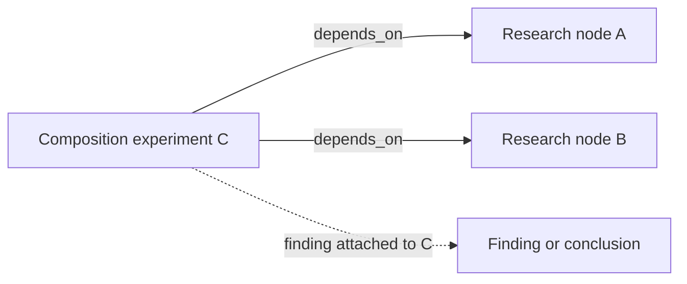
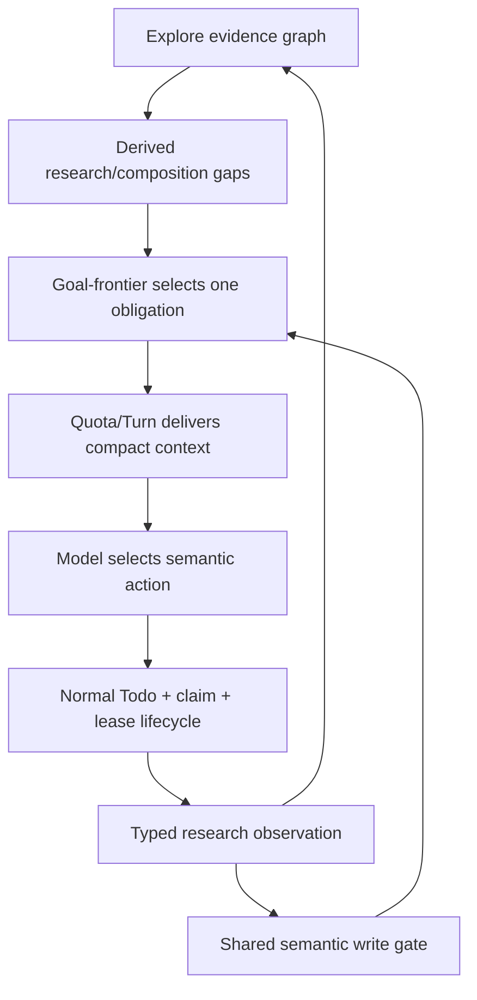

# RFC: Research Exploration Control Plane v0

| Field | Value |
|---|---|
| Status | Accepted |
| Supersedes / closes | none |
| Date | 2026-08-13 |
| Authors | LoopX maintainers |
| Scope | Research evidence, coverage, composition frontier, replan integration, execution handoff, and qualification |
| Source baseline | LoopX `7f67d51c6` |

> Language note: the
> [Chinese version](./research-exploration-control-plane-v0.zh-CN.md) and this
> English version are semantic mirrors. A difference between them is a defect.

## 1. Decision Summary

LoopX should treat research as the controlled evolution of a **typed knowledge
frontier**, not as a long sequence of tasks and not as an unbounded request to
"try something different".

The first new ability is a **composition frontier**. When two individually
investigated research nodes have an explicit, evidence-linked reason to be
tested together, LoopX should preserve that untested relation as a gap. The gap
may produce a replan obligation and a normal runnable successor. It is closed
only by an evidence-backed composition experiment or an evidence-backed
dismissal, not by reading context, acknowledging a packet, completing an
unrelated Todo, or restating the same conclusion.

This RFC makes six architectural choices:

1. **Explore owns research topology and evidence.** Goal-frontier consumes a
   bounded projection; it does not build a second research graph.
2. **Research observations compose the existing progress contract.** They do
   not silently add research-only fields to `typed_progress_observation_v0`.
3. **A joint probe is an experiment node.** It depends on its input nodes. A
   direct binary `joint_probe` edge is not the execution record.
4. **The first composition trigger is explicit-only.** A shared closure
   constraint may rank candidates in shadow mode, but it must not automatically
   create every pairwise obligation until precision is demonstrated.
5. **Replan closes on semantic state change, not protocol ceremony.** Context
   delivery, manual reads, prose ACKs, and repeated terminal claims are not
   research progress.
6. **Execution remains in the normal LoopX lifecycle.** Explore planners and
   harnesses remain read-only; Todo, quota, claim, lease, writeback, and spend
   retain their current authority.

The broader aim is not to make every LoopX goal "research-shaped". It is to add
one optional, bounded substrate for goals whose outcome depends on exploration,
hypothesis revision, negative evidence, and combinations between previously
separate directions.

## 2. Why Research Needs a Distinct Control-Plane View

Ordinary implementation work often has a known target and a mostly monotonic
path: select a Todo, change an artifact, validate it, and close or continue.
Research work has a different failure surface:

- the next useful action depends on the latest evidence;
- a negative result may be valuable even when it changes no artifact;
- several individually exhausted directions may interact;
- broad exploration can look active while producing no new knowledge;
- premature closure and combinatorial explosion are both plausible;
- a long prewritten Todo chain can preserve activity while hiding that the
  underlying question has changed.

LoopX already has most of the required parts:

- `typed_progress_observation_v0` identifies a work slice and distinguishes
  advanced, unchanged, blocked, exhausted, and no-follow-up results;
- the repeat detector can derive an obligation from materially equivalent
  observations;
- semantic writeback accepts new surfaces, hypotheses, probe families,
  grounded successors, concrete blockers, and coverage-backed terminal results;
- the host projects bounded evidence and uncovered frontier into the next
  action packet;
- Explore stores append-only nodes, typed edges, findings, and public-safe
  evidence references;
- Todo, quota, claim, lease, and spend own executable work.

What is missing is relational knowledge. Current novelty is mostly atomic:
"new surface", "new hypothesis", or "new probe family". It cannot represent
the durable fact that A and B were each investigated, their individual
conclusions are known, but the interaction A x B remains untested.

That omission creates two bad outcomes:

1. LoopX accepts individual exhaustion as global exhaustion even when an
   explicit interaction hypothesis remains open.
2. A model rediscovers the combination informally, but the relation is not
   durable and the next turn cannot distinguish it from another ad hoc probe.

## 3. Goals

This RFC aims to:

- represent research coverage, closure, and composition with typed,
  public-safe identities;
- detect repeated or isolated exploration without parsing prose;
- preserve negative evidence and coverage boundaries;
- turn a qualified knowledge gap into exactly one causal, runnable direction;
- keep context delivery separate from proof that the context changed the next
  action;
- support interruptions and replay without duplicating experiments or losing
  gaps;
- keep hot quota packets small enough for weaker protocol-following models;
- qualify both deterministic state semantics and actual model-selected tool
  behavior;
- expose honest terminal outcomes: finding, exhausted coverage, concrete
  blocker, dismissal, or no follow-up;
- evolve through measured milestones rather than speculative framework growth.

## 4. Non-Goals

This RFC does not propose:

- a general scientific-method engine or autonomous lab;
- automatic pairwise combination of every closed node;
- a prose classifier for research intent, closure, novelty, or similarity;
- a generic knowledge graph replacing Explore;
- a second Todo scheduler, agent launcher, settlement executor, or quota path;
- a requirement that ordinary implementation goals use research observations;
- automatic truth claims from model confidence;
- automatic execution of unsafe, expensive, external, or permissioned probes;
- a guarantee that composition produces a positive finding;
- a generic Kleisli or middleware framework for research commands;
- n-ary composition, concurrent experiment execution, or CAS semantics before a
  real execution caller requires them.

## 5. Current Truth and Missing Pieces

This section is intentionally maintained as implementation lands. Protocol
references and code define shipped behavior; this RFC records direction and
milestone status.

### 5.1 What exists today

| Capability | Current truth |
|---|---|
| Typed work-slice progress | `typed_progress_observation_v0` records stable semantic dimensions, result class, coverage, blockers, and evidence ids. |
| Stall detection | Consecutive materially equivalent typed observations can derive a replan trigger. |
| Semantic replan closure | New typed dimensions, a grounded successor, a concrete blocker, or coverage-backed terminal result can close the current obligation. |
| Host-delivered context | Quota can project a compact coverage ledger and uncovered frontier without requiring a manual evidence-read ritual. |
| Explore evidence | Explore owns append-only nodes, edges, findings, and bounded public-safe projections. |
| Explore planning | Optional branch planners are read-only and return execution to quota, Todo, claim, and lease. |
| Model behavior qualification | Real function-tool conversations can test whether a model reads an actual packet and selects a real semantic writeback. |

### 5.2 What is missing

| Gap | Consequence |
|---|---|
| No typed closure basis | A terminal conclusion cannot explain which constraint made it terminal without prose. |
| No composition candidate | A relation between individually investigated nodes is not durable. |
| No composition experiment identity | Replays can schedule duplicate joint probes or mistake a Todo for a result. |
| No composition gap projection | Goal-frontier cannot distinguish atomic exhaustion from untested interaction. |
| No research-specific qualification matrix | Tests do not yet prove candidate-to-gap-to-experiment-to-result causality. |
| No promotion evidence for inferred combinations | Shared constraints are not known to be precise enough to trigger obligations. |

## 6. Research State Model

The model has five durable concepts and two derived concepts.

### 6.1 Goal-level research contract

Research mode is an explicit per-goal policy layered on the existing goal
vision and Explore opt-in. It must not create a second goal statement. Before
composition can become enforceable, the goal boundary needs to identify:

- that research exploration is enabled;
- the active vision or question whose acceptance remains authoritative;
- the coverage scope used for exhaustion or no-follow-up claims;
- whether composition is `disabled`, `explicit_only`, or a later promoted
  policy;
- allowed terminal outcomes and any user/safety gate that owns them.

The first implementation should extend the nearest existing Explore goal
configuration rather than introduce a new capability. Without this explicit
policy, Explore evidence remains available for diagnostics and presentation,
but no composition obligation is derived.

Research nodes and findings can supply evidence to the goal vision. They do not
change goal acceptance merely by becoming `resolved`, and a locally complete
composition frontier does not imply that the whole goal is complete.

### 6.2 Durable concepts

1. **Research node**: a question, area, hypothesis, experiment, or artifact in
   the Explore log.
2. **Research observation**: a typed result for one bounded work slice,
   attributable to a research node and evidence.
3. **Closure basis**: the typed constraints and coverage that support a
   terminal or bounded conclusion.
4. **Composition candidate**: an explicit, evidence-linked claim that two
   research nodes should be tested together.
5. **Composition experiment**: a first-class Explore experiment node with
   `depends_on` edges to every input node.

### 6.3 Derived concepts

1. **Composition gap**: an eligible composition candidate that has no active,
   completed, or validly dismissed composition experiment.
2. **Research frontier**: a bounded projection of atomic gaps, composition
   gaps, and terminal coverage available to replan and status consumers.

### 6.4 Why the experiment is a node

For input nodes A and B, a composition experiment is C:



In the stored Explore graph, C carries `depends_on` edges to A and B. This
representation:

- supports more than two inputs later without changing edge meaning;
- gives the probe its own lifecycle and evidence;
- separates the hypothesis that inputs may compose from proof that a joint
  experiment ran;
- makes replay identity stable;
- reuses the existing `experiment` node kind, `depends_on` edges, attached
  findings, and `supports`/`refutes` relations where they apply.

A direct `joint_probe` edge between A and B would collapse candidate,
execution, and result into one ambiguous relation. This RFC rejects that shape.

## 7. Typed Contract Direction

The following schemas are design targets, not shipped protocols. Their final
wire form must be introduced with an active caller, protocol reference, and
focused validation.

### 7.1 Compose; do not mutate v0 silently

`typed_progress_observation_v0` is a generic work-item contract. Research
metadata belongs to Explore. The intended envelope is:

```json
{
  "schema_version": "typed_research_observation_v0",
  "progress": {
    "schema_version": "typed_progress_observation_v0",
    "work_item_id": "todo-42",
    "surface_id": "routing-boundary",
    "hypothesis_id": "alternate-ordering",
    "probe_kind": "order-differential",
    "result_class": "exploration_exhausted",
    "coverage_scope_id": "routing-order-v1",
    "coverage_complete": true,
    "evidence_ids": ["ev-routing-order"]
  },
  "explore_node_id": "node-routing-boundary",
  "closure_basis": {
    "schema_version": "research_closure_basis_v0",
    "disposition": "bounded",
    "constraints": [
      {
        "kind": "decision",
        "id": "parameter-normalization",
        "role": "decisive"
      }
    ],
    "evidence_ids": ["ev-routing-order"]
  },
  "composition_candidates": [
    {
      "target_node_id": "node-filter-interaction",
      "basis": "explicit",
      "interaction_kind": "shared_constraint",
      "evidence_ids": ["ev-routing-order", "ev-filter-boundary"]
    }
  ]
}
```

The envelope composes the generic progress observation; it does not copy its
result-class logic. Core progress consumers may read `progress`. Explore owns
closure and composition validation. A future `refresh-state` integration may
write both through one receipt-bearing effect program, but it must not create a
second generic settlement executor.

### 7.2 Typed closure basis

`closure_basis.constraints[]` is typed data, not a list of arbitrary strings.
The initial `kind` vocabulary should remain domain-neutral and small:

- `stage`
- `decision`
- `invariant`
- `dependency`
- `resource`
- `policy`

Each constraint has a stable opaque `id` and a role of `decisive` or
`supporting`. The ordered list may describe a path, but matching uses typed
identity, never substring overlap. The terminal observation must also carry a
coverage scope and evidence; a closure path is not a substitute for coverage.

### 7.3 Explicit composition candidates

The first version accepts only `basis=explicit`. `interaction_kind` is a typed
claim about why a joint test may matter:

- `shared_constraint`
- `producer_consumer`
- `state_interference`
- `order_dependency`
- `resource_coupling`
- `unknown_interaction`

These values describe a candidate; they do not assert a finding. Candidate
identity uses a canonical sorted set of input node ids plus goal id, so A x B
and B x A cannot create duplicate gaps.

`composition_candidates` must be bounded per observation. A candidate must
reference known nodes in the same goal and public-safe evidence already
attributable to the inputs. Unknown nodes, local paths, prose-only targets, and
cross-goal refs fail closed.

### 7.4 Action signature and compatibility

When a research observation can close a replan obligation, the action
signature must include:

- current obligation id;
- research observation schema version;
- Explore node id;
- normalized input node ids for a composition experiment or candidate;
- generic progress fingerprint;
- evidence ids or their bounded digest.

Adding research fields without updating the action signature would allow an
adapter to drop the composition meaning while still claiming semantic parity.
Compatibility tests must reject that drift.

## 8. Composition Gap Derivation

### 8.1 Eligibility in v0

A candidate becomes a `composition_required` gap only when all conditions are
true:

1. the candidate is explicit and references at least two known Explore nodes;
2. every input has an attributable terminal observation with evidence;
3. every input's terminal state is eligible;
4. no experiment with the same canonical input set is active or has an
   evidence-backed result;
5. the candidate has not been validly dismissed;
6. the gap is within the configured per-goal and per-agent projection budget.

Eligible terminal states in v0 are:

- coverage-backed `exploration_exhausted`;
- coverage-backed `no_followup`;
- an Explore `resolved` or `dead_end` node backed by an equivalent typed
  observation.

`unchanged` is not a closed node. It may trigger ordinary stall replanning, but
it cannot prove that a direction is ready for composition closure analysis.

`blocked` is not eligible by default. A later milestone may admit an
evidence-backed **intrinsic** blocker once blocker scope and resume semantics
are typed. A temporary permission, resource, user, or scheduler blocker must
not imply that isolated research is exhausted.

### 8.2 Shared constraints are not a v0 trigger

Two terminal nodes that share a decisive closure constraint may be interesting,
but automatically pairing all such nodes is unsafe:

- common infrastructure constraints can connect many unrelated nodes;
- N nodes behind one stage produce O(N^2) pairs;
- a shared rejection boundary may be proof of independence rather than
  interaction;
- false obligations impose protocol cost and distract from more valuable
  frontiers.

Therefore shared constraints may initially produce a **shadow ranking signal**
only. Promotion to an inferred candidate trigger requires measured precision,
bounded candidate generation, and an explicit RFC decision-log update. It must
never be implemented as string matching over `closure_path` prose.

### 8.3 Bounded projection

The canonical Explore projection may contain all public-safe eligible gaps. Hot
control-plane packets should not.

The default quota action packet should carry:

```json
{
  "composition_frontier": {
    "schema_version": "composition_frontier_projection_v0",
    "pending_count": 3,
    "selected_gap": {
      "gap_id": "composition-gap-opaque",
      "input_node_ids": ["node-a", "node-b"],
      "required_outcome": "schedule_or_resolve_composition_experiment"
    }
  }
}
```

The packet selects at most one obligation for one agent turn. Status and
drill-down commands may expose a separately bounded list and total counts. No
hot path should enumerate every candidate pair or copy full evidence bodies.

### 8.4 Bounded Autonomous Model Selection (Deferred)

Eligibility and ranking are different decisions. The control plane proves that
a candidate is legal, still pending, scoped to the current goal and agent, and
within evidence, capability, authority, and projection budgets. It must not
present a structural ordering as a success probability. A single eligible gap
may be projected directly. When several gaps are eligible, a later
implementation should deliver at most three public-safe typed candidate cards
and let the model choose which one is most valuable to execute first.

Each bounded candidate card should include at least:

- experiment identity and normalized input node identities;
- `interaction_kind` and typed closure basis;
- each input's terminal result class and compact evidence abstract;
- proposed probe family, capability readiness, cost class, and prior joint
  attempt count;
- the current obligation id and allowed outcomes.

The model optimizes expected research value rather than a self-reported success
probability. The first version should compare ordinal typed dimensions for
breakthrough plausibility, information gain, falsifiability, execution cost,
duplicate risk, and capability readiness. It must not publish or consume
apparently precise numeric probabilities before calibration evidence exists.
Model confidence is routing metadata only; it cannot create a finding, close a
composition gap, or upgrade goal-acceptance truth.

The model must return a bounded `composition_selection_v0` receipt containing
at least the current obligation id, an experiment ref from the delivered
candidate set, typed selection reasons, a confidence bucket, and bounded typed
reasons for rejected alternatives. The semantic write gate must verify that:

1. the obligation identity is still current;
2. the selected experiment belongs to the candidate set actually delivered in
   this turn;
3. the candidate remains eligible and has no active bound successor;
4. the successor binds both the obligation and experiment identities;
5. the selection receipt is never treated as experiment-outcome evidence.

Deterministic ordering may be used only as an explicit, observable weak-model
fallback. It must not silently claim to have chosen the most promising
candidate. M4 should first use real model-tool behavior and repeated live shadow
to prove that a model can read candidate cards, select a legal candidate, and
produce a meaningful experiment or justified dismissal. This RFC does not
require M2 to implement the selection protocol.

## 9. Composition Gap Lifecycle

The derived gap has a causal lifecycle even though its truth is computed from
durable Explore events:

```text
candidate -> pending -> scheduled -> observing -> observed
                       |              |
                       |              +-> pending (interrupted or invalid result)
                       +-> pending (Todo closed without result)

candidate/pending -> dismissed (evidence-backed)
pending/scheduled -> deferred (typed resume condition) -> pending
```

### 9.1 State meanings

- `candidate`: an explicit relation exists, but input closure is incomplete.
- `pending`: inputs are eligible and no covering experiment exists.
- `scheduled`: a runnable Todo and experiment identity are bound to the gap.
- `observing`: execution started and a lease or current work slice identifies
  the experiment.
- `observed`: an evidence-backed experiment result is in Explore.
- `dismissed`: evidence proves the proposed combination is duplicate, invalid,
  unsafe, or outside goal scope.
- `deferred`: a typed blocker has a resume condition; the gap remains true but
  does not pretend to be runnable.

### 9.2 What closes what

Scheduling a grounded successor is a valid semantic replan delta. It closes the
**current replan obligation**, because a new runnable direction exists. It does
not close the **composition gap**.

The composition gap closes only when:

- the bound experiment records an evidence-backed outcome; or
- an evidence-backed dismissal records why the candidate is not a useful or
  legal experiment.

Completing the Todo without an experiment result reopens the gap. Rewording a
Todo, recording an unrelated finding, reading evidence, or writing a repeated
blocker does not advance the lifecycle.

## 10. Ownership and Effect Boundaries

| Layer | Owns | Must not own |
|---|---|---|
| Explore | Research nodes, typed relations, closure basis, composition candidates, experiment evidence, canonical gap query | Quota, claims, leases, launches, spend, or goal acceptance truth |
| Goal-frontier | Priority among current obligations and bounded consumption of composition gaps | A duplicate research graph or inferred prose semantics |
| Quota / Turn envelope | Compact context delivery, selected obligation, allowed outcomes, scheduler handoff | Canonical evidence writes or proof that an experiment succeeded |
| Todo / task lease | Runnable successor, ownership, lease, and execution lineage | Research truth derived from Todo completion alone |
| Semantic write gate | Exact obligation identity, grounded successor, typed observation, evidence, and legal transition | Manual-read rituals, legacy ACK-only closure, or prose classification |
| Explore harness | Read-only ranking and candidate planning under an explicit opt-in | Todo creation, claims, leases, worker launch, state write, or spend |
| Presentation | Public-safe rendering of the Explore projection | Parsing private research sources or becoming an evidence authority |

The end-to-end flow is:



This is compatible with the Agent Loop Effect Interpreter RFC. Context
delivery, Todo creation, experiment execution, observation writeback, and quota
spend are separate effects with separate receipts. Similar packet shapes do
not justify a shared executor unless two real callers also share execution
authority.

## 11. Replan Integration

### 11.1 Trigger precedence

Composition is one frontier source, not the only one. The goal-frontier reducer
must keep one ordered, typed rule table. Composition should enter only after
higher-authority gates and already-runnable successors are considered.

A reasonable initial order is:

1. existing exact obligation;
2. blocking user or handoff gate;
3. already-runnable bound successor;
4. current vision or goal-acceptance obligation;
5. ordinary succession, stall, or long-chain obligation;
6. eligible composition gap;
7. monitor/exhaustion fallback.

The final order requires characterization fixtures against current reducer
semantics. Composition must not mask a user decision, a runnable Todo, or a
vision acceptance gap.

### 11.2 Causal identity

Every transition must retain:

```text
composition_gap_id
  -> replan_obligation_id
  -> successor_todo_id
  -> explore_experiment_node_id
  -> result evidence ids
```

Only that lineage can suppress or close the gap. An unrelated deferred Todo,
another agent's experiment, or a prior obligation ACK cannot impersonate it.

### 11.3 Semantic outcomes

For a composition obligation, accepted outcomes are:

- `new_runnable_composition_experiment`;
- `composition_experiment_observed`;
- `composition_candidate_dismissed` with evidence;
- `new_concrete_blocker` with a typed resume/terminal scope;
- coverage-backed goal-level `exploration_exhausted` or `no_followup` only when
  the composition candidate is included in the declared coverage.

`context_delivered`, `evidence_read`, `acknowledged`, `unchanged`, repeated
blocker, and unrelated new surface are not sufficient to close this obligation.

### 11.4 Host-delivered research context

The host should project:

- selected gap id;
- input node ids and compact conclusions;
- bounded evidence refs;
- required outcome;
- allowed terminal actions;
- the exact writeback/successor contract.

The model should choose and execute the research action. It should not spend a
turn discovering which evidence command satisfies a protocol ceremony. A
delivery receipt proves that context arrived; the observation proves whether
the next action used it.

## 12. Write-Time Enforcement

The write gate must reuse the same current goal-frontier and Explore gap
projection as quota. A run-history-only adapter is insufficient because vision,
frontier, and composition obligations can be derived without a prior compact
run.

While a composition obligation is open, the gate rejects:

- maintenance or `unchanged` writeback;
- a successor not bound to the current gap and obligation;
- a terminal result without coverage and evidence;
- a composition experiment with unknown or mismatched input nodes;
- a Todo closeout with no experiment observation;
- a manual read or legacy ACK presented as semantic completion;
- a duplicate experiment identity that would repeat an already covered input
  set without a typed supersession reason.

The gate accepts only legal transitions from the lifecycle above. Error output
should name the current obligation id, missing typed field or state transition,
and one canonical next command. It should not dump the full graph or private
evidence.

## 13. Complexity and Safety Budget

Research capability is useful only if it costs less than the repetition it
prevents.

### 13.1 Cardinality rules

- Never enumerate all pairs of closed nodes.
- Bound explicit candidate declarations per observation.
- Canonicalize input sets for idempotency.
- Select at most one composition obligation per agent turn.
- Keep full gap lists out of the hot quota packet.
- Require a configured overflow/read-drilldown policy instead of silently
  truncating material gaps.
- Introduce n-ary candidate generation only after a real caller demonstrates
  that binary experiments are insufficient.

The exact numeric limits are protocol constants chosen with qualification
data, not hidden magic numbers in renderers or prompts. Changing them is a
behavior change and requires packet-budget and model-behavior evidence.

### 13.2 Authority rules

- The capability is default-off per goal until its first milestone is
  qualified.
- Enabling research projection grants no network, filesystem-write, worker,
  claim, lease, quota, or external-system authority.
- An experiment still passes ordinary capability, permission, user, budget,
  scheduler, and safety gates.
- Unsafe or permissioned combinations may be dismissed or deferred; the
  existence of a gap is not authorization to execute it.

### 13.3 Public/private boundary

Durable public-safe research events may contain opaque ids, typed relation
kinds, compact summaries, coverage ids, and public relative evidence refs.
They must not contain:

- raw prompts, reasoning, transcripts, trajectories, or provider responses;
- raw benchmark task text, verifier output, or private incident logs;
- credentials, headers, tokens, or secret material;
- local absolute paths;
- private documents, private links, customer or organization context;
- unredacted external payloads.

Private research inputs remain outside the repository. The graph stores only a
bounded public-safe observation or opaque pointer permitted by the source
boundary.

## 14. Qualification Strategy

Tests are derived from legal and illegal state transitions, not from the
current implementation output.

### 14.1 P0: state-machine and replay matrix

Enumerate valid prefixes and interruption points for:

```text
candidate -> pending -> scheduled -> observing -> observed/dismissed
```

Prove at least:

- no explicit candidate means no v0 composition gap;
- `unchanged` cannot close an input node;
- scheduling changes the replan state but not gap truth;
- Todo completion without an experiment result reopens the gap;
- the same canonical input set schedules at most one active experiment;
- an old obligation, unrelated Todo, or unrelated evidence cannot close the
  current gap;
- failure before observation produces no false result;
- replay after each durable write is idempotent.

### 14.2 P0: cross-projection conformance

For the same synthetic goal, quota, status, Turn envelope, and refresh-state
write gate must agree on:

- selected gap and obligation identity;
- active bound successor;
- required semantic outcome;
- whether the gap remains open;
- public-safe evidence refs;
- scheduler remaining outside research settlement.

### 14.3 P0: model tool behavior

The behavior test must resemble a real LoopX turn:

1. construct a hermetic public-safe goal with two individually covered nodes
   and one explicit composition candidate;
2. invoke the real `quota should-run` path;
3. deliver the actual compact packet through a real function-tool conversation;
4. let the model choose its next tool action;
5. execute only allowlisted commands against temporary fixture state;
6. judge whether the selected action creates or observes the correctly bound
   composition experiment;
7. persist only a compact receipt and digests, never prompts or raw responses.

The model must not pass by emitting a test-only field, starting its response
with a keyword, reading a file, or repeating the expected label. Negative arms
should include isolated repeat, unrelated novelty, candidate omission,
pre-obligation ACK, Todo-only completion, and terminal closure without evidence.

Deterministic scripted transports validate the harness and protocol decoder.
They are not live-model evidence. Promotion requires repeated, low-frequency
live qualification with an allowlisted model and explicit owner review.

### 14.4 P1: mutation tests

Mutations should fail when they:

- drop an input node from experiment identity;
- reorder a non-commutative experiment plan;
- remove evidence from closure;
- treat shared prose as a typed shared constraint;
- accept `unchanged` as terminal;
- close a gap on Todo status alone;
- accept a different obligation id;
- duplicate the experiment effect after replay;
- omit research semantics from an adapter action signature.

### 14.5 P1: public-safe incident replays

Retain only generalized, synthetic cases that protect durable behavior:

- repeated maintenance accepted while a frontier-derived obligation is open;
- context delivered but no later semantic action;
- a runnable unrelated Todo masking a specific gap;
- a completed long chain with no outcome checkpoint;
- an explicit composition candidate lost between turns.

Raw trajectories and private benchmark artifacts remain local and are never
fixtures.

### 14.6 P2: concurrency

Race/CAS tests begin only when a real concurrent writer can schedule or observe
the same experiment. Until then, deterministic identity, file locking, claim,
lease, and replay tests are sufficient. Do not add a distributed coordination
abstraction for a hypothetical caller.

## 15. Evaluation and Claim Boundary

The feature is not successful because it creates more Todos or more replan
events. Qualification should compare:

- materially repeated work slices per useful finding;
- time and tool calls to the next semantic delta;
- percentage of replan obligations that produce a genuinely new runnable
  direction;
- composition-candidate precision: eligible gaps that lead to a meaningful
  experiment or justified dismissal;
- autonomous-selection yield: meaningful experiments or justified dismissals
  from model selections relative to the declared deterministic fallback;
- out-of-set/invalid selection rate and time from selection to semantic outcome;
- duplicate experiment rate;
- false-obligation rate;
- protocol/tooling share of total calls;
- honest terminal rate and unsupported-exhaustion rate;
- external task outcome under repeated matched runs;
- regression on ordinary non-research goals.

Shadow inference from shared closure constraints should record candidate
precision and estimated packet cost without creating obligations. It may be
promoted only if it improves research outcomes or convergence without an
unacceptable false-obligation or protocol-cost increase.

No single benchmark run proves general uplift. A credible claim requires a
stable release, stable scheduler/harness, matched starting state, repeated arms,
declared stopping rules, and separation between model variance and
control-plane failures.

## 16. Milestones

| Milestone | Deliverable | Promotion gate | Status |
|---|---|---|---|
| M0 | RFC, current-state inventory, and explicit ownership decision | Maintainer review; no runtime behavior | Accepted design |
| M1 | Characterization fixtures plus typed research observation and closure contract in Explore | Deterministic normalization, privacy, compatibility, and negative tests | Not started |
| M2 | Explicit-only composition candidate, canonical gap projection, and read-only status shadow | No pairwise inference; bounded packet; projection parity | Partially implemented (#3173: explicit experiment projection and successor binding) |
| M3 | Goal-frontier obligation, exact Todo/experiment lineage, and shared write-time gate | State/replay matrix and premerge canary pass | Not started |
| M4 | Bounded multi-candidate cards, `composition_selection_v0`, real model-tool behavior qualification, and repeated live shadow | Model autonomously selects a legal semantic action from the delivered candidate set; selection quality is no worse than the declared fallback; compact receipts only | Not started |
| M5 | Shared-constraint candidate ranking in shadow mode | Precision and cost evidence; no automatic trigger | Not started |
| M6 | Optional inferred trigger | Explicit maintainer decision and measured promotion thresholds | Deferred |
| M7 | N-ary composition or concurrent scheduling | A real second-order caller and authority boundary exist | Deferred |

### 16.1 Smallest useful implementation slice

M1 and M2 are the first reviewable slice:

- add no new scheduler or executor;
- keep composition gaps read-only and default-off;
- accept explicit candidates only;
- characterize the current Explore projection before changing it;
- prove public safety, canonical identity, and bounded projection;
- show the candidate and gap in status, but do not yet block writeback.

M3 is the first behavior-changing slice. It should be a separate PR so the
obligation and write gate can be reviewed and reverted independently from the
evidence schema.

## 17. Rejected Alternatives

### 17.1 Automatically pair nodes with a shared closure stage

Rejected for v0 because shared infrastructure creates false pairs and
quadratic growth. Retained as a later shadow-ranking hypothesis.

### 17.2 Add `closure_path` and `composes_with` directly to generic progress v0

Rejected because it changes the semantics of an established generic contract
without a version boundary and moves Explore knowledge into a work-item schema.
Use an Explore-owned research envelope that composes the existing progress
observation.

### 17.3 Store `joint_probe` as a direct edge

Rejected because it cannot distinguish candidate, scheduled experiment,
execution, and result. Use an experiment node with dependencies.

### 17.4 Let the Explore harness create successor Todos

Rejected because the harness is read-only. It may recommend a bound experiment;
execution returns to the normal Todo/quota/claim/lease lifecycle.

### 17.5 Treat any runnable Todo as sufficient research continuation

Rejected because an unrelated Todo can mask the exact knowledge gap. Only a
Todo in the gap's causal lineage suppresses duplicate replanning.

### 17.6 Close replan on an evidence-log read or ACK

Rejected because context delivery is not semantic use. A new grounded action or
evidence-backed terminal result is required.

### 17.7 Generalize all core paths into one research/effect executor

Rejected until real adapters share execution authority. Shared algebra and
typed receipts are useful; a generic executor registry is not justified by
similar data alone.

## 18. Open Questions

1. Which typed blocker scopes are strong enough to make a blocked input
   composition-eligible?
2. Should a composition experiment be able to supersede an earlier experiment
   with the same inputs but a different probe family, and what evidence is
   required?
3. Which interaction kinds predict useful combinations across multiple
   research domains without becoming domain-specific core vocabulary?
4. What packet and candidate budgets give weaker protocol-following models
   enough context without restoring protocol tax?
5. Should goal acceptance require all high-priority composition gaps to be
   observed/dismissed, or should the goal declare an explicit research coverage
   policy?
6. When does a shared-constraint ranking signal earn promotion from shadow
   evidence to an enforceable trigger?
7. Does a second real caller need a reusable composition-experiment builder, or
   is the Explore CLI still the correct owner?

## 19. RFC Maintenance Protocol

This is a living RFC, not an append-only diary.

- Update **Current Truth and Missing Pieces** when shipped behavior changes.
- Update the milestone table in the same PR that lands or retires a milestone.
- Record a short decision-log entry below for changes to ownership, trigger
  policy, eligibility, or promotion gates.
- Replace stale statements instead of adding parallel historical sections.
- Move stable wire contracts to `docs/reference/protocols/`; link them here and
  keep this document architectural.
- Keep implementation tutorials in the control-plane course and user/operator
  instructions in capability docs; do not duplicate them here.
- Do not add private experiment results, raw model traces, internal links, or
  local paths.
- A later abstraction requires an active caller and scope-fit review, not only
  an open milestone.

### Decision log

| Date | Decision |
|---|---|
| 2026-08-13 | Adopt Explore as the canonical research-topology owner; choose explicit-only composition candidates for v0; represent joint work as an experiment node; defer shared-constraint inference to shadow qualification. |
| 2026-08-13 | Separate eligibility from ranking: the control plane owns a legal bounded candidate set, while the model autonomously prioritizes among multiple eligible candidates. A selection receipt proves a scheduling choice, not research truth. Defer the protocol to M4 rather than adding it to the #3173 runtime slice. |

## 20. Acceptance Criteria for the RFC

Merge accepts this design basis. Implementation qualification still requires evidence that:

- ownership boundaries do not create a second research graph or executor;
- the first slice is useful without inferred pair generation;
- typed contracts avoid prose classification and silent v0 mutation;
- gap, obligation, Todo, experiment, and evidence lineage are unambiguous;
- the qualification plan can reject protocol ceremony and test-only behavior;
- complexity, authority, and privacy budgets are explicit;
- milestone promotion depends on evidence and real callers;
- the Chinese and English documents remain semantic mirrors.
