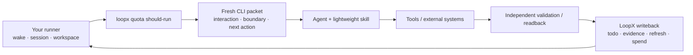

# Embed LoopX In Your Agent Runner

[简体中文](custom-agent-runner-integration.zh-CN.md)

This guide is for developers who already run agents on a remote development
machine, through a custom CLI, or behind an existing workflow supervisor.
You do not need to replace that runtime or move domain orchestration into
LoopX. Keep your runner, and use LoopX as the durable control-plane contract
between turns.

Want the shortest public contract first? Start with the
[minimal custom runtime example](minimal-custom-runtime-example.md) and run
`python3 examples/custom-runtime-minimal-cli-turn-smoke.py`. The advanced typed
Turn path is separate:
`python3 examples/loopx-turn-fake-host-walkthrough-smoke.py`.

The shortest useful mental model has three pieces:

| Piece | Owns | Does not own |
| --- | --- | --- |
| **LoopX CLI** | Durable goal, todo, claim, gate, quota, evidence, monitor, scheduler hint, and accepted writeback state | Agent reasoning, tools, or the external system |
| **Lightweight skill or re-entry instruction** | How the Agent reads a fresh LoopX packet, obeys its boundary, validates work, and writes back | Current task state or another scheduler |
| **Your runner** | Wakeups, workspace/session setup, Agent invocation, and applying the actual timer or scheduler value | LoopX policy, hidden authority, or domain truth |

The CLI is the source of truth. The skill is a small behavior contract. Your
runner is the loop driver.



## What You Do Not Need

You do not need a permanent leader Agent, a second orchestration database, or a
LoopX capability for every task. An Agent may plan, split work, use tools, and
create a successor todo from the facts it discovers.

When Agent A finishes and Agent B should continue, A writes or links the
successor todo through LoopX. The next host wake reads the new frontier and B
claims it. No central model needs to remember or manually route the handoff.

Add a Capability only when the caller needs a stable, provider-neutral outcome
contract with reusable observation normalization, validation, and transition
policy. Put an external implementation behind a Provider. Ordinary reasoning,
repository edits, and one-off tool use can remain Agent work.

## Bootstrap A Custom Host

Install the CLI on the machine that owns the project workspace:

```bash
python3 -m pip install --upgrade loopx
loopx doctor --agent-type other-agent
```

Ask LoopX for the current custom-host packet instead of hard-coding commands:

```bash
loopx agent-onboard \
  --agent-type other-agent \
  --project . \
  --goal-id <goal-id> \
  --agent-id <agent-id> \
  --task-text "<first task>" \
  --available-capability shell
```

The packet returns the current doctor/install command, bootstrap command pack,
quota guard, and recheck command. Declare only capabilities the current host
actually has. `--available-capability` reports observed execution ability; it
does not grant permission or satisfy a user gate.

For `other-agent`, doctor intentionally does not inspect `~/.codex/skills`.
CLI health and workflow delivery are separate checks. The custom host must
deliver `loopx-project`, `loopx-pr-program`, `loopx-pr-review`,
`loopx-doc-registry`, `loopx-benchmark`, and `loopx-self-repair` from the same
LoopX revision through its own skill manifest or equivalent prompt injection.
`loopx-benchmark` is task-triggered for LoopX-managed experiments; loading it
does not grant benchmark runner or private-evidence authority. When the current goal enables
`change_quality_qualification`, the onboarding packet also lists
`loopx-change-quality` as an active project skill; deliver that workflow or its
equivalent self-contained prepare-packet instructions. Then read back the
integration mode, loaded skill ids, and source revision. Do not assume a Codex,
Claude, or OpenCode directory layout for an unknown host. Loading the quality
skill does not activate it; the current goal policy controls activation.

If the host has no skill system, inject the equivalent `SKILL.md` instructions
and keep one short re-entry instruction that tells the Agent to:

1. read a fresh JSON quota packet for the current goal and Agent;
2. follow `interaction_contract`, `goal_boundary`, and the selected todo;
3. perform one bounded action and validate the real postcondition;
4. write the result through LoopX; and
5. apply and acknowledge any scheduler hint before the next wake.

The re-entry instruction stays stable. It must not cache a previous CLI packet,
todo list, cadence, or project policy.

## Run One Self-Driven Tick

Use JSON for the machine path:

```bash
loopx --format json \
  --registry "$HOME/.loopx/registry.global.json" \
  quota should-run \
  --goal-id <goal-id> \
  --agent-id <agent-id> \
  --available-capability shell
```

Then follow this loop:

1. **Decide:** Treat `should-run` and `interaction_contract` as the gate. A
   quiet, wait, or monitor-only result makes no model call and spends no quota.
2. **Route:** If the user channel requires action, show the concrete user todo
   or question. Do not substitute an owner gate for a missing payload.
3. **Claim:** Claim the selected executable todo before write-capable work.
   Keep independent handoffs unclaimed unless an explicit assignment is known.
4. **Execute:** Give the Agent only the current objective, selected todo,
   boundary, compact evidence references, and writeback contract. Let it
   dynamically plan the bounded action.
5. **Validate:** Read the real repository, test, CI, service, or Provider
   result. The Agent's completion claim is not proof.
6. **Write back:** Complete, update, block, defer, or add a successor todo;
   record compact evidence; then run `refresh-state`.
7. **Account:** Spend quota only after validated durable writeback. A failed
   validator, cadence update, quiet monitor poll, or no-op retry does not spend.
8. **Schedule:** Apply the current scheduler hint in the runner, read back the
   value actually applied, and ACK it through the returned CLI command.

Before a non-trivial delivery, inspect the goal's change-quality policy. When
enabled, run `change-quality prepare`, review the exact final diff, and record
its receipt. A custom host without a skill system can consume the self-contained
prepare packet directly. `safe_fix` allows one bounded repair pass;
`strict_receipt` makes `canary premerge --goal-id <goal-id>` reject a missing or
stale receipt.

Every new wake starts again at step 1. Do not resume from remembered model
state or a cached packet.

## Choose The Right Execution Boundary

There are two valid integration depths. In both cases, your runner still owns
the outer wake/schedule loop:

```text
outer runner: wake -> one bounded execution -> apply scheduler hint -> next wake
LoopX Turn:             decide -> execute -> validate -> commit
```

| Path | Use it when | Boundary |
| --- | --- | --- |
| **Direct CLI orchestration** | Your runner already invokes Agents and validates their work | The runner consumes `quota should-run`, todo lifecycle, refresh, spend, and scheduler ACK contracts |
| **LoopX Turn adapter (experimental)** | You want one typed command to plan, invoke one bounded host segment, validate, and commit | Use `turn run-once` with the built-in `codex-cli` adapter or a thin `generic-cli` adapter |

Direct CLI orchestration is the current compatibility baseline. LoopX Turn is
an experimental transaction boundary inside the runner, not a permanent
scheduler or multi-Agent coordinator. Choose one owner for decide, validate,
writeback, and spend in each tick: do not run the direct sequence and
`turn run-once` for the same logical action.

Treat a new Turn integration as development and qualification work. Before
depending on it, prove the host adapter emits the typed result contract, the
validator is independent, retry/resume/replay cannot duplicate effects, and
the outer runner applies and acknowledges scheduler state correctly. Those are
useful extension and contribution surfaces for making Turn more mature; an
Agent process exit code or scraped transcript is not a substitute for them.

## Acceptance Checklist

Before calling the integration autonomous, prove that:

- restarting the runner recovers from LoopX state without transcript replay;
- a concrete user action is surfaced, while an unrelated safe todo may still
  run;
- two Agents cannot silently claim the same work;
- validation failure cannot complete a todo or spend quota;
- scheduler application and ACK are idempotent;
- raw transcripts, credentials, private paths, and unbounded logs stay outside
  LoopX state; and
- the Agent can hand off through a successor todo without a permanent leader.

For exact read/write contracts, see
[Host Integration Surface v0](../reference/protocols/host-integration-surface-v0.md).
For the optional typed Turn path, see
[Run One LoopX Turn With Codex CLI](../product/runtimes/codex-cli/loopx-turn-codex-cli-quickstart.md).
