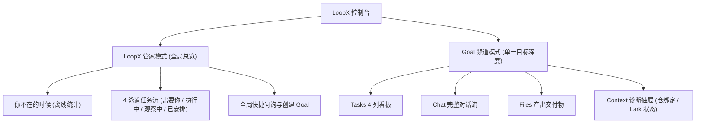

# LoopX 个人工作区控制台（Personal Workspace Console）使用指南

LoopX 控制台是为工程师与 Agent 深度协作打造的统一本地工作台。它将分散在不同会话、话题与后台运行中的 Agent 任务统一汇聚，提供**「LoopX 管家全局总览」**、**「Goal 4 列任务看板」**、**「轻量悬浮会话托盘」**、**「先预览后确认安全门禁」**与**「Lark / 飞书话题直连」**。

---

## 🎬 30 秒产品发布演示视频

<video controls width="100%" poster="https://loopx-project.github.io/loopx/docs/assets/personal-workspace/guide_manager_overview.png" style="border-radius: 12px; box-shadow: 0 8px 30px rgba(0,0,0,0.12);">
  <source src="https://loopx-project.github.io/loopx/docs/assets/personal-workspace/loopx-dashboard-launch.mp4" type="video/mp4">
  您的浏览器暂不支持直接播放视频，可下载 <a href="https://loopx-project.github.io/loopx/docs/assets/personal-workspace/loopx-dashboard-launch.mp4">MP4 视频文件</a> 进行查看。
</video>

> 💡 **视频高光**：终端一键启动 ➔ 管家 4 泳道任务流 ➔ 快捷指令浮动托盘 ➔ 4 列看板与智能「转为 Task」清洗 ➔ 飞书话题直连 ➔ Brutal 野兽派主题切换。

---

## 🚀 1. 快速启动与访问

在本地仓库或已安装 LoopX 的终端中执行：

```bash
# 启动本地 Dashboard 控制台（默认自动打开浏览器）
loopx dashboard
```

安装版会在同一个进程中启动打包后的工作区、状态投影和 Agent Chat，不需要另开
终端运行 `loopx serve-status`。命令默认自动打开浏览器；无界面启动可使用
`loopx dashboard --no-open`，并访问命令实际打印的 URL。默认地址为
`http://127.0.0.1:8767/chat/`。

可用下面两条命令验证页面和状态投影都来自同一个进程：

```bash
curl -fsS http://127.0.0.1:8767/chat/ >/dev/null
curl -fsS http://127.0.0.1:8767/status.json
```

> 💡 **两种入口可共存**：`loopx dashboard`（浏览器 / PWA）与 Tauri 原生桌面壳
> 都会复用已经在运行且版本匹配的 LoopX Chat 服务。先开 dashboard 再开桌面壳，
> 或先开桌面壳再执行 `loopx dashboard`，两种顺序都可以；当桌面壳已经启动时，
> 也可以直接访问 `http://127.0.0.1:8767/chat/` 使用浏览器 / PWA，无需再启动一套
> 服务。

---

## 🧭 2. 控制台核心架构



---

## 🏠 3.「LoopX 管家」全局总览模式

点击左侧侧边栏顶部的 **「LoopX 管家」**，进入全局总览模式。


### 核心功能区
1. **「你不在的时候」离线概览**：
   - 聚合展示你离开期间所有 Agent 的运行结果：`已完成` 数量、`异常/失败` 数量以及当前 **`等你确认`** 的阻塞项。
2. **4 泳道全局任务流（Swimlanes）**：
   - **🛑 需要你（Needs You）**：高亮展示当前所有正等待你审批、确认或提供输入的问题（如权限审批、环境授权）；
   - **⚡ 执行中（In Progress）**：展示当前正在被自主推进的 Agent Todo 与 Goal；
   - **👀 观察中（Observing）**：展示正在运行的持续监控与定时巡检任务；
   - **📅 已安排（Scheduled）**：展示挂起的周期性计划。
3. **全局快捷指令（Quick Prompts）**：
   - `[询问全局待办 (草稿)]`：一键将「有哪些 Goal 正在等我？优先处理什么？」填入输入框；
   - `[汇总所有 Goal 进展 (立即发送)]`：带有蓝色高亮标识，点击后**立即发送**并在右下角弹出托盘展示全局总结；
   - `[创建新 Goal (草稿)]`：快速填入目标模板草稿。

### 问答中的等待与失败

管家与 Goal 的前端对话共用运行视图，适用于查询、编码、投研等各种任务：回答下方显示当前正在做的一步，例如「正在读取 notes.md」。使用 Codex 执行器时，展开「执行过程」可逐步查看思考、读取、搜索、运行的命令、调用的工具和修改的文件；同一步的开始与结束合并为一行，失败的步骤标出退出码，点击一行可查看完整命令、改动文件列表或思考内容。思考内容仅在模型向宿主公开时显示（有的模型只给出思考用时）；不显示命令输出、工具参数与结果或文件改动内容，项目内路径显示为相对路径，其余本机路径和疑似凭据会被隐藏。「完成」只表示该步结束，不代表检查通过。这些步骤只保存在本机、仅所有者可读的会话回放记录中；回合结束超过 24 小时后，下次启动 LoopX Chat 时清理。其他执行器继续显示「最近活动」中的最近六条记录。尚未收到活动时保留等待提示，不根据等待时长推测执行进度。


点击回答中的「中断本轮」可以停止该回合。成功后保留已经显示的回答，继续发送消息会沿用当前会话；这不会停止整个 Goal。中断失败时错误留在原回答中，执行状态继续显示；若回合先完成，界面保留完成结果。仅连接到外部宿主、未开放中断的会话会返回宿主限制。

The steward and Goal conversations share the same frontend activity view across task types. The reply shows the step in progress, such as "Reading notes.md". With the Codex executor, expand **Work steps** to follow each thought, read, search, command, tool call and file edit; a step's start and end share one row, failures show their exit code, and clicking a row reveals the full command, the changed files or the thinking text. Thinking text appears only when the model exposes it to the host (some models report only how long they thought). Command output, tool arguments and results, and file diffs are never shown; project paths read as relative paths, other local paths and credential-like values are hidden. A completed step means it ended, not that a check passed. Steps live only in the owner-only local session replay; the next LoopX Chat start after a Turn is more than 24 hours old clears them. Other executors keep **Recent activity** with the latest six observations; missing activity stays an honest waiting state. **Interrupt turn** targets that reply, preserves already visible text, and keeps the conversation available for continuation. A rejected interruption leaves the live reply visible; completion wins a race with interruption. This control does not stop the Goal. Attached hosts that do not expose interruption report that limitation.

运行中可点击「调整本轮」，向原任务追加指令。当前支持原生 Codex 执行器；只有收到匹配的执行器回执后才显示已接收，这不代表调整后的任务已经完成。不支持的执行器、过期回合或无法确认的回执会保留草稿，不自动变成新任务。送达状态未知时，重试沿用同一请求编号，防止重复投递；执行器明确拒绝且确认未送达时，条件恢复后可用原文安全地重新发起。回合结束后，未发送的草稿仍可复制到输入框。草稿仅保存在当前页面，刷新前请自行保存。

Use **Adjust turn** to add instructions to the running task. Native Codex executors currently support this control. A matching executor receipt confirms acceptance, not completion. Unsupported executors, expired turns and unconfirmed receipts retain the draft without starting another task. An unresolved delivery keeps the request identity on retry to prevent duplicates; a confirmed pre-delivery rejection allows the unchanged draft to start a new request after recovery. After the turn ends, copy an unsent draft to the composer. Drafts are page-local; save them before refreshing.

For API callers, `POST /api/chat/sessions/{session_id}/turns/{turn_id}/steer`
accepts `message` (1–12000 characters) and a stable `client_ingress_id`.
The successful receipt includes both identities, the ingress id and
`status: delivered`. Reusing the ingress id with changed text or a different
turn is rejected. The original turn stream continues; this endpoint never
queues a new turn. A pre-delivery rejection reports `delivery_state: not_delivered`;
an uncertain outcome reports `delivery_state: unresolved`. Replaying the same
ingress id preserves its recorded outcome; a confirmed non-delivery needs a new
id for a fresh attempt. Existing LoopX-mode and Lark ingress keep their contracts.

Codex 上游声明仍会重试时，会话显示「Codex 正在重试」并继续等待最终结果。若上游明确终止，LoopX 保存失败回执，不把已经出现的部分文字当成完整回答。明确的策略拦截、用量限制、频率限制、上下文超限和身份验证失败会保留各自类别；未知错误仍显示通用失败，不从报错正文猜测原因。

策略拦截是本轮已结束，不是仍在安全检查中。LoopX 不会自动重放该请求；重启或重复提交同一个请求编号也会返回原失败回执。界面提示只说明上游给出的类别，不解释其未提供的具体触发原因，也不公开上游原始错误详情。

### 3.1 停止暂时不活跃的 Goal

当 Goal 较多时，主列表只展示仍处于 active 状态的 Goal。点击 Goal 右侧的暂停按钮后，LoopX 会先展示 Typed Action 预览；只有你明确确认，Goal 才会进入 **「已停止」** 折叠区。

- 停止会暂停该 Goal 的自动 Agent Turn，并从「需要你」等活跃聚合中移除；
- 退出 active attention 后，该 Goal 的**有效 quota 会投影为 0**，调度器据此停止 Codex App heartbeat 等宿主自动化；原 quota 配置仍被保留；
- Goal 的 Todo、历史、证据和配置全部保留，不会被标记成「已完成」，也不会删除；
- 展开「已停止」，点击恢复按钮并确认，即可重新获得调度资格；恢复后仍需通过 quota、Gate 和 Todo 约束。

`stop` 与手动设置 `quota.compute=0` 共用同一条自动停机通道，但恢复权限不同：前者只能由显式 Goal `resume` 恢复，后者由显式提高 compute quota 恢复。这样 quota 操作不会意外复活一个被 owner 停止的 Goal。

该操作不会强杀正在执行的工具调用；下一次 `quota should-run` 会返回宿主停机指令，由 Codex App 等宿主暂停或删除当前 heartbeat，阻止后续自动 Turn。

CLI 提供同一套可预览、可验证的生命周期操作：

```bash
# 零写入预览
loopx goal-lifecycle --goal-id <goal-id> --operation stop

# 确认执行，再读取 quota 验证自动推进已暂停
loopx goal-lifecycle --goal-id <goal-id> --operation stop --actor-kind owner --execute
loopx quota status --goal-id <goal-id>

# 恢复；不会绕过其他运行门禁
loopx goal-lifecycle --goal-id <goal-id> --operation resume --actor-kind owner --execute
```

`--execute` 必须显式声明 `--actor-kind owner` 或 `controller`；不带 actor 的
预览仍保持只读。写入的 activation receipt 会保留该 actor kind。

执行时，LoopX 会写入权威 source registry、同步全局 registry，并验证两端 readback；任一端未验证成功时不会宣称操作完成。

切换到 SSH 状态来源后，只有来源与本机 OpenSSH 配置中的精确 Host alias 绑定时，
侧边栏才显示停止/恢复按钮。操作通过 SSH 在目标主机执行同一个
`goal-lifecycle` typed contract，并验证远端投影；不会回退修改本机同名 Goal。
手工 URL 以及创建、删除、Todo、会话等其他远端操作继续保持只读。

---

## 🎯 4. Goal 深度工作区

在侧边栏点击具体的 Goal（例如 `Apollo Spacecraft Telemetry Pipeline`），进入该 Goal 的独立工作台。

### 4.1 Tasks 列表与看板视图


- 默认显示四列看板；可切换到分组列表，列表中空分组隐藏、已完成分组默认折叠。
- 看板与列表共享已完成历史（包含归档，排除持续监控任务），按工作 Agent 筛选。列表的已完成组默认折叠；展开并滚动可按需加载，每页 40 条，使用五分钟快照保持翻页稳定。两种视图均只渲染可见区域附近的记录，切换视图保留历史和总数。快照过期可重试，读取失败保留当前记录。只读远端来源不调用本机历史接口。本机历史详情保留 Todo 读取层返回的文本、路径和证据，不额外截断或替换路径；Markdown 读取层原有的 500 字符规范化上限仍适用。
- 初次连接先显示加载状态，不把示例任务当作实时数据。执行会话连接失败时显示重连提示并退避轮询，隐藏页面暂停新的会话查询。
- Files 的“前往会话”进入 Goal 会话；“导出摘要”导出安全摘要 Markdown，不下载原始文件。

- **分组含义**：
  - **待确认（Attention Required）**：需用户决策或授权的卡片（黄色/红色标红，显示等待时间）；
  - **待执行 / 进行中（In Progress）**：按 P0 / P1 优先级排列的 Agent 待办事项；
  - **定时与持续（Scheduled & Continuous）**：绑定的周期性检查与监控；
  - **已完成（Completed）**：已标记完成的工作任务；摘要总数与当前可查询明细的范围分别展示。

- **💬 对话建议一键「转为 Task」**：
  - 看板顶部横幅会展示 Agent 最新的进度报告与下一步建议；
  - 点击 **`[转为 Task]`** 按钮，系统会**自动清洗掉无关客套文案**，将核心行动项智能转换为结构化草稿回填到底部输入框，供你确认后创建！


---

### 4.2 Goal 概览与交付依据 / Goal overview

Goal 顶部直接提供 **概览、任务、对话、成果**，分别用于判断进展、推进工作、
与 Agent 沟通和查看产出。选择一个 Goal 后仍默认进入四列任务看板；
看板与列表保持原有任务范围。切换页面后，任务筛选、已加载历史和各页滚动位置保留。
右上角设置直接打开既有能力配置；返回后保留工作区。切换 Goal 或数据源则重新建立页面上下文。

点击一次 **概览**，即可查看当前进展、需要处理的决定、执行记录和用量。
决定与执行记录直接打开原有详情；「查看任务」「查看成果」前往对应页面。
低频仓库、连接和运行信息保留在「Goal 信息」中，不再充当查看进展的必经路径。

**交付与依据：**概览直接展示当前交付链、责任、关联关系和验收观察，
不需要额外打开复盘弹窗。可按标题、负责人或引用搜索，选择节点沿关系追溯，
并打开当前工作区中的任务、决定或执行记录。交付链默认列表，桌面可切换关系图。

**工作地图：**交付链上方展示整个 Goal 的工作形状：全部未归档任务、决定和持续监控，
以及已记录的依赖、延续与替代关系。默认「当前工作」显示进行中和受阻的事项、它们的直接前序
（单项超过 2 个已完成前序时折叠为计数），以及待决定事项会解锁的工作；已完成或延后的其余工作
隐藏并计数。「全部」包含早期已完成工作。互不相连的工作链分框排列，需要决定的链在前；
没有关联的事项单独列出。选中事项会高亮全部前序与后续，检查器列出「之前 / 之后」并可打开任务详情。
连线只来自已记录关系，不代表可以执行；遗漏、来源裁剪或依赖成环时显示「部分工作未出现在此地图中」，
关联端点未找到时同样保留不完整提示，不能推断它已归档或属于其他 Goal。手机改为列表。

**范围与刷新：**交付链覆盖当前选中工作及有限前序；完整 Goal 关系请看工作地图。
缺失前序、来源裁剪与未展开决定可展开查看；任务完成或缺口列表为空都不代表通过验收。
仅进入概览或点击「刷新快照」时读取交付链；离开概览取消未完成请求，
不增加普通状态读取的图计算。状态变化后自动重读快照，重读完成前暂停来源跳转和导出；
重读失败才提示快照已过期。
读取失败保留其他概览内容并显示重试提示，不将失败视为工作已完成。

**导出：**「导出交付快照」下载包含读取时间、完整当前链、工作地图、关系、证据引用和验收观察的
Markdown。搜索筛选不会裁剪导出；不包含原始日志、文件正文或对话正文。
成果与报告继续由成果页统一展示，不在概览建立第二份成果清单。

**显式验收合同：**若本地所有者已为使用 canonical authority 的 Goal 启用合同，
交付链下方可展开「Goal 验收合同」，查看条件、任务关联与独立的产物检查结果。
「任务关联已确认」不等于「产物检查通过」，后者也不自动批准或完成 Goal。
缺失、停用保持原界面；旧检查显示其原版本，刷新失败不会作为最新结果导出。
配置入口是本地所有者 CLI：先 `loopx goal-acceptance inspect --goal-id example-goal`，
再按[配置与回滚指南（v0）](../reference/goal-acceptance-observations.md#owner-authorized-contract-v0)
使用 `configure --document --expected-provider-revision`、`verify` 或 `disable`；
变更与执行检查需要 `--execute`。不新增网页配置入口，不自动提升 provider。

**边界：**原有交付链观察无需模型调用或新配置。远端只读来源可查看同步的概览和验收观察，
不回退查询本机同名 Goal 的交付链。所有阅读、筛选与导出均不改变任务、租约、预算或
审批；来源操作仍使用既有预览和权限检查。本次没有状态迁移，回滚沿用原安装流程。

English: Use the direct **Overview / Tasks / Chat / Files** navigation. Goal
selection still opens Tasks. Switching views or returning from settings retains
task filters, loaded history and scroll; a different Goal or source starts a new
view session. Settings opens the existing capability editor directly.

Overview brings progress, pending decisions, execution and usage into one page.
Its delivery section reads the bounded current chain and acceptance observations
on entry or explicit refresh, with search, map/list layouts, source navigation
and Markdown export. Leaving Overview aborts pending reads. A changed workspace
re-reads the snapshot automatically; source navigation and export pause until it
returns, and only a failed re-read reports the snapshot as stale.

The **Work map** above the chain shows the whole Goal: every non-archived task,
decision and monitor, with recorded requires/follow-up/replaces relations.
**Current work** keeps in-progress and blocked items, their direct
prerequisites (more than two finished ones collapse into a count on the card)
and the work an open decision unblocks; other finished or deferred work is
hidden and counted. **Everything** adds earlier finished work. Unconnected
chains sit in separate frames, chains awaiting a decision first, and unlinked
items sit in their own strip. Selecting an item highlights its full lineage and
lists what comes before and after it, with **Open details** for tasks. A line is
a recorded relation, not permission to run. Omitted items, a truncated source
or a dependency loop show "Some work is not on this map". Missing linked items
also keep that notice: absence alone does not prove archival or another Goal.
Phones get a list instead of a canvas. Export retains the
entire validated delivery snapshot regardless of filtering, excluding raw logs
and conversation/file bodies. Outputs remain in Files. Missing observations
never certify acceptance. Remote sources show their synchronized observations
without querying the local delivery API. The baseline delivery-chain read
requires no model call or configuration and adds no write authority or migration.

When a local owner explicitly enables an acceptance contract on an already
canonical Goal, expand **Goal acceptance contract** below the delivery chain.
It separates confirmed task associations from artifact checks and shows both
the current contract basis and recorded verification basis. Neither approves
or completes the Goal. Missing or disabled contracts preserve the baseline view.
Start with `loopx goal-acceptance inspect --goal-id example-goal`; the
[owner guide (v0)](../reference/goal-acceptance-observations.md#owner-authorized-contract-v0)
covers exact configure, verify and disable commands. Authoring stays in the
explicit local-owner CLI; it does not automatically promote a provider or add a
web configuration surface. Refresh the snapshot after a CLI operation.

CLI readback uses the same existing owners:

```bash
loopx --format json status --goal-id example-goal --include-task-graph
loopx --format json review-packet --goal-id example-goal
loopx --format json todo list --goal-id example-goal
```

The last command returns the typed relation fields the Work map draws.

The local Chat HTTP read is `GET /api/chat/delivery-review?goal_id=example-goal`.
Lark continues using its existing Goal Channel projection; this slice adds no
Lark card or notification and does not qualify cross-channel presentation parity.

## 💬 5. 悬浮会话托盘（ManagerConversationTray）

无论你在浏览总览还是在处理看板，只要点击带有 **`立即发送`** 标识的快捷指令，页面右下角都会弹出抽屉式的轻量对话托盘：


- **非侵入式体验**：托盘浮出时不会打乱或覆盖主看板的浏览位置；
- **即时交互**：阅读完毕后点击托盘右上角的 `[×]` 即可随手收起。

---

## 🔍 6. Goal 诊断与 Lark / 飞书话题连接抽屉

进入 **概览**，点击 **Goal 信息**，可从右侧滑出元数据诊断抽屉：


- **执行健康度**：展示 Session ID、是否可继续以及当前 Agent 状态；
- **代码仓只读绑定**：明确展示当前绑定的 GitHub / 本地仓库、生效分支及只读隔离属性；
- **自适应子代理执行**：按 Goal 展示当前开关、可选的 `task_domain` 限制与最多子代理数；
- **Lark / 飞书话题连接**：
  - 展示当前绑定的飞书群组与 Topic 话题；
  - **Capture scope**：可选择只接收明确 @ / 回复 App 的消息，或接收该 Goal Topic
    的全部消息；这只改变捕获范围，不扩大 Agent 权限；
  - **Agent ingress**：为 Goal 当前已注册的目标 Agent 选择一种明确的收信方式：
    - **Steering (`live_steering`)**：投递到该 Agent 当前精确的活跃 Turn；没有匹配的
      活跃 Turn、Session 已过期或运行时不支持原生 steering 时安全拒绝；
    - **Queuing (`session_queue`)**：写入同一精确 Agent Session 的有界 FIFO，当前
      Turn 完成后按顺序处理，并支持重启恢复；
    - **Async inbox (`async_inbox`)**：写入该 Agent 的本地私有收件箱，等待后续显式
      `lark-inbox drain`；投递本身不会创建内联 Session，也不会提前回复或 ACK；
  - **Reply mode**：回复仍限定在来源 Topic 内，避免跨群或跨 Goal 投递。

### 6.1 按 Goal 体验自适应子代理执行

该控制面默认不对外暴露。先在 Goal 所在主机上显式启动带权威 opt-in 的本地
Dashboard；不带此参数启动时，配置 API、状态字段和界面卡片都会保持缺失：

```bash
loopx dashboard --enable-goal-subagent-configuration
```

然后要为一个 Goal 开启运行时能力：

1. 进入该 Goal 的 **概览**，点击 **Goal 信息**；
2. 在「自适应子代理执行」中选择最多子代理数。任务领域限制是可选项：全部不选表示
   不按领域过滤；需要进一步收窄时，再从当前 Goal 开放 advancement Todo 已声明的
   `task_domain` 中多选。每个选项会显示当前匹配的开放 Todo 数量。控制台优先读取
   完整 Todo index，压缩的 Goal 卡片 Todo 仅作兼容回退；
3. 点击开关。此时只生成零写入预览；检查领域限制与并发上限后，再点击「确认」；
4. 界面只有在 source registry 写入、共享 registry 同步和读回校验都成功后，才把
   开关显示为「开启」。

可在终端读取同一权威配置和运行时决策：

```bash
loopx configure-goal --goal-id <goal-id>
loopx quota should-run --goal-id <goal-id>
```

要撤销 Dashboard 配置面的 opt-in，停止当前 Dashboard 后不带
`--enable-goal-subagent-configuration` 重新启动。这个启动参数只暴露本机 loopback
上的 preview-locked 配置合同，不授予 Agent 新的 Goal、仓库、凭证、发布或生产权限。

关闭时再次点击开关、检查预览并确认；也可以使用同一配置入口：

```bash
loopx configure-goal \
  --goal-id <goal-id> \
  --multi-subagent-feature off \
  --execute
```

如果当前没有开放 advancement Todo 声明 `task_domain`，界面会显示说明性空状态，
但不会阻止开启。此时只是不增加领域过滤，Todo 仍必须通过状态、依赖、quota、能力、
仓库、写入范围和冲突检查。选择了一个或多个领域后，未声明或不匹配领域的 Todo 会被
拒绝。控制台不会从 Todo 文本猜测领域，也不会提供与真实 Todo 无关的固定候选列表；
已保存但当前匹配数为 0 的领域仍会显示，方便审阅或移除既有边界。

这个开关只给运行时增加有界的临时子代理容量，不会强制并行，不会创建持久 Agent
层级，也不会绕过 Todo 归属、quota、能力、Gate 或写入范围。SSH 状态来源保持只读，
必须在 Goal 所在主机上修改。所选 `allowed_domains` 会进入 Goal 配置，不要填写凭证、
客户名或其他私密信息。完整执行语义见
[Codex sub-agent orchestration](../integrations/codex-subagent-orchestration.md)。

在「通知设置 → Lark / 飞书 → Connections」中选择 Goal、Target Agent、群聊、
Capture scope 与 Agent ingress，保存后可在同一页读回当前模式、Session 绑定状态、
监听状态和最近事件结果。Steering 与 Queuing 要求该 Goal / Agent 已有工作 Session；
Async inbox 不要求活跃 Turn，适合后台 Agent 稍后处理。发送一条新的 @ 消息验证所选
模式；若选择 Async inbox，可用以下命令读回待处理事件：

```bash
loopx lark-inbox drain --goal-id <goal-id> --agent-id <agent-id>
```

要停用该 Goal 的话题入站，在 Connections 中选择 **Disconnect**。断开只移除这个
Goal 的 Topic 路由，不删除 Goal、Agent Session、历史 Todo 或其他 Goal 的连接。

---

## 🎨 7. 双主题切换（温和 Paper ⇄ 硬朗 Brutal）

点击右上角的主题切换按钮，即可在两种主题间无缝流转：

- **默认温和纸质主题 (`Paper`)**：适合日常长时间工作，低饱和度护眼；
- **野兽派主题 (`Brutal`)**：粗黑边框、硬阴影、高对比亮黄与极客风格。


---

## 🛡️ 8. 安全与不可逆操作保护

LoopX 控制台严格遵循 **Human-in-the-Loop（人类介入）安全模型**：
1. **先预览，后确认**：任何会写入 Goal 状态、修改配置或执行外部变更的指令，都会先在界面弹出 **Typed Action 预览卡片**，明确展示影响范围与待填参数；
2. **用户点击确认后才下发**：杜绝 Agent 自行执行未授权的高危操作；
3. **操作回执（Receipt）**：每次操作执行完毕均会生成不可篡改的带时间戳回执，随时可溯源。
