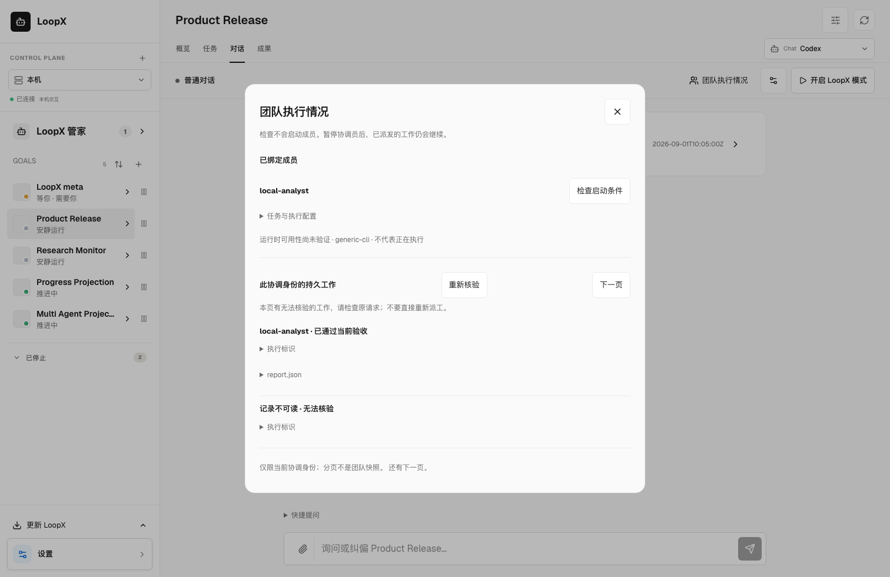
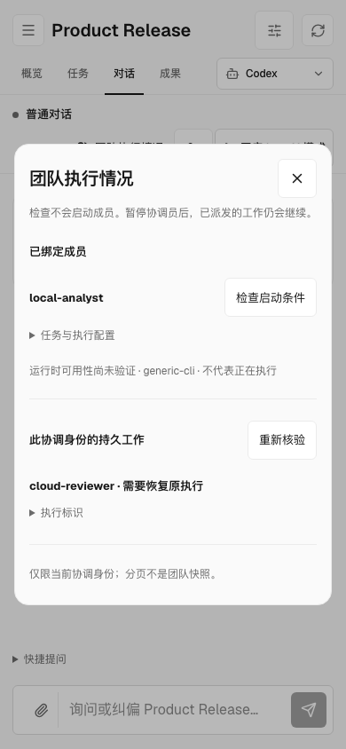

# Continue work in Goal Chat

The existing **Goal → Chat** can be the project coordinator. The local steward
handles cross-Goal intake and owner attention; a project conversation or a
registered peer can coordinate work within one Goal. Both reuse the existing
[delegation service](local-delegation.md), independently governed member Turns
and TS task acceptance. A coordinator role alone grants no execution authority.

## Enable LoopX mode

On a local managed Codex Goal conversation, choose **Enable LoopX** in the
compact bar below the channel header. First use opens **Settings** in a bounded
dialog. Select the registered sender,
its existing delegation configuration under the project's `.loopx/config/`, and
a positive total coordinator token allowance. Save, then enable. Subsequent
activations reuse these settings. The member roster comes from the authorized
bindings; selecting a registered Agent alone cannot launch members.

The coordinator chooses whom to ask, the order of work and how to respond to
rejection. Its host-bound `loopx_collaboration` tool exposes bindings, start,
read, wait, resume and inbox messages. Models cannot select a different sender,
executable, workspace or acceptance rule. The same delegation service supports
an authorized member coordinating further members. Results returned as
`accepted` require current canonical task completion and unchanged artifacts.

In newly tool-equipped conversations, `action=operations` recovers the configured sender's
durable work with the same [paged inventory](local-delegation.md#recover-work-without-remembered-operation-ids)
as CLI/MCP. It includes work started outside this conversation. Follow
`next_cursor`, read the original operations and reconcile unavailable entries
before starting replacements. The recent member chips remain conversation
observations, not the complete inventory. Pausing still fences this tool.
Existing native threads retain their original tool schema when resumed; this
change does not replace an unfinished Goal to add a tool operation. Such a
thread keeps its original read/wait operations; a shell-capable caller can use
the CLI recovery entrypoint independently. Tool-schema upgrade remains a
separate session capability.

After configuring bindings, **Team execution** opens the same durable inventory
for the owner, independently of the native thread's installed tools. Its
on-demand refresh rechecks accepted artifacts, preserves unavailable items and
offers pagination. **Check prerequisites** reads the selected member's actual
Turn/profile and pinned acceptance binding without launching work. An unknown
runtime stays unknown. The panel works while paused and before enabling mode;
it does not add validation to regular snapshot polling. Existing native threads
remain intact. This is local operator readback, not a new dispatch surface.
Close the dialog or press Escape to return focus to its trigger and keep the
conversation's reading position. Team details do not occupy the initial chat.

Synthetic desktop and narrow-screen examples show unverified runtime,
unavailable output and an original execution needing recovery:




The compact bar shows native state and the coordinator controls. Settings and
team inspection disclose accumulated usage and member observations on demand.
**Pause coordinator** stops the coordinator, while already delegated members
continue under their independent deadlines and acceptance rules. **Continue**
resumes the same native Goal and its accumulated usage. **Exit mode** returns to
ordinary conversation; it does not cancel children or settle the canonical Goal.
Ordinary messages after pausing remain ordinary messages.

During execution the message selector offers:

| Mode | Delivery contract |
| --- | --- |
| Next turn (`queue`, default) | Persist now; inject at a subsequent native turn start. It does not interrupt the current turn or promise another turn will occur. |
| Inbox | Persist for the coordinator to read explicitly with `messages`; delivery is not semantic adoption. |
| Steer now | Ask the provider to steer the exact current turn. Rejection remains a failure; it is never downgraded to queue. |

Pending input remains visible after pause or native completion. A lost queue
acknowledgement is `uncertain`, is not automatically replayed, and needs explicit
owner reconciliation. Input is bounded to 12,000 characters and 20 pending
messages; images use the ordinary conversation after pausing.

## Execution and recovery boundaries

- This lead driver requires Codex's experimental app-server `thread/goal/*`
  APIs. It retains the Goal Chat's read-only sandbox and model configuration;
  member execution uses only the configured host bindings. It does not inherit
  the steward's trusted-owner permissions or confer arbitrary shell writes.
- Codex cannot add dynamic tools to a resumed thread. On first explicit enable,
  an idle executor is replaced with a tool-equipped thread, retaining the local
  conversation identity/history and resolved model/effort. An unfinished native
  Goal is never replaced; finish it or explicitly start another conversation.
  Subsequent pauses/recovery retain the exact upgraded upstream thread.
- Duplicate activation ids return the original run; changed requests using the
  same id fail. A second active conversation cannot use the same configured
  sender concurrently. This fence does not acquire or transfer a peer's Todo lease.
- An unfinished native Goal pins its sender and execution file digest. A changed
  or revoked binding fails closed and must be reconciled; increasing the total
  token allowance does not change member authority.
- Native `complete`, `blocked`, `paused`, `budgetLimited` and `usageLimited`
  describe the coordinator host. They do not complete a canonical Goal or the
  coordinator's report Todo. The returned conversation report and accepted
  member tasks remain distinguishable. Token allowance includes prior usage;
  in-flight requests can overshoot it and member usage is accounted separately.
- Browser refresh reconnects to the existing local run. After service loss,
  reconnect restores and pauses the original native thread before resuming.
  The Chat hard timeout remains in force; this is not an unattended daemon.
- To roll back, pause/close the Chat service before installing an older build.
  Disabling mode or deleting a binding does not cancel already admitted children;
  use their own execution/recovery controls and retain their evidence.

The ordinary native command path also remains available without delegation:

```text
/goal start --tokens 100000 Inspect this project's evidence and report verified conclusions here.
/goal status
/goal resume --tokens 200000
```

`start` takes at most 3000 objective characters; `status` does not run the model.
These commands alone do not enable the collaboration tool. Lark, attached
sessions, and other lead drivers do not expose this button or gain equivalent
behavior. Their qualification remains with the
[session RFC](../architecture/rfcs/agent-session-execution-modes-v0.md).
For a disposable mixed-team setup, use the
[synthetic research example](../../examples/managed-research-team/README.md#goal-chat-coordinator).

## 中文使用说明

入口仍是 **Goal → 对话**，在输入框旁点 **开启 LoopX 模式**。首次原地填写
已注册的协调身份、项目 `.loopx/config/` 下的现有成员执行配置、协调员总 token
额度，保存后开启；之后复用设置。注册身份本身不授予启动成员的权限。

模型自主决定分工、先后顺序和拒绝后的处理；宿主固定身份与执行范围，成员
沿用原有 Turn、TS 验收和 canonical Todo 完成链路。有授权的成员也可继续委派。
工具 ACK、模型口头完成、原生 Goal 完成都不能替代成员独立验收。

**暂停**只停协调员，已派发成员继续执行；**恢复推进**沿用原生 Goal 和累计
用量；**退出模式**恢复普通对话。暂停后发普通问题不会再次启用持续推进。
运行中默认消息进入 **下一轮处理**；**放入收件箱**等待模型主动读取；
**立即纠偏**交给当前原生回合，失败不会偷偷变成排队。队列不会强制开启下一轮；
暂停或完成后仍会显示待处理消息。不确定是否已送达的消息不自动重放，需所有者
核对；每条最多 12,000 字符，最多 20 条待处理消息。图片在暂停后用普通对话发送。

首次开启需要为闲置执行器增加工具，因此保留前端会话和历史、模型及推理配置，
升级底层线程；已有未结束的原生 Goal 时拒绝替换。以后恢复都沿用该线程。
服务重启先恢复并暂停原线程；浏览器刷新不会另起运行。运行仍有硬超时，尚非
无人值守 daemon。配置文件在未结束的 Goal 中保持摘要绑定，改变后需先协调处理。

协调员保留只读沙箱，成员权限来自各自执行绑定，不继承管家的扩大权限。
成员通过验收与协调员报告、整个 Goal 验收分别显示；本模式不直接完成报告 Todo
或整个 Goal。额度是含历史用量的总量，正在执行的请求可能超额，成员另行计量。
回滚旧版本前先暂停或关闭 Chat 服务；退出或撤销绑定不自动取消已启动的成员。
此按钮目前限本机 managed Codex Goal 对话，不宣称 Lark、挂接会话或其他主力
驱动等价。可用下方示例准备一次隔离的本地 DSH＋云端 Ark 协作。
