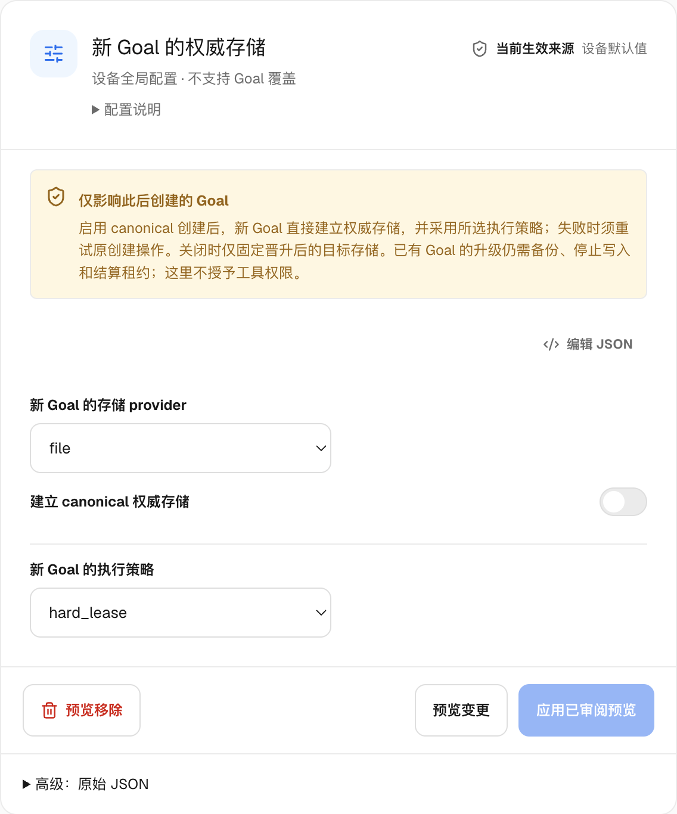
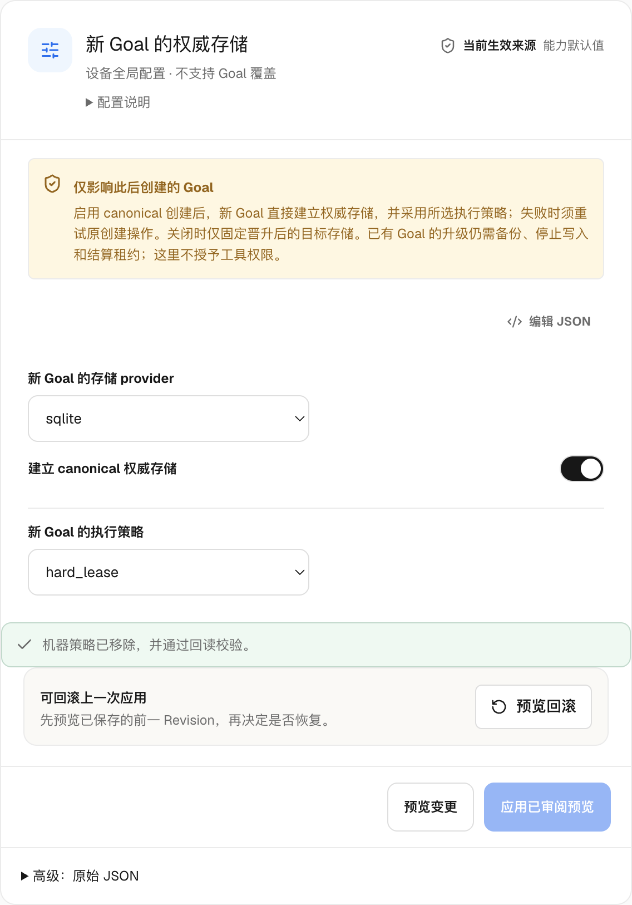

# Local authority provider selection

LoopX now has one typed local-provider boundary for every provider-first
coordination command. When a goal has no selector, the boundary resolves the
`file` profile (`source_authority=file_v0`). This makes File/SQLite provider
semantics the default local contract without silently promoting an existing
Markdown goal or changing its writer fence.

## Selection contract

`openLocalAuthorityStoreHandle(runtime_root, goal_id)` resolves a handle with:

| Field | Meaning |
| --- | --- |
| `store` | The provider-neutral `AuthorityStore` implementation |
| `provider` | `file`, `sqlite`, or `postgresql` |
| `sourceAuthority` | The provider evidence label (`*_v0`) |

An absent selector is the explicit default File profile. A SQLite selector uses
the existing `loopx_local_authority_provider_v0` marker and its database
incarnation. A PostgreSQL selector uses the same marker schema plus a
`tenant_id` and `postgresql:<32 lowercase hex>` store identity.

The PostgreSQL marker contains no URL, credential, or database client. Opening
it requires a service-owned `openPostgresqlStore` factory. The factory receives
only the validated public binding facts and must return a PostgreSQL-labelled
`AuthorityStore` whose identity matches the selector. This is the runtime seam
for the medium-term switchable PostgreSQL profile; it does not ship an
authenticated service or grant an Agent database access.

## Failure and compatibility rules

- A selected provider never falls back to File when its selector, database,
  factory, identity, or metadata is unavailable.
- `source_authority` identifies the selected provider even when opening it
  fails; unresolved or malformed selection reports `null`.
- `decision_read_from_provider` is false for selection/open failures, and
  `legacy_fallback_used` remains false.
- The legacy `openLocalAuthorityStore` function still returns only the store,
  so existing callers remain source-compatible. Runtime entrypoints use one
  shared opening seam and no longer duplicate provider construction.
- Provider identity is observability metadata. It does not decide Todo
  eligibility, claims, leases, receipts, or promotion.

The default profile is a routing decision, not a migration. Existing Markdown
state, writer fences, qualification gates, and explicit File/SQLite promotion
holds remain unchanged. The released SQLite profile remains opt-in until the
shared-authority RFC's D2 evidence and owner approval are complete. PostgreSQL
remains an independent service-provider qualification path.

## Validation

The provider selection matrix is exercised with the production-scale synthetic
coordination fixture. Tests cover the default File handle, SQLite persistence,
selected-provider failure without fallback, PostgreSQL factory identity
fencing, and the factory's rejection of a different provider. File, SQLite,
and PostgreSQL continue to share the provider-neutral transaction conformance
contract; PostgreSQL's real-server qualification remains a separate gate.

See [reviewed promotion and recovery](reviewed-coordination-promotion.md) for the explicit saved-plan CLI journey.

## New Goal authority (machine setting)

**Settings → Capability Center → Device defaults → New Goal authority** selects
File or SQLite independently of the execution policy. In the new-Goal default
candidate, a device without a `goal_storage` namespace creates canonical SQLite
with `hard_lease`; CLI bootstrap and App creation reuse the same configuration
and typed initialization owner. **Create canonical authority** can be disabled
explicitly, or used with File and either `soft_claim` or `hard_lease`. Agents
inherit the Goal policy; this grants no tool, repository,
scheduler, account or network permission and does not migrate existing data.

The candidate changes only unconfigured new creation. Released v0 settings and
v1 with `canonical_creation=false` retain the post-promotion target behavior.
Opening v0 in the guided editor previews a v1 envelope upgrade with creation
still disabled; switching editor modes cannot enable it through the new default.
The CLI continues to accept v0. Existing Goals keep their recorded target,
including its absence, even when device settings change. Invalid configuration
fails before registry publication rather than being treated as an absent setting.
Registry-relative runtime paths are compared by their resolved filesystem
location, so an equivalent spelling cannot masquerade as an authority move.

Save this namespace document as `goal-storage.json`:

```json
{
  "schema_version": "loopx_goal_storage_defaults_v1",
  "new_goal_provider": "sqlite",
  "canonical_creation": true,
  "new_goal_handoff_mode": "hard_lease"
}
```

Preview, apply the exact reviewed revision, then inspect and create:

```sh
loopx machine-config preview --namespace goal_storage --config-json goal-storage.json
loopx machine-config apply --namespace goal_storage --config-json goal-storage.json \
  --expected-plan-revision PLAN_REVISION --execute
loopx machine-config inspect
loopx bootstrap --project ./new-project --goal-id new-project --dry-run
loopx bootstrap --project ./new-project --goal-id new-project
loopx todo list --goal-id new-project
```

Creation reports `storage_selection.authority_initialized=true`, its original
operation and provider receipt, and `legacy_writer_fenced=true`. Complete Todo
reads report canonical `source_authority` and `legacy_fallback_used=false`.
Saving a preference or publishing a registry entry alone is not successful
creation. Run artifacts and independently owned stores do not move.

CLI and App reuse one typed creation owner. The registry atomically freezes the
original operation and target before initialization. The owner verifies the
registered source, complete empty Todo/lease inventory and current bytes under
the existing writer locks. It engages a creation fence, commits the native
projection and original receipt, and durably records completion before success.
Fresh creation has no shadow qualification and never fabricates capture events.
Nonempty or captured sources require reviewed migration.

After interruption, rerun the same CLI bootstrap, or use **Retry original
operation** on the App card. Changed device defaults cannot retarget that
operation. Recovery must match its operation and workspace; a competing creator
cannot adopt it. The original receipt survives later native writes, so replay
cannot erase Todos or repeat their creation. An unavailable selected provider
fails visibly without Markdown fallback. Lost completed authority requires full
backup recovery and cannot be treated as empty creation. Generic forced
bootstrap cannot rebuild a canonically created Goal.

The App also retains the original card after Goal/initial-task commits when
first-Host startup fails or its response is lost. Its recorded Goal, Agent and
initial-task steps stay visible; **Retry original operation** resumes them in
the frozen server workspace, including an ordinary non-Git workspace. Native
File/SQLite Todo operation ids and the existing Session/Turn acceptance owner
prevent duplicate writes or first-Turn submission. A started Turn is read back
from its original Session, not inferred from a creation checkpoint. This
recovery does not certify model execution or Goal completion. A missing original
workspace, conflicting identity or unavailable authority still stops recovery.
Target-only historical creation retains its adapter; it does not gain the
canonical transaction's response-loss guarantee.

首 Host 启动失败或响应丢失时，App 保留原创建卡片，并分别展示已提交的 Goal、
Agent 和首批任务。使用“重试原操作”在冻结的服务端工作区恢复，普通非 Git
工作区同样适用。原生 File/SQLite 复用 Todo 操作身份与既有 Session/Turn
接纳规则；已启动的 Turn 必须从原 Session 读回。创建步骤不代表模型运行或
Goal 验收完成；原工作区、操作身份或 authority 不可用时仍须停止恢复。
历史 target-only 创建保留其适配器，不获得原生事务的响应丢失恢复保证。

<details>
<summary>Settings and recovery views / 设置与恢复界面</summary>

Synthetic workspace data on the candidate's packaged App and installed wheel;
model execution is disabled in this isolated creation/configuration rehearsal.

Released v0 preferences remain target-only when opened in the candidate editor.



Removing that preference restores canonical SQLite/hard-lease defaults, with
native removal readback. It does not migrate the existing Goals.



The existing preview/apply revision gate is unchanged. Unsupported `legacy`
policy is rejected before apply; correct the policy and preview again. No new
layout or responsive navigation is introduced.

</details>

To disable future canonical creation, preview and apply the same v1 document
with `canonical_creation=false`. Removing the preference restores the candidate
SQLite/hard-lease default for future new Goals; removal is **not** opt-out.
To remove the whole preference:

```sh
loopx machine-config remove --namespace goal_storage
loopx machine-config remove --namespace goal_storage \
  --expected-plan-revision PLAN_REVISION --execute
loopx machine-config inspect
```

Use the removal preview's revision. Rollback also affects future creation only;
neither operation switches existing storage, removes its fence or reopens its
old writer. Reconnection and import keep their recorded route. Existing Markdown
Goals use [reviewed promotion and recovery](reviewed-coordination-promotion.md);
already-canonical Goals use the [reviewed File/SQLite cutover](file-authority-state-log.md#reviewed-filesqlite-cutover).
Retain verified backups, stop writers, settle leases and preserve newer writes
on reverse migration. Supported historical backup/format/receipt readers remain.

This implementation candidate does not close full existing-Goal upgrade, D2
sustained qualification or authorize release-default activation. Trial admission and release
default admission remain separate; the existing RFC acceptance is unchanged.

### 新 Goal 的权威存储

在“设置 → 能力中心 → 此设备默认 → 新 Goal 的权威存储”中，分别选择 File/SQLite
和 `soft_claim`/`hard_lease`。候选实现让未配置此命名空间的新 Goal 默认建立
canonical SQLite、使用 `hard_lease`，CLI 与 App 共用配置和类型化创建归属。
旧 v0 或显式关闭状态仍只固定晋升后的目标；表单以关闭状态预览 v1 升级，
切换编辑模式也不会自动启用。CLI 继续接受旧格式，已有 Goal 保留原路径。
Registry 中的相对 runtime 路径按实际文件位置比较；等价路径不会误触发权威迁移检查。
Agent 继承 Goal 策略；此设置不授予工具、仓库、账户或网络权限。

CLI 使用上面的完整 JSON 和 preview/apply/inspect/bootstrap 命令；App 用现有
表单预览、应用并读回。成功须含 `authority_initialized=true`、原创建回执和已
读回的写入 fence；Todo list 须显示 canonical provider。保存偏好或出现 registry
记录本身不算成功，也不代表 Run 等独立存储已经迁移。

失败时重新执行原 bootstrap，或在 App 创建卡上“重试原操作”。目标和身份已固定，
后续默认值不能改写它。旧写入先被 fence；原生提交和回执核对后才持久记录完成。
已有 Todo、租约历史或 capture 的源须走独立审核迁移，不伪造 shadow 资格。完成
后的存储丢失须恢复完整备份，不能重新创建空库；通用 force 不能重建。原回执在
后续写入后仍可读回，重试不得丢失或重复 Todo。

显式设置 `canonical_creation=false` 才关闭之后的新建；remove 删除偏好会恢复候选
SQLite/hard-lease 默认，不能用于关闭。两者均不会迁回已有数据、
删除 fence 或重新开放旧 writer。既有 Goal 升级仍需备份、停止写入、结算租约和
审核计划；反向迁移须保留新增写入。受支持的旧备份、格式和原回执恢复能力保留。
配置损坏明确失败，不视为未配置；候选实现不代表完整升级、D2 长期资格或发布默认已通过。

Prose-only source maintenance compares the exact canonical JSON bytes of the
existing stable partition view. Only the resume evaluation clock is excluded;
boolean and integer facts remain distinct even where Python object equality
would equate them. This uses the same encoding boundary as capture identity,
without granting a prose writer any Todo mutation or provider fallback.

## Retirement boundaries before changing the release default

SQLite adoption and Python retirement need separate evidence. A canonical Goal
can bypass a source writer while supported unmigrated Goals still call it.
Changing the creation default does not migrate those Goals or settle their
capture history. Use the existing [retirement cadence](../architecture/rfcs/ledger/shared-goal-authority-state-provider-v0/2026-09-28-retirement-cadence.md)
to qualify each last caller family independently.

| Retained boundary | Current value and owner | Evidence needed before removal |
| --- | --- | --- |
| `todos.py`, `bootstrap.py`, `todos/line_update.py` | Unmigrated source creation and Todo edits still use Markdown writes. Canonical lifecycle decisions belong to the typed provider transactions. | Migrate the corresponding supported callers; run creation, update and recovery with the old writer physically absent. Keep Markdown display projection and supported import/export. |
| `runtime_shadow_writer_adapter.py`, `local_authority_shadow_outbox.py` | Source writers prepare capture before the primary write and record commit afterward; outbox records preserve interrupted operations. Typed coordination owners interpret the captured mutations. | Stop the corresponding source producers, classify every pending prepared/committed entry against its source and exact receipt, and prove recovery after producer removal. Clearing configuration cannot cancel an active capture obligation. |
| `local_authority_shadow_projection.py` | Python transports full source artifacts, rejects floats and unsafe integers before Python/JS digest comparison, and checks identity, size, digest and regular-file readback. `coordination.source.project` remains the typed projection owner. | Preserve exact-byte and malformed-input behavior in the replacement, including symlink rejection, bounded transfer and ambiguous-operation errors. A language-only rewrite is insufficient. |
| `runtime_shadow.py`, `local_authority_shadow_adapter.py` | Explicit bootstrap, inspect, candidate read, drain and recovery still consume full source snapshots, cursor history and digest comparison. | Qualify the replacement management/recovery entrypoints and supported historical evidence; a canonical write passing does not establish these readers are unused. |
| `authority_core.py` | Live Todo adapters delegate to typed mutation/ownership rules; scope overlap delegates to the typed lease owner. The lease-mode input compatibility contract is explicitly retained. | Trace direct, internal, dynamic and exported callers separately. Review registered historical input support before retiring its vocabulary; do not infer a fresh grant from old `legacy` inputs. |

Paths in the table are under `loopx/` or its `control_plane/coordination/` and
`control_plane/todos/` subdirectories. Keep host locking, atomic replacement,
process cleanup, private validation declarations and supported backup/original
receipt readers where they still serve real callers. Their I/O or recovery
value is distinct from a duplicated decision owner.

For each proposed deletion, record the supported caller, replacement owner,
persisted obligations and rollback. Search references and exports, then exercise
the real CLI and installed package in a disposable runtime with the retired
path absent. Include interrupted writes, restart/replay, malformed evidence and
unavailable selected-provider cases. The provider must fail visibly without
falling back to a Markdown writer. Keep historical recovery coverage; reverse
cutover must retain writes made after the original migration.

Useful existing regressions include `test_source_projection.py`,
`test_source_transfer.py`, `test_local_authority_shadow_outbox.py`,
`test_runtime_shadow_bounded_e2e.py`, `test_shadow_writer_boundaries.py` and
`test_shadow_cursor_recovery_e2e.py` under `tests/control_plane/`. Transport
fault tests use injected faults; source/recovery tests also run real CLI/native
writers against disposable File stores. These are bounded regression evidence,
not sustained SQLite, PostgreSQL, packaged App or release-default qualification.

### Proposed compatibility cutoff and release sequence

**Proposal, not installed behavior or a release announcement.** The current
implementation still accepts target-only v0 settings, explicit
`canonical_creation=false`, and normal writes to unpromoted Markdown Goals.
Retiring that supported write path is an incompatible change; target a **2.0**
release rather than silently removing it in a compatible 1.x update. This
follows [Semantic Versioning's compatibility distinction](https://semver.org/).
The implementation and release decision remain subject to the existing
[shared-authority RFC](../architecture/rfcs/shared-goal-authority-state-provider-v0.md)
and [retirement cadence](../architecture/rfcs/ledger/shared-goal-authority-state-provider-v0/2026-09-28-retirement-cadence.md).

The proposed cutoff is **canonical authority before normal mutation**, not
SQLite for every Goal and not removal of every Python module:

| Existing state | Proposed major-release behavior |
| --- | --- |
| Unpromoted Markdown authority | Retain inspection and explicit upgrade/recovery; reject normal mutation before any write or new execution grant, with an actionable supported migration route. Do not silently initialize an empty canonical store. |
| Canonical File or SQLite | Keep the recorded provider and either supported `soft_claim` or `hard_lease` policy. New unconfigured Goals default to SQLite; existing File Goals do not have to switch. Missing providers remain errors. |
| Canonical store with `legacy` ownership policy | Review a claim-preserving policy migration to `soft_claim` or `hard_lease` before normal execution. Changing policy does not require promoting the store again or switching its provider. |
| Target-only v0 or v1 creation disabled | Keep decoding for inspection and reviewed configuration upgrade. Require an explicit compatible creation choice before creating a writable Goal; do not erase the preference or reinterpret disabled as enabled. |
| Historical ownership inputs, source captures and backups | Recognize them in declared migration/recovery contracts. Historical leases, receipts and a restored source do not grant new execution authority. Preserve supported original-operation recovery and permanent Markdown display. |

There is a concrete prerequisite for the unpromoted cohort: today's reviewed
promotion requires an enabled, bootstrapped shadow qualified by **real source
mutations**, with the saved operation/event policy. An empty shadow cannot pass.
If the major release first blocks the writer that produces those mutations, a
cold Goal cannot manufacture its own migration qualification. The selected
upgrade path is a separately qualified **reviewed import of the existing
source**, without requiring a compatible 1.x writer to create new captures.
Do not lower operation counts, fabricate capture history or bypass source and
receipt verification to hide this dependency. A direct importer is a remaining
acceptance item, not a capability established by canonical create or isolated
archive restore. Keep the compatible installer available for recovery until
the declared historical support matrix has been qualified.

The import package must close one installed user journey through the existing
typed coordination owner and Goal storage settings, shared by CLI and App:

- Inventory and back up the complete supported source: active and archived
  Todos, metadata, identities, ownership facts, captures and original receipts.
  Reject unsupported or ambiguous source content explicitly; never omit it or
  equate an empty target with successful import.
- Source lease JSON inventory is fail-closed: unsupported record names,
  non-regular files and linked source subtrees refuse observation/revalidation.
  Exact byte witnesses include retained orphan records; those records do not
  become live leases. Non-record host lock files remain outside that inventory.
  This existing source-admission repair does not qualify the complete importer.
- Stop source writers and affected Hosts, settle active leases and reconcile
  prepared/committed outbox entries against source bytes and original receipts.
  Preserve history without converting old leases or receipts into new grants.
- Preview an immutable source/target-bound plan, then require explicit confirm.
  Detect source drift before publishing; fence the old writer before accepting
  canonical mutation. A cold source is qualified by the import's own checks,
  without inventing source mutation history.
- Recover the same operation after interruption, lost response or restart.
  Read back complete imported state and the new import receipt separately from
  original receipts; retries must neither duplicate effects nor erase later
  canonical writes. Test both File and SQLite with a physically absent old
  normal writer, including provider failure and stale-plan refusal.

This imports an unpromoted Goal into canonical authority. It is distinct from
File/SQLite provider cutover of an already-canonical Goal and from isolated
archive restore into a new identity. Do not substitute either journey's
acceptance for this one. Once this route qualifies, an old Goal's next normal
write requires reviewed import; installing the binary alone does not migrate it.

The CLI stage uses the typed `coordination.cold_source.import` transaction
(`loopx_cold_source_import_request_v0`). First stop affected writers through
their owning Host and verify that their processes have exited. Inspect each
retained task lease and release it through `task-lease release`, using its
original owner/key and current `--expected-version`. An expired lease is still
unsettled; stopping a process does not release its lease. Dispose of pending
capture/outbox through its owning workflow before preparing this import.
Then execute `backup-state` with the source state, registry, coordination
evidence and runtime root. Lease release after a saved preview changes its
source: make a fresh backup and reviewed preview. `--writers-stopped` records
an operator attestation, not an automatic process stop. For example, after
shutdown and settlement, from the registered project:

```bash
loopx --format json backup-state --project . --execute --no-automations --no-skills
loopx --format json coordination-shadow prepare-import --goal-id GOAL --operation-id IMPORT \
  --backup-manifest SAVED-MANIFEST.json --provider sqlite --target-handoff-mode hard_lease
# Inspect the immutable plan at plan_path. Confirm using its exact plan_sha256.
loopx --format json coordination-shadow apply-import --goal-id GOAL --operation-id IMPORT \
  --plan-sha256 SAVED-SHA256 --writers-stopped --execute
# After interruption, use the original operation and digest; do not prepare a new source.
loopx --format json coordination-shadow recover-import --goal-id GOAL --operation-id IMPORT \
  --plan-sha256 SAVED-SHA256 --execute
```

Prepare reads complete active and archived Todo records and preserves metadata,
original evidence and settled lease history. The trusted Python tar adapter
reads actual archive members, including older backups without a member list;
the TypeScript owner verifies coverage of the coordination source bytes and
pins both saved artifacts. A missing source path in the backup refuses import.
Prepare may select an empty target and persist its identity and immutable plan,
but does not fence the writer, import state or grant execution authority.

Apply rechecks the original source and backup under the owning locks before
engaging `loopx_cold_source_import_writer_fence_v0`. Missing identity, changed
source, unsettled leases (including expired active or orphan records) and
unresolved capture/outbox fail closed. Recovery requires that original fence,
accepts no replacement source snapshot, and reads the original receipt without
overwriting later canonical writes. Source bytes remain retained history; the
import writes a separate new receipt. Recovery is not a provider rollback or a
whole-Goal restore, and replacing the binary cannot clear the writer fence.

`coordination_source_backup_verified=true` qualifies the prepared coordination
source witness only. `complete_goal_backup_verified=false` preserves the full
backup and original-history recovery acceptance. The packaged Goal storage
settings use the same transaction for cold import:

1. Select the Goal and open **Goal settings → Task ownership → Data storage**.
   Choose File or SQLite and an explicit supported execution policy.
2. Stop affected writers/Hosts, verify their exit and settle/dispose of refused
   work through its owning workflow. The preview refuses unsettled leases,
   including expired active records; a checkbox cannot bypass this refusal.
3. **Back up and preview import** creates a private local archive using the
   existing backup owner, then displays the complete active/archive inventory.
   Preview does not import, stop a Host, settle leases or grant execution.
   Confirm **Import reviewed Markdown source**. Apply
   rechecks the bound original source and backup; a changed source needs a new
   reviewed preview.
4. After a lost response or reload, **Read original preview and current storage**
   observes the saved operation and current store independently. Reload never
   completes an unfinished import. Confirm again to retry the original operation;
   do not discard its carrier while the commit is ambiguous.

Only Goal/operation/digest identifiers survive in browser storage. Full plans,
source bytes and backup paths stay local to the server. Completed receipt
readback neither overwrites later writes nor reselects a provider.
The operator-led POSIX stop path is exercised with actual owned Host processes
and native unpromoted-source leases on File/SQLite: import refuses while the
Host runs and after it exits with an active lease; native release permits
cutover. The imported released lease retains its identity and history, and a
restart using the old grant is rejected before the actual Host launches.
This does not qualify automatic Host discovery/stop, pending outbox disposition,
live model sessions or full-history restore. The
cold-import CLI reuses the selected command dispatcher and
the existing Goal path resolver; its File/SQLite import and original-receipt
recovery run with `todos.py`, `bootstrap.py`, `runtime_shadow_writer_adapter.py`
and `local_authority_shadow_outbox.py` physically absent in a disposable package.
This proves that command's independence, not that other commands or supported
writers can lose those files. The retained prose-write guard now belongs to the
existing source/fence boundary and shares the source partition projector with
capture. Its old import remains compatible. Configuration and the guard load
with both capture modules absent. Pure runtime-root routing now belongs to
`paths.effective_runtime_root`; canonical Todo, terminal lifecycle, acceptance,
Chat and CLI callers import that owner directly. The old adapter reexports the
same function for supported capture callers. Source and fresh-wheel File/SQLite
HTTP import, process restart, original-operation recovery, later writes and
canonical prose checks use the same oracle with both capture modules present
and physically absent. Project-relative routes, explicit override precedence,
source identity, maintenance, Todo/handoff, JSON type and failed-write protections
remain intact. Pending historical outbox disposition and independent complete
Goal recovery still need their original acceptance. This stage does not qualify
supported old-writer retirement,
release default or historical support cutoff.

Deliver complete, reversible PR packages in this order:

1. **Direct source import and support boundary.** Implement and qualify the
   reviewed cold-source import on the installed CLI and packaged App, alongside
   existing new-Goal creation/retry and provider migration. Cover both
   qualified and cold unpromoted sources, target-only settings, stopped writers,
   active/expired leases, pending captures, missing providers and original-plan
   recovery. Publish the selected major-release support contract before removing
   its writer. An additive 1.x release may ship the importer and deprecation
   guidance first; using the old writer is not a prerequisite for import.
   New SQLite creation is already implemented.
2. **Normal writer family cutoff.** In the major-release implementation, enforce
   that boundary through the existing typed admission owner and remove the
   corresponding Markdown create/update/claim/complete/supersede/archive paths
   together with their private dispatch and writer-only tests. Trace CLI,
   internal, dynamic and supported import callers; keep shared rendering,
   validation effects and migration/recovery readers. Run the real wheel and
   packaged user journey with the retired paths physically absent, including
   refusal and recovery for an unmigrated Goal. Do not land the breaking package
   into an otherwise compatible 1.x release line.
3. **Capture producer and duplicate decision retirement.** After the writer
   family exits, remove only producers and bridges without supported callers.
   Reconcile each prepared/committed outbox entry against source bytes and its
   original receipt first. Retain the codecs/readers needed by supported old
   backups and interrupted migrations. Prove restart/replay and forward recovery
   without recreating a business write or losing a later canonical write.

Publish 2.0 beta, then rc and final only as these user journeys qualify for the
declared support matrix. Do not wait for every external Goal to have migrated;
each affected user must have a tested route before its next normal write.
Software installation, authority-format upgrade, provider migration and
ownership-policy migration remain distinct operations. Binary updates do not
automatically switch authority. Reverse File/SQLite cutover starts from the
current head and retains all acknowledged post-migration writes.

Data loss, duplicate effects, identity errors and incorrect settlement remain
hard stops. Record representative usability/cost evidence separately from frozen
D2 capacity/soak qualification; missing or failed D2 evidence stays visible.
A microbenchmark failure alone does not block an unrelated, proven internal
deletion, and passing those deletions does not certify the release default.

### 切换发布默认前的退役边界

canonical 写入绕过旧 writer，不代表未迁移 Goal 的调用方已消失。默认值修改也不
迁移已有 Goal 或结算 capture 历史。按调用族分别验收，不把整项迁移设成所有小批
退役的前置依赖；仍有调用的 writer/producer 在对应迁移后删，已无调用的内部桥接
可先删，受支持的备份、格式、原回执恢复与 Markdown 展示继续保留。

上表中的精确数字与摘要校验、安全文件传输、prepare→主写入→commit 顺序、游标
恢复和 Host I/O 都有实际价值。替代实现须保留它们；Python 行数减少不能代替语义
验收。静态引用、内部调用、动态入口、导出兼容与安装态要分别核验。删除前在隔离
环境中让旧路径实际不存在，验证创建、修改、中断、重启、原操作重放及 provider
不可用时明确失败；不降级到 Markdown writer，不破坏历史恢复，回退保留迁移后的
新写入。现有回归覆盖不等于长期 SQLite、真实 PostgreSQL、打包 App 或发布默认
已通过，trial 与正式默认的资格继续分别记录。

**发布路径提案：**当前仍支持未晋升 Markdown Goal 的正常写入、v0 target-only
和显式关闭 canonical creation；删除这条支持路径属于不兼容变更，建议在 **2.0**
统一截止，不混入兼容 1.x 更新。要求是“正常写入前必须有 canonical authority”，
不是所有 Goal 强制 SQLite。已有 canonical File/SQLite 和明确的两种 ownership
policy 保持；已有 canonical store 若仍用 `legacy` policy，只需审核保留 claim 的
policy 迁移，不重新晋升或强制换 provider。关闭/旧配置先明确审核升级，不删偏好
或暗中启用。旧备份、格式、原回执和永久 Markdown 投影继续按其恢复契约支持。

一个必须解决的死结是：当前晋升需要真实源写入形成合格 capture；冷启动、未资格化
的旧 Goal 若先被禁止写入，就无法再产生迁移资格。选定主路径是独立验收的
**旧源审核导入**，无需先在兼容 1.x writer 上新增 capture；不能降低计数、伪造
capture 或把空库创建/isolated restore 当作此验收。先完整盘点和备份源，停止
writer/Host、结算 lease 并逐项对账 outbox，再预览、明确确认、fence 旧 writer、
导入并读回。未支持或歧义内容明确拒绝，旧 lease/回执不转为新授权；导入新回执
与历史原回执分别保存。中断、失响应、重启须恢复同一操作，不重复副作用、不丢
后续 canonical 新写入。此旅程与既有 canonical File/SQLite 切换及新身份 archive
restore 分别验收；实现尚未完成。历史支持矩阵验收前保留兼容安装包用于恢复。

按上面的三个完整 PR 包推进：安装态 CLI/App 直接导入与支持边界 → 同边界
create/update/claim/complete/supersede/archive 旧 writer 及私有 dispatch 删除 →
逐项对账 outbox 后删除无调用的 capture producer/重复决策。大版本实现须有原生
拒绝与恢复、旧路径物理缺席的真实入口验证；不要求所有外部用户已迁移。2.0
beta→rc→final 依据明确支持矩阵的旅程验收，不将原失败/缺失 D2 改成通过，也不把
独立微基准当所有内部退役的前置。二进制更新不自动切 authority，反向切换须保留
当前 head 的新增写入。版本和截止仍是提案，尚未改变安装行为或宣布发布。

## Existing canonical Goal storage in the App

Open a Goal’s settings → Task ownership → **Goal data storage**. This control
uses the same typed local-provider migration, archive and publication owner as
`authority-archive plan-migration/migrate`; it changes neither new-Goal defaults
nor ownership policy. Previous Markdown Goals must first use reviewed promotion.
PostgreSQL cutover is outside this local File/SQLite operation.

1. Stop writers and settle active leases, including expired active leases. An
   active capture blocks preview/apply even when its outbox currently looks
   empty. Finish the existing capture rollback/recovery; do not delete its queue.
2. Read current storage, select File or SQLite and preview. The immutable plan
   pins the source identity, revision, cursor, projection and writer fence.
3. Confirm the reviewed operation. Apply verifies the full backup and target
   history before publishing and independently reading the selected provider.
4. After a lost response or server restart, **recover the original preview**.
   The browser retains only its opaque handle and digest. Recovery reports the
   original prepared/completed record separately from today’s source; it never
   replays a superseded operation or changes the provider. Retry that same plan
   to resolve an interrupted publication. A stale source needs a fresh preview.
5. To return to File, preview a new migration from the **current SQLite head**.
   This retains writes made after the first migration. Restoring the original
   backup alone would discard those writes and is not a reverse cutover.

HTTP accepts registered Goal and opaque preview/digest bindings, never caller
paths, source overrides or complete state. Its current-source/recovery reads are
observations, not execution grants or whole-Goal backups. Configuration remains
unchanged until explicit apply. Real File/SQLite HTTP and packaged-App recovery
validation does not qualify sustained D2, release defaults, a stopped external
Host or all historical-source upgrade paths.

### 既有 canonical Goal 的 App 存储切换

进入 Goal 设置 → 任务所有权 → **Goal 数据存储**。新 Goal 默认值、任务所有权
策略与此处的既有存储切换分别管理，复用同一 TS migration/archive/provider owner。
旧 Markdown Goal 先走有备份的审核晋升；这里不提供 PostgreSQL 切换。

先停止写入方并结算 active lease，过期不证明 Host 已停。active capture 即使暂时
空队列也拒绝切换；按原生 rollback/recovery 处理，不能删队列。读回当前来源、
选择 File/SQLite、预览并明确确认后才备份和发布。来源变化拒绝应用。

丢失响应或重启后恢复同一 opaque 预览与摘要。历史 completed 回执与当前来源
分开读回，旧操作被后续切换替代后不会重新激活。中断操作重试原计划；源变更才
审核新计划。回退 File 必须从当前 SQLite head 新建计划，保留升级后的新增写入，
不能直接恢复旧备份替换当前数据。本入口不授予执行权限或迁移所有 Goal；D2、
发布默认、完整旧源/Host 恢复继续按原验收分别资格化。
