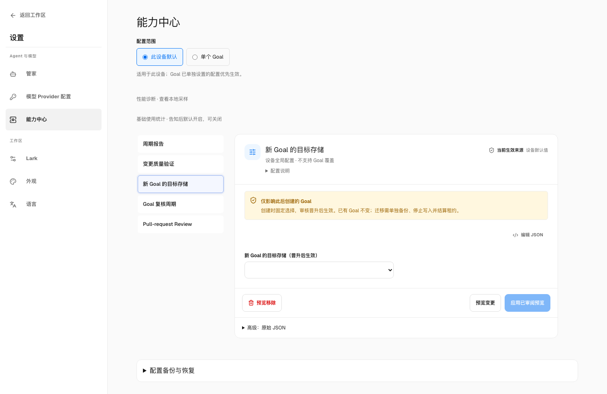
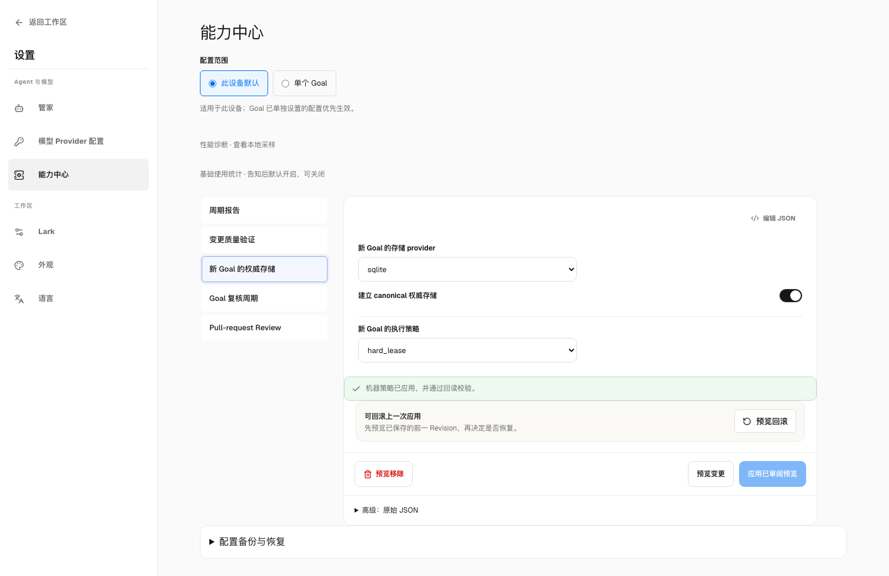
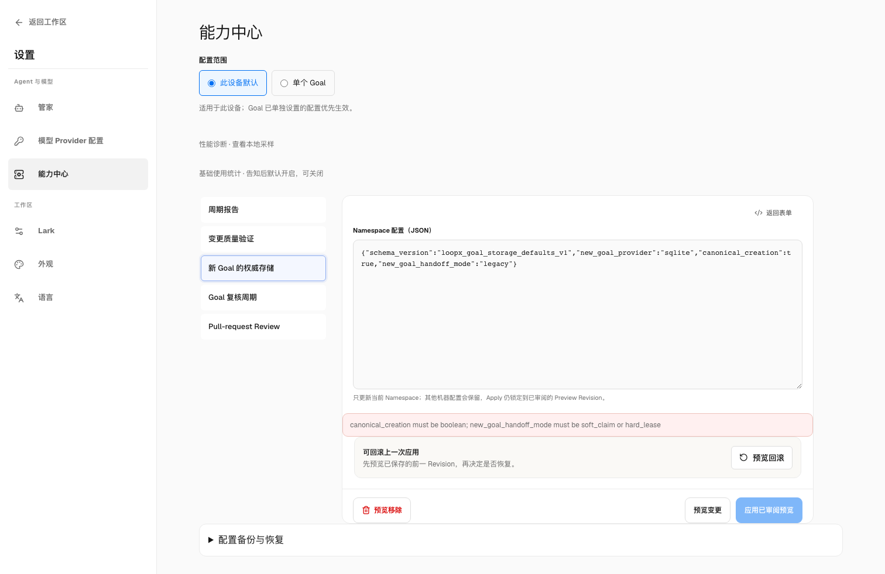
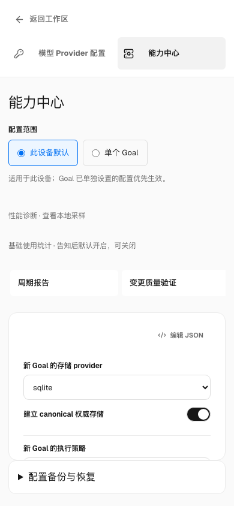

# Local authority provider selection

LoopX now has one typed local-provider boundary for every provider-first
coordination command. When a goal has no selector, the boundary resolves the
`file` profile (`source_authority=file_v0`). This makes File/SQLite provider
semantics the default local contract without silently promoting an existing
Markdown goal or changing its writer fence.

## Selection contract

`openLocalAuthorityStoreHandle(runtime_root, goal_id)` resolves a handle with:

| Field | Meaning |
| --- | --- |
| `store` | The provider-neutral `AuthorityStore` implementation |
| `provider` | `file`, `sqlite`, or `postgresql` |
| `sourceAuthority` | The provider evidence label (`*_v0`) |

An absent selector is the explicit default File profile. A SQLite selector uses
the existing `loopx_local_authority_provider_v0` marker and its database
incarnation. A PostgreSQL selector uses the same marker schema plus a
`tenant_id` and `postgresql:<32 lowercase hex>` store identity.

The PostgreSQL marker contains no URL, credential, or database client. Opening
it requires a service-owned `openPostgresqlStore` factory. The factory receives
only the validated public binding facts and must return a PostgreSQL-labelled
`AuthorityStore` whose identity matches the selector. This is the runtime seam
for the medium-term switchable PostgreSQL profile; it does not ship an
authenticated service or grant an Agent database access.

## Failure and compatibility rules

- A selected provider never falls back to File when its selector, database,
  factory, identity, or metadata is unavailable.
- `source_authority` identifies the selected provider even when opening it
  fails; unresolved or malformed selection reports `null`.
- `decision_read_from_provider` is false for selection/open failures, and
  `legacy_fallback_used` remains false.
- The legacy `openLocalAuthorityStore` function still returns only the store,
  so existing callers remain source-compatible. Runtime entrypoints use one
  shared opening seam and no longer duplicate provider construction.
- Provider identity is observability metadata. It does not decide Todo
  eligibility, claims, leases, receipts, or promotion.

The default profile is a routing decision, not a migration. Existing Markdown
state, writer fences, qualification gates, and explicit File/SQLite promotion
holds remain unchanged. SQLite stays an opt-in qualified candidate until the
shared-authority RFC's D2 evidence and owner approval are complete. PostgreSQL
remains an independent service-provider qualification path.

## Validation

The provider selection matrix is exercised with the production-scale synthetic
coordination fixture. Tests cover the default File handle, SQLite persistence,
selected-provider failure without fallback, PostgreSQL factory identity
fencing, and the factory's rejection of a different provider. File, SQLite,
and PostgreSQL continue to share the provider-neutral transaction conformance
contract; PostgreSQL's real-server qualification remains a separate gate.

See [reviewed promotion and recovery](reviewed-coordination-promotion.md) for the explicit saved-plan CLI journey.

## New Goal authority (machine setting)

**Settings → Capability Center → Device defaults → New Goal authority** selects
File or SQLite independently of the execution policy. Enable **Create canonical
authority** to initialize future empty Goals directly with `soft_claim` or
`hard_lease`. Agents inherit the Goal policy; this grants no tool, repository,
scheduler, account or network permission and does not migrate existing data.

Canonical creation is default-off. An absent namespace, the released v0 shape,
or v1 with `canonical_creation=false` retains the post-promotion target behavior.
Opening v0 in the guided editor previews a v1 envelope upgrade with creation
still disabled. The CLI continues to accept v0.

Save this namespace document as `goal-storage.json`:

```json
{
  "schema_version": "loopx_goal_storage_defaults_v1",
  "new_goal_provider": "sqlite",
  "canonical_creation": true,
  "new_goal_handoff_mode": "hard_lease"
}
```

Preview, apply the exact reviewed revision, then inspect and create:

```sh
loopx machine-config preview --namespace goal_storage --config-json goal-storage.json
loopx machine-config apply --namespace goal_storage --config-json goal-storage.json \
  --expected-plan-revision PLAN_REVISION --execute
loopx machine-config inspect
loopx bootstrap --project ./new-project --goal-id new-project --dry-run
loopx bootstrap --project ./new-project --goal-id new-project
loopx todo list --goal-id new-project
```

Creation reports `storage_selection.authority_initialized=true`, its original
operation and provider receipt, and `legacy_writer_fenced=true`. Complete Todo
reads report canonical `source_authority` and `legacy_fallback_used=false`.
Saving a preference or publishing a registry entry alone is not successful
creation. Run artifacts and independently owned stores do not move.

CLI and App reuse one typed creation owner. The registry atomically freezes the
original operation and target before initialization. The owner verifies the
registered source, complete empty Todo/lease inventory and current bytes under
the existing writer locks. It engages a creation fence, commits the native
projection and original receipt, and durably records completion before success.
Fresh creation has no shadow qualification and never fabricates capture events.
Nonempty or captured sources require reviewed migration.

After interruption, rerun the same CLI bootstrap, or use **Retry original
operation** on the App card. Changed device defaults cannot retarget that
operation. Recovery must match its operation and workspace; a competing creator
cannot adopt it. The original receipt survives later native writes, so replay
cannot erase Todos or repeat their creation. An unavailable selected provider
fails visibly without Markdown fallback. Lost completed authority requires full
backup recovery and cannot be treated as empty creation. Generic forced
bootstrap cannot rebuild an opted-in Goal.

<details>
<summary>Settings and recovery views / 设置与恢复界面</summary>

Synthetic workspace data; the settings use a real isolated backend. The first
view is the released v0 editor; the remaining views show the proposed v1 path.

Before: the provider setting only chooses the post-promotion target.



After: provider, explicit canonical opt-in and execution policy, with applied
configuration readback.



An unsupported `legacy` policy is rejected before apply; the previous valid
configuration remains. Correcting the policy allows preview and apply again.



The same device settings at a narrow viewport:



</details>

To disable future canonical creation, preview and apply the same v1 document
with `canonical_creation=false`. To remove the whole preference:

```sh
loopx machine-config remove --namespace goal_storage
loopx machine-config remove --namespace goal_storage \
  --expected-plan-revision PLAN_REVISION --execute
loopx machine-config inspect
```

Use the removal preview's revision. Rollback also affects future creation only;
neither operation switches existing storage, removes its fence or reopens its
old writer. Reconnection and import keep their recorded route. Existing Markdown
Goals use [reviewed promotion and recovery](reviewed-coordination-promotion.md);
already-canonical Goals use the [reviewed File/SQLite cutover](file-authority-state-log.md#reviewed-filesqlite-cutover).
Retain verified backups, stop writers, settle leases and preserve newer writes
on reverse migration. Supported historical backup/format/receipt readers remain.

This opt-in path does not close full existing-Goal upgrade, D2 sustained
qualification or the release-default decision. Trial admission and release
default admission remain separate; the existing RFC acceptance is unchanged.

### 新 Goal 的权威存储

在“设置 → 能力中心 → 此设备默认 → 新 Goal 的权威存储”中，分别选择 File/SQLite
和 `soft_claim`/`hard_lease`，并显式启用 canonical 创建。默认关闭；旧 v0 或关闭
状态仍只固定晋升后的目标。表单以关闭状态预览 v1 升级，CLI 继续接受旧格式。
Agent 继承 Goal 策略；此设置不授予工具、仓库、账户或网络权限。

CLI 使用上面的完整 JSON 和 preview/apply/inspect/bootstrap 命令；App 用现有
表单预览、应用并读回。成功须含 `authority_initialized=true`、原创建回执和已
读回的写入 fence；Todo list 须显示 canonical provider。保存偏好或出现 registry
记录本身不算成功，也不代表 Run 等独立存储已经迁移。

失败时重新执行原 bootstrap，或在 App 创建卡上“重试原操作”。目标和身份已固定，
后续默认值不能改写它。旧写入先被 fence；原生提交和回执核对后才持久记录完成。
已有 Todo、租约历史或 capture 的源须走独立审核迁移，不伪造 shadow 资格。完成
后的存储丢失须恢复完整备份，不能重新创建空库；通用 force 不能重建。原回执在
后续写入后仍可读回，重试不得丢失或重复 Todo。

关闭或按上面的 remove 预览/执行命令删除偏好，只影响之后新建；不会迁回已有数据、
删除 fence 或重新开放旧 writer。既有 Goal 升级仍需备份、停止写入、结算租约和
审核计划；反向迁移须保留新增写入。受支持的旧备份、格式和原回执恢复能力保留。
此路径不代表完整升级、D2 长期资格或发布默认已通过。

## Retirement boundaries before changing the release default

SQLite adoption and Python retirement need separate evidence. A canonical Goal
can bypass a source writer while supported unmigrated Goals still call it.
Changing the creation default does not migrate those Goals or settle their
capture history. Use the existing [retirement cadence](../architecture/rfcs/ledger/shared-goal-authority-state-provider-v0/2026-09-28-retirement-cadence.md)
to qualify each last caller family independently.

| Retained boundary | Current value and owner | Evidence needed before removal |
| --- | --- | --- |
| `todos.py`, `bootstrap.py`, `todos/line_update.py` | Unmigrated source creation and Todo edits still use Markdown writes. Canonical lifecycle decisions belong to the typed provider transactions. | Migrate the corresponding supported callers; run creation, update and recovery with the old writer physically absent. Keep Markdown display projection and supported import/export. |
| `runtime_shadow_writer_adapter.py`, `local_authority_shadow_outbox.py` | Source writers prepare capture before the primary write and record commit afterward; outbox records preserve interrupted operations. Typed coordination owners interpret the captured mutations. | Stop the corresponding source producers, classify every pending prepared/committed entry against its source and exact receipt, and prove recovery after producer removal. Clearing configuration cannot cancel an active capture obligation. |
| `local_authority_shadow_projection.py` | Python transports full source artifacts, rejects floats and unsafe integers before Python/JS digest comparison, and checks identity, size, digest and regular-file readback. `coordination.source.project` remains the typed projection owner. | Preserve exact-byte and malformed-input behavior in the replacement, including symlink rejection, bounded transfer and ambiguous-operation errors. A language-only rewrite is insufficient. |
| `runtime_shadow.py`, `local_authority_shadow_adapter.py` | Explicit bootstrap, inspect, candidate read, drain and recovery still consume full source snapshots, cursor history and digest comparison. | Qualify the replacement management/recovery entrypoints and supported historical evidence; a canonical write passing does not establish these readers are unused. |
| `authority_core.py` | Live Todo adapters delegate to typed mutation/ownership rules; scope overlap delegates to the typed lease owner. The lease-mode input compatibility contract is explicitly retained. | Trace direct, internal, dynamic and exported callers separately. Review registered historical input support before retiring its vocabulary; do not infer a fresh grant from old `legacy` inputs. |

Paths in the table are under `loopx/` or its `control_plane/coordination/` and
`control_plane/todos/` subdirectories. Keep host locking, atomic replacement,
process cleanup, private validation declarations and supported backup/original
receipt readers where they still serve real callers. Their I/O or recovery
value is distinct from a duplicated decision owner.

For each proposed deletion, record the supported caller, replacement owner,
persisted obligations and rollback. Search references and exports, then exercise
the real CLI and installed package in a disposable runtime with the retired
path absent. Include interrupted writes, restart/replay, malformed evidence and
unavailable selected-provider cases. The provider must fail visibly without
falling back to a Markdown writer. Keep historical recovery coverage; reverse
cutover must retain writes made after the original migration.

Useful existing regressions include `test_source_projection.py`,
`test_source_transfer.py`, `test_local_authority_shadow_outbox.py`,
`test_runtime_shadow_bounded_e2e.py`, `test_shadow_writer_boundaries.py` and
`test_shadow_cursor_recovery_e2e.py` under `tests/control_plane/`. Transport
fault tests use injected faults; source/recovery tests also run real CLI/native
writers against disposable File stores. These are bounded regression evidence,
not sustained SQLite, PostgreSQL, packaged App or release-default qualification.

### 切换发布默认前的退役边界

canonical 写入绕过旧 writer，不代表未迁移 Goal 的调用方已消失。默认值修改也不
迁移已有 Goal 或结算 capture 历史。按调用族分别验收，不把整项迁移设成所有小批
退役的前置依赖；仍有调用的 writer/producer 在对应迁移后删，已无调用的内部桥接
可先删，受支持的备份、格式、原回执恢复与 Markdown 展示继续保留。

上表中的精确数字与摘要校验、安全文件传输、prepare→主写入→commit 顺序、游标
恢复和 Host I/O 都有实际价值。替代实现须保留它们；Python 行数减少不能代替语义
验收。静态引用、内部调用、动态入口、导出兼容与安装态要分别核验。删除前在隔离
环境中让旧路径实际不存在，验证创建、修改、中断、重启、原操作重放及 provider
不可用时明确失败；不降级到 Markdown writer，不破坏历史恢复，回退保留迁移后的
新写入。现有回归覆盖不等于长期 SQLite、真实 PostgreSQL、打包 App 或发布默认
已通过，trial 与正式默认的资格继续分别记录。
