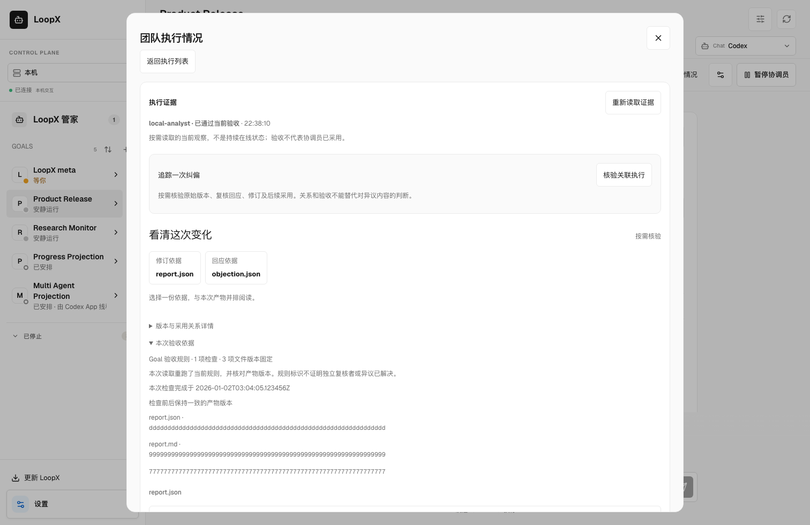
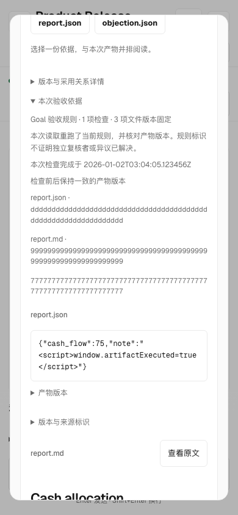
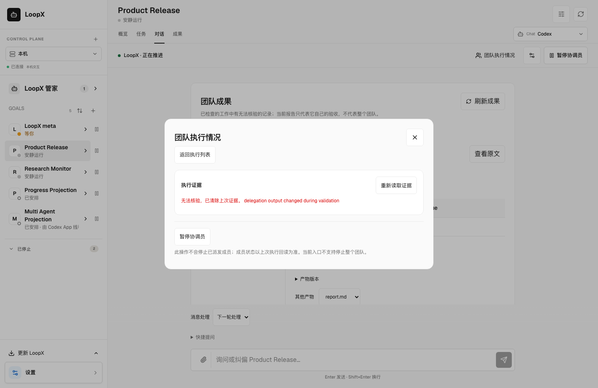
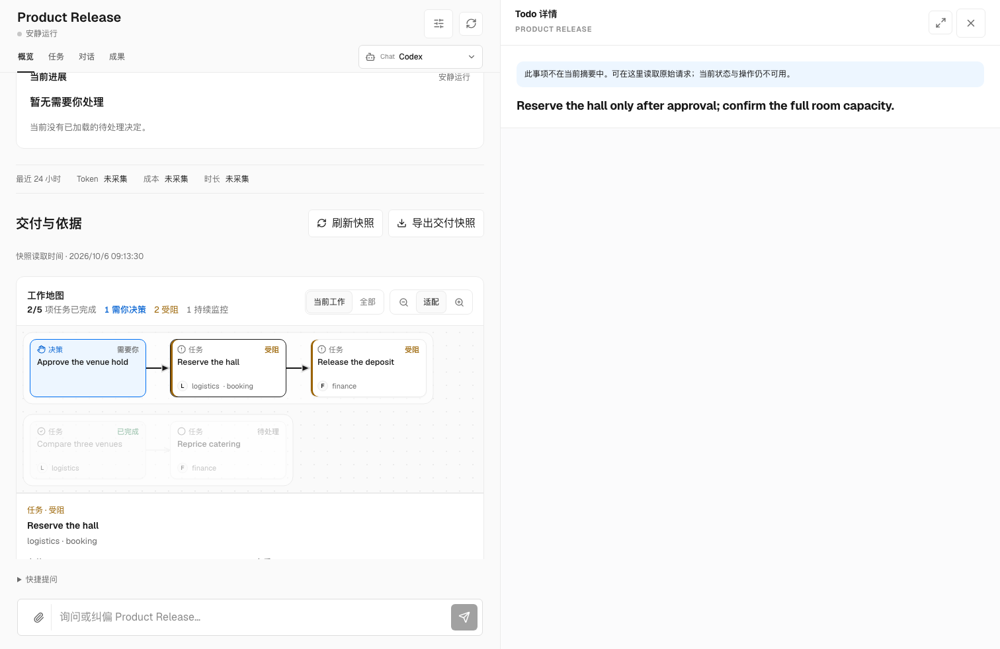
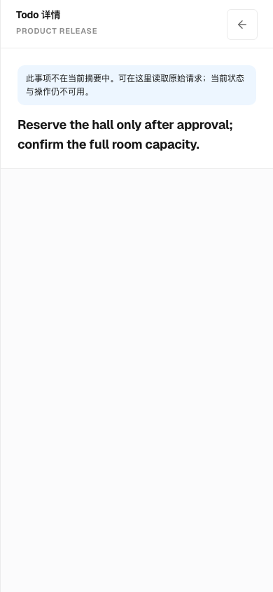
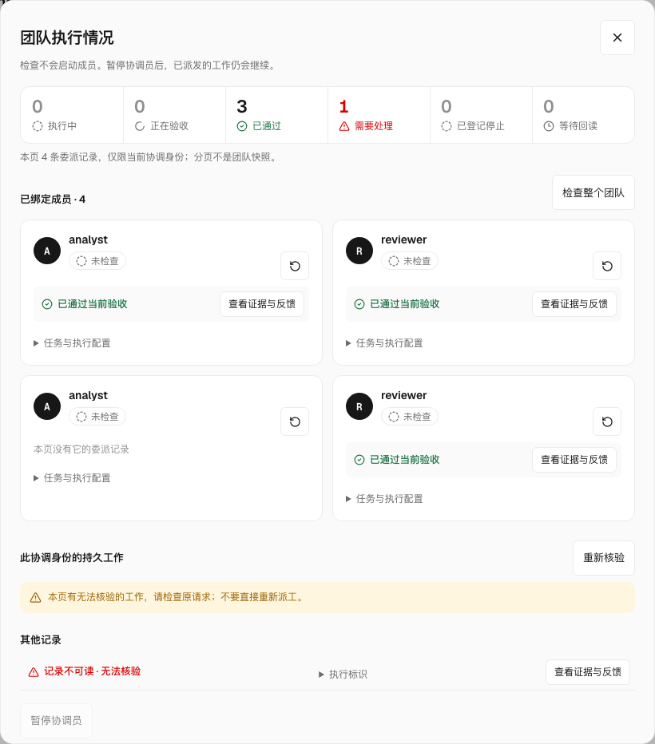
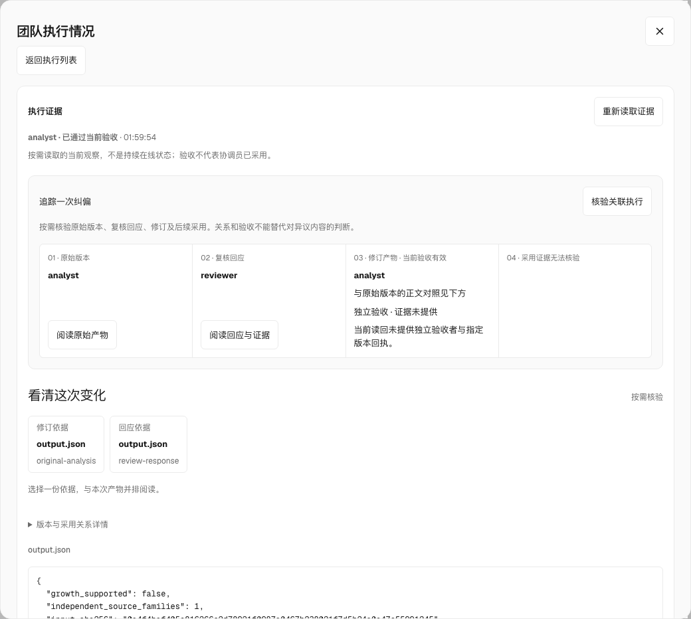

# Local delegation through governed Turns

An existing local Agent can launch explicitly bound peer work and reconnect to
its result after the requesting conversation disappears. The same interface is
available to a coordinating member. DSH and an optional cloud provider use the
existing Turn entrypoint; there is no steward-specific scheduler or task store.

## Activate

First register the participating Agents and give each intended canonical Todo
an explicit validation basis. Work covered by
[owner-configured acceptance](goal-acceptance-observations.md) must retain its
current owner binding. Independent work outside that scope (or with Goal
acceptance disabled) instead requires its own canonical Todo completion
validator, declared through the existing `todo add --validation-command-json`
entrypoint. A missing or stale owner association never falls back to that
validator; a Todo validator supplements owner criteria when both apply.
Prepare an
operator-owned JSON file **outside every delegated member workspace**. A
coordinator may keep it as an ignored file under its Goal project at
`.loopx/config/delegations.json`:

```json
{
  "schema_version": "loopx_local_delegation_v0",
  "bindings": [{
    "id": "independent-review",
    "agent_id": "reviewer",
    "todo_id": "todo_review",
    "requesters": ["lead", "analyst"],
    "workspace": "/absolute/reviewer-worktree",
    "host_args": ["--host", "dsh", "--dsh-model", "your-configured-model"],
    "timeout_seconds": 300,
    "output_refs": ["output.json"]
  }]
}
```

`requesters` is an execution grant for this exact binding. Registration, a peer
message or a coordinator role does not grant it. Host arguments are trusted
operator configuration and use the existing `turn run-once` options. For Ark,
select `generic-cli`, `fresh`, and the optional adapter's `--config` invocation.
Profiles, executables, workspace isolation and credential custody remain the
operator's responsibility. No model tool accepts those values.

Inspection, pre-launch admission, Turn validation and returned-artifact readback
consume this same basis. Private commands must match the canonical Todo's
declaration digest; verifier files declared by Goal acceptance are checked
before and after execution. The ordinary Todo digest pins the command, not
undeclared script dependencies. A successful validator still needs canonical
completion, unchanged artifacts and receiver adoption. Inspection never starts
work or configures owner acceptance. Disable by removing the exact binding
from the operator configuration; existing operations retain their history and
cannot re-execute or return accepted evidence under a revoked grant.

Member completion uses the ordinary active-Goal continuation, including legacy
non-hard-lease routes. It does not declare terminal `no_followup` for a
requester-owned synthesis. This lets controller validation finish the Todo
before resuming only the original Turn's settlement; the host is not rerun.
Explicit terminal closeout still requires matching writeback/spend receipts.

中文：受 Goal 验收范围覆盖的 Todo 保留当前 owner 关联；范围外的独立任务，或未启用
Goal 验收的任务，必须通过既有 `todo add --validation-command-json` 声明规范 Todo
完成校验。范围内关联缺失或过期不能退回普通校验；两者同时存在时须全部通过。
预检、启动前准入、Turn 校验和结果读回复用同一依据，私有命令必须匹配规范声明
摘要。普通 Todo 摘要固定命令，不固定未声明的脚本依赖；Goal 声明的校验文件在
执行前后核对。校验通过仍不等于规范完成、产物未变或接收方采纳。预检不启动工作、
不配置 owner 验收；移除原配置中的精确 binding 即撤销 grant，保留历史但拒绝重新
执行或返回已撤权任务的有效结果。

成员完成沿用普通 active-Goal 继续状态，旧的非 hard-lease 路径也如此；不会为仍由
请求方负责的汇总声明 terminal `no_followup`。因此可以先通过 controller 校验完成
Todo，再仅恢复原 Turn 的结算，不重跑 host。显式终结仍须具备匹配的写回和扣额回执。

A Codex binding launches an independent, resumable Codex Agent Session through
the same governed Turn path. Pin both fields when the worker must use an exact
profile:

```json
{
  "id": "strong-independent-review",
  "agent_id": "managed-reviewer",
  "todo_id": "todo_review",
  "requesters": ["lead"],
  "workspace": "/absolute/reviewer-worktree",
  "host_args": [
    "--host", "codex-cli",
    "--codex-model", "gpt-5.6-sol",
    "--codex-reasoning-effort", "xhigh",
    "--codex-sandbox", "workspace-write"
  ],
  "timeout_seconds": 300,
  "output_refs": ["output.json"]
}
```

This is not a native `multi_subagent` child. Native children remain temporary
workers inside one parent execution and use the Goal's child model preference.
The binding above has its own Agent identity, Todo, workspace, Codex Session and
durable delegation operation. `delegation inspect` and the planning projection
show `gpt-5.6-sol@xhigh`; start and resume pass both fields to that same Session.
The requester still needs the exact binding grant, and a profile is not an
acceptance or result-return receipt.

中文：Codex binding 通过同一条受治理 Turn 链启动独立、可续接的 Codex Agent
Session。需要精确执行配置时同时固定 `--codex-model` 与
`--codex-reasoning-effort`。它不是 `multi_subagent` 的原生临时 child：后者仍在
单个父执行内部使用 Goal 的 child model 偏好；前者拥有独立 Agent 身份、Todo、
workspace、Codex Session 与持久 delegation operation。`delegation inspect` 和
规划投影会读回例如 `gpt-5.6-sol@xhigh`，start/resume 也把同一配置送入原 Session。
这不扩大 requester grant，也不把 profile 冒充验收或结果返回回执。

By default, a Codex binding also supplies one invocation-scoped
`loopx_delegation` stdio MCP server to every fresh or resumed worker Session.
Its command pins the selected worker `agent_id`, workspace, Goal, registry,
runtime and operator execution configuration before Codex starts. The model
cannot select or rewrite those values. Codex receives the server through
per-invocation configuration, so LoopX does not modify the user's global Codex
MCP settings and a resumed worker keeps the same binding. When configured, the
server and its already identity-scoped tools are approved inside that route;
failure to start the server rejects the Turn instead of
silently continuing without tools. The native tools are
the collaboration and authorized delegation operations from that bound server;
they do not add shell, Todo or external-action authority.

The shell commands below remain the compatibility path for an already running
Agent Session, a host without MCP support, or an operator who deliberately uses
shell-only coordination. Both surfaces call the same `Delegations` service and
preserve the same binding, operation and acceptance rules; the shell path is
not a second control-plane implementation.

中文：Codex binding 默认会为每个新建或续接的 worker Session 注入一次调用范围内的
`loopx_delegation` stdio MCP server。启动前，host 已固定 worker `agent_id`、
workspace、Goal、registry、runtime 与 operator execution configuration；模型不能
选择或改写这些值。该配置不会修改用户的全局 Codex MCP 设置，也不会授予 shell、
Todo 或外部动作权限。下方 shell 命令继续作为既有 Session、无 MCP host 或显式
shell-only 协调的兼容入口；两种入口复用同一个 `Delegations` 服务和同一套验收规则。

## Use an existing Agent conversation through its shell

An attached Codex or other shell-capable Agent can use the same execution
bindings without opening a replacement conversation or adding MCP tools to a
running session. Use its registered requester identity and the exact registry,
runtime and operator configuration; this trusted local CLI is not a remote
authentication boundary.

```bash
delegate() {
  loopx --registry "$REGISTRY" --runtime-root "$RUNTIME_ROOT" --format json \
    delegation "$@" --goal-id "$GOAL_ID" --agent-id "$AGENT_ID" \
    --execution-config "$DELEGATION_CONFIG"
}

delegate list
delegate inspect --binding-id independent-review
delegate start --binding-id independent-review --operation-id review-round-1 \
  --brief-file request.json --execute
delegate read --operation-id review-round-1
delegate wait --operation-id review-round-1
delegate stop --operation-id review-round-1 --execute
```

Inspection uses the bound worker workspace as its actual safety scan root. If
quota defers the exact Todo for control repair, inspection returns
`state: turn_blocked` with `turn_blocker.reason_code`, the original selection
state and a contract-error count. Canonical acceptance can still be ready;
`executor: null` means it was not inspected, not that the model runtime failed.
Use `loopx check --scan-root /absolute/reviewer-worktree` with the same registry
to diagnose the scan. Repair the source or configuration, then inspect again.
Do not exempt tests, scan the installed package instead, retarget the Todo or
start another operation to bypass the refusal. Other unstructured CLI failures
remain errors, and a refusal whose bounded fields are malformed — including a
`state` that is not one of the decoded string literals — fails closed instead of
reporting `turn_blocked`. The observation starts no host, Turn journal or quota spend.
Normal quota selection may still admit unrelated eligible work; this preflight
never substitutes another Todo.

The long-lived collaboration MCP server explicitly opts into preview reuse.
One-shot CLI and per-request Goal Chat services retain the original fresh CLI
subprocess; they do not start a preview supervisor or pay its cleanup cost.
This is an internal entrypoint-lifetime choice, not a user setting. Repeated
inspections in that long-lived `Delegations` service reuse at most one
fixed-workspace, read-only Python CLI worker. The existing TypeScript Host owner
supervises that worker: each preview retains its 60-second request deadline;
timeout, cancellation, malformed output and parent EOF stop its process group
before a verifiable failure is returned. If cleanup cannot be established, the
transport fails closed without a preview or an automatic fallback/retry.
An ordinary idle, lifetime or request-limit retirement emits a terminal fence
only after the Host has stopped the old process group. If that fence confirms
a racing request was never accepted, the caller may replace the worker once
within the same binding and original deadline. An accepted request, missing or
invalid fence, crash or uncertain cleanup never grants retry permission.
Input backpressure and partial output reads share the parent's original absolute
deadline; waiting for the supervised cleanup remains a separate bounded fence.
POSIX cleanup is process-group scoped; Windows retains the Host owner's
best-effort process-tree cleanup boundary.

Only loaded modules are reused. Registry/runtime/binding and workspace identity,
interpreter, environment or packaged-source changes retire the worker. Every
request still runs the original CLI decision owner and current acceptance,
validator and workspace reads; no eligibility, authority or result is cached.
The session is single-flight and bounded to 128 requests, 30 seconds idle and
five minutes total. Execution and resume keep their original one-shot CLI path,
including the existing leased Host supervisor's current-execution readback,
renewal and nested-process cleanup. Lease-bearing commands never enter the
preview worker; preview reuse grants no lease or execution authority.
This is an internal transport change, not a new capability setting, execution
grant or UI source of truth. A one-shot CLI inspection still pays its original cold startup;
a warm-service measurement is not evidence of a faster cold CLI.

Authority loss at either acceptance read, including the final read after the
Turn preview, returns the same typed unavailable projection without exposing
earlier acceptance or executable permission. Workspace loss or replacement
still takes precedence. A later inspection rereads recovered authority; there
is no automatic retry, provider promotion or fallback.

中文：长驻 collaboration MCP server 显式启用预检复用；一次性 CLI 和每个请求新建
服务的 Goal Chat 保留原 fresh CLI subprocess，不启动预检监督进程，也不承担其清理
成本。这只是入口生命周期选择，不新增用户配置。长驻 `Delegations` 服务的连续预检
最多复用一个固定工作区的只读 Python CLI
进程；既有 TS Host owner 负责生命周期。单次预检仍有 60 秒截止时间，超时、取消、
非法输出或父端 EOF 后，先确认进程组停止，再返回可核验失败；若无法确认清理，
不给预检结果，也不自动回退或重试。正常空闲、寿命或请求数到期，只有在 TS Host
确认旧进程组停止后才返回退役屏障。屏障确认竞争中的请求从未被接收时，可在相同
绑定和原截止时间内更换一次 worker；已接收请求、缺失或非法屏障、崩溃及不确定
清理均不允许重试。POSIX 按进程组清理，Windows 保留既有的
best-effort 进程树边界。
输入管道背压和不完整输出共用父端原绝对截止时间；监督清理仍是另一个有界屏障。

只复用已加载模块，不缓存准入、权限或结果。registry/runtime/binding、工作区身份、
解释器、环境或包内源码变化时，先退役旧进程；每次仍执行原 CLI 决策 owner，重读
当前验收、validator 和工作区。单个 session 串行处理，最多 128 次请求、空闲 30 秒、
总寿命 5 分钟；执行和恢复沿用一次性 CLI，包括既有租约 Host 的当前执行读回、
续期和嵌套进程清理。带租约的命令不进入预检 worker，预检复用不授予租约或执行
权限。这不增加配置、授权或 UI 权威。
一次性 CLI 仍承担原来的冷启动，热服务的加速不能冒充冷 CLI 的加速。

首次验收读取或预检后的末次复读遇到权限存储不可用时，均返回同一类型化不可用
投影，不返回旧验收或可执行许可；工作区消失或被替换仍优先处理。后续检查重新
读取已恢复的权限存储，不自动重试、晋升 provider 或回退。

The managed Effect launcher also preloads a small TypeScript module before the
server's static imports to enable [Node's native compilation cache](https://nodejs.org/api/module.html#module-compile-cache). The default
cache lives inside the existing private temporary Effect namespace; it stores
compiled code, not Goal data, decisions or permissions. Node validates module
contents and separates Node versions. The original source fingerprint, startup
authentication, readiness checks and request deadlines remain authoritative.
Cache fill has a first-load cost, and code cache is written on normal Node exit;
measure first fill separately from populated-cache restart and resident reuse.
Shutdown drains requests and flushes pending compilation before retiring its
locator. The locator's existing stop acknowledgement must not let temporary
namespace cleanup race a later exit-time cache write; request deadlines and
shutdown authorization are unchanged.
An unavailable, non-private or symlinked default cache leaves normal source
execution working, without changing its permissions. Existing explicit
`NODE_COMPILE_CACHE` behavior is retained. Set `NODE_DISABLE_COMPILE_CACHE=1`
to disable compilation reuse, including for precise V8 coverage; the default
preload does not enable it in `NODE_V8_COVERAGE` runs. This internal optimization
adds no capability setting, frontend/Lark state or authority owner. A faster
module load alone does not qualify whole-CLI latency or requester adoption.

中文：Effect 启动器在 server 的静态导入之前 preload 一个小型 TS 模块，启用
Node 原生编译缓存。默认目录位于既有私有临时 Effect namespace；只保存编译后的
代码，不保存 Goal 数据、判决或权限。Node 校验模块内容并隔离 Node 版本；原源码
指纹、启动鉴权、就绪校验和请求截止时间保持权威。首次填充有成本，代码缓存在
Node 正常退出时写出；首次填充、已有缓存的重启和常驻复用须分别测量。
关闭时先排空请求、刷出待写的编译缓存，再撤销定位文件，避免既有停止回执允许
临时目录清理后，退出阶段又写入缓存；不延长请求期限或改变关闭授权。默认缓存
不可用、非私有或为符号链接时，继续执行原源码，不修改既有权限。保留显式
`NODE_COMPILE_CACHE` 行为；`NODE_DISABLE_COMPILE_CACHE=1` 可关闭编译复用，
包括精确 V8 coverage 场景；默认 preload 在 `NODE_V8_COVERAGE` 下不启用缓存。
这不新增 capability 设置、前端／Lark 状态或权限 owner。模块加载变快不等于完整
CLI 耗时或原请求方采用已验收。

The shared TS Effect dispatcher loads a business owner only when its registered
method is selected. It retains the resolved handler, not request parameters,
authority reads or results. The complete source fingerprint still invalidates
the runtime after source changes; the method table, authentication, source
transfer, admission and settlement owners remain unchanged. This also changes
the failure boundary: an unavailable unselected module no longer prevents
transport startup, while selecting that module rejects the request without a
fallback. A successful `runtime.ping` proves transport readiness, not execution
or qualification of every registered method. First-use module cost is included
in the real caller measurement below, not hidden in a startup-only timer.

Runtime identity also binds the resolved physical source root, not only equal
source bytes. A copied installer candidate or checkout starts its own loader;
retiring another copy cannot strand a deferred import or Python bridge in a
transport that still answers `ping`. Calls within the same resolved source root
continue to reuse the resident runtime, and every source file remains checked.
The root is hashed into the existing identity, not published as a new user
setting or authorization requirement.

中文：共享 TS Effect dispatcher 只在选中已注册方法时加载业务 owner；保留解析后的
handler，不缓存请求参数、权限读取或结果。完整源码指纹仍负责升级失效，方法表、
认证、source transfer、准入及结算 owner 不变。错误边界有明确变化：未选模块不可用
不再阻止传输启动，实际选中该模块时仍拒绝，不静默回退。`runtime.ping` 成功只证明
传输就绪，不证明全部方法可执行或已验收。首次模块加载计入下方真实调用方测量，
不能只用启动计时将成本移走后声称提速。

运行时身份也绑定解析后的物理源码目录，而非只比较源码字节。复制出的安装候选或
工作树使用自己的 loader，避免另一副本被清理后，仍能 `ping` 的传输在延迟导入或
Python bridge 阶段失效。同一解析目录内仍复用常驻运行时，全部源码文件仍参与校验。
目录只哈希进既有身份，不新增用户设置或授权要求。

### Preview performance qualification / 预检性能验收

Qualify the useful caller path, not the total duration of a pytest suite. A
functional suite's execution timeout bounds a stuck test runner; it is not a
request-latency SLO. Revising a frozen timeout creates a new qualification with
the old declaration/result retained, never a retroactive pass. For this bounded
continuous-service slice, use the following calibration profile:

- Run the original preflight suite without dropping cases in a separate
  qualification stage. A 600-second runner timeout allows real subprocess/
  backend setup; it does not change the existing
  60-second preview deadline. Lease lifetime, cancellation, EOF and descendant
  cleanup regressions remain required separately, as do current validator and
  workspace drift checks. Passing the timing profile cannot waive these checks.
  The bounded inline completion validator checks the retained qualification's
  source, complete results and criteria; it does not rerun the full suite inside
  an authority transaction or raise that transaction's timeout. Missing or stale
  evidence refuses completion.
- Freeze source/interpreter, fixture population, runtime configuration and
  measurement boundaries before sampling. Compare production-wired reuse with
  the original fresh-subprocess policy at the same revision, separately for
  File and SQLite. Use at least six alternating pairs, each with one cold and
  three warm inspections; isolate runtime processes and retain every sample.
  Stop the caller's own heavy tests while measuring; disclose shared-host load.
- Require identical complete unnormalized results and unchanged canonical
  fixture bytes. Re-read current authority on every inspection; no cached
  verdict, truncated input, skipped validator or repeated write is admissible.
- Require each provider's warm median to improve by at least 25%, and the
  median total of a four-inspection sequence, including its cold request, to
  improve by at least 15%. These are minimum useful savings, not thresholds
  fitted to one sample or a promise about a single-use CLI.
- Permit at most one second of additional cold median and cold maximum versus
  the paired fresh policy, with no request deadline violation. This explicitly
  accepts a bounded startup cost only when the sequence still saves time; report
  cold median/max and the break-even sequence alongside the warm result. A
  consumer that only inspects once must be assessed as a cold consumer.

CLI and Goal Chat are single-use consumers of this service: verify their real
entrypoints keep the original subprocess and full readback, separately from the
MCP repeated-call profile. Do not apply continuous-service gains to HTTP/CLI
requests or introduce a cross-request authority cache to obtain warm samples.

中文：CLI 和 Goal Chat 是单次消费者，须另验真实入口沿用原 subprocess 与完整读回；
不能把 MCP 连续调用的收益套到 HTTP/CLI，或为制造热样本引入跨请求权限缓存。

These small-sample median/max checks qualify this transport-policy slice only;
they establish neither a percentile SLO nor sustained R2, model, installation,
frontend/Lark or requester-adoption acceptance. A changed workload or source
needs new qualification. Failure retains the samples and keeps the affected
acceptance open; do not increase thresholds or sample until a pass appears.

中文：验收有用的调用路径，不再把整套 pytest 总时长当单次请求 SLO。测试执行
超时仅防挂死；调整已冻结超时属于新一轮验收，保留旧声明与旧失败，不追溯改判。
本次持续服务切片按以下校准标准验证：原预检套件不删案例，在独立阶段执行，
runner 超时为 600 秒，
真实请求的 60 秒截止时间不改；租约生命周期、取消、EOF、子孙进程清理以及当前
validator／工作区漂移另行必验。内联完成校验只核对对应源码、完整结果及标准，
不在权威事务内重跑全套或延长事务超时；证据缺失、过期仍拒绝。冻结源码、解释器、
完整 fixture 与运行配置，
File／SQLite 分别在同一版本比较真实复用路径和原 fresh 策略；至少六组交替配对，
每组一冷三热，隔离 runtime、保留全部样本，停止自己的重测试并披露宿主负载。
完整未改写结果相同、canonical 字节不变，每次仍读当前权限，不能用判决缓存过关。
每个 provider 热调用中位数至少改善 25%，含冷启动的四次调用总时长中位数至少
改善 15%；这是最低有用收益，不是对独立 CLI 的承诺。冷启动中位数及最大值最多
各增加一秒且不违反请求期限；以有界的一次性成本换取整个序列的净收益，同时
披露冷读与回本调用数。仅调用一次的消费者按冷路径评估。这不认证百分位 SLO、
R2 持续运行、模型、安装、前端／Lark 或真实请求方采用；变更负载或源码重新验证，
失败保留样本，不边采边抬线或反复采样挑通过。

中文：预检以 binding 固定的真实 worker 工作树作为安全扫描根。quota 因控制面
修复延后该精确 Todo 时，返回 `state: turn_blocked`、原选路状态、
`turn_blocker.reason_code` 和契约错误数；规范验收可能仍已就绪。
`executor: null` 表示未检查执行器，不表示模型故障。使用相同 registry 和
`loopx check --scan-root /absolute/reviewer-worktree` 定位，再修复原来源或配置
并重做预检。不能豁免测试目录、改扫安装包、换 Todo 或创建新操作绕过拒绝。
其他无结构 CLI 故障仍报错；拒绝投影字段畸形（含 `state` 不是已解码字符串
字面量）时按失败关闭报错，不返回 `turn_blocked`；该观察不启动 host、Turn
journal 或扣额。
普通 quota 选路仍可安排其他独立且合格的工作；本预检不会替换 Todo。

`request.json` contains the same `collaboration_brief_v0` used by MCP:

```json
{
  "schema_version": "collaboration_brief_v0",
  "purpose": "Independently check the current analysis",
  "context": "Reconcile the corrected source with the earlier conclusion.",
  "constraints": ["Use only the supplied material; no external actions"],
  "inputs": [],
  "acceptance": ["Satisfy the task's pinned independent acceptance"],
  "return_requirement": "Return evidence, uncertainty and the checked artifact"
}
```

The Agent chooses questions, sequencing and synthesis. After `start` returns,
it can continue its own investigation; closing that CLI process does not stop
the worker. Another invocation reads the original operation. `wait` observes
for a bounded interval and does not start, resume or accept work. `ok: true`
means the command succeeded; inspect `status`, `recovery_required`, `error` and
the independently checked artifacts to determine the work result. Neither a
`running` result nor a saved peer opinion means accepted completion.

After a lost start response, repeat the same start with the same operation id
and brief. If readback reports `recovery_required`, use:

```bash
delegate resume --operation-id review-round-1 --execute
```

Resume keeps the original operation and Turn; it cannot silently retarget
work. A new scope or repair round requires a new operation, still subject to
the configured task, quota and acceptance owners. A member coordinating its
own authorized peers supplies `--parent-request-id` on start. CLI and MCP
share grant validation, detached execution, wait/readback and recovery rather
than maintaining separate rules.

`stop --execute` ends one member's bounded work and returns a receipt that
states what was proven. The request is written beside the execution record
(`<operation>.stop.json`), never into it, so a worker that is still holding the
operation cannot overwrite it. A worker on this machine receives `SIGTERM` for
its whole process group, which ends its Turn child; the native host runs in
its own process group, and its supervisor terminates that group once the Turn
child is gone. The worker acknowledges from under its own lock, marks the
record `stopped`. The hard lease is resolved only once readback proves that
the worker, Turn lane and everything the Turn launched have exited. The Host
transport reads that from the one record the operation names: in hard-lease
mode the leased CLI's supervisor records its own group beside it and the
actual nested Host writes it, and neither exit proves the other. Each record
says which group it supervises and whether it belongs to a leased execution.
A new operation gets an explicit non-execution record before it can launch;
replaying an existing operation never recreates lost proof. Missing primary
evidence is unproven, even when both records are absent.
Either surviving leased record requires the other: a missing outer record is
not proof that its CLI exited, even when the nested Host never started.
The private CLI forwards the record address and supervision scope to
the Turn transport, which consumes it before launching user Host code. A record
that does not say what it supervises, such as an older outer-only hard-lease
record, cannot prove drain and leaves the stop `acknowledged`; reconcile that
original execution rather than deleting its evidence or reusing its key.
When nobody holds the operation, the requester
acknowledges itself. A worker on another machine is never signalled; it finds
the request at its next checkpoint or at its next record write, which is
refused. The receipt `phase` is `settled` only when an acknowledgement exists,
the operation lock is free, the member's Turn lane holder record shows it
released by the stopped worker (the lane is read, never taken), the native
host the Turn launched has exited together with every process in its group,
and the hard task lease that execution may hold is resolved: released, or
proven not owed. Canonical authority decides, for the operation's own
execution identity (owner, execution key, any valid recorded epoch and the current
version). The operation's `task_lease` annotation is only a hint: a missing,
empty, stale `required: false` or malformed annotation never proves that
nothing was owed, and a lease another execution holds is never released. The
absence of the cutover marker also needs a provider-first read proving the
canonical store absent. An existing or unreadable store keeps the obligation
unproven until the original authority route is restored; stop never rebuilds it.
The receipt's `lease.state` is `released`, `not_owed`, `release_unproven` or
`obligation_unproven`. A release that failed is
retried under the stop's own lock on the next explicit `stop`, so it never becomes a
`settled` receipt that leaves the member's Todo blocked until the lease TTL;
while it is unproven the stop stays `acknowledged` with
`required_lease_release_unproven`, and an authority that cannot be read keeps
it open with `lease_obligation_unproven`. If that host cannot be attributed, or its
supervisor never finished cleaning up, the stop stays `acknowledged` and a
later `stop` rereads it. On a platform without process groups the launched
host cannot be proven drained at all, so `stop --execute` fails with an
actionable error naming that boundary before writing a cancellation intent,
acknowledging, signalling a worker, or releasing a lease. Repeating a refused
request preserves the operation and any existing stop receipt unchanged. An
active or unattributable worker is also refused before its Host record appears;
a not-yet-started operation with no holder can still be cancelled. `unknown`
means the holder vanished before acknowledging; its lease is resolved the same
way once its Host is proven gone, and is left to its TTL rather than handed on
when that Host cannot be attributed. `noop` means the
work was already accepted, rejected or stopped. `requested` or `acknowledged`
means it is still winding down: call `stop` again. A grace timeout never turns
into a receipt. Stopped work is not resumed; `resume` refuses it and a new
scope needs a new operation id. The Turn journal keeps its `in_progress` entry
for inspection, and the record is never rewritten as a completion. A stopped
member's Todo stays open, so the coordinator decides what happens next. The
member's Todo completion and reply publication commit under the same lock a
stop takes, so a stop written first means neither effect lands, and a stop
written after both leaves their acceptance intact.
Recovery of an already validated Turn uses the same fenced completion entry:
it retains the lock through the original Turn's settlement and result publication,
without rerunning the Host. A competing stop waits for that acceptance or wins
before completion starts; a lock-acquisition timeout requires retrying `stop`.

中文：`stop --execute` 结束一个成员的有界工作，并返回一份只陈述已证明事实的
回执。停止请求写在执行记录旁边的 `<operation>.stop.json`，从不写进记录本身，
因此仍持有该 operation 的 worker 无法覆盖它。本机 worker 会收到整个进程组的
`SIGTERM`，其 Turn 子进程随之结束；原生 host 在自己的进程组中运行，Turn 子进程
退出后由其 supervisor 终止整个 host 进程组。worker 在自己的锁下确认，把记录标为
`stopped`。只有读回证明 worker、Turn lane 及该 Turn 启动的全部进程都已退出，
才会处理硬任务租约。Host transport 从 operation 指定的唯一记录读回这一事实：
硬租约模式下，外层 CLI 的 supervisor 把自己的进程组记录在旁边，内层真实 Host
写入该记录，外层退出不能证明内层退出，反之亦然。每份记录都写明自己监管哪个进程组、
是否属于租约监督的执行。新操作在启动前先登记明确的未执行证明；重放已有操作
不能重新创建丢失的证明。即使两份记录都缺失，也只能判定为未证明。
任一侧的记录保留时，另一侧缺失都不能证明退出；即使内层
Host 尚未启动，也不能据此判定外层 CLI 已退出。
私有 CLI 只把记录地址和监督范围交给 Turn transport，由它在启动用户 Host 前消费，用户 Host
不继承该标记。未写明监管对象的记录（例如只覆盖外层 CLI 的旧硬租约记录）无法证明
排空，停止保持 `acknowledged`；应核对原执行，不能删除证据或复用其 key。
没有持有者时由请求方自行确认。另一台机器上的
worker 不会被发信号，它在下一个检查点或下一次写记录时发现请求，写入被拒绝。
只有存在确认、operation 锁已释放、成员 Turn lane 的持有者记录显示已被停止的
worker 释放（只读 lane，从不获取）、该 Turn 启动的原生 host 及其进程组内所有进程
都已退出，且该执行可能持有的硬任务租约已经处理（已释放，或被证明无需释放）时，
`phase` 才是 `settled`。是否需要释放由 canonical 权威按该 operation 自己的执行身份
（owner、执行 key、已记录的有效 epoch 与当前版本）判定；operation 的 `task_lease`
注解只是线索，缺失、为空、过期的 `required: false` 或畸形注解都不能证明无需释放，
其他执行持有的租约也绝不会被释放。切换标记缺失时，还必须由既有 provider-first
读取证明 canonical store 不存在；已有或不可读的 store 使义务保持未证明，直到原
authority 路径恢复，stop 不会重建它。回执的 `lease.state` 为 `released`、`not_owed`、
`release_unproven` 或 `obligation_unproven`。释放失败会在下一次显式调用 `stop` 时于其锁下重试，
因此不会产生一份「已结算」却让成员 Todo 被租约阻塞到 TTL 的回执；在释放得到证明前，停止保持 `acknowledged`，原因为
`required_lease_release_unproven`；权威无法读取时同样保持打开，原因为
`lease_obligation_unproven`。host 无法归属或其 supervisor 未完成清理时，
停止保持 `acknowledged`，之后再次调用 `stop` 会重新读取。在没有进程组的平台上，
启动过的 host 根本无法被证明已收尾，因此 `stop --execute` 会以指明该平台边界的
可操作错误在写入停止意图、确认、发送信号或释放租约之前失败，重复拒绝不修改原记录。
Host 记录尚未出现但 worker 仍活跃或无法归属时也拒绝；没有持有者且尚未启动的
operation 仍可安全取消。`unknown` 表示持有者在确认前消失；其 Host 被证明已退出后，
租约按同样方式处理，Host 无法归属时则留待 TTL，不会在 Host 可能仍运行时交出；`noop` 表示工作已 accepted、
rejected 或 stopped；`requested`/`acknowledged` 表示仍在收尾，再次调用 `stop`。
宽限期超时永远不会变成回执。已停止的工作不能 `resume`，新范围需要新的
operation id。Turn journal 保留 `in_progress` 条目供检查，记录不会被改写成完成；
成员的 Todo 仍然打开，由协调者决定下一步。成员的 Todo 完成与回执发布在 stop
所取的同一把锁下提交，因此先写入停止则两个效果都不会落地，后写入停止则其验收结果
保持不变。
恢复已通过验证的 Turn 也使用同一个带锁的完成入口，直到原 Turn 结算与结果发布
结束才释放锁，不会重新运行 Host。并发 stop 等待该验收结果，或在完成开始前先取得
停止边界；获取锁超时则需要重试 `stop`。

This entrypoint does not create Agents, grant bindings or wake an idle Codex
conversation. The existing host/LoopX continuation policy owns the next lead
turn; for a Goal Chat LoopX lead that is the Chat service's one-time wake after
acceptance, described in [Goal Chat continuation](goal-chat-continuation.md).
That wake returns to the conversation whose Turn started the operation, which
the trusted Chat host records beside the operation; the model supplies no
routing. The conversation remains persistent independently of whether autonomous
LoopX mode is enabled. Dashboard, CLI/managed Turn and Lark keep their existing
conversation and runtime owners; they may consume the shared bounded route
projection described below, but they do not get another grant or scheduler.

### Bind a later result to an exact accepted version

A brief input may opt into requester-scoped provenance:

```json
{
  "ref": "inputs/accepted-analysis.json",
  "description": "Accepted analysis to use in the synthesis",
  "sha256": "0123456789abcdef0123456789abcdef0123456789abcdef0123456789abcdef",
  "delegation": {
    "operation_id": "analysis-round-2",
    "ref": "output.json",
    "relation": "uses"
  }
}
```

Use the real digest from `delegate read`, not the illustrative digest above.
`ref` addresses the receiving workspace's already supplied file; `delegation.ref`
addresses an output of this requester's original operation. The source must be
currently accepted and both files must match the specified hash. Start checks
before dispatch and checks again before completing the consumer. It neither
copies files nor grants workspace access. Existing briefs without `delegation`
retain their behavior and readback shape.

The typed relations are **requested intent**: `responds_to`, `revises` and `uses`.
They do not assert that an objection is correct, a revision resolves it or an
Agent has adopted a result. `read` returns the immediate dependency's specified
version and current/unavailable observation; it does not flatten a whole team's
graph or infer relationships from prose.

After inspecting the independently accepted downstream result, the requester
may explicitly record adoption into that result:

```bash
delegate adopt --operation-id analysis-round-2 \
  --consumer-operation-id synthesis-round-1 --execute
delegate read --operation-id analysis-round-2
```

Both executions must belong to this requester and remain accepted under their
current bindings, canonical Todos, pinned validators and saved artifact hashes.
The consumer's immutable brief must reference the source through `uses`, and
its supplied input must still match. The receipt binds source hashes, consumer
hashes and original request/task identities. Repeating the same decision is
idempotent. At most twelve downstream adoption records can be attached to one
source. Reading, receiver request acknowledgement and completing a consumer
never create this requester decision automatically.

Every read rechecks recorded adoption evidence. Changed output, missing input,
revoked binding or failed acceptance makes that relationship `unavailable`;
the historical reference remains visible, but its saved success is not replayed.
This is evidence of the requester's explicit decision and a validated downstream
artifact, not proof of model comprehension or arbitrary semantic claims. Domain
acceptance must check substantive dependency use; matching an input hash alone
cannot establish it. No Goal is completed and no new model is launched by adoption.

MCP exposes `adopt_delegation_result(operation_id, consumer_operation_id)`;
newly created Goal Chat tool sessions expose `action=adopt` with those fields.
Existing native sessions keep their original schema; use the existing shell CLI
when their tools do not include the action. Host tool approval still applies.
The local Goal Chat evidence panel shows these version links and requester
receipts, with direct navigation to source/downstream evidence and explicit
missing or stale adoption. This owner-only surface does not grant Lark or shared
audiences access. Stop supplying the optional provenance input to disable it for
new work; existing decisions remain auditable and revalidated, not deleted.

中文：输入可显式绑定当前请求方某次已验收产物及其哈希。`responds_to / revises / uses`
只表达请求关系；不从文字或完成状态推导纠偏、采用。请求方检查后续已验收结果后，
通过 `adopt --execute` 显式记录采用；读回重新核验源版本、接收方输入及后续产物。
版本或验收失效时保留历史引用并显示不可核验，不重放旧成功。领域验收仍须验证实际
使用了依赖及结论正确性。前端可沿关系打开证据、反馈或暂停协调员；整体 Goal、成员
停止与跨受众权限均不因此改变。

### Publish bounded route readiness to the coordinator

After the ignored operator file exists, register only its Goal-relative pointer
through the existing orchestration configuration:

```bash
loopx configure-goal --goal-id "$GOAL_ID" \
  --subagent-execution-config .loopx/config/delegations.json
loopx configure-goal --goal-id "$GOAL_ID" \
  --subagent-execution-config .loopx/config/delegations.json --execute
loopx agent-context --goal-id "$GOAL_ID" --agent-id "$AGENT_ID" \
  --phase before_plan --format json
```

Preview before apply. The pointer accepts only a repository-relative JSON path
under `.loopx/config/`; symlinked or missing files yield a typed blocked
observation. The registry does not copy the file. The same requester grant
filter used by `delegate list` considers at most six public-safe planning routes
and byte-bounds the projected subset; `authorized_count` and `routes_truncated`
make omissions explicit. Managed-host availability comes from the existing Turn host/profile owner;
unprobed generic adapters are `unknown`, not optimistically ready.
Routes disclose that owner's `probe_scope` for a supplied non-null probe. Read full
`runtime_probe` and `unavailable_remediation` observations through
`delegation inspect` on the same binding; planning keeps its existing byte budget.

This planning projection is read-only. It does not start, resume, accept,
enumerate operations or periodically poll work. A ready observation is not an
execution receipt. Use the original binding and a stable operation id for
dispatch, then read and validate the original artifacts. An explicit
`agent-context --phase after_delegate_result` read may summarize current
requester-scoped operation statuses; those counts are not parent acceptance.
Remove only the pointer with
`--clear-subagent-execution-config --execute`; revoke actual admission in the
operator binding file.

For compatibility, an unfinished Goal Chat run created before the Goal-owned
pointer was available can resume with its frozen Session reference. That path
ends with the run: a new or completed run must use the Goal configuration, and
no legacy Session setting is copied back into the registry automatically.

中文：本地授权文件可放在协调者 Goal 仓库中已忽略的
`.loopx/config/delegations.json`，但必须位于所有被委托成员工作区之外。先用
`configure-goal` 预览，再执行写入；注册表只保存仓库相对指针，不复制授权内容。
`agent-context` 复用 `delegate list` 的 requester 范围，最多投影六条公开安全的
路由状态；managed runtime 的可用性由既有 Turn host/profile owner 判断，未探测的
通用适配器显示 `unknown`，不能乐观宣称 ready。规划投影不会枚举 operation，也不会
启动、恢复、验收或周期轮询工作；需要时可显式读取 `after_delegate_result` 阶段的有界
operation 状态摘要。ready 和状态计数都不是执行或父级验收回执。清除指针不会撤销
授权；真正撤销仍须修改 operator binding 文件。
路由对非空 probe 渐进式披露同一 host owner 的 `probe_scope`。按原绑定读取下述
`delegation inspect`，可获得完整 `runtime_probe` 和 `unavailable_remediation`；
规划保持原有字节预算，不内联全部诊断。

### Recover work without remembered operation ids

After reconnecting or losing conversation context, use the same registered
requester and execution configuration:

```bash
delegate operations --limit 10
# When has_more is true, copy next_cursor from that response:
delegate operations --limit 10 --cursor "$NEXT_CURSOR"
delegate read --operation-id "$ORIGINAL_OPERATION_ID"
```

This reads the existing requester-scoped journal, including work created from
another conversation under that identity. Each item includes its original
operation/request/task identity and current execution readback. Accepted items
are independently rechecked against current canonical completion and artifacts;
the page includes artifact references/hashes, while `read` supplies full content.
One changed binding, corrupt record or invalid artifact yields `unavailable`
for that item and `page_readback_complete: false`; healthy siblings remain
visible. This is a reconciliation case, not permission to dispatch a replacement.
Failure to read the journal itself fails the command instead of returning empty.

Pages contain at most 50 items. `has_more` is independent of page readback
completeness. Accepted-item checks rerun the existing pinned validators; use a
smaller page when those checks are expensive. Inventory is requested on demand,
not added to the dashboard polling loop. The cursor follows stable record addresses, not business priority;
this is a live listing, so restart paging to discover new records inserted before
the cursor. An empty page for one requester says nothing about other members or
whether the Goal is complete. Only explicit `start`/`resume` can launch execution.

Enabled MCP exposes the same operation as `list_delegations`. Newly tool-equipped Goal Chat
uses `loopx_collaboration` with `action=operations`, optional `limit` and `cursor`.
It retains its existing sender/configuration pin and pause fence. Both the lead
and a coordinating member recover their own operations; creation ancestry grants
no access to another requester's journal. No new settings or background polling
are required, and disabling execution tools removes this tool with them.
Already enrolled native Chat threads keep their original tool schema on resume;
they are not replaced to install this new operation. Recovery guidance is part
of the new tool description, not injected into those older threads' shared prompt.

中文：原对话重连后执行 `delegate operations`，不用先记住每个 operation ID。
主力与承担协调的成员各自找回自己的工作，再用原 ID 读取完整结果；需要恢复时
仍显式调用 `resume --execute`。分页回读会重新核验 accepted，单条失效显示
`unavailable`，不能当成失败重派或静默隐藏。`has_more` 表示还有下一页，
`page_readback_complete` 只表示本页是否均成功读取；二者都不代表整个团队已完成。
此入口不创建 Agent、不扩大授权，也不唤醒闲置的 Codex 对话。Goal Chat LoopX 模式的协调员由 Chat 服务在结果被接受后唤醒一次，且只回到「启动该操作的回合所属会话」——该绑定由受信任的 Chat 宿主写在操作记录旁，模型不提供路由；见 [Goal Chat 续跑](goal-chat-continuation.md)。

### Check a binding before new work

`delegate inspect --binding-id independent-review` uses the same task,
workspace, host, model/effort and validator arguments as an actual delegation,
through `turn run-once` without `--execute`. It creates no request or Turn,
does not invoke the host and spends no quota. Host arguments that enable
execution or retarget the selected work are rejected before the subprocess.

The original workspace guard evaluates `turn run-once` against its explicit
`--project`, including the scheduler's later decision read. An allowed caller
directory cannot authorize a different execution destination. Commands without
a run-once project retain their invocation-directory boundary. This corrects
the former ambient-directory dependency; it does not change workspace rules,
binding grants or acceptance. Structured-handler tests exercise the same owner
from another service directory and concurrent independent registries. Production
transport selection follows caller lifetime as documented above: short-lived
callers keep the pinned one-shot subprocess; the long-lived MCP server explicitly
reuses its supervised preview worker. Both retain the existing timeout. Functional
parity alone does not establish latency qualification or installed adoption.

中文：原工作区 guard 按 `turn run-once` 的显式 `--project` 校验，包括随后 scheduler
的决策重读；合格的调用者目录不能授权另一个执行目标。没有 run-once project 的命令
保留调用目录边界。这修复原先对进程目录的隐式依赖，不改工作区规则、binding grant
或验收。结构化 handler 测试从不同服务目录、并发独立注册表调用同一 owner。生产传输
按上文的调用者生命周期选择：短生命周期调用者保留固定的一次性子进程，长生命周期
MCP 服务显式复用受监督的预览 worker；两者都保留原超时保护。功能一致性通过本身
不代表耗时达标或已安装采用。

Inspection and its Turn preview load their existing command registrars, not
unrelated CLI owners. One inspection reuses only the executable TS source
revision within that logical request; it does not cache binding, acceptance,
provider revision or validation-file facts. Those facts are still re-read to
reject drift, and the next observation resolves its own source revision. The
preview remains a pinned child process with the real workspace scan; CLI, MCP
and Team execution consume the same unchanged projection. There is no new
setting, scheduler or grant. Diagnose cold process/fixture cost separately from
the useful observation, following the
[measurement and budget rules](../development/testing-and-quality.md#roadmap-aligned-optimization);
functional success does not waive an original latency qualification.

中文：预检与其 Turn 预览只加载既有命令注册，不加载无关 CLI owner。同一次逻辑
观察仅复用可执行 TS 源码版本，不缓存 binding、验收、provider revision 或校验
文件事实；这些事实仍重读以拒绝漂移，下次观察重新解析源码版本。预览仍在固定
release 的子进程中扫描真实工作树；CLI、MCP 与团队执行消费不变的共享投影，不
增加设置、调度器或授权。按上述测量与预算规则区分冷进程／fixture 开销和真实
观察成本；功能检查通过不能豁免原延迟验收。

The typed result keeps three facts separate: `turn_eligible` is the current
Turn decision for that exact Todo; `acceptance_ready` is the current pinned
acceptance binding, not passed output validation; `executor.available` uses
the existing host probe. `false` means unavailable, while `null` means the
runtime has not been probed. In particular, the generic-cli path used by the
optional Ark adapter does not acquire a remote readiness guarantee from a
successful local dry run. `launchable` only means those local prerequisites
were observed; it grants no execution permission and does not reserve capacity.
Normal start still reads current admission and independently validates output.
If the existing Turn rejects preflight, inspection reports that error rather than
manufacturing a launchable result; no request is created.

`acceptance_reason_code` and `acceptance_next_action` retain bounded diagnostics
from the same TS validation plan; they do not change admission or grant repair
authority. A current matching task can report
`independent_delegation_validation_required`,
`completion_validation_declaration_unavailable`, or
`completion_validation_declaration_mismatch`, with
`review_original_todo_validation`. A ready declaration with unavailable pinned
files reports `validation_files_unavailable` and `restore_original_validation_files`.
Missing, stale, foreign-task or unknown observations report
`acceptance_binding_unavailable` and `review_original_task_acceptance` rather
than exposing private errors. Workspace/authority stops did not inspect task
validation, so their reason is `null` and action is `none`; ready acceptance
also has no recovery action. Older clients may omit these optional fields.

CLI, MCP and Goal Chat return this same projection. **Team execution** shows
the matching Chinese/English cause and asks the original configuration owner
to review the original task declaration/contract or restore pinned files, then
recheck. A missing independent validator is not a runtime outage, a request to
expand Goal acceptance, or permission to retarget/replay an old operation.
Commands, file paths and validator effects are not part of the public diagnosis.

中文：`acceptance_reason_code` 与 `acceptance_next_action` 来自同一 TS 验收计划，
只补诊断，不改变准入或授予修复权限。同一当前任务缺少独立声明、已声明内容无法
读取或指纹不符时，返回对应原因和 `review_original_todo_validation`；声明已就绪
但固定文件不可用时，返回 `validation_files_unavailable` 与
`restore_original_validation_files`。缺失、陈旧、其他任务或未知观察只能返回
`acceptance_binding_unavailable` 与 `review_original_task_acceptance`，不输出私有
异常。工作目录／权限提前停止代表验收尚未检查，原因为 `null`、动作为 `none`；
验收已就绪也没有修复动作。旧客户端可省略这两个可选字段。

CLI、MCP、Goal Chat 和「团队执行」消费同一投影；页面中英文提示由原配置责任人
核对原任务声明／契约或恢复固定文件，再重新检查。缺少独立校验不等于运行时故障，
不建议扩大 Goal 验收范围，不改绑或重放旧操作，也不暴露命令、路径与校验 effects。

Workspace failures are observed before authority or Turn inspection, but after
the caller's binding grant and active Goal are checked. `workspace_unavailable`
retains a bounded `workspace_state`: `missing`, `not_directory`, or `unavailable`
(the filesystem could not be read). `authority_ready: null` and
`authority_state: uninspected` do not claim an authority failure or promotion
requirement. `workspace_next_action: review_operator_workspace_binding` asks the
operator to check the original execution configuration and its directory, then
repeat inspection. The same projection is rendered in **Team execution** and
returned by CLI/MCP/Goal Chat. Inspection creates no directory, retargets no
binding, launches no worker and exports no private path or filesystem error.
It is a point-in-time observation; a changed binding fails closed and start
still rechecks the existing work/authority boundaries. Inspection also
reobserves the directory target after acceptance and the real Turn preview:
if that target disappeared or was replaced, it returns the same bounded
workspace diagnosis instead of reporting the old workspace as ready. This
does not lock the filesystem or authorize launch.
Expected preview failures also recheck the workspace; when the directory is
unchanged, the original timeout, malformed response or I/O error is preserved.

中文：工作目录故障在调用者授权与 Goal 活跃检查之后、Authority 与 Turn 检查之前
返回 `workspace_unavailable`。`workspace_state` 区分 `missing`（不存在）、
`not_directory`（不是目录）和 `unavailable`（文件系统无法读取）。
`authority_ready: null`、`authority_state: uninspected` 表示尚未检查，不能解释为
权限故障或需要晋级。`workspace_next_action: review_operator_workspace_binding`
要求核对原执行配置及绑定目录后重新检查；团队执行页面与 CLI/MCP/Goal Chat 消费
同一投影。检查不创建目录、不改绑、不启动成员，也不暴露私人路径或文件系统错误。
结果只是时点观察；配置变更仍拒绝，实际启动仍须重新通过原有工作与权限边界。
预期的预览故障也重新检查目录；目录未变时保留原始超时、响应解析或 I/O 错误。
预检还会在验收检查与真实 Turn 预览后复核目录目标；期间消失或被替换时，返回相同
的有界工作目录诊断，不把旧目录误报为就绪。这并不锁定文件系统，也不授权启动。

`executor.runtime_probe` preserves the host's bounded probe scope: a DSH
`probing_interpreter` result concerns module availability in the interpreter
running this inspection, not every installation or remote host. A
`configured_runner` result concerns the explicit runner. A `null` probe means
this executor was not probed; older previews may omit the optional field.
`executor.unavailable_remediation` contains bounded operator-action codes from
the same host owner, not commands or permission to switch providers. For
`configure_dsh_runtime`, check the original launcher's interpreter and its
`deepseek-harness` optional dependency or original runner configuration before
requalification. A successful module probe alone does not prove credentials,
profile, task acceptance or remote capacity. Inspection exposes no interpreter
paths, credential/endpoint configuration, or provider payloads.

中文：`executor.runtime_probe` 保留 host 的有界探测范围。DSH 的
`probing_interpreter` 只说明执行本次检查的解释器是否能找到模块，不代表整机或远端
所有安装；`configured_runner` 针对已显式配置的 runner。`null` 表示未探测，旧预览
可以缺省此兼容字段。`executor.unavailable_remediation` 是同一 host owner 提供的
有界操作代码，不是命令，也不授予切换 provider 的权限。遇到
`configure_dsh_runtime`，先核对原启动器绑定的解释器及其 `deepseek-harness` 可选依赖
或原 runner 配置，再重新核验。模块可用不证明凭据、profile、任务验收或远端容量；
此检查不暴露解释器路径、凭据/endpoint 配置或 provider 原始数据。

### Inspect accepted evidence and return

Enabled MCP exposes `inspect_execution_binding`; newly enrolled Goal Chat tools
accept `action=inspect` with `binding_id`. Existing native thread schemas remain
unchanged. Owners can use **Team execution** directly below the Goal conversation
controls after configuring its existing bindings, including while paused or
before enabling LoopX mode. Select **Evidence and feedback** on an original operation to read its bounded
artifact content. This uses the same `delegate read` owner: bindings, pinned
acceptance, canonical completion and current file bytes are checked again.
Changed or unavailable evidence clears the prior content. These are on-demand
observations, not continuous liveness; accepted output does not prove requester
adoption. Text is rendered inertly, and source/version identifiers remain
inspectable. Returning rereads the current execution page and restores keyboard focus.

Configured Goal conversations also expose **Team results** in the main view.
Select an accepted artifact to recheck its exact operation, reference and hash
before reading. Markdown reports use the existing inert renderer, including
readable tables; **View source** preserves the original bytes. JSON and other
text remain source evidence, without inferred prose or changed numeric values.
When several artifacts are returned, prefer the Markdown report. Refresh and
pagination are explicit; a failed read clears the previous report. Expand
acceptance/adoption separately: showing a result does not finish the Goal or
inject a coordinator answer. Reading starts no model or member work.

中文：配置后的 Goal 对话主界面提供「团队成果」，优先选择 Markdown 报告。
点击后按原执行、文件与哈希重新核验；Markdown 以可读段落和表格展示，原文可切换，
JSON 等文本保留原值，不推断成结论。刷新和翻页显式操作，核验失败清除旧报告。
验收/采用关系单独展开；显示产物不代表 Goal 完成，也不伪造协调员回复或启动模型。

For accepted work with version-bound dependencies, **See what changed** lets you
select a referenced source and read it beside the output. Multiple outputs have
an explicit selector, defaulting to the same reference, then the same file type,
then the first available artifact. This is a reading convenience, not semantic
equivalence. Read reports by default; **View source changes** reveals the raw diff. The source operation, artifact reference and SHA-256 must
match the dependency; an unavailable or changed source clears the previous
comparison instead of substituting newer bytes. Highlighting marks the range
containing text changes, not semantic correctness or requester adoption. The
panes stack on narrow screens, and verified version identifiers stay expandable.
This uses the existing read operation and introduces no execution authority.

中文：在已验收且带版本依赖的执行中，选择“看清这次变化”下的一份依据，
与本次产物并排阅读；默认优先同名、再同类型产物，仍可显式切换。这只是阅读选择，
不证明语义相同。默认阅读报告，可切换原文差异。来源 operation、文件与哈希必须匹配，
来源失效会清除上次对照，不能用新文件替代。高亮只表示文本变化范围，
不代表正确或已采用；窄屏上下排列，版本标识仍可展开。这不增加执行权限。

Synthetic fixture views: [desktop comparison](../assets/personal-workspace/team-comparison-desktop.png),
[mobile comparison](../assets/personal-workspace/team-comparison-mobile.png), and
[unverified source](../assets/personal-workspace/team-comparison-unavailable.png).
The literal script text in the fixture demonstrates inert artifact rendering;
these are validation screenshots, not a real research result.

While the original coordinator is executing, feedback includes the selected
operation and observed artifact hashes in its existing inbox. Pending and delivered
receipts stay distinct from application; a retry after an uncertain response
reuses the exact message and operation id. **Pause coordinator** stays in the
panel and reports its actual scope. Dispatched members continue independently;
this entrypoint cannot stop the whole team. Stop one member explicitly with
`delegation stop --execute` or `stop_delegation` and read its receipt. Ordinary polling does not read artifact
bodies or run preflight. Closing the panel changes no work state. This local
operator entrypoint does not grant a Lark audience access.

中文：配置原有执行绑定后，在 Goal 对话的「团队执行情况」中选择原执行的
「查看证据与反馈」，直接读取经当前验收、绑定和文件核验的产物正文。文件变化或
读取失败时清除旧内容；这是按需观察，验收通过不代表协调员已采用。来源和版本标识
可展开查看，打开关联证据后可逐级返回；返回执行列表会重读当前页，保留分页与
键盘焦点。产物失效时撤回原先的验收计数；列表读取失败会清除旧记录，可重新核验
恢复。协调员运行时，可把执行标识、看到的
产物哈希和反馈投递到原收件箱；等待投递、已交付和已应用不能混为一谈。不确定响应
后重试同一消息和标识，避免重复投递。面板内的「暂停协调员」显示实际反馈，但不会
停止已派发成员，也不宣称整个团队停止。要停止某个成员，显式使用
`delegation stop --execute` 或 `stop_delegation` 并阅读其回执。暂停时仍可检查证据；读取不启动模型。

Linked evidence has a stepwise back action and a separate exit to the execution list. Returning to that list now reads its current page once: a changed output loses its accepted count, and an unavailable inventory clears earlier rows instead of replaying cached success. The current page and keyboard focus are retained. Refresh recovers after a failed read; no additional work or model is launched.

A lost downstream result or revoked adoption leaves the freshly verified original/response/revision readable and marks adoption unavailable. Select **Verify linked work** again after recovery; adoption returns only when the current receipt and exact consumer identity, input and output agree. A lost core version still clears the correction trace.

Expand **Current validation basis** in the existing evidence reader to inspect the source, definition digest, check count and file-pin count from this read. The additive `validation` object on `delegate read` contains `source`, `basis_sha256`, `check_count`, `pinned_file_count`, `checked_at` and `output_versions` (relative `ref` and bare `sha256` pairs); its source reuses `goal_acceptance` or `todo_validation`. The digest binds the current canonical requirements and selected validation effects. It does not export their commands, absolute paths or labels, and it is neither a stored success receipt nor verifier identity.

The host now reads declared outputs before and after running the current checks. If their versions differ, the first return is refused as well as later reads; the original journal cannot accept newly changed, unchecked bytes. `checked_at` is the host's UTC completion observation for that read, and `output_versions` names the bytes that remained unchanged across the checks. This bounded observation does not prove that a validator semantically evaluated every output, detect a change and restoration between snapshots, or establish an independent reviewer. Each read still requires the exact stored output versions. Rule-file drift or validation failure withdraws the report and basis; restoration needs an explicit recheck. Older runtimes remain readable with missing basis or check/version records marked unavailable. A frontend response carrying records for another output version cannot present them as this report's checks. These are read-only observations through the existing delegation grant; no new configuration, verifier authority or task execution is implied.

Validation stability is scoped to this task, its current claim/lifecycle, selected rules, file pins and verified workspace. The internal TS plan reuses the acceptance owner's work digest: unrelated Todo commits and observation-only note/evidence updates do not revoke otherwise identical checks. Task work changes, including unknown future work fields, claim/lifecycle changes and changed validators still reject the attempt. This changes the prior whole-Goal revision comparison; provider revisions remain authoritative for mutation CAS, not a reason to reject another task's stable read.

A revision can have current task acceptance and valid requester adoption while independent-verifier evidence is missing. These are distinct facts. The correction path explicitly says **Independent verification · evidence not provided**; neither `responds_to`, a reviewer's name nor a successful validator is an exact-version independent-verifier receipt.

The following packaged transport-fixture views show current check records and their withdrawal. A separate isolated production SQLite/HTTP/CLI journey exercises the same reader with actual host checks, missing output and explicit restoration. All data is synthetic; these checks do not qualify a live-model correction or the installed native App.







Task details opened from the work map can read the original request even when
the task is outside the current bounded status summary. That drawer explicitly
marks current state and actions unavailable; graph captions are not authoritative
request text. A missing source withdraws the earlier body, and an explicit retry
reads the same exact Goal/Todo again. This changes the former summary-only detail
guard without weakening current-state or mutation checks. The existing Todo CLI
and HTTP authority remain the reader; no new execution or settings are added.

The following desktop and 390px views use the packaged frontend with an isolated
real SQLite/HTTP reader; the surrounding workspace/map data is synthetic. Source
loss, recovery and unchanged canonical state are checked in that same journey.
They do not qualify installed native behavior or an independent semantic verdict.





中文：工作地图里的事项即使不在当前状态摘要中，也能按准确 Goal/Todo 读取原始要求。
详情明确提示当前状态和操作不可用，不把地图标题当作权威正文；来源失联撤回旧正文，
恢复后显式重试。读取复用原有 Todo CLI/HTTP 权威源，不新增配置或执行权限。
上述打包桌面及 390px 场景使用隔离的真实 SQLite/HTTP 正文读取，周边工作区与地图为
合成数据，并验证失联、恢复与规范任务状态不变；不代表已安装 Native App 或独立语义验收。





中文：证据详情可展开“本次验收依据”，查看当前规则来源、定义摘要、检查与文件固定项数，以及 host 的 UTC 检查完成时间和检查前后保持一致的产物版本。首次返回同样拒绝检查期间变更的文件；不暴露命令、绝对路径或私有标签，也不代表独立验收者或证明规则语义完整，无法发现两次快照之间变更后恢复的内容。稳定性只比较本任务、当前 claim/生命周期、规则、固定文件与工作区，复用 TS 验收 owner 的工作摘要；无关 Todo 提交和观察性 note/evidence 更新不再误拒绝本次检查。本任务工作声明（含未来未知字段）、claim/生命周期或检查器变化仍拒绝；写事务仍按 provider revision 做 CAS。规则文件变化或验收失败清除产物与依据，恢复后显式重读；旧运行时和不匹配版本明确标为检查记录未提供。返回执行列表单次重读当前页，保留分页与键盘焦点；产物变化撤回验收，列表失联清除旧行，可刷新恢复，不启动额外工作。任务接受有效和请求方采用有效，仍不能证明独立验收者验证了准确版本。纠偏路径对此明确留缺口。后续结果失联或采用撤回不会抹去当前仍有效的纠偏证据；原地重新核验可恢复准确版本的采用，核心来源失效则仍清除路径。图中为打包前端的合成数据；另用隔离生产 SQLite/HTTP/CLI 验证同一读回和实际失效/恢复，不作为真实模型纠偏或已安装 Native App 验收。

## Use the same bindings through MCP

Start the existing stdio server with the explicit opt-in:

```bash
python -m loopx.collaboration_mcp \
  --registry "$REGISTRY" --runtime-root "$RUNTIME_ROOT" \
  --goal-id "$GOAL_ID" --agent-id "$AGENT_ID" --workspace "$WORKSPACE" \
  --execution-config "$DELEGATION_CONFIG"
```

Without `--execution-config`, the original five collaboration tools are
unchanged and cannot launch workers. With it, the Agent can:

1. Call `list_execution_bindings` to find its authorized work.
2. Call `start_delegation(binding_id, operation_id, brief, parent_request_id?)`.
   Supply the existing `collaboration_brief_v0`, including purpose, context,
   constraints, inputs, acceptance and return requirement. Reuse the operation
   id after a lost response; changed content under the same id is rejected.
3. Continue other work, or call `wait_delegation` for a bounded wait. A `running`
   response is normal. `read_delegation` reads the durable original operation.
4. If `recovery_required` is true, call `resume_delegation` with that same id.
   This cannot retarget the work or silently create a replacement Turn.
5. Call `stop_delegation(operation_id)` to end one member. Read its `phase`:
   `settled` is the only receipt that the worker acknowledged and released its
   locks, that the native host and its process group exited, and that its hard
   lease was released or proven not owed; `unknown` means the holder vanished first; `noop` means the work had
   already ended. Stopped work cannot be resumed; use a new operation id.

Configure the member's host to expose its own identity-bound collaboration
tools. It reads `DELEGATION.json`, independently calls `assess_request`, and
produces the bound artifact. A nested coordinator uses its own grants and
forwards `parent_request_id`; the original semantic context is retained.

## Acceptance and return

The Turn validator reads only this task's current pinned criteria from the TS
acceptance owner. After a validated Turn, ordinary `todo complete` executes the
criteria again and commits through the existing canonical authority. The host
then reads current completion, binding guards and artifacts before returning
`accepted`. The overall Goal remains independent of this task result.

A member's peer conclusion is preserved. It is an opinion/evidence message,
not canonical completion; the host does not overwrite it with another reply.
When the member has not written a conclusion, the host returns compact
completion references through the existing peer return route. Reading a saved
accepted operation revalidates current artifacts and bindings. Edited output,
stale work, missing adoption and forged result files cannot certify completion.

The operation receipt lives under the runtime's existing private collaboration
storage (`.local/manager-context/executions`). It records execution observations,
request lineage, the original Turn key and bounded results. It does not replace
canonical Todo, claim, lease, quota, or acceptance ownership. Business ordering,
questions, repair decisions and synthesis remain Agent decisions.

The existing `loopx.collaboration_mcp` host owns tool serving, detached worker IO
and the Turn validator entrypoint. Typed execution grants and observation
transitions remain in the collaboration TS boundary. A worker waits through a
brief status-read lock before deciding another worker owns the operation;
concurrent executions still use the same kernel lock and original Turn journal.

## Disconnect and recovery

A managed delegation error retains the first typed lease failure as
`lease:<boundary>/<reason>`: for example, `initial_proof/lease_inactive`,
`renewal/renewal_rejected`, or `deadline/proved_deadline_elapsed`. A `cancelled`
Host outcome alone does not mean a user requested stop or the lease was released.
Inspect the original execution and canonical lease before recovery. These
observations do not extend deadlines, grant authority, or change stop settlement.
Successful and ordinary unleased Host results retain their existing shape.
After the Host returns, periodic renewal stops but final execution readback
remains bounded by the latest proved lease expiry. An in-flight renewal that
finishes with fresh canonical proof advances that deadline; a committed renewal
whose proof is unavailable does not.

受管委派错误通过 `lease:<boundary>/<reason>` 保留首个类型化租约失败原因，
区分启动前证明失败、续期拒绝和已证明期限到达。仅有 Host 的 `cancelled`
结果不代表用户请求停止，也不证明租约已释放；恢复前需读回原执行与 canonical
租约。这些诊断不延长期限、不授予权限，也不改变停止结算条件；成功执行与普通
无租约 Host 的结果结构保持不变。Host 返回后不再安排周期续期，但最终执行读回
仍受最新已证明的租约期限约束；进行中的续期取得新鲜 canonical 证明后更新该期限，
仅有续期提交而没有及时取得证明不能延长执行权限。

| Interruption | Behavior and recovery |
| --- | --- |
| Requesting MCP conversation closes | The detached bounded worker continues; another connection reads the original operation. |
| Duplicate start/resume while work runs | Operation identity, task lock and Turn journal prevent another concurrent execution. |
| Worker process or machine stops | Reconnect with the same operator configuration and credentials, then resume the original Turn. |
| Member stopped on request | The worker acknowledges under its lock, its Turn child is ended and the host supervisor terminates the host group; only then is its hard lease resolved against canonical authority. `settled` needs that acknowledgement, free locks, an exited host group and the lease released or proven not owed, `unknown` means the holder vanished first. The record is `stopped`; resume refuses it. |
| Ark is computing without local tools | The already-started cloud turn can continue. It is not dependent on the local conversation. |
| Ark requests a local tool while the host is absent | It waits for the local tool result. Recovery observes the original input/session and executes only previously unstarted tool calls. |
| Tool execution or send acknowledgement is uncertain | Do not repeat the effect. Preserve the receipt/session for explicit reconciliation. |
| Task completed but return was interrupted | Read/validate the original task and return; do not rerun the model. |
| Journal history is unreadable, contradictory or ambiguous | The original operation remains recoverable with an error; no replacement Turn is launched. Reconcile the retained history before resuming the same operation. |

Settlement-addressed recovery and completion capability evidence use the same
TypeScript journal query and identity/inspection owners. Recovery accepts a
consistent in-progress journal; capability evidence still requires terminal
replay legality. The reader also enforces the writer's status/phase constraints:
for example, `committed` requires the full phase prefix. These are enforced
checks, not guidance. `turn inspect-journal` reports a contradictory snapshot
as `replay_blocked` with `journal_status_phase_mismatch`.

A digest-named journal that cannot be read cannot safely be skipped as evidence
of absence or uniqueness. This also holds when another matching file is readable.
Non-journal sidecars and identifiable other Turns are ignored; duplicate exact
identities fail closed. Keep the original files for diagnosis; do not delete a
receipt or change an operation id to force progress. After verified repair,
resume the same operation through the existing tools. Capability lookup supplies
no evidence on an unavailable/conflicting read, preserving ungated fallback.
Historical capability names are strings; non-string declarations are ignored.

The query reads atomic file versions without creating reader locks or an index.
It does not take a directory-wide snapshot, establish provider-side absence,
validate current lease authority, or replace execution single-flight and
commit-time checks. The File Turn journal is separate from the selected
coordination authority backend. No new configuration or frontend control is
needed; existing delegation error/readback and CLI inspection expose the result.

Ark recovery retains the original execution deadline; reconnecting does not
reset the budget. Lost creation/input-send responses remain reconciliation
cases. This is a local trusted-host facility, not authenticated remote control,
automatic boot supervision, general live steering or a guarantee that an entire
team continues through a host outage. It introduces no frontend/Lark settings
or default executor change; those existing configuration surfaces are untouched.

To disable new admission, remove the caller's grants or remove
`--execution-config` from the host. A stopped Goal refuses new starts/resumes;
existing completed results remain readable. Disabling does not kill work already
running; `delegation stop --execute` ends one member and returns a receipt.
Retain receipts, stop or reconcile owned workers, and confirm cloud
resource cleanup before deleting a disposable runtime. The optional adapter's
cleanup command never grants task completion.

For the mixed and nested research journey, see the
[synthetic research team](../../examples/managed-research-team/README.md).

### Machine credentials and Goal grants

Delegation readiness and the dispatched Turn resolve the same canonical machine
[operator credential](operator-model-credential.md). Changing a Goal runtime
directory does not require another key or authorize another requester. Keep
member counts, model choices, workspaces and requester grants in the Goal's
execution configuration; reuse machine authentication without copying another
Goal's assignments. A configured credential does not prove the selected SDK,
model, remote environment or task acceptance is ready.

## Confirmed operation callback continuation

This default-off adapter lets the existing authenticated Lark operation callback
request a continuation through one existing delegation binding. Human operation
confirmation and the operator's launch grant are separate authorities. In the
original collector v1 configuration, explicitly set:

```json
{
  "operation_callbacks": {
    "enabled": true,
    "managed_turn_wake": {
      "registry_path": "/absolute/operator-registry.json",
      "goal_id": "project-goal",
      "requester_agent_id": "coordinator",
      "execution_config": ".loopx/config/delegations.json",
      "binding_id": "confirmed-operation"
    }
  }
}
```

This is a fragment, not a complete collector configuration. `execution_config`
is project-relative, without traversal or symlinks, and remains outside the
member workspace. The selected binding must grant that registered requester
the operation's exact Agent/Todo. Use `codex-cli`, `--codex-operation-tools`
and the original pinned model/effort. Do not select `fresh`, change the owning
home, binary, sandbox or effective MCP configuration, or retarget the Todo.
Prepare the operation in this same managed session/profile. Existing delegation
inspection and ordinary Turn admission still determine whether it can run.

If the original standalone operation Session was prepared **without** a
delegation MCP server, its profile includes `mcp_server: null`. Preserve that
exact profile using the existing operator-owned binding option:

```json
{
  "host_args": [
    "--host", "codex-cli",
    "--codex-operation-tools",
    "--codex-model", "original-model",
    "--codex-reasoning-effort", "original-effort",
    "--codex-sandbox", "read-only",
    "--codex-mcp-server-json", "null"
  ]
}
```

This is a fragment; replace the model/effort placeholders with their original
values and retain the original executable, workspace, home and Agent/Todo
grant as well. Binding `host_args` follow the default injected MCP
option, so the real CLI parser uses the explicit JSON `null`. Do not infer
absence by reading the first occurrence in argv. Omit this override for an
original delegation-MCP profile: removing that server would also be drift.
Inspect the original profile before enabling the collector; runtime
qualification requires same-session/profile native acceptance, not just this
configuration readback. No global Codex configuration is changed.
The native `loopx_operation` tool remains bound to the original transport;
`null` does not grant collaboration MCP tools, bypass ordinary receiver
adoption/validation, or prove consumption, outcome or source delivery. A
synthetic typed `wait` may yield native acceptance and a rejected delegation;
that is not an accepted work result or an end-to-end operation loop.

中文：若原独立 operation Session 在没有 delegation MCP 时准备，profile 中的
`mcp_server` 为 `null`，应在原 operator binding 的 `host_args` 显式设置
`["--codex-mcp-server-json", "null"]`，保留 executable、workspace、home、原
Agent/Todo grant 及模型/深度等其余字段。上例仅为片段，model/effort 占位符须替换
为原值；binding 参数在默认注入
参数之后，真实 CLI parser 采用后面的 JSON `null`，不能取 argv 第一个同名参数
来判断生效配置。原 profile 使用 delegation MCP 时不要加此覆盖，删除 server
同样属于漂移。启用 collector 前核对原 profile；运行资格必须由同 session/profile
的原生接收回执证明，不能只凭配置读回。不改全局 Codex 配置。原生
`loopx_operation` 工具保持原连接绑定，但 `null`
不会授予 collaboration MCP 工具、绕过接收方采纳/验收，也不证明消费、结果或原
来源送达；合成 typed `wait` 可同时产生原生接收和 delegation rejected，不代表
工作完成或端到端操作闭环。

`loopx lark-inbox collector-plan` and `collector-status` expose
`operation_callback_managed_wake_configured`, a configuration observation, not
runtime qualification. An authenticated callback returns `managed_turn_wake`:
`delegation_requested` gives the original operation locator;
`existing_delegation` acknowledges replay without another spawn;
`blocked` preserves the canonical confirmation but grants no launch. Read the
locator through existing delegation read/recovery commands. Callback receipts
never certify native start, consumption, Todo completion or original-audience
result delivery. The internal `--codex-confirmed-operation-id` is only an exact
resume fence, not a caller credential or domain permit.

Remove `managed_turn_wake` or the exact delegation requester grant to stop new
admission. The collector reloads the launch grant at each callback; already
started work needs its ordinary stop/reconciliation path. Lost spawn ACKs do
not trigger automatic callback resume. Retain the original journal and inspect
it before recovery. No new scheduler, approval store or result owner is added.

The existing Dashboard shows operation/host-start state through the shared
frame, but does **not** edit this grant. Frontend grant editing and genuine
original-source outcome delivery remain partial; synthetic startup tests do
not establish an end-to-end user or trading loop.

中文：此适配默认关闭。认证 Lark 确认只能请求既有 delegation 续跑，不能直接
执行金融操作；启动 grant 与用户对不可变条款的批准独立。上例是原 collector v1
配置片段，不是完整配置。`execution_config` 必须项目内相对路径、无穿越或符号
链接，并位于成员工作树之外；精确 binding 必须授予已注册 requester 原 Agent/Todo。
使用 `codex-cli`、operation tools 和原固定模型/深度；不能选 `fresh`、更换 home、
binary、sandbox、生效 MCP 或任务。在相同受管 session/profile 准备操作，
普通 Turn 的准入、quota、租约与验收仍全部生效。

plan/inspect 的 `operation_callback_managed_wake_configured` 仅证明配置，
不证明运行资格。callback 的 `delegation_requested` 返回原定位信息，
`existing_delegation` 表示重放未重新 spawn，`blocked` 保留确认但不授予启动。
通过既有 delegation 读回/恢复命令检查原记录；上述状态都不是原生启动、消费、
完成或原受众送达回执。内部 operation-id 参数只做精确恢复保护，不是身份凭证。
移除启动配置或原 requester grant 在下一 callback 生效，已开始工作须走原停止/
对账流程；丢失 ACK 不自动重启。Dashboard 沿用共享 frame 展示状态，但尚不能编辑
此 grant；前端配置与真实原来源结果送达仍为部分交付，不能据合成测试称交易闭环。
