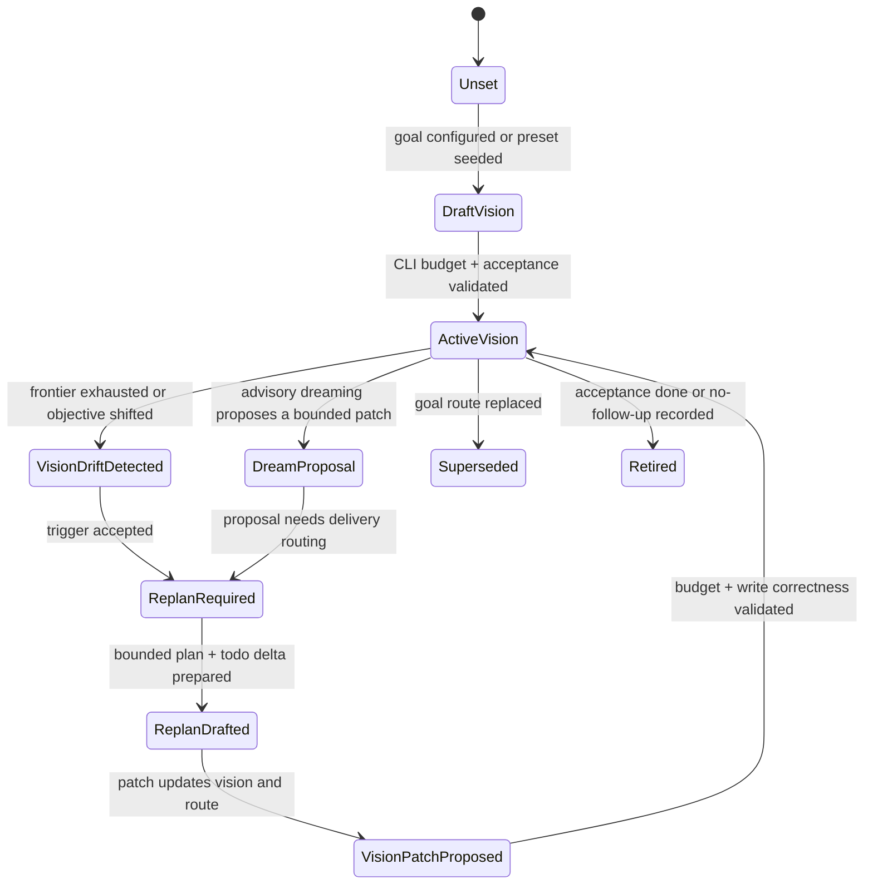

# goal_vision_replan_contract_v0

`goal_vision_replan_contract_v0` defines the small per-agent contract that
connects bounded agent vision, autonomous replan, dreaming proposals, and
goal-routing projection. It is a kernel contract, not an auto-research preset.

The purpose is to keep both the user layer and the product preset thin:

- the user supplies intent and small overrides;
- the preset supplies domain defaults and handoff hints;
- the kernel owns bounded per-agent vision, replan state transitions, and the
  read/write protocol used by quota and status.

Every vision packet and checkpoint is scoped by `agent_id`. Goal-level
projection may aggregate the resulting gaps, but it must not let one role's
vision drift or missing closeout satisfy, block, or wake another role.

## Ownership Boundary

| Layer | Owns | Must Not Own |
| --- | --- | --- |
| User | Objective, optional role overrides, and optional data/eval entrypoint. | Vision state-machine transitions, replan recovery policy, quota routing, or raw agent scratchpads. |
| Preset | Domain roles, handoff hints, metric/evidence adapters, and compact default acceptance text. | Long-lived replan mechanics, pane-local tick policy, generic successor routing, or product-specific forks of the kernel state machine. |
| Kernel | CLI-enforced vision budgets, vision/replan state transitions, goal-route projection, todo/evidence/status protocol, and compact default prompts. | Domain-specific research logic, benchmark scoring, support triage semantics, or sales workflow semantics. |

`loopx/quota.py` should consume the final `goal_route_projection` or
`goal_frontier_projection`. It should not grow per-agent vision storage,
budgeting, dreaming, or product-specific replan logic.

## CLI Budget

Per-agent vision is an executable control-plane field, so the CLI/write API must
enforce a hard size budget before the state reaches quota, status, or a visible
agent pane. Long reasoning belongs in evidence artifacts or design docs.

| Field | Max chars | Purpose |
| --- | ---: | --- |
| `vision_summary` | 420 | Current role-specific direction and success shape. |
| `role_scope` | 280 | What this agent owns and must not own. |
| `acceptance_summary` | 420 | Compact completion contract for this agent. |
| `advancement_policy` | 32 | `as_needed` or `repeat_until_closed`. |
| `replan_trigger_summary` | 240 | Why the latest replan is required. |
| `dreaming_policy` | 240 | Whether advisory dreaming can propose a patch. |
| `last_patch_summary` | 240 | What changed in the latest bounded vision patch. |
| `total_agent_vision` | 1800 | Aggregate budget for one agent's active vision packet, including path delta and fallback declarations. |

The aggregate allowance was raised from 1,200 to 1,800 characters to accommodate
direction, acceptance and evidence-linked replanning together. This is additional
authoring headroom, not a target length or a larger quota-response budget. Summary
field limits, list cardinalities and the 240-character unchanged reason remain
unchanged; concise evidence references still replace long reports. Older packets
remain valid. Older runtimes may reject newly admitted larger packets, so use an
updated runtime for writes and preserve the original intent when correcting input.

整包预算从 1,200 提升到 1,800 字符，让方向、验收与路径调整能够共同表达；
这不是要求填满的长度，也不扩大 quota 输出预算。摘要字段、列表数量及
240 字符的 unchanged reason 限制不变，旧数据继续可读，较大新包需使用新版运行时写入。

Required write-path behavior:

1. Reject over-budget writes with `vision_budget_exceeded`, including the
   current character count, field limit, and a compact suggested replacement
   when the offending field is known.
2. Do not silently truncate fields; truncation hides control-plane intent.
3. Store verbose rationale as evidence and reference it by id.
4. Keep the latest bounded packet visible in status/quota so agents can reason
   without reading private scratchpads or chat history.

The normal lightweight CLI write boundary is `loopx refresh-state` with inline
vision patch fields:

```bash
loopx refresh-state \
  --goal-id <goal-id> \
  --agent-id <agent-id> \
  --vision-summary "<bounded direction>" \
  --vision-acceptance "<bounded acceptance>" \
  --vision-advancement-policy repeat_until_closed \
  --vision-replan-trigger "<why the frontier is insufficient>"
```

`advancement_policy` is a small machine-readable frontier rule, not a domain
label. It defaults to `as_needed`, which preserves bounded external waits only
when the wait belongs to the current vision, current blocked Todo, or its
explicit successor lineage. An unrelated deferred Todo or historical ACK
cannot suppress an acceptance gap. Use `repeat_until_closed` for campaigns,
iterative research, sweepers, and other visions whose open acceptance requires
another advancement iteration whenever the runnable advancement frontier is
empty. In that mode, monitor observations remain useful evidence but cannot
satisfy advancement continuation by themselves. A fresh evidence-linked vision
path outcome, new concrete blocker, coverage-backed terminal result, or a
closed/superseding vision resolves the duty.

For machine-generated or multi-field patches, the same command also accepts
`--agent-vision-json <packet.json>`. The two forms are mutually exclusive and
both pass through the same budget validation. When a vision-derived replan duty
is open, a valid packet counts only when it carries a fresh evidence-linked path
outcome accepted by the shared semantic write gate. An invalid, over-budget, or
pathless packet fails instead of recording a partial closure. A matching typed
semantic ACK settles the vision-derived duty even while the original acceptance
gap remains visible in the source projection.

Quota's replan writeback projection and write-time outcome matching share
`work_items/replan_semantics.ts`. Every vision-derived trigger, including a
missing required baseline, projects evidence-linked JSON authoring through
`replan_action_packet.writeback_contract`; limits come from the existing vision
validator. This is guidance for a valid refresh path, not a new obligation or
the removal of typed successor/blocker/terminal alternatives. A new surface id
alone cannot satisfy a vision obligation. Execute the current settlement binding
exactly once; accepted semantic writeback, satisfied checkpoint, settled Turn
and Goal completion remain separate facts. Existing missing-checkpoint recovery
stays on the original Turn, and in-flight continuation remains unchanged.

投影与写入校验共用 TS 语义规则；required-vision 不再投影只有普通进度标识的模板。
JSON 写作契约复用 vision 校验器，不新增 ACK 仪式，也不改变既有 successor、blocker、
terminal 出口。语义接受、checkpoint 满足、Turn 结算与 Goal 完成仍须分别验证。

Long-chain review also accepts `fresh_vision_path_outcome` and now projects this
JSON route. An acceptance summary plus an evidence-linked `continue`, `no_change`
or `replan` path can retain existing runnable work; no extra planning Todo or
legacy repair ACK is required. Existing typed progress, successor and terminal
exits remain available. Vision-only obligations still reject ordinary progress
identifiers. Use the projected Todo **or** obligation binding, never both.

长链 review 同样接受带验收摘要和证据的 vision path，并默认投影 JSON 写回路径；
可以保留已有可执行工作，无需新增“再次重规划”的 Todo。既有 typed progress、
successor 和 terminal 出口保留；严格 vision 义务仍不接受普通进度标识。

Inline vision writes require `--agent-id`. JSON packets must also resolve to
the same `agent_id` as the refresh run. This keeps `research-executor`,
`evaluator-promoter`, and other roles from overwriting or satisfying each
other's active vision.

### Path Delta

A vision packet may include a top-level `path_delta` object; `goal_path_delta_v0`
is its `schema_version`, not its enclosing field. The shared TypeScript authoring
boundary rejects misplaced declared deltas before any write, including through
CLI and Turn. It does not infer a protocol from ordinary metadata field names.
Existing packets may omit the nested schema version; an explicitly supplied
version must match. The look-back rides the existing `--agent-vision-json`
boundary, so it stays explicit without adding more inline CLI flags or expanding
the heartbeat prompt. Historical read compaction remains unchanged.

```json
{
  "vision_patch": {"vision_summary": "Deliver the verified successor."},
  "path_delta": {
    "schema_version": "goal_path_delta_v0",
    "outcome": "replan",
    "prior_assumption": "Polling would produce acceptance evidence.",
    "observed_reality": "Repeated polls produced no material transition.",
    "retained": ["Keep the verified monitor target."],
    "changed": ["Create one runnable advancement successor."],
    "stopped": ["Stop treating polling as completion evidence."],
    "evidence_refs": ["evidence:monitor-poll", "todo:successor"]
  }
}
```

`outcome` is one of `continue`, `replan`, `wait`, `no_change`, `ask_human`, or
`stop`. `prior_assumption` and `observed_reality` are required when the object
is present, together with at least one `retained`, `changed`, or `stopped`
item. The remaining optional lists preserve unresolved questions and
public-safe evidence ids. The enclosing
vision packet's `agent_id` records who made the comparison; `evidence_refs`
point to evidence instead of copying long rationale or raw artifacts.

The path delta shares the 1,800-character `total_agent_vision` budget.
`prior_assumption` and `observed_reality` each allow 320 characters (previously
220); `reentry_condition` remains limited to 180. Keep/change/stop lists accept
at most three 120-character items, unresolved questions at most two
140-character items, and evidence refs at most four 140-character items. The
write path rejects excess data instead of silently truncating it. This is a
compact audit/read model, not a second planner or a new state machine. An
honest `no_change` remains valid when the observed reality does not justify a
different path.

`state` is a lower `snake_case` lifecycle token. Domain-specific states remain
extensible and are treated as open. The write path canonicalizes closure aliases
such as `closed`, `satisfied`, and `vision_satisfied` to `vision_closed`, and
`closed_no_followup` to `no_followup`. Quota/status use the same centralized
closure predicate when reading older persisted packets, so a legacy alias cannot
silently reopen a satisfied vision. Prose or malformed state values fail at the
write boundary with an actionable error.

When a valid packet includes `replan_trigger_summary`, status/quota projects it
as `goal_frontier_projection.acceptance_gaps[]`. If no runnable advancement
frontier remains, that gap is evaluated before monitor quiet skip and can
produce `autonomous_replan_required`. This is the intended self-discovery path:
an agent records the bounded reason the current vision is still incomplete, and
LoopX turns that reason into the next replan obligation without relying on chat
memory or owner reminders.

## Vision Checkpoint

`refresh-state` always emits a per-agent `vision_checkpoint_v0`, and defaults
to the `semantic_closeout` delivery boundary. A material delivery outcome or a
durable `## Next Action` update at that boundary requires an explicit vision
decision:

```json
{
  "schema_version": "vision_checkpoint_v0",
  "agent_id": "research-executor",
  "required": true,
  "satisfied": false,
  "decision": "missing_required",
  "delivery_boundary": "semantic_closeout",
  "triggers": [
    {"kind": "material_delivery_outcome", "delivery_outcome": "outcome_progress"}
  ],
  "required_resolution": ["write_vision_patch", "record_unchanged_reason"]
}
```

One explicit exception exists for in-flight delivery. When quota admits an
open advancement Todo for normal delivery, its settlement guidance may add the
boundary below. After a resulting `delivery_outcome=outcome_progress`, the next
heartbeat separately prefers that same Todo while its typed facts stay valid:

```bash
loopx refresh-state \
  --goal-id <goal-id> \
  --agent-id <agent-id> \
  --todo-id <selected-open-todo-id> \
  --delivery-outcome outcome_progress \
  --delivery-boundary in_flight_continuation \
  ...
```

This boundary is valid only for the selected agent-bound or unclaimed open
advancement Todo while it is still in flight. It rejects Todo completion, a
durable Next Action update, autonomous replan writeback, and any outcome other
than `outcome_progress`. Its checkpoint has `decision=not_required`,
`required=false`, and a typed
`in_flight_continuation` trigger carrying the Todo id. The next quota decision
can therefore preserve causal ownership without manufacturing another vision
decision merely because the scheduler woke up. Agents must start from
`interaction_contract.cli_channel.next_cli_actions[0]` and preserve its
projected boundary and identity flags; reconstructing a generic
`semantic_closeout` command discards that continuity contract.

Omitting `--delivery-boundary` remains strict `semantic_closeout`. Todo
completion, `outcome_gap`, `primary_goal_outcome`, durable route changes,
replan, and terminal/no-follow-up decisions must use that boundary. This is a
vision/Todo domain transition, not a lighter Effect Program or settlement:
validation, durable writeback, receipts, and quota accounting still run on
every heartbeat.

Valid checkpoint decisions are:

- `patched`: the refresh wrote a bounded `agent_vision` packet for the same
  `agent_id`;
- `unchanged_with_reason`: an already persisted current per-agent vision still
  applies, with a compact public-safe reason. A reason cannot create the first
  vision baseline; without one, the checkpoint remains `missing_required` and
  requires `write_vision_patch`. TypeScript binds the decision to that vision's
  exact `generated_at` revision through `continuity_basis`;
- `missing_required`: the turn was material but did not make a per-agent vision
  decision; and
- `not_required`: no material closeout trigger was present, including a valid
  typed in-flight continuation.

A material closeout should carry its own vision patch or evidence-backed unchanged
reason. If omitted, `refresh-state` still records the outcome and returns the
checkpoint repair action. Follow that action in the same turn with the original
settlement identity: first read `checkpoint-context`, then echo its
`read_context_id` as `--checkpoint-read-context` with a newly judged vision
decision, removing already executed state mutations. The supplement
must satisfy the checkpoint before terminal closeout; it neither re-authors the
outcome nor spends a second time. Never invent an unchanged reason to clear a gap.
Typed in-flight continuations keep their existing exemption.

### Read basis for checkpoint-only recovery

Missing-checkpoint supplementation now requires an explicit read receipt. This is
a default admission change for both legacy and newly committed Turn writebacks;
normal first writebacks and non-Turn vision authoring retain their existing rules.
From the original working directory and with the original registry/runtime/project/
state-file options, read the basis for the exact settlement:

```sh
loopx checkpoint-context --goal-id example --agent-id agent-a \
  --todo-id todo_page --turn-instance-id turn-1 --format json
```

Use `--replan-obligation-id` instead of `--todo-id` for an obligation-bound Turn.
Declared Todo dependencies are included; repeat `--dependency-todo-id` for any
additional upstream Todo results actually used in the judgment. Inspect the
returned `basis`, judge the direction again, and add
`--checkpoint-read-context <read_context_id>` to the checkpoint-only refresh.
The agent echoes this opaque receipt; LoopX retains the version manifest.

MCP hosts use the same protocol through `review_task_vision`: call with only
`todo_id` and `agent_id` to read, then submit the returned `read_context_id`
with one newly judged `agent_vision` or `vision_unchanged_reason`. Reading never
automatically submits a decision. Missing receipts fail closed; stale receipts
require another read and judgment, while lost replies use the exact original
receipt and decision. The Python `checkpoint_context_io` adapter gathers and
locks local sources. TypeScript derives canonical Todos and the complete owner
acceptance document from one authority head; `checkpoint_read_context` compares
the basis and `checkpoint_commit` owns the final append.

The basis covers the selected Todo, its dependency closure and recorded results,
shared Goal prose and User Todos, the owner acceptance document/revision when
configured, the current agent vision, and the local source binding. A replan
obligation covers the full Todo frontier. Archived dependencies remain inputs.
Large local bases use digest-checked private files across the Python/TypeScript
runtime boundary, including the response; the CLI still returns the complete
basis. The 2 MiB default RPC guard remains for other effects. File size is
bounded and an unverifiable response after a possible commit is ambiguous,
so the caller reads the exact receipt before retrying any mutation. Neither
transport nor a future paged presentation may silently omit a basis component.
Todo display positions, source headings, and the Goal's global `updated_at` are
excluded; an unrelated Agent Todo or run-history append does not invalidate an
otherwise unchanged Todo-bound basis. Shared prose is deliberately conservative:
editing it requires another judgment even if the edit was only editorial.

The File/SQLite path retains the Goal index and local source protection, then
enters the real provider's writer fence: File uses the same mutation lock as
`commitAuthority`; SQLite uses one connection's `BEGIN IMMEDIATE`. Final head
read, version comparison and checkpoint append complete before release. SQLite
performs this short section synchronously, with no `await` while holding the
transaction. Model reasoning and projection sync remain outside it. The provider
revision is returned for diagnostics, but only relevant component changes or a
different store identity invalidate the basis. Old v0 receipts require a new read.

The ordinary local Todo command wrapper already takes the maintenance lock
before committing. The provider fence additionally covers transactions through
the exported provider boundary that do not take that outer lock; these are
distinct concurrency tests. Provider failures stay closed. This adds no
PostgreSQL or cross-Goal transaction support and does not move checkpoint
authority into the Todo provider. SQLite cannot roll back the external run files.

Index lock order is kernel then mutation marker for Python writers; existing
quota adapters retain their kernel lock around the native marker owner. Native
writers never wait for the kernel lock. Source writers retain marker then kernel,
in maintenance/Todo/state order. History append/repair, refresh, feedback,
operator-gate, project-map and runtime projection use this shared index boundary;
feedback takes the index before state. The checkpoint effect claims the caller's
index/source markers and owns their release through the durable append. Caller
exit or timeout does not release an in-flight effect's claims. Runtime death
allows the existing conservative PID/token reclaim; a live stalled owner times
out contenders rather than losing its lock. No model or Agent holds a store lock.

Receipts are bound to the exact Goal/Agent/Todo or obligation/Turn. A new read for
that Turn replaces its previous receipt, so its confirmation operations must be
serial; other work may remain parallel. A missing, replaced, or stale receipt
rejects the supplement without appending delivery or spending quota. Rerun
`checkpoint-context`, reread, and rejudge. Never attach a new receipt to an old
judgment. The committed decision includes the receipt identity in its replay
digest: an exact retry returns the original result even if state changed after
commit. Acquiring a receipt for an already satisfied checkpoint is rejected.
Replay also verifies the committed artifact references. A malformed/torn index,
conflicting checkpoint rows, or inconsistent artifacts returns an explicit
unknown/error; prepared JSON/Markdown alone never authorizes a blind append.

Versions are content revisions of the declared decision inputs, including native
revision fields where present. They cannot detect an unobserved change-and-revert
in legacy Markdown, raw writes bypassing the writer locks, or changed bytes behind
an unversioned external link. Upstream deliveries must be represented by their
recorded Todo results/references. The receipt verifies the declared basis, not
whether the model actually understood or used it. It grants no new permissions,
task-completion authority, or evidence of acceptance. Older binaries do not enforce
this admission rule; rolling back loses its freshness protection.

`missing_required` is not a chat reminder. Status keeps it in compact run
history, quota filters it by current `agent_id`, and goal-frontier projection
turns it into `acceptance_gaps[]`. If the current agent has no runnable
advancement frontier, that gap can trigger `autonomous_replan_required`.
For the same `agent_id`, a newer satisfied checkpoint with `patched` or
`unchanged_with_reason` supersedes older
`missing_required` checkpoints; `not_required` does not.

A satisfied checkpoint is protocol-complete, but a material closeout also has
to qualify its relationship to the final outcome. A patched checkpoint must
name the active `acceptance_summary`, attach public-safe
`goal_path_delta_v0.evidence_refs`, and record one of these decisions:

- `continue` or `no_change` when the new evidence supports the final-outcome
  path and the delivery did not report `outcome_gap`; or
- `replan` when the evidence contradicts or leaves the path open. The typed
  path outcome is itself the vision decision; it does not rely on a legacy
  autonomous-replan ACK flag.

An `unchanged_with_reason` checkpoint may reuse that evidence-linked path only
when its typed `continuity_basis` matches the exact current vision revision and
the persisted path already carries the acceptance claim, evidence refs, and a
legal path outcome. A missing or mismatched basis, an evidence-free prior path,
or a newly missing checkpoint opens a new outcome gap. This closes the accepted
revision without suppressing a later material vision/checkpoint change.

An older path delta, an unchanged-with-reason decision, or an unrelated
runnable todo does not qualify the material closeout. Quota projects
`vision_outcome_checkpoint_required` ahead of ordinary runnable work until a
fresh evidence-linked continuation or replan is recorded. The same rule
applies when a same-agent advancement todo was completed after the latest
qualifying checkpoint. Todo completion is therefore the checkpoint timing
signal, not proof that the final acceptance contract is done; the evidence
decides whether to continue, replan/supersede, or close.

Checkpoint packets, context-delivery receipts, manual evidence reads, and
historical autonomous-replan ACKs are protocol records, not semantic completion
proof. A future monitor schedule is also not completion proof; it only says
when to poll. If evidence, successor state, blocker state, or a superseding
vision packet still shows the vision is unmet, the acceptance gap remains
authoritative and quota must continue to project replan work. The write-time
gate derives that same obligation from the goal-frontier reducer, so a
maintenance classification or an ACK for an earlier periodic duty cannot bypass
a newly rotated vision duty.

### Semantic History Continuity

`run_history.goals[].latest_runs` is a strictly bounded recency drill-down. It
must not grow beyond its requested display limit to preserve older control
records. Long-lived goal semantics instead use `goal_semantic_history_v0`, a
per-agent read model whose size grows with participating agents rather than
heartbeat count.

Each agent lane independently selects the latest active vision (or explicit
retirement), latest checkpoint, latest outcome-relevant checkpoint, latest
autonomous-replan ACK, and latest material milestone. The goal also retains the
latest compact human reward as the owner-correction slot. Repeated quota spend,
monitor polling, promotion readiness, and ordinary refresh rows do not consume
these semantic slots.

The outcome-checkpoint slot retains its same-run qualification vision. A newer
plain refresh may become the latest general checkpoint, but it cannot hide the
older material checkpoint or borrow a later path delta. Likewise, another
agent's qualified checkpoint cannot satisfy the selected lane. Goal-frontier
readers prefer this semantic context and fall back to `latest_runs` only for
older status payloads that do not carry the new read model.

Agent-scoped status keeps only the selected agent's semantic lane plus the
compact owner-correction slot on the hot path. Whole-goal, all-agent history
remains available through unscoped status/history diagnostics. This keeps
final-outcome continuity authoritative without turning a long heartbeat thread
into an ever-growing CLI payload.

## Vision Continuation Audit

Every selected todo is a bounded step toward the active per-agent vision, not a
replacement for that vision. Before an agent records `todo complete`, a
no-follow-up rationale, `--vision-unchanged-reason`, or an autonomous replan
ACK, it must audit the current evidence against the active
`acceptance_summary`:

1. Derive the explicit requirements from the active vision, current todo,
   user correction, and protected scope.
2. Name the authoritative evidence for each requirement: changed files,
   public-safe evidence records, public web research findings, evaluation
   outputs, successor state, blocker state, or a superseding vision packet.
3. Treat weak, indirect, stale, or protocol-only evidence as incomplete.
4. Before external research, inspect the selected goal's registry-declared
   `topic_authority` and `project_materials`, preferring the host-projected
   replan coverage ledger, `agent_material_frontier`, and projected required
   reads. Use role, freshness, revision,
   boundary, gate status, and conflict rule to select permitted references.
   Registration guides discovery; it neither grants access nor proves acceptance.
5. If projected evidence and permitted registry references remain weak, and the
   acceptance question depends on public facts, run bounded public web research
   from primary or authoritative sources and write back the confirmed/refuted
   finding.
6. If any requirement remains unproven, keep the vision active by creating a
   successor todo or writing a compact `--vision-replan-trigger`.

Quota/status expose this as `vision_continuation_audit_v0` in the CLI payload
and `interaction_contract`. This mirrors the `/goal` continuation rule: goal
state persists across turns until evidence proves the requested end state. It
prevents a role from declaring success merely because it consumed the currently
selected todo, recorded a checkpoint, or observed that another lane is quiet.

A typed progress observation with `result_class=no_followup` is coverage
evidence, not Todo lifecycle settlement. A writeback may use its
`coverage_backed_no_followup` outcome only when the same packet closes the
agent vision with `state=no_followup` and records `path_delta.outcome=stop`.
If a completed advancement Todo still lacks a successor, the agent must first
settle that Todo through `loopx todo complete --no-follow-up` (or add/link a
successor). A semantic ACK cannot replace this durable continuation, and the
repair path must not invent a human gate without a real external authority.

The audit also exposes a compact deterministic `vision_gap_judge_v0`
instruction packet for the agent. It borrows the strict done-judge stance used
by autonomous goal loops without calling an LLM: the agent is told to compare
the active vision `acceptance_summary` with the host-projected coverage ledger,
then permitted registry-declared material references. The agent-scoped
`loopx evidence-log` remains an operator diagnostic, not a mandatory model ritual.
Bounded public web research is the next
fallback when those sources are missing or stale and the gap depends on public
facts. `done=true` is only valid
when the response or state clearly provides one of these outcomes:

- explicit completion with authoritative evidence;
- final deliverable or evaluation output satisfying the acceptance summary;
- a projected blocker/user gate that makes the goal unachievable without input;
- a superseding vision or no-follow-up rationale that explicitly closes the
  frontier.

Otherwise the judge remains `continue` and quota should keep projecting either
the runnable successor or the replan trigger. This is intentionally stricter
than todo lifecycle status: a completed todo is only evidence input, not the
judge result.

## State Machine



| State | Meaning | Required Exit Evidence |
| --- | --- | --- |
| `Unset` | No per-agent vision packet exists. | Goal configuration or preset seed. |
| `DraftVision` | A bounded packet is being prepared. | CLI budget validation and acceptance text. |
| `ActiveVision` | Agents may use the packet for lane-local work. | Progress, evidence, replan trigger, or retirement. |
| `VisionDriftDetected` | Current vision no longer explains the frontier. | Concrete trigger, not vague "needs planning". |
| `DreamProposal` | Advisory planning suggests a patch. | Explicit proposal id and public-safe summary. |
| `ReplanRequired` | The next bounded work is replan, not quiet wait. | Replan obligation in goal-route/frontier projection. |
| `ReplanDrafted` | A concrete route/todo/acceptance delta exists. | Bounded patch packet. |
| `VisionPatchProposed` | The patch is ready to apply. | Budget check and local-state write correctness. |
| `Superseded` | Another route replaces this packet. | `superseded_by` or successor id. |
| `Retired` | The route is complete or intentionally closed. | Acceptance evidence or no-follow-up evidence. |

The canonical stored close states are `vision_closed`, `retired`,
`retired_or_superseded`, `superseded`, and `no_followup`. A state such as
`completed_current_slice` intentionally remains open because completing one
slice is not evidence that the per-agent vision acceptance is satisfied.

These close states do not all have the same succession meaning.
`vision_closed` means the current bounded stage passed its acceptance; while
the registry goal remains `active` (including `active-*` variants), quota must
project `vision_successor_required` and run a bounded replan before ordinary
advancement or monitor quiet. The agent must write the next bounded vision, or
choose the explicit terminal lane semantics `retired`, `superseded`, or
`no_followup`. A completed/archived registry goal does not need a successor
vision. This keeps stage completion from silently terminating a long-horizon
goal.

### Exact blocked-successor wait

An open agent vision can wait when every causal Todo binding of its ordinary
acceptance gap has a related current-agent or unclaimed advancement successor
whose supported `resume_when` condition is projected as `resume_ready=false`,
or an exact current-agent blocker with a reason. One route's wait cannot cover
another uncovered binding. When there is no other selectable advancement, quota/status expose
`goal_vision_wait_state_v0` with the waiting todo id, `resume_when`, compact
`resume_condition`, and `automatic_resume=true`. The ordinary
`vision_acceptance_gap` is deferred while that read model is active, so the
agent can remain quiet instead of inventing duplicate successor work.

This is a read model, not a stored vision or todo lifecycle state. When the
condition becomes ready, normal open-todo or deferred-successor routing resumes
automatically and the active vision remains available for acceptance auditing.
It cannot suppress `vision_checkpoint_missing`, `vision_successor_required`, a
resume condition that lacks exact projected evidence, or the dedicated repair
for an advancement todo incorrectly gated by a standing continuous monitor.

The normal `refresh-state --vision-todo-delta <action>:<todo_id>` and Turn vision
write paths supply the causal bindings. Todo create/update/complete/supersede
and resume evaluation supply their current facts. A planned `create/reopen`
entry is a binding to inspect, not proof that its Todo exists. An agent changes
the active bindings through the existing vision writeback contract when the
plan changes; finishing a Todo alone does not prove its acceptance is closed.
Explicit successor lineage can connect a completed or archived predecessor to
a real waiting successor. Sharing a prerequisite does not make two sibling
Todos interchangeable, and a terminal vision keeps its existing lifecycle rules.

Wait witnesses are derived from canonical Todo rows and evaluated conditions
before display compaction. `agent_todos.vision_wait_states` carries only those
positive, agent-scoped results, bound to `causal_todo_ids`; each source read
rebuilds them for the latest vision. It is not a stored or separately authored
state. Quota and semantic writeback use the same coverage reducer. Display
limits remain unchanged: extra unrelated Todos and reordering cannot change
the wait decision. If a legacy/incomplete source cannot prove coverage, the
existing acceptance gap stays open; missing display rows do not prove that
canonical work is absent or that all alternatives are exhausted.

This tightens the previous any-related-wait behavior. With bindings to A and B,
A waiting and B unmaterialized requires replan when execution gates permit it;
a runnable B continues, and related valid waits for both preserve defer. The
rule uses existing acceptance/lineage facts regardless of the optional advisory
`fallback_declarations`. It neither discovers alternatives nor invents AND/OR
relationships, and it grants no additional authority. Ownership, exclusions,
capabilities, user gates, and quota remain independent execution constraints.

等待资格现在逐项检查已有 acceptance 的 Todo 关联，并在展示裁剪前从完整来源计算。
A 的等待不能遮住尚未落实的 B；有可执行工作则继续，相关工作都具有合法等待证据才暂缓。
无需另外维护 fallback 声明；无关 Todo 的数量和顺序不应改变决策。

## Replan Triggers

A replan trigger is goal-level and should be evaluated before lane-local quiet
or agent-scope wait decisions:

- normalized progress shows no remaining advancement frontier;
- monitor-only lanes have no material transition and acceptance remains open;
- a cleared handoff has no successor or no-follow-up rationale;
- the current agent lane owns at least 15 open advancement Todos;
- a periodic autonomous replan obligation is due;
- the user objective or acceptance contract changed;
- an approved dreaming proposal requires a delivery route.

The replan decision must not be disturbed by monitor quiet skip, scoped gate
waiting, or a single agent having no runnable todo. Those may explain local
lane state, but they cannot erase a required goal-level replan.

Long-chain scope corrections (#4667, #5001): Agent-scoped counts exclude shared
unclaimed candidates and continuous monitors. Shared candidates remain selectable,
but a new long-chain duty requires at least 15 claimed advancement Todos. The former
20-claimed-open threshold no longer triggers an Agent lane. Unscoped Goal
observations retain the selectable-pool thresholds; monitor due selection and
no-change replan rules are unchanged. The typed frontier owner supplies
`obligation_identity_revision` from the owned material identity, keeping an open obligation stable across
peer/shared-pool churn; `frontier_revision` retains the full selectable-source
checkpoint for diagnostics and historical ACK matching. Owned material changes
still rearm. Timestamp/evidence bookkeeping does not. Existing accepted ACKs
remain readable, including predecessor recovery for historical open-count
obligations; an outstanding pre-upgrade Turn should refresh its guard.

长链触发范围修正：Agent lane 只在自己已认领的开放推进任务达到 15 项时触发；
持续监控和共享未认领任务不计入该阈值，移除原 20 项已认领开放任务的触发分支。
共享任务仍可选取；无 Agent 的 Goal 总览保留原可选池口径，监控到期和无变化重规划
规则不变。历史开放任务计数 checkpoint 的读取与前置义务恢复保持兼容。
义务身份使用 typed owner 给出的 owned 实质 revision，同伴修改共享池不会让正在
处理的义务换 ID；自己任务的实质修改仍重新触发。证据补充或更新时间不重新触发。

## Replan Output

A valid replan writes at least one bounded delta:

```json
{
  "schema_version": "goal_vision_replan_contract_v0",
  "goal_id": "example-goal",
  "agent_id": "research-curator",
  "state": "vision_patch_proposed",
  "vision_patch": {
    "vision_summary": "Map the next evidence frontier and hand off one runnable claim.",
    "role_scope": "Owns research framing; does not run evaluation.",
    "acceptance_summary": "One concrete successor todo plus evidence refs.",
    "replan_trigger_summary": "Frontier exhausted while acceptance remains open."
  },
  "path_delta": {
    "schema_version": "goal_path_delta_v0",
    "outcome": "replan",
    "prior_assumption": "The existing frontier could satisfy acceptance.",
    "observed_reality": "No runnable advancement remains.",
    "retained": ["Keep verified evidence and the acceptance boundary."],
    "changed": ["Route one new bounded successor."],
    "stopped": ["Stop repeating the exhausted action."],
    "evidence_refs": ["evidence:frontier-review-01"]
  },
  "todo_delta": ["create_successor", "retire_stale_monitor"],
  "validation": {
    "budget_checked": true,
    "write_correctness_checked": true
  }
}
```

An acknowledgement without an obligation-accepted typed semantic delta is
`replan_noop` and must not clear the obligation. Depending on the obligation,
accepted outcomes can be a new evidence-backed surface, hypothesis, or probe
family; a runnable successor; a new concrete blocker; coverage-backed
exploration exhaustion or no-follow-up; or a fresh evidence-linked vision path
outcome. A typed `goal_vision_patch` repair delta is the vision-derived ACK that
settles vision successor/checkpoint gaps even when the original acceptance gap
remains visible in the source projection. `refresh-state` does not treat
classification prose,
`--autonomous-replan-recorded`, or a caller-supplied repair kind as proof. New
writebacks use `typed_progress_observation_v0`: changed surface, hypothesis, or
probe identifiers are compared with the obligation baseline; a successor id
must resolve to a current runnable advancement Todo; blockers must be new and
evidence-backed; terminal results require coverage scope and evidence. A
vision-derived duty accepts only its declared vision outcomes. Historical
repair ACKs are not accepted by the semantic replan reducer; they remain inert
history rather than a compatibility closure path.

The compact `autonomous_replan_ack` projection preserves the aggregate
`fresh_vision_path_outcome` in `semantic_delta` and, when that outcome is
present in the validated `outcomes` list, adds the same run's
`agent_vision.path_delta.outcome` as top-level `path_disposition`. Only
`continue`, `no_change`, and `replan` are projected. The field is additive and
observational: it does not alter settlement, and it is omitted for non-vision,
legacy, or invalid path packets. Consumers should inspect `outcomes` rather
than only `satisfying_outcomes`, because one accepted ACK may combine a vision
path observation with a different obligation-satisfying outcome.

### Bad Case: ACK Hidden By Scheduler Accounting

Observed failure: a monitor-only lane correctly projected
`autonomous_replan_required`, then a worker recorded a replan ACK with a
frontier delta. The next quota check became quiet, but a later neutral spend or
accounting run replaced the latest status record. Because quota only saw the
latest run, the same monitor lane was projected as `autonomous_replan_required`
again, causing a scheduler/replan loop.

Root cause: replan ACK state was treated as latest-run detail instead of a
durable goal-frontier projection. Scheduler/accounting records are useful
history, but they are not material frontier changes.

Repair rule: status must project the newest durable replan ACK across neutral
accounting and monitor-poll runs until a real material transition appears.
Quota then consumes that compact projection and does not duplicate the history
scan or let scheduler backoff override the replan state machine.

## Projection Contract

Status, quota, diagnose, and visible multi-agent panes should expose the same
compact goal-route facts:

- `normalized_progress`: how far the goal has moved relative to acceptance;
- `remaining_frontier`: runnable or replanable next edges;
- `monitor_only_lanes`: lanes that are waiting without advancement;
- `deferred_successors`: successors blocked by handoff, resume, or gate;
- `acceptance_gaps`: missing evidence or contract fields;
- `autonomy_blockers`: concrete blockers to autonomous progress;
- `vision_budget`: current character usage and any rejected overage reason.

These fields are projections. Writeback still goes through LoopX write APIs,
not through dashboards, Lark mirrors, or chat text.

When quota requires an autonomous replan, the host projects the current agent's
recent public-safe evidence ledger into `replan_context_v0`; a weak
protocol-following model does not need to discover and execute a separate read
ritual. A todo-specific evidence read remains useful as drill-down, but its
receipt proves only context access. If projected evidence is empty, stale, or
contradictory, the agent may use bounded public-safe search and write back
source references with the typed observation.

## Write / Correction Mechanism

After a material milestone, `vision_outcome_checkpoint_required` remains a
completion guard. When the checkpoint is satisfied and current, the path outcome
is `continue`, `no_change`, or `replan`, evidence refs are present, and no
`outcome_gap` was reported, an absent or blank `vision_patch.acceptance_summary`
is diagnosed as `final_outcome_claim_missing`. Add or restore a bounded claim
supported by those evidence refs; a learning milestone alone does not prove
the final outcome. Keep the valid route and evidence in the correction. The
existing durable-field write gate still requires `path_delta.outcome=replan`
when changing the claim against an open replan obligation; record that bounded
claim correction rather than repeating a generic path investigation.

The gap and replan trigger carry `reason_code`, `component_checks`, and
`resolution_hint`. The same diagnostic appears in the compact CLI audit,
managed Turn contract capsule, Goal acceptance observations, and Lark projection
rows. Component checks distinguish checkpoint satisfaction and freshness, path
validity, evidence presence, claim presence, and reported outcome gaps. Other
incomplete combinations retain the guard and use
`final_outcome_checkpoint_incomplete`. Diagnostics are read-only: retrying
`quota should-run` neither spends quota nor supplies acceptance evidence, and
the added explanation does not change the obligation's identity.

Synthetic Goal acceptance views (read-only fixture, no connected execution
service) show the missing-claim diagnosis and passed/failed components:

| View | Before | After |
| --- | --- | --- |
| Desktop, Chinese | [Before](../../assets/personal-workspace/final-outcome-claim-before-desktop.png) | [After](../../assets/personal-workspace/final-outcome-claim-after-desktop.png) |
| Mobile, English | [Before](../../assets/personal-workspace/final-outcome-claim-before-mobile.png) | [After](../../assets/personal-workspace/final-outcome-claim-after-mobile.png) |

Vision correction is a normal state-machine transition, not only a
self-repair fallback. Agents should write a bounded vision patch when:

- a normal progress turn changes the role's acceptance target;
- a user correction narrows or redirects the goal;
- a replan discovers that the current frontier no longer satisfies the
  acceptance summary;
- a monitor-only lane should remain a watch lane but needs an explicit
  continuation or expiry condition, including explicit monitor successors and
  a watch ACK; or
- a product bottleneck is real but no current todo/frontier projection exposes
  it.

The inline flags keep the common path small. A role can update only the fields
it knows: inline writes merge those fields into that agent's latest active
vision, preserving omitted durable mainline fields and the current state. A
todo, PR, capability, or monitor wait should normally update its own todo plus
`replan_trigger_summary` or `last_patch_summary`; it must not replace the
role's broader `vision_summary` merely because that dependency is current.

JSON packets are complete generated updates. When satisfying a current
vision-derived replan obligation, changing an existing `vision_summary`,
`role_scope`, `acceptance_summary`, or `advancement_policy` requires a
`goal_path_delta_v0` with `outcome=replan`, regardless of whether the update
arrived through JSON or inline flags. This keeps a real mainline change
possible while making the prior assumption, observed reality, and
retained/changed/stopped route machine-auditable. Unchanged full packets,
non-replan inline edits, and initial baselines do not need a path delta.

When no patch is needed, the agent should still close a required checkpoint with
`--vision-unchanged-reason`. That reason is per-agent and must explain why the
existing acceptance and route still cover the material closeout.

## Acceptance

A change satisfies this contract only when:

- per-agent vision fields are rejected or compacted at the CLI/write boundary;
- inline vision writes require a concrete `--agent-id`;
- material `refresh-state` closeouts emit a per-agent `vision_checkpoint_v0`;
- missing per-agent checkpoints can become agent-scoped replan gaps instead of
  global goal-level noise;
- quota/status and `interaction_contract` expose a
  `vision_continuation_audit_v0` before todo closeout, no-follow-up,
  `--vision-unchanged-reason`, or typed replan writeback;
- ordinary `refresh-state` calls can write bounded vision corrections without a
  separate self-repair-only path;
- replan state is decided from goal-level projection before local quiet/wait
  classifications;
- replan can clear an obligation only by writing a typed semantic delta accepted
  against the current goal-frontier obligation;
- durable replan ACKs survive neutral scheduler/accounting runs until material
  frontier state changes;
- `quota.py` consumes the resulting projection instead of storing vision logic;
- auto-research remains a thin preset over the reusable kernel; and
- public docs and smokes cover the budget, state machine, and `quota.py`
  boundary without private material.

## History-trigger ownership and retry semantics

The built-in `work_items/replan_history.ts` decision owns historical progress
repetition, blocked-successor repetition, repeated executed Monitor polls,
periodic review, and the persisted unchanged-Monitor streak. The Python codec
preserves historical observation fingerprints and timestamp parsing, then sends
one bounded fact request. Obligation rendering and identity serialization retain
the existing public contract. This is deterministic policy; no observer model,
new capability, provider selection, or additional permission is introduced.

History is newest first. Agent scoping precedes an accepted replan ACK cutoff;
a peer ACK cannot clear another lane. The three existing neutral accounting
classifications are transparent. A valid logical turn id is counted once per
agent, including an id carried by settlement identity. Missing, malformed, or
conflicting historical ids remain separate rows; the reader does not invent an
identity. Unknown material work still breaks an established progress streak.

The default thresholds remain two equivalent typed observations, two blocked
successor waits, six executed unchanged Monitor turns, twenty material turns
for periodic review, and five persisted unchanged polls for a Monitor-only
lane. Trigger precedence remains progress, Monitor, then periodic review.
Accepted ACKs reset the historical window; clearing another frontier obligation
still requires its existing typed semantic outcome and revision rules. A future
blocking Monitor suppresses premature wait replanning only while its schedule
and expiry are valid; the decision reuses the Todo resume planner.

These are enforced replan conditions, not advisory hints. Relative to the older
reader, retry records no longer accelerate periodic/Monitor thresholds, accepted
ACKs now stop typed-progress repetition, and neutral accounting no longer hides
repetition. These changes apply to legacy, File, and SQLite status/quota callers
without an opt-in. Frontend and Lark consume the existing obligation shape and
need no new setting or editor. Read back with `loopx status --goal-id <id>` and
`loopx quota should-run --goal-id <id> --agent-id <agent>`.

### 中文：历史触发与重试语义

历史触发规则由现有 work_items 的 TypeScript 边界统一维护，Python 负责旧数据
解码及原有 obligation 呈现。没有新增模型、capability、provider 选择或权限。
先按 agent 筛选，再遇到已接受的 replan ACK 截断窗口；其他 agent 的 ACK 不能
清空当前窗口。中性额度记账不计数、不打断停滞；同一 agent 的有效 Turn ID
只计一次。无效、缺失或相互矛盾的历史 ID 不被猜测性合并。

阈值仍为：2 次相同 typed progress、2 次 successor 等待、6 次已执行监控、
20 次实质工作轮次、5 次持久化监控无变化。优先级及 obligation 标识保持原样。
修复的是计数单位、ACK 截断和记账透明性，适用于旧路径及 File/SQLite；这些是
机器执行的 replan 条件。尚未到期且在到期时仍有效的关联监控继续抑制提前重规划。
这不替代其他 frontier 的语义验收、版本检查或权限。前端与 Lark 继续使用原有
返回结构；可用上面的 status/quota 命令核对。
