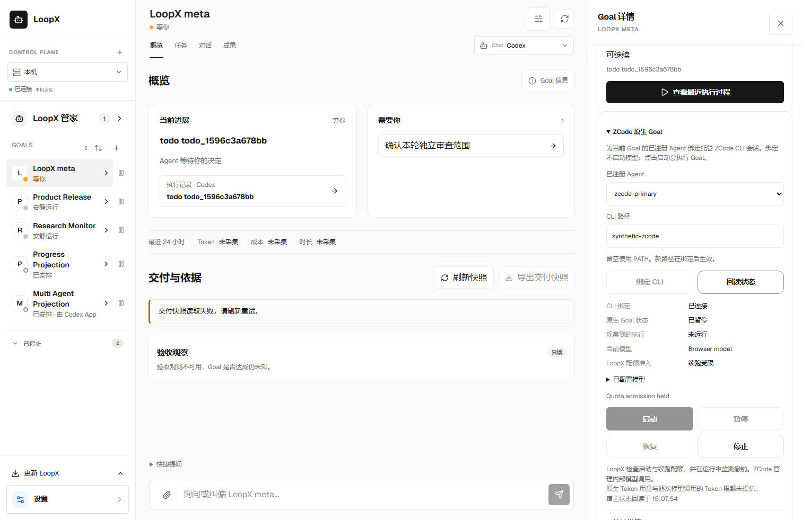
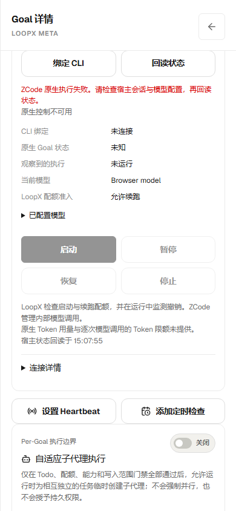

# ZCode host integration

LoopX has two explicit ZCode entry points: the existing `$loopx` skill facade
and an opt-in provider for one managed CLI native Goal. Native execution is off
until the user binds and starts it. Selecting a host or installing skills does
not start a process, run a model, or enable Automations.

## Existing skill entry

```bash
loopx slash-commands --install --surface zcode
```

The installer refreshes marked LoopX files in `ZCODE_HOME/skills` (default
`~/.zcode/skills`, with the legacy `ZCODE_AGENTS_HOME` fallback). It preserves
user-owned files. Refresh Settings → Skills in ZCode and invoke `$loopx` or
`/loopx <task>` in a connected project. The default activation still runs
`start-goal --guided --project . --host-surface zcode`; the agent carries the
canonical heartbeat task and checks `quota should-run` on each continuation.

## Managed native CLI Goal

Use an existing active LoopX Goal, its canonical project, and an Agent already
registered to that Goal. This provider reads existing authority; it does not
register an Agent or invent a Goal instance. Node.js must satisfy LoopX's
existing TypeScript runtime requirement. Supply an installed CLI executable or
an existing ZCode JS bundle if `zcode` is absent from PATH. On Windows, select
the JS bundle instead of a `.cmd`/`.bat` shim or Desktop executable.

```bash
loopx --format json zcode-goal bind --goal-id GOAL --agent-id AGENT --zcode-cli /path/to/zcode.cjs
loopx --format json zcode-goal status --goal-id GOAL --agent-id AGENT
```

Binding verifies the actual app-server protocol, creates an idle native session
and persists it through a native pause receipt before reading model availability.
It does not start a native Goal or a model request. An existing ZCode
model default is retained. If no model is selected, choose one from the
readback's `native.available_models`; disabled models cannot be selected:

```bash
loopx --format json zcode-goal select-model --goal-id GOAL --agent-id AGENT --provider-id PROVIDER --model-id MODEL
```

When that model advertises reasoning levels, supply `--reasoning-level LEVEL`
using an advertised level. Selection belongs to this managed native session;
LoopX does not configure provider credentials or infer that a listed model is
usable. A model request can still fail. Then explicitly operate the Goal:

```bash
loopx --format json zcode-goal start --goal-id GOAL --agent-id AGENT
loopx --format json zcode-goal pause --goal-id GOAL --agent-id AGENT
loopx --format json zcode-goal resume --goal-id GOAL --agent-id AGENT
loopx --format json zcode-goal stop --goal-id GOAL --agent-id AGENT
```

The existing Goal detail drawer includes **ZCode native Goal**. Choose a
registered Agent, bind its CLI, select a model when necessary, then use the
same start/status/pause/resume/stop controls. The frontend and CLI share the
provider's action and readback contract. HTTP operations require the existing
local loopback and origin checks. Mutations assert the Goal reference and
creation witness from the last readback before launching provider effects; a stale panel must refresh
after Goal replacement. This provider is not a remote control API.

The binding journals the LoopX Goal reference, registered Agent, canonical
project, native session and native target. Existing instance identifiers remain
exact. Legacy Goal aliases retain compatibility and their existing creation
witness; `identity_scope` distinguishes their weaker lifetime boundary. If the legacy
registry has no creation witness, identical alias deletion/recreation is not
detectable as a new lifetime. Stop before rebuilding such a Goal; this provider
does not mint a substitute instance identity. Lifecycle-only
`source_session_v1` registry profiles remain unavailable for this runtime,
as required by Core. Replacement identity or changed authority rejects work.

Start uses the current canonical heartbeat task. Pause confirms cancellation
has drained; resume retains the same session and target. Repeated start cannot
replace an executing target. Cold recovery restores that session, pauses an
active target and never automatically resumes. The managed broker serializes
operations and owns the app-server process tree; a guardian closes that tree
if the broker dies. Its session database is isolated from other CLI/Desktop
sessions. A lost start receipt can be recovered only from a durable admitted
intent with the same canonical objective hash.

### Goal controls

These illustrations use synthetic UI fixtures. They show the controls and
unavailable states, not real execution or billing evidence.

When quota denies continuation, the panel shows a paused target and disables
start/resume while retaining stop and status readback:



On mobile, a native execution failure stays visible alongside status readback.
A disconnected observation remains unknown; refresh before retrying:



### Quota and authority boundary

Start and resume call Core `quota should-run`. During execution, serial checks
run approximately every two seconds, with a bounded authority/quota subprocess
timeout. Denial or unavailable authority pauses the owned target; an
unconfirmed pause closes the owned host. This is admission plus revocation,
not a per-model-call, per-token or native-round hard budget. Native background
model failures are paused and reported with a safe error reason. Native usage
is unknown here, and native completion does not settle a LoopX Goal, debit
credits, or certify acceptance. Each explicit execution has a one-hour safety deadline;
paused idle controllers close after five minutes and can be restored explicitly.

The managed host denies interactive permission requests and disables automatic
question resolution. Native execution grants no new tool, shell, filesystem,
credential, scheduler or settlement authority. This phase does not attach the
current terminal/Desktop conversation and does not install MCP, Hooks, Desktop
plugins or Automations.

### Stop, disable and recover

`pause` retains the target for explicit resume. `stop` confirms pause, clears
the native target and closes the managed process; it preserves the session
history and binding for a later explicit start. Read status before retrying an
operation whose response was lost. A disconnected readback does not claim the
native process is running. Cleanup remains available for the same registered
identity after the LoopX Goal is stopped; execution does not.

To change the selected CLI, stop first, then repeat `bind --zcode-cli ...`.
The old owner must finish cleanup before a new native session is created.
Leaving this provider disabled requires no configuration switch: stop it and
do not start/resume it. Uninstalling skill files is a separate operation:

```bash
loopx slash-commands --uninstall --surface zcode
```

This removes only installer-owned skills. It does not stop an already bound
native Goal or delete the user's ZCode configuration, credentials or sessions.

## Host diagnostics

```bash
loopx doctor --agent-type zcode
loopx doctor --agent-type zcode --zcode-cli /path/to/zcode.cjs
loopx doctor --agent-type zcode --zcode-desktop /path/to/ZCode
loopx doctor --agent-type zcode --zcode-source /path/to/ZCode-checkout
```

Doctor separately observes PATH CLI, installed Desktop/bundled CLI and an
explicit source checkout. Root package and existing runnable dist versions are
separate. Its isolated probes use version/help only: they do not handshake,
execute models, verify authentication, attach Desktop or exercise Automations.
Read `skill_delivery.status` and host observations even when overall required
installation/runtime checks return success. Repair marked skill files with
`slash-commands --install --surface zcode`; use the same `--cli-bin` for a
custom LoopX executable and resolve user-owned conflicts explicitly.

## Ownership and validation

This is a bounded S4/S5/S7/S8/S12 host provider, not a new capability or a second
Goal/quota decision owner. TypeScript owns provider session state and effects
(`contract.ts`, `runtime.ts`, `cli.ts`, `app-server.ts`, `guard.ts`). Python
`bridge.py` and `api.py` adapt existing Core identity/quota and local Chat/CLI
entry points. The local action vocabulary in `contract.json` is loaded by
both transport runtimes; Python does not fork the provider action set. The
existing skill activation exposes explicit native commands without changing
default skill behavior.

Focused validation covers quota denial/revocation, stale/replacement identity,
negative protocol/CAS/permission cases, durable lost-receipt recovery, process
ownership, model selection and frontend readback. Real CLI qualification uses
an isolated database and local model substitute, with real Core and packaged
frontend entry points. It does not establish live provider billing, Desktop
attachment, multi-Agent collaboration or general unattended qualification.
